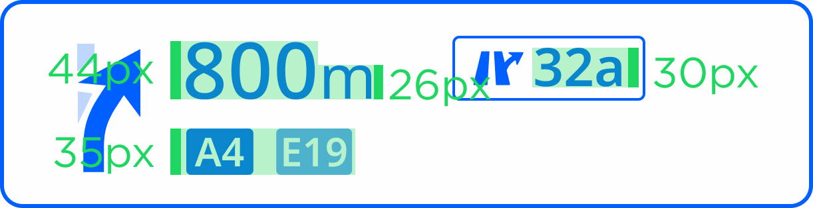

PIC: Example of Next Instruction Panel in the context of Horizon Panel.

  

| **Interaction Designer** | [Alexey Opokin](https://tomtom.atlassian.net/wiki/people/70121:e8cb7861-9079-4b92-b96d-bfe8cd882680?ref=confluence) |
|---|---|
| **Visual Designer** | [Georgios Koultouridis](https://tomtom.atlassian.net/wiki/people/5be2fd44649a737c2342afbe?ref=confluence) |
| PM | [Rolf Dorland](https://tomtom.atlassian.net/wiki/people/557058:c780ee11-e2ba-4436-9adf-fdd36a8a351a?ref=confluence) |
| PO | [Joost Pennings](https://tomtom.atlassian.net/wiki/people/712020:a6d50cb1-97be-4a9a-a279-3fbb3e2e1799?ref=confluence) |
| Dev. Teams | Omega, Lighthouse |
| Visual Design Specification | www.figma.com |

  

Table of Contents
=================

*   [Table of Contents](#Table-of-Contents)
*   [Definition](#Definition)
*   [UI Touchpoints](#UI-Touchpoints)
*   [Components of Visual Instruction (NIP)](#Components-of-Visual-Instruction-NIP)
*   [Cluster Display](#Cluster-Display)
    *   [Description](#Description)
    *   [NIP Prioritisation](#NIP-Prioritisation)
    *   [NIP Configurability](#NIP-Configurability)
        *   [Font size](#Font-size)
        *   [Adaptiveness](#Adaptiveness)
        *   [Prototype example](#Prototype-example)

    

  

Definition
==========

Visual Instruction  (also known as NIP-Next Instruction Panel) is a UI component that is used to visualise Instruction in order to provide Guidance for a driver. Guidance is a complex experience consists of visual instruction, Audio instruction, Map with representation of the route on it and various other elements. Audio and Visual Instructions change in time as vehicle progresses to the manoeuvre point. This logic is described in details in this document: [Instruction Triggering Logic](https://tomtom.atlassian.net/wiki/spaces/FlaminGO/pages/157679961/Instruction+Triggering+Logic).

  

  

UI Touchpoints
==============

Visual instruction is represented at following touch point in a car: HUD, Cluster Display, Central unit display. Each of those touch points have different visual design of the NIP and layout. For now we describe only CSD touch point.

  

  

Components of Visual Instruction (NIP)
======================================

  

  

|  | Item                                                | Context | Mandatory | Occurence | Description |
|---|-----------------------------------------------------|---|---|---|---|
| 1 | Next Instruction schematic image (Manoeuvre arrow)  | any | yes | Single | Graphical image representing next manoeuvre schematically |
| 2 | Distance to next instruction                        | not applicable for some special instructions | yes | Single | Distance to point of main manoeuvre. Distance units follow special formatting rules described here: [G\_008 Distance and Time Notation\#Distanceformatting](https://tomtom.atlassian.net/wiki/spaces/NAVUISPECS/pages/87264846/G_008+Distance+and+Time+Notation#G_008DistanceandTimeNotation-Distanceformatting) |
| 3 | Road Name Representation of Directional Information | any | No | Single | **Road name** (part of Directional info) is a road driver will continue on after completing manoeuvre. There are two use cases here that need to be separated:  1. **Signpost** is not available for the manoeuvre. In this case Road name is taken from map data as a name of a road manoeuvre leads to. NOTE: Only significant roads should be selected. Connecting road links should not be mentioned.  2. **Signpost** is available. In this case Road name must be in sync with signpost information even if map date provides different information.     Road names ofter refer to the same object as Road numbers. Additional information about usage of **Road names** and **Road Numbers** provided in this document: [Directional Information \- Road names, Road numbers, Towards](https://github.com/tomtom-internal/nie-ux-spec/blob/main/Guidance%20Framework%20-%20Methods%20%26%20Components/Directional%20Information%20-%20Road%20names%2C%20Road%20numbers%2C%20Towards%20/Directional_Information-Road-names_Road-numbers_Towards.md) |
| 4 | Road Number  Representation of Directional Information | any | No | Multiple | **Road number** (part of Directional info) is a number assigned to a road and usually corresponds to the Road name above. Visually road numbers represented as graphical shapes which vary by location and the number inside. Sometimes Road numbers have direction (East) attached to them. Some roads have both: Road name and Road numbers, some only road names and some only road numbers.  There are two use cases here that need to be separated:  1. **Signpost** is not available for the manoeuvre. In this case **Road number** is taken from map data as a number of a road manoeuvre leads to. Only significant roads should be selected. Connecting road links should not be mentioned.  2. **Signpost** is available. In this case Road number must be in sync with signpost even if map date provides different information.  If multiple Road numbers provided, only those that route goes through must be displayed.       Road names ofter refer to the same object as Road numbers. Additional information about usage of **Road names** and **Road Numbers** provided in this document: [Directional Information \- Road names, Road numbers, Towards](https://github.com/tomtom-internal/nie-ux-spec/blob/main/Guidance%20Framework%20-%20Methods%20%26%20Components/Directional%20Information%20-%20Road%20names%2C%20Road%20numbers%2C%20Towards%20/Directional_Information-Road-names_Road-numbers_Towards.md) |
| 5 | Towards Information                                 | any | No | Single | An area/city TOWARDS which the user will be heading after the manoeuvre.  This information is taken from Signpost. If multiple Towards are provided there, we should show the one that Route goes through and ignore others.      NDS DATA NDS DATA ISSUE Currently in NDS data, **Road names/numbers** sometimes provided as **Towards** information. This seems to be incorrect and needs to be clarified with NDS. For now, we provide some heuristic algorithm that filters out **Road names/numbers** from Towards information. |
| 6 | Exit Numbers                                        | Highways only | No | Multiple | **Exit Number** is a method by which exits are identified on roads in most areas. must match the real\-world sign information Could contain an array of numbers with or without cardinal direction information (i.e. Sout\-East)      EXCEPTION In some areas (California and Russia are known to have such logic) exit numbers are not used always or not used at all. Instead to identify the exit they use Towards or Directional information. |
| 7 | Lane guidance                                       | on multi\-lane roads | No | Single | Graphical image representing lane structure at the point of next manoeuvre |
| 8 | Chain Instruction                                   | any | No | Single | Is used where another manoeuvre occurs very soon after the main manoeuvre. |

  

  

Cluster Display
================

Description
-----------

Following the [Cluster vision reference ↗️](https://www.figma.com/file/c6C8xa5qJAeF1DgSR69zT7/Nav-Cluster-Reference-Vision?node-id=0%3A1) , the Next instruction panel, as part of the cluster display, should be able to easily adapt and scale to the different OEM layouts without compromising usability and the core concepts.  
As a part of the system described above, the cluster NIP should be **adaptable, flexible but focused, glanceable, simplified, not distracting and easy to read.**

  

NIP Prioritisation
------------------

|  | Item | Context | Permanent? | Priority | Comments |
|---|---|---|---|---|---|
| A | Next Instruction schematic image (Manoeuvre arrow) | any | yes | 1\. | Graphical image representing next manoeuvre schematically. This information is key and will always be displayed on the NIP whatever the size of it. |
| B | Distance to next instruction | not applicable for some special instructions | yes | 1\. | Distance to point of main manoeuvre. Distance units follow special formatting rules described here: [G\_008 Distance and Time Notation\#Distanceformatting](https://tomtom.atlassian.net/wiki/spaces/NAVUISPECS/pages/87264846/G_008+Distance+and+Time+Notation#G_008DistanceandTimeNotation-Distanceformatting)  This information is key and will always be displayed on the NIP whatever the size of it.  However, it position might differ from top aligned (most of the use cases) to center aligned (small NIP area/ split screen) regarding the size of the NIP area. |
| C | Exit Numbers | highways only | No | 2\. | This is the most important element on Highway's scenario. The exit number will be prioritised on top of the road number / shields, in case there is no room for both. |
| D | i. Road Name | any | No | 3\. | Road names, in a built\-up area scenario will only be displayed if the NIP area is big enough. In case of a long road names ( two lines ) or if the NIP area is small (PSA, split screen), the NIP will focus on the manoeuvre arrow and on the distance to direction only. |
| D | ii. Road Shields/ Number | any | No | 3\. | Road shields / number will not be visible on the smallest NIP area. However, it will be in the rest. |

NIP Configurability
-------------------

### Font size

|  |  |
|---|---|
| **Eye Distance** (cm) | **Example** |
| **800**Pitch 0\.132 (wide) |  |
| **1000**Pitch 0\.132 (wide) |  |

### Adaptiveness

These buckets are a representation of the panel of our Cluster’s NIP areas based on our various clients. 
They **DO NOT** represent all of our clients NIP area / Cluster sizes but sum up the extreme use cases, in order for us to align our vision and design an adaptive and flexible NIP accordingly.  

  

  

  

|  |  |  |
|---|---|---|
| **Simple Navigation Example** | **Motorways Example** | **Notes** |
|  |  | This is PSA 7" cluster. Potentially the smallest NIP area.   In that case, we do not have the room for the road name and center the distance with the arrow manoeuvre. In motorways scenario, the exit number is prioritised over the road number. |
|  |  | In the Maserati Cluster scenario, the road name can be displayed on one lign.   In case this is too long, it will be fade out. |
|  |  | Similar to the Maserati NIP area, this PSA ultra wide Cluster, will display the road name as long as it fits, on one lign.    In the motorways scenario, the exit number will be next to the distance with the road numbers right below, as designed in the original layout. |
|  |  | The split screen scenario make it difficult to keep the road name within the built up area scenario. In that case, we focus on the distance only, horizontally centred with the manoeuvre arrow.    The road numbers will be right below that arrow on the mortorways. |
|  |  | In the biggest NIP area from Stelantis, in order to use as much room as possible, the elements center aligned vertically inside the NIP by prioritisation order. |

### Prototype example

https://github.com/user-attachments/assets/3310f3ea-4faf-4610-89ae-eb6c002f971b
