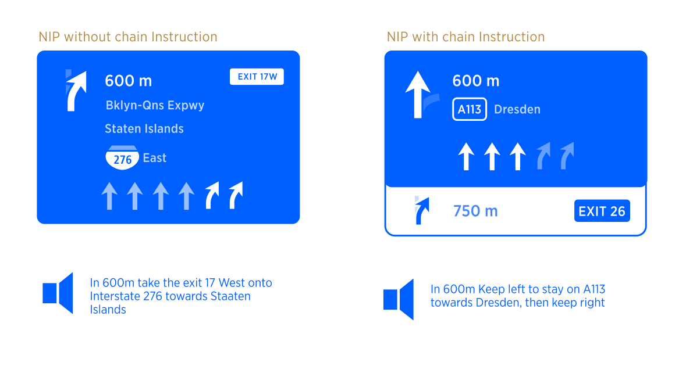
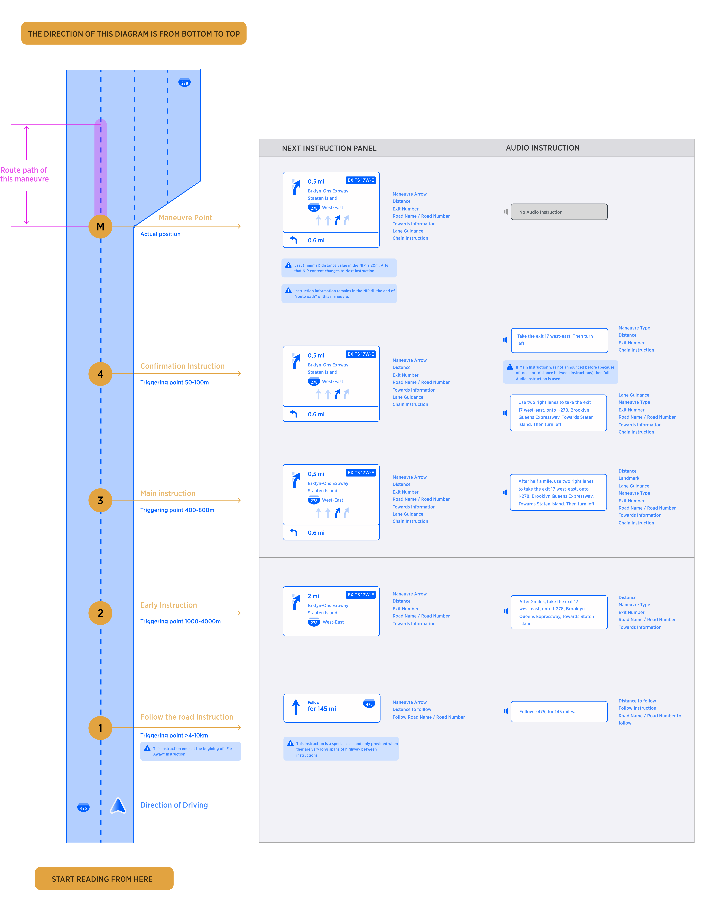
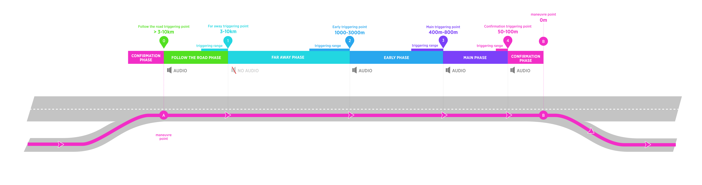
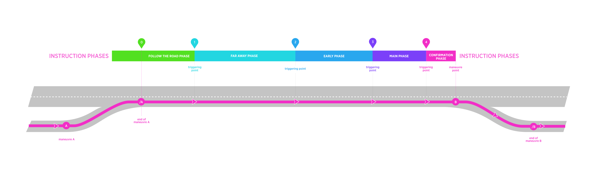
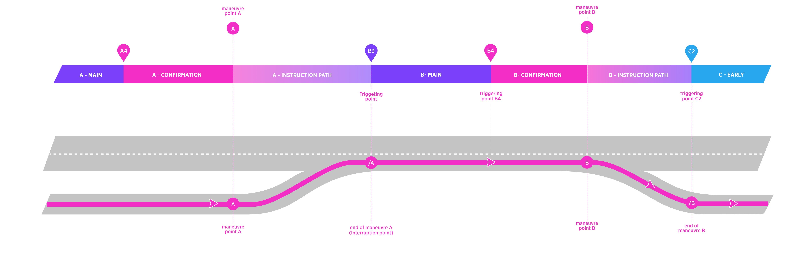
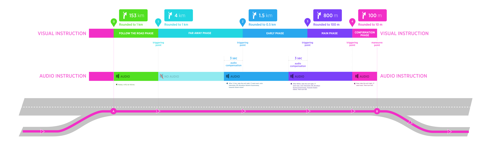
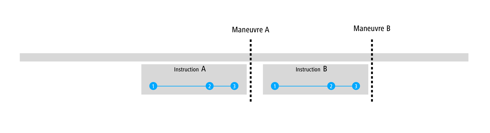
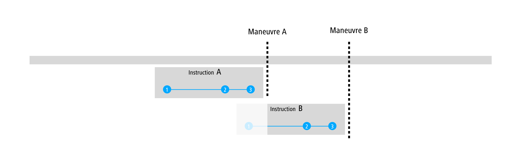

| **Created by** | [Alexey Opokin](https://tomtom.atlassian.net/wiki/people/70121:e8cb7861-9079-4b92-b96d-bfe8cd882680?ref=confluence) [Oleh Kis](https://tomtom.atlassian.net/wiki/people/712020:bd4f4d9f-75d9-4d67-8408-8ace89f8fda6?ref=confluence) |
|---|---|
| PM | [Joost Pennings](https://tomtom.atlassian.net/wiki/people/712020:a6d50cb1-97be-4a9a-a279-3fbb3e2e1799?ref=confluence) |
| Code | [https://bitbucket.tomtomgroup.com/projects/NAVKIT2/repos/nk2\-navigation\-instruction\-engine/commits](https://bitbucket.tomtomgroup.com/projects/NAVKIT2/repos/nk2-navigation-instruction-engine/commits) |

Table of Contents
=================

*   [Table of Contents](#Table-of-Contents)
*   [Introduction](#Introduction)
    *   [Example of Visual and Audio Instruction](#Example-of-Visual-and-Audio-Instruction)
*   [Timing for displaying and speaking instructions](#Timing-for-displaying-and-speaking-instructions)
*   [Instruction Phases](#Instruction-Phases)
    *   [Instruction Phases in details](#Instruction-Phases-in-details)
*   [Triggering algorithms](#Triggering-algorithms)
    *   [Uninterrupted Instruction Phase](#Uninterrupted-Instruction-Phase)
    *   [Interrupted Phase](#Interrupted-Phase)
        *   [Instruction Path](#Instruction-Path)
*   [Audio Instruction Duration Compensation](#Audio-Instruction-Duration-Compensation)
*   [Manual Triggering of Instruction (Repeat last Instruction)](#Manual-Triggering-of-Instruction-Repeat-last-Instruction)
*   [Consecutive Instructions](#Consecutive-Instructions)
    *   [Full set](#Full-set)
    *   [Early Instruction overlap](#Early-Instruction-overlap)
    *   [Main Instruction Overlap](#Main-Instruction-Overlap)

  
    
Introduction
============

In order to guide driver along the route, navigation system invokes guiding Instructions for every maneuver.

Guiding Instruction contains Visual and Audio components which work in sync with each other. As vehicle is moving toward the point of the maneuver, visual instructions are displayed in the NIP (Next Instruction Panel) and audio instructions are triggered at certain conditions. Audio instructions are synchronized with appropriate visual instruction, so the distance to maneuver displayed in the NIP corresponds to spoken distance in audio instruction. Additionally, some Information displayed in the NIP might get reflected in the announcement.

Example of Visual and Audio Instruction
---------------------------------------

  

  

  

Timing for displaying and speaking instructions
===============================================

As the user's current location approaches the point of the maneuver more information is displayed in the NIP GUI.

Additionally audio instructions provide key information as the user approaches the maneuver point.

As the user approaches the maneuver point there are 'Instruction Stages' at which audio information is communicated to the user:

*   Far away 
*   Early instruction  
*   Main Instruction 
*   Confirmation 

Instruction stages  triggering points vary according to the class of road the user is driving on and whether the location is US or the Rest of the World. The content, however, will be the same for each 'Instruction Stage'. In addition to Instruction Stages, it is supported manual, driver request of information. This can happen at any time and it is initiated by driver.  
  
In the diagram below the concept is explained using example instructions and triggering distances

  

  

Instruction Phases
==================

Instructions are invoked far in advance in order to prepare driver for the manoeuvre. As vehicle progresses towards manoeuvre point, there are **5 phases of instruction** provided. Here is overview of all possible instruction phases which can occur on a long road stretch:   
  

*   All **Instruction phases** with the exception of 1 (Far away instruction) are accompanied by audio.
*   **Triggering points** are not fixed values based on distance but rather function of road class and region as well as dynamic attributes ("Triggering threshold", "Audio compensation"). Exact logic is described later in this document.
*   In addition to those (automatically invoked) triggering points, there is a possibility of **manual (user invoked) triggering point**.
*   **Triggering range** indicates the range in which triggering point can fall. 
*   This document only covers **triggering logic** and does not define instructions themselves.

  

Instruction Phases in details
-----------------------------

In the table below described all instruction stages with their attributes.

| Phase of Instruction: | "Follow the road for XXkm" | **Far away** | **Early** | **Main** | **Confirmation** |
|---|---|---|---|---|---|
| Description | This instruction phase is executed at any distance bigger than Far Away Instruction phase. It does not refer to the next manoeuvre directly, but rather communicates long stretch ahead there are no more instructions. | Executed earliest on the route. It informs the driver that there is upcoming manoeuvre somewhere far away from his current location. No action is needed at this point. | Executed closer to manoeuvre point and informs driver that he needs to prepare for the upcoming manoeuvre and plan his path. I.E. start changing lanes. | Executed at the short time before manoeuvre. | Executed at the time of the manoeuvre itself. |
| Audio | Yes. Audio instruction is always announced at the moment when instruction is invoked. | Has NO Audio Instruction by default. Can be configurable internally to enable audio instruction. | Yes | Yes | Yes |
| Distance Range | At the end of previous manoeuvre and above "Far Away" trigger. | 4000\-10000m | 600\-3000m | 300\-1500m | 50\-300m |

  

Note: Triggering point distances in the diagram and table are examples, please refer to [NIE\_029 - HCP3 instruction timing](https://github.com/tomtom-internal/nie-ux-spec/blob/main/Customer%20specific%20designs%20-%20HCP3%2C%20STL/NIE_029%20-%20HCP3%20instruction%20timing/NIE_029_HCP3_instruction_timing.md) for the project values.  
  

Triggering algorithms
=====================

  

Uninterrupted Instruction Phase
-------------------------------

If a road stretch between two maneuvers is big enough to include all instruction phases from 1 to 4, then the instruction phases will be triggered by their own logic and we call them **uninterrupted instruction phases**. Phase 0 (Follow the road) is excluded because it has indefinite length. **Triggering point** for **Follow the road** instruction is always defined in the end of previous maneuver.   
  
Following diagram depicts scenario of uninterrupted instruction phases on a road stretch between two maneuvers . This diagram depicts full set of Instruction phases with both visual and audio components. There is a long stretch of the road between maneuvers **A** and **B** with no maneuvers in-between.

  

**How Triggering points are defined?**

Position of instruction triggering points (0-4) for uninterrupted scenarios is based on the distance to the maneuver.  

Please refer to [NIE\_029 - HCP3 instruction timing](https://github.com/tomtom-internal/nie-ux-spec/blob/main/Customer%20specific%20designs%20-%20HCP3%2C%20STL/NIE_029%20-%20HCP3%20instruction%20timing/NIE_029_HCP3_instruction_timing.md) for the project values.

  

Interrupted Phase
-----------------

### Instruction Path

Each maneuver has duration. It is not a dimensionless point on the map. Duration of the maneuver (as time value as well as segment of the road on the map) is called **Instruction path** and it depends on road geometry and can be gathered from the NDS map road segment attributes. Instruction path is in other words a short gap between beginning of the maneuver and its end.   
  
In depicted diagram **Instruction path** Indicated the beginning of the maneuver and its end. During Instruction Path of **Maneuver A** the visual instruction in the NIP remains representing **maneuver A**.

**Interrupted instruction phase** occurs when road stretch between two maneuvers is too short to include all instruction phases from 1 to 4.   
In the diagram below, Main phase of **maneuver B** is interrupted by the end of previous **maneuver (/A)**. It creates interruption point for Main phase of **maneuver B**. In this example the interruption point becomes new **triggering point for B3**.

  

  

IMPORTANT! Triggering Points **A4, B4** are not interrupted, and they are functions of the distance from the maneuver and car speed. 

Triggering point **B3** (and **C3**) are interrupted and they are announced at the end of route path of the previous maneuver. In other words, navigation announces next maneuver always after finishing the previous one, regardless of the distance to it.

  

Audio Instruction Duration Compensation 
========================================

Speaking Audio instruction takes time, therefore audio should start a bit ahead of the distance displayed in the NIP in order to be synchronized with visual. We apply simple 2sec compensation assuming that distance should be pronounced during this time. 

  

**NOTE:** Compensation is not applied to Confirmation, Follow the Road and Far away instruction phases.

  

  

Manual Triggering of Instruction (Repeat last Instruction)
==========================================================

All triggering point are automatically generated by the system that results in the guidance Audio instructions to be delivered in optimal (from the system perspective) way in time to the driver. However, there are  situations when driver forgets the last announcement, because he was involved in the conversation or for whatever other reason. He might want to repeat the last announcement. This scenario is supported by manual user request. Interaction vise, It could be initiated via various methods, depending on the target platform, and it will generate triggering point at the moment of request. The result of this will be audio announcement of the next instruction.  
  

| Value | What is announced |
|---|---|
| Distance | Current distance with applied rounding rules |
| Instruction Phase | Based on Distance |

  

Consecutive Instructions
========================

When two instructions need to be announced in sequence, there are following situations possible:

  

Full set
--------

Two instructions are separated by the distance that allows a full set (Early, Main, Confirmation) to be announced.

  

  

Early Instruction overlap
-------------------------

Instruction A3 falls between Instructions B1 and B2. Instruction B1 is not announced in this case.

  

Main Instruction Overlap
------------------------

Instruction A3 falls between  B2 and B3.  Instructions A3 and B3 are combined into one instruction. This creates so called "Chain Instruction"

