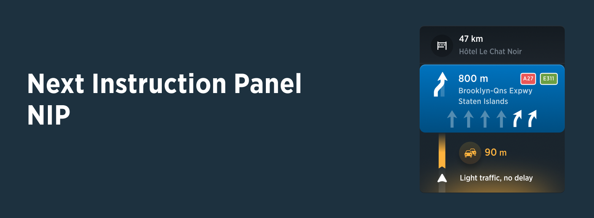

PIC: Example of Next Instruction Panel in the context of Horizon Panel.

  

| **Interaction Designer** | [Alexey Opokin](https://tomtom.atlassian.net/wiki/people/70121:e8cb7861-9079-4b92-b96d-bfe8cd882680?ref=confluence) |
|---|---|
| **Visual Designer** | [Georgios Koultouridis](https://tomtom.atlassian.net/wiki/people/5be2fd44649a737c2342afbe?ref=confluence) |
| PM | [Rolf Dorland](https://tomtom.atlassian.net/wiki/people/557058:c780ee11-e2ba-4436-9adf-fdd36a8a351a?ref=confluence) |
| PO | [Joost Pennings](https://tomtom.atlassian.net/wiki/people/712020:a6d50cb1-97be-4a9a-a279-3fbb3e2e1799?ref=confluence) |
| Dev. Teams | Omega, Lighthouse |
| Visual Design Specification | www.figma.com |

  

Definition
==========

Visual Instruction  (also known as NIP-Next Instruction Panel) is a UI component that is used to visualise Instruction in order to provide Guidance for a driver. Guidance is a complex experience consists of visual instruction, Audio instruction, Map with representation of the route on it and various other elements. Audio and Visual Instructions change in time as vehicle progresses to the manoeuvre point. This logic is described in details in this document: [Instruction Triggering Logic](https://tomtom.atlassian.net/wiki/spaces/FlaminGO/pages/157679961/Instruction+Triggering+Logic).
[a](./a.pdf)
  

UI Touchpoints
==============
