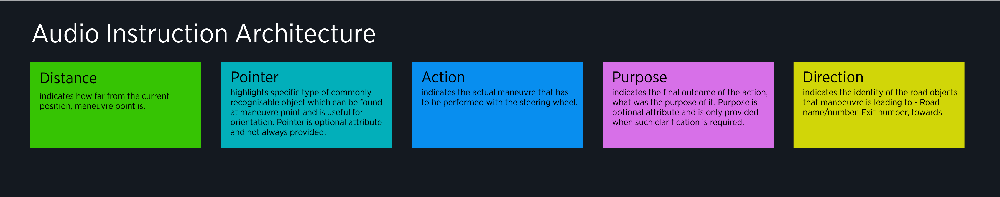

| **Interaction Designer** | [Alexey Opokin](https://tomtom.atlassian.net/wiki/people/70121:e8cb7861-9079-4b92-b96d-bfe8cd882680?ref=confluence) |
|---|---|
| **PM** | [Joost Pennings](https://tomtom.atlassian.net/wiki/people/712020:a6d50cb1-97be-4a9a-a279-3fbb3e2e1799?ref=confluence) |
| **ENG OWNER** | [Dennis Jakobsen](https://tomtom.atlassian.net/wiki/people/712020:c273d0e3-9a2a-456c-ad2f-6f56ca0e12b3?ref=confluence) → please assign |

Introduction
============

Audio, or spoken, instructions are the means of Guidance and used in combination with Visual Instructions to provide complete guidance experience. Audio instructions have benefits of not requiring driver's visual attention on a screen in order to navigate, which reduces the risk of driver distraction.  Audio instructions aim to guide the driver even if he doesn't see visual instruction (for example when infotainment system is used). Audio instruction work in sync with visual and dynamic information dictated by audio (such as distance) should be in sync  with visual. 

Relevant Documents:

[Instructions Triggering Logic](https://tomtom.atlassian.net/wiki/x/WQFmCQ) - provides definition of how instructions (both audio and visual) are triggered in time.  
[Instruction Architecture](Instruction-architecture_157680070.html) - defines in detail Next Instruction Panel (NIP) component which displays visual guidance information which is replicated by Audio Instruction.

It is worth to read both of those documents before diving into audio Instructions details because Audio is synchronised with Visual representation of Instruction.

Audio Instructions provided in two Configurations: Full Instructions set and Compact Instructions set. Configuration can be enabled in user settings.

Audio Instructions configurations
---------------------------------

Through various user research studies of navigation experience, we have learnt that significant percentage of drivers (around 50%) don't regard audio guidance very high in general.  They even go as far as disabling audio guidance altogether. There are following known reasons for this:

**Listening to Music** - When guidance announcement plays back, it interrupts ongoing music, which is considered unacceptable for drivers.

**Conversation with passengers** - The same is applied for keeping ongoing conversations.

**High external/internal noise level** - Guidance instructions could not be clearly heard.

**Excessive verbosity** - Some, but not all, drivers perceive audio instructions as unnecessary detailed and they have a hard time to remember those details.

**Repetitiveness** - Some, but not all, drivers perceive audio guidance unnecessary repetitive.

**Mechanical voice** - Most of navigation systems of the past had very low voice quality, that sounded mechanical and hard to understand. While this is not true anymore (mostly) the habit is still applied.

It is important to keep in mind that while those issues are real, not all drivers hate audio guidance. Many drivers still consider audio very helpful and rely on it. This division between lovers and haters of audio guidance lead to the following approach in NIE. NIE has two configurations of audio: _**Full instruction set**_ and _**Compact instruction set**_.

_**Full Instructions set**_ is a default configuration. It provides maximum amount of spoken information needed for successful manoeuvre handling. However, in some situations audio instructions might become too long and hard to follow. To address this, alternative, _**Compact Instruction set**_ is created. Compact Instruction set is a User preference that can be set in the settings. What are the differences between Compact and Full Instruction sets? 

Differences between Full and Compact Instruction set
----------------------------------------------------

There are two main differences between them:

1.  **Reduced amount of Instruction phases**  
    Full instruction set has following audio instruction announcement points: Early (2-4km), Main (0.5-1.5km) and Confirmation (50-200m). Compact set _**omits**_ **Early instruction** audio announcement. This means that there are only Main instruction announcement and Confirmation remain.   
      
    
2.  **Reduced spoken information**  
    Full Instructions announce various map related attributes such as: Road Name / Number, Exit name/Number, Towards Information. Compact mode only announces those on motorway forks (bifurcations and exits) and only if they are coming from signposts. In other scenarios, this information is not announced.  
      
    

Audio Instructions architecture
=====================================

How Audio Instruction is constructed
------------------------------------

Audio instruction is a complete sentence explaining the upcoming manoeuvre to the driver in a natural human speech, the same way as . Audio Instructions have to communicate various aspects of the manoeuvre, such as distance to it, type of the manoeuvre, target of the manoeuvre and various reference information provided by road signposts. To address this Audio Instruction consists of _**components**_ which are combined together in one sentence. There are following _**main components**_ of Audio Instruction:

1. **\[distance\]** - to the point where manoeuvre happens.

2. **\[pointer\]** - Where precisely manoeuvre must be performed in relation to clearly visible external objects (that also have official name "Landmarks").

3. **\[action\]** - Manoeuvre description, or what driver has to do to perform the manoeuvre (turn left, keep right, continue straight)

4. **\[purpose\]** - What would be result of this action, the outcome of the manoeuvre (...to stay on, ...to take). Not always applicable.

In addition to main components, there are map attributes of roads and intersections that are also communicated by audio. We call those attributes - _**Directional Information.**_ They define identity of rads or intersections which are parts of map data. They consist of:

**\[road name\]** - Target road name that need to be taken as a result of next manoeuvre.

**\[road number\]** - Target road number that need to be taken as a result of next manoeuvre.

**\[exit number\]** - Exit number that need to be taken. Indicated on a signpost.

**\[towards\]** - Indicates remote location that target road leads to.

Examples
--------

| **Distance** | **Pointer** | **Action** | **Purpose** | **Direction / Road ID** | **Direction / Towards** |
|---|---|---|---|---|---|
| \-\- | At the end of the road | turn right | \-\- | \-\- | \-\- |
| in 3km | At the the fork | keep left | to stay on | A100 | towards Hamburg |
| in 3km | \-\- | take the exit no. 6 | to switch to | A100 | towards Hamburg |
| in 500m | at the traffic light | use two left lanes | to turn left | to Prenzlauer Alee | towards city center |
| in 500m | at the traffic light | use middle lane | to continue straight | \-\- | \-\- |

NOTE: prepositions (e.g. onto, at) are automatically generated by the engine based on Road names and/or Road numbers

NOTE: Directional information can be scattered across the sentence depending on the language, so this order might not be always maintained. This doesn't mean the structure is wrong, but in practice all strings in each language are pre-compiled and written in excel table. They are not recreated dynamically by the engine.

Audio Instructions at different Instruction phases
--------------------------------------------------

At each Instruction phase (Far Away, Early, Main, Confirmation) audio information set varies slightly. This table defines each component of the instruction depending on the Instruction stage  
  

**FULL INSTRUCTION SET**

|**Instruction phase**|**Distance**|**pointer**|**Action** |**purpose**|**Direction / Road ID**|**Direction / exit number**|**Direction / towards**|**Chain Instruction**|
| -- | - | - | - | - | -- | -- | - | -- |
|Early|yes|**\*no**|yes|yes| yes | yes| yes|no|
| Main|yes|yes|yes|yes| yes | yes | yes |yes |
|Confirmation (If Main has been announced)| no | no | yes| no | no |**\*no**|no |yes |
| Confirmation (If Main has not been announced)|no|yes|yes|yes|yes|yes|yes |yes
|

NOTE: "Far away" phase has no audio, and not listed here.  
NOTE: "Follow the road for XXkm" following special rules and not listed here.

*NOTE: Red values are newly changed based on recent evaluation. 

**COMPACT INSTRUCTION SET** 

| **Instruction phase** | **Distance** | **Pointer** | **Action** | **Purpose** | **Direction / Road ID** | **Direction / Exit Number** | **Direction / Towards** | **Chain Instruction** |
| --- | --- | --- | --- | --- | --- | --- | --- | --- |
| Main | yes | yes | yes | only if signpost | only if signpost | only if signpost | only if signpost | yes |
| Confirmation (If main has been announced) | no | no | yes | no | no | no | no | yes |
| Confirmation (If main has not been announced) | no | no | yes | only if signpost | only if signpost | only if signpost | only if signpost | yes |

NOTE: "Early" phase is not available in compact set.

  
Precompiled Audio Instructions list
======================================

Following the principles outlined above, each, theoretically possible, instruction sentence has been compiled (in English as a source language). Afterwards those source strings have been translated to all target languages. Resulted lists (for each language) is stored in Excell table below.  Those text strings still contain some variables (left, right, number of exit) to indicate different variations of each instructions. This is necessary to keep the amount of strings reasonable.

| **Type** | **URL** |
|---|---|
| GitHub PO file | [https://github.com/tomtom\-internal/navigation\-text\-generation/blob/main/navigation\-text\-generation/src/po\_files/en\-GB.po](https://github.com/tomtom-internal/navigation-text-generation/blob/main/navigation-text-generation/src/po_files/en-GB.po) |
| Original Source file | [https://tomtominternational.sharepoint.com/:x:/s/ttUXDDrive/EWU\_AvkdHg5FmCxdz9uhLRsBhLTZSEuS\_mEuSR4gYuVYtQ?e\=EFgM9q](https://tomtominternational.sharepoint.com/:x:/s/ttUXDDrive/EWU_AvkdHg5FmCxdz9uhLRsBhLTZSEuS_mEuSR4gYuVYtQ?e=EFgM9q)) |

  
  

Further information
===================

Content of this page just outlines the architecture of audio instructions and defines high level framework. To dig further into details, please follow individual instructions definitions where those principles applied in concrete use cases:

[NIE\_011 - Turn manoeuvres overview](https://tomtom.atlassian.net/wiki/spaces/FlaminGO/pages/157679963)

[Forks Instructions (Bifurkations, Trifurcation, Exits)](https://tomtom.atlassian.net/wiki/spaces/FlaminGO/pages/157680013/Furcations+-+Bifurkations+Trifurcation+Exits)

[NIE\_007 - Simple Lane Guidance (SLG)](https://tomtom.atlassian.net/wiki/spaces/FlaminGO/pages/157680032)

[Roundabouts](https://tomtom.atlassian.net/wiki/spaces/FlaminGO/pages/157680439/Roundabouts)

[Ferry &amp; Car Train connections](https://tomtom.atlassian.net/wiki/spaces/FlaminGO/pages/157680117/Ferry+Car+Train+connections)

[NIE\_015 - Departure Instruction](https://tomtom.atlassian.net/wiki/spaces/FlaminGO/pages/157686483/Departure+Instruction)

* * *

\--- END OF DOCUMENT ---
========================