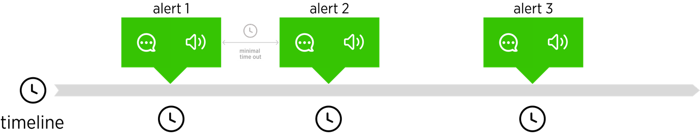
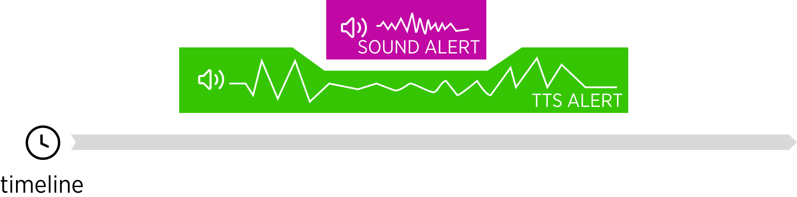
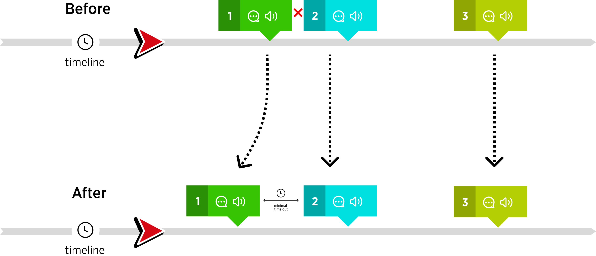
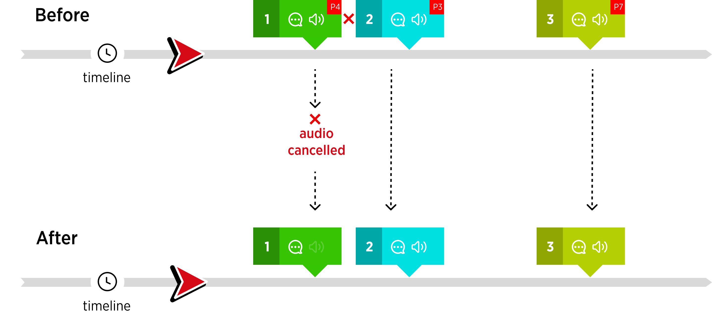

| **created by** | [Alexey Opokin](https://tomtom.atlassian.net/wiki/people/70121:e8cb7861-9079-4b92-b96d-bfe8cd882680?ref=confluence)                                                                                                                                                                                                                                                                                                                                                                                                                                                               |
|---|-----------------------------------------------------------------------------------------------------------------------------------------------------------------------------------------------------------------------------------------------------------------------------------------------------------------------------------------------------------------------------------------------------------------------------------------------------------------------------------------------------------------------------------------------------------------------------------|
| **PM** | [Mohammad Babamahmoudi](https://tomtom.atlassian.net/wiki/people/712020:710d380e-571a-4770-84e8-d3c8d129556f?ref=confluence)                                                                                                                                                                                                                                                                                                                                                                                                                                                      |
| **Dev. Teams** | Dynamic Guidance                                                                                                                                                                                                                                                                                                                                                                                                                                                                                                                                                                  |
| **ENG OWNER** | [Borys Zhdanov](https://tomtom.atlassian.net/wiki/people/557058:c967cc66-cd66-4b70-8e30-41cfa2c3b15a?ref=confluence)                                                                                                                                                                                                                                                                                                                                                                                                                                                              |
| **Stakeholders** | * [Borys Zhdanov](https://tomtom.atlassian.net/wiki/people/557058:c967cc66-cd66-4b70-8e30-41cfa2c3b15a?ref=confluence)* [Murad Magomedov](https://tomtom.atlassian.net/wiki/people/62c80c4aa152cf973645b7c8?ref=confluence)* [Feyona van Middelaar](https://tomtom.atlassian.net/wiki/people/5afaa1b3b0c5845738d8e1db?ref=confluence)* [Joost Pennings](https://tomtom.atlassian.net/wiki/people/712020:a6d50cb1-97be-4a9a-a279-3fbb3e2e1799?ref=confluence)* [Adriano Kono](https://tomtom.atlassian.net/wiki/people/712020:aebb17c4-4458-41ec-90b4-b375ffec0a5d?ref=confluence) |
| **Reference documents** | [Events prioritisation](https://tomtom.atlassian.net/wiki/spaces/FlaminGO/pages/157680125/Events+prioritisation) [Sounds](https://tomtom.atlassian.net/wiki/spaces/FlaminGO/pages/157680148/Sounds) [Audio hierarchy](https://tomtom.atlassian.net/wiki/spaces/FlaminGO/pages/157680272/Audio+hierarchy)                                                                                                                                                                                                                                                                    |

Introduction
============

Navigation systems in a car use audio channel for various communications. Audio is used by many subsystems that inform drivers about events on the route, potential danger, or guiding instructions. If those systems unaware of each other, the audio streams could collide or cancel each other, rendering them useless and annoying. This outcome is, obviously, undesirable, and to prevent it, all car systems should "talk" through the audio management framework. Our goal is to define such audio management framework. Specifically, following requirements should be met:

1.  Make audio framework generic and insensitive to the amount of sources and their nature.
    
2.  Make sure that it supports all known driving use cases and doesn't create dangerous situations.
    
3.  Specifically, support upcoming feature -  "Better Route proposal".
    
4.  Make sure that the framework avoids audio streams collisions.
    

Audio Sources Overview
----------------------

Before diving into audio management we need to have an overview of all potential audio sources and their corresponding requirements. Below is the list of all audio sourced in a car.

### Manoeuvre announcements

Guidance engine generated audio announcements about upcoming manoeuvres. Each manoeuvre can have potentially 3 announcements that are activated at various distances to the manoeuvre. Those are called Instruction phases: **Early**, **Main**, **Confirmation**. Each phase creates separate audio alert. There are also some guidance instructions that only have 1 phase.

### Hazards warnings

Those include various types of warnings (Truck restrictions, Jam tail, LEZ, etc) of potential danger that is located on the route. Hazards have also 2 phases of announcements: **Early** and **Approaching**

### Informing about POIs on the way

Fuel stations, Rest places, Shops, etc. Depending on their importance of those particular locations they may or may not have audio announcements. 

### Dynamic events

Over-speeding, Better route proposal, ETA change, etc. Dynamic events don't have static location or no location at all and their audio announcements vary depending on the specific type of the object. In most cases there is only one announcement (except of Better Route Proposal that can have 2).

### External audio sources  

Phone calls, Car systems communications, Phone applications. External sources are not managed by this system at this time 08 May 2024 

REFERENCE: Events are currently supported by the SDK are listed in this document: [Events prioritisation](https://tomtom.atlassian.net/wiki/spaces/FlaminGO/pages/157680125/Events+prioritisation)

Events &amp; Alerts
===============

For the sake of clarity of terminology, it is worth to mention the difference between Events and Alerts. An **Alert** is caused by an Event and 1 event can have several Alerts as in case of Manoevers announcements and Hazard warnings. From the audio management perspective, we are are interested in Alerts, and not Events.

Types of Alerts
---------------

**Audio Alerts are accomplished by visual alerts** - this way information can be delivered in most effective way: Audio alert grabs driver's attention, and Visual alert clarifies the details (what, where, how severe, etc). Therefore it is important to keep connection between them. Exactly at the same moment that Audio alert is played, Visual alert should take place in the UI. They are always synchronised.

|  | **Audio Alert**Audio message via TTS delivering details about the event |
|---|---|
|  | **Visual Alert**appearance of UI component or change of the state of the component |

**Schematic representation of Alerts in time.**  
The diagram below depict the sequence of alerts on a timeline. Each alert is represented by both: Audio and Visual parts that have to come together.

Sound  &amp; TTS based alerts
-------------------------

Audio Alerts could be based on **TTS** (text to speech) engine that communicates the information via human voice, and **Sounds** (beeps or similar sounds that represent the event) that only attract drivers attention without explaining the source of the alert literally. Multiple TTS alerts, cannot be played simultaneously and therefor require some kind of management. **TTS based alerts management** is the main purpose of this document.

Sound Alerts **don't need to be managed** and can play freely at any time even during another TTS alert announcement. Generally speaking, the management of sound and TTS based alert depends on how NavSDK or client will perform the playback (Client might not use TTS engine of NavSDK, and in this case the management is the client responsibility). Another factor to consider is what platform API will be used by client/SDK to perform the playback. Depending on these APIs, the ducking could be automatic of not supported.

Sound alerts must stay short in order to not distract TT alerts too much. We would like to limit the length of sound alert to max. 2 seconds.

The digram below illustrates conflicting situation between Sound alert being played during TTS alert with ducking method applied. 

Alert Management
================

To ensure Alerts rules mentioned above, Alerts should be channelled through special filter - **event manager**, that can restructure alerts (both audio and visual). 

Design requirements for alerts
------------------------------

At this point we can outline the desired behaviour in regards to Alerts (both Audio and Visual:

1.  **Audio Alert should always come simultaneously with Visual Alert, if applicable.**

    
2.  **For the events, location of the event(if applicable) should be highlighted on the map (if surfaced inside the map viewport).**

    
3.  **For dynamic event the visual alert should take place in the appropriate UI component and/or on the map.**

    
4.  **Alerts should never interrupt each other, except of Sound Alerts.**

    
5.  **Alerts should have minimal time out between each other (preliminary value is 2 sec)**
    

To achieve this behaviour, following alerts management methods could be considered: Alerts **rearranging** method and **cancellation** method.

Alerts Rearranging Method
-------------------------

Conflicting alerts are reorganised in time in such way that they don’t conflict with each other and respect gaps between them. 

NOTE: Only alerts that can be moved in time, should be rearranged. Over-speeding, or Jam Tail alerts cannot be moved. The movable attribute should be defined for each alert for this method.

NOTE: Moving the alert in time should be also applied to visual part, as they both represent one object that has to be delivered at both ends (audio and Visual) simultaneously.

NOTE: The exact direction of movement of the conflicting alert (back in time or forward) is not yet defined for this method. The depicted direction is just for illustration of the principle.

**Effort required**  
This method, while being the most effective in terms of management, poses significant technical challenges. Based on this and the fact that the frequency of alerts conflicts is unknown, it has been **decided not to proceed with this method for the first increment of implementation**. However, we could consider it later, if the evaluation of the next method will give negative results.

Alerts Cancellation Method
--------------------------

For this method to work, each alert has to be assigned a unique priority, by which it could be compared. Conflicting alerts get cancelled based on this priority. Alert #1 (priority 4) is cancelled because it is conflicting with alert #2 (priority 3). Only alerts that can be moved, can be cancelled. 

NOTE: In case of cancellation of the Audio alert, it’s visual part can still be shown.  
NOTE: Instead of cancelling the conflicting alert it can be transformed to sound alert.

**Effort required**  
This method is much simpler for the implementation and it has been decided to use it for the first increment of the implementation.

Alerts Priority table
=====================

In order for Alerts Cancellation method to work, unique priorities should be assigned to each individual alert (not Event!! Remember the difference between an Alert and Event). Such priorities are defined in the table below. Highest priority is lowest number. Priority 0 (Zero) is highest. Priorities numbers listed here are not meant to be used in code, but just be an indication of what is more important. Exact format of priorities to be used in the code is to be defined by development.

**Priority table per individual event.** Priorities are assigned to individual alerts and each event has 2 alerts: Early and Approaching. 

| **ID** | **EVENT** | **Category** | **Early** | **Approaching** |
|---|---|---|---|---|
|  | Heigh restriction | hazard | 110 | 100 |
|  | Width restriction | hazard | 111 | 101 |
|  | Weight restriction | hazard | 112 | 102 |
|  | No truck allowed | hazard | 113 | 103 |
|  | Length restriction | hazard | 114 | 104 |
|  | Axle weight restriction | hazard | 115 | 105 |
|  | Mobile speed camera | hazard | 1100 | 200 |
|  | Fixed speed camera | hazard | 1101 | 210 |
|  | Red light speed camera | hazard | 1102 | 220 |
|  | Safety camera | hazard | 1103 | 230 |
|  | Road closure | hazard | 300 | 1104 |
|  | Traffic | dynamic | 310 | 311 |
|  | Guidance Instructions | guidance | 400 | 400 |
|  | IC (exit) JC/JCT (junction) | guidance | 410 | 411 |
|  | IC Highway exits | guidance | 420 | 421 |
|  | JCT Junctions | guidance | 430 | 431 |
|  | Better route proposal | dynamic | 500 | 501 |
|  | Charging stop | POI | 510 | 511 |
|  | ADR Tunnel Restriction | hazard | 600 | 601 |
|  | Hazardous Materials | hazard | 610 | 611 |
|  | Low Emission Zone | hazard | 1105 | 621 |
|  | Road Works | hazard | 700 | 701 |
|  | Red light camera | hazard | 1106 | 800 |
|  | Restricted camera | hazard | 1107 | 821 |
|  | Average speed zone | hazard | 1108 | 831 |
|  | Danger zone | hazard | 1109 | 841 |
|  | Truck stop | POI | 900 | 901 |
|  | Petrol station | POI | 910 | 911 |
|  | Rest area | POI | 920 | 921 |
|  | Rest Area with Amenities | POI | 930 | 931 |

NOTE: Not every event in this list will actually have TTS Alert assigned. In this case priority is not used.

**END OF DOCUMENT /**