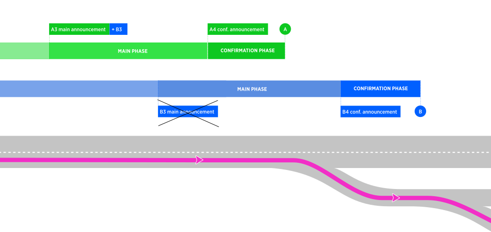
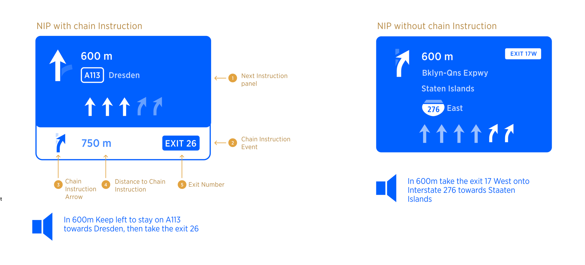
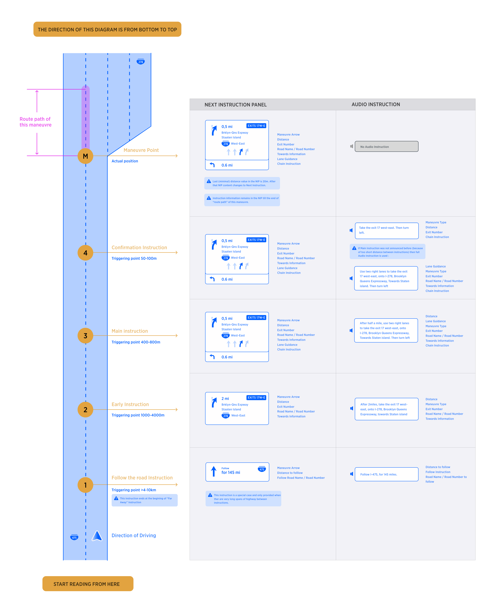
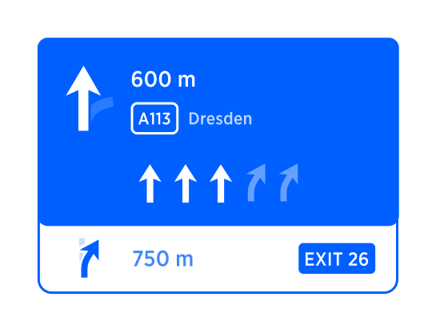
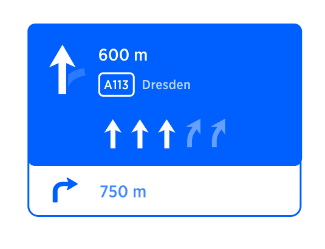
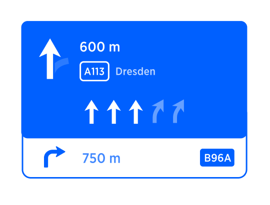
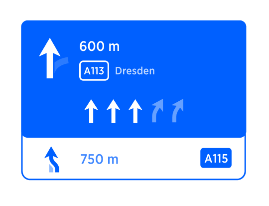
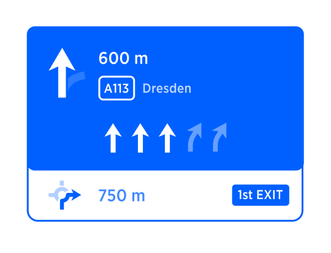

| **Interaction Designer** | [Alexey Opokin](https://tomtom.atlassian.net/wiki/people/70121:e8cb7861-9079-4b92-b96d-bfe8cd882680?ref=confluence) |
|---|---|
| **Visual Designer** | [Georgios Koultouridis](https://tomtom.atlassian.net/wiki/people/5be2fd44649a737c2342afbe?ref=confluence) |
| **PM** | [Joost Pennings](https://tomtom.atlassian.net/wiki/people/712020:a6d50cb1-97be-4a9a-a279-3fbb3e2e1799?ref=confluence) |
| **DEV** | [Bohdan Soroka](https://tomtom.atlassian.net/wiki/people/712020:d6cafcbe-bb3a-4305-bba3-02e3350309bc?ref=confluence) HCP3, |

Table of Contents
=================

*   [Table of Contents](#Table-of-Contents)
*   [Motivation](#Motivation)
*   [Terminology](#Terminology)
*   [When Chain Instruction is generated?](#When-Chain-Instruction-is-generated)
*   [Visual Format of Chain Instruction](#Visual-Format-of-Chain-Instruction)
*   [Triggering points & Chain Instruction](#Triggering-points--Chain-Instruction)
*   [Chain Instruction Audio Format](#Chain-Instruction-Audio-Format)
*   [Types of Instructions that can be used as Chain Instructions.](#Types-of-Instructions-that-can-be-used-as-Chain-Instructions)
    *   [Examples](#Examples)
*   [Roundabouts as Consecutive Manoeuvres](#Roundabouts-as-Consecutive-Manoeuvres)
*   [Strings](#Strings)

Motivation
==========

Consecutive manoeuvres are manoeuvres that placed close to each other on the route path. This poses certain challenges for a driver because limited time he has to react on second manoeuvre after performing the first one. To mitigate this, we use **Chain Instruction** method. This method informs the driver about consecutive manoeuvre upfront, at the same time as announcing main manoeuvre delivering both manoeuvres in combined package.

Terminology
===========

Manoeuvre that driver approaches first called _**"Main Manoeuvre"**_   
Instruction which is applicable to the Main Manoeuvre called _**"Main Instruction"**_  
Manoeuvre driver approaches second, after passing the "Main Manoeuvre"  is called _**"Consecutive Manoeuvre"**_  
Instruction which is related to Consecutive manoeuvres at the point in time where the vehicle didn't yet reach the Main Manoeuvre is called **"Chain Instruction"**

When Chain Instruction is generated?
====================================

**At the diagram below** depicted two consecutive manoeuvres (A-green, and B-Blue) with their corresponding triggering points:

**A** - Actual manoeuvre point of manoeuvre A (Main Manoeuvre)

**A4** - Confirmation triggering point of manoeuvre A

**A3** - Main triggering point of manoeuvre A

**B** - Actual manoeuvre point of manoeuvre B (Consecutive Manoeuvre)

**B4** - Confirmation triggering point of manoeuvre B

**B3** - Main triggering point of manoeuvre B

Condition for Chain Instruction is: **B3** (Early announcement of connective manoeuvre) **cannot be announced because it falls into the range of main instruction of manoeuvre A.** In the diagram depicted above, the announcement B3 cannot happen during passing through manoeuvre A. Obviously, we cannot announce next instruction before passing the first one. But B3 announcement is critical for the next manoeuvre, therefore to address it, we introduce _**chain instruction**_. 

To inform the driver about two close manoeuvres upfront following instruction sequence is created;

**At A3 triggering point:** Instruction A3 and B3 are combined together following the rule of combined instructions.  
**At B3 triggering point:** This point is not announced.  
**At A4 triggering point:** Instruction A4 and B4 are combined together following the rule of combined instructions.  
**At B4 triggering point:** B4 should be announced even if it spills over the manoeuvre point B.

Visual Format of Chain Instruction
==================================

Chain Instruction is represented as an event component similar to a standard event item in Horizon panel positioned below the NIP. If any other events are present in HP, they are positioned below chain instruction.

Visual representation of chain instruction only contains maneuvre arrow, distance, exit number, and Road number. 

| **Visual Attribute**|**Distance**|**Road name**|**Road Number**|**Towards**|**Exit number**|**Lane Information**|
| --- | --- | --- | --- | --- | --- | --- |
| Used in Chain Instruction | **Yes**|**No**|**???**| **No**|**Yes**| **No**|

Triggering points &amp; Chain Instruction
=====================================

Chain instruction appears only at **Main and Confirmation** triggering points. Chain instruction is not communicated at earlier stages.

|**Triggering Point**|**0-Follow the road**|**1-Far Away**|**2-Early**|**3-Main**|**4-Confirmation**|
| --- | --- | --- | --- | --- | --- |
|Visual|**No**|**No**|**No**|**Yes**|**Yes**|
|Audio|**No**|**No**|**No**|**Yes**|**Yes**|

Following diagram depict the full sequence of Instruction sequence including chain instruction:

Chain Instruction Audio Format
==============================

Audio instruction for chain instruction always uses short format (turn left, keep right, take the exit, make a u-turn)) which only indicates the "action" without mentioning "pointers", "purposes" or any other elements of instructions. That means that some shortening needs to be applied to the data. More details about which attributes are used in chain instruction and which not are listed in the table below:

|**Audio Attribute**|**Distance**|**Pointer**|**Action**|**Purpose**|**Road name**|**Exit number / Name \*** |**Road Number \***|**Towards \***|**Lane Information**|
| --- | --- | --- | --- | --- | --- | --- | --- | --- | --- |
|Used in Chain Instruction|**No**|**No**|**Yes**|**No**|**No**|**Yes, but see NOTE**|**Yes, but see NOTE**|**Yes, but see NOTE**|**No**|

NOTE: Only one of the Blue items can be announced. Priorities of those items are following: Exit Num/Name → Towards → Road Number

Types of Instructions that can be used as Chain Instructions.
=============================================================

Every upcoming manoeuvre is represented by the Next Instruction, however, not all Consecutive manoeuvres should be represented by Chain instruction. Sometimes it doesn't make sense. Why? The reason for this is that some instructions in NIE are not guiding (prescribing driver action) but rather informative. Example: _**Border Crossing, Follow the Road for XXkm.**_ Another reason is that some Chain instructions are too complex to be communicated clearly without overloading driver's cognitive capacity. Example: _**Roundabouts.**_

In the table below we list all possible manoeuvres and define which of them can be used as chain instructions (second part of the audio message)

| **Instruction** |                        | |
|---|------------------------|-|
|  | Turn Left/Right        | **Yes** |
|  | Turn Sharply Left/Right | **Yes** |
|  | Bear Left/Right        | **Yes** |
|  | Keep Left/Right        | **Yes** |
|  | Turn around            | **Yes** |
|  | Turn around when Possible | **No** |
| **Highway Instructions** |
|  | Enter Motorway         | **Yes** |
|  | Merge                  | **Yes** |
|  | Take Exit              | **Yes** |
|  | Keep Left/Right        | **Yes** |
| **Roundabouts** |
|  | Roundabout (Michal???) | **Yes** |
| **Out of Car Transportation** |
|  | Take Ferry             | **Yes** |
|  | Take Car train         | **Yes** |
| **Special Instructions** |
|  | Start Driving          | **No** |
|  | Reaching Destination   | **Yes** |
|  | Reaching Waypoint      | **Yes** |
|  | Entering Off\-Road     | **No** |
|  | Starting from Off\-road | **No** |
|  | Follow the road for XXkm | **No** |
|  | Toll Booth             | **Yes** |
|  | Boarder crossing       | **No** |
|  | Exit Auto Transport    | **No** |
|  | Enter HOV lane         | **Yes** |
|  | Exit HOV lane          | **Yes** |

NOTE: While this table should be used I default configuration of NIE, we should also support optional configuration (requested in Korean market) where all instructions types are possible for chain instruction.

Examples
--------

Here are some examples of chain instruction:

| **Chain instruction** | **Visual Instruction** | **Audio Instruction** |
|---|---|---|
| Take Exit |  | ... and then take the exit No. 26 |
| Turn Right |  | ... and then Turn Right |
| Enter Motorway |  | ... and then take the A115 |
| Turn Right |  | ... and then turn right |
| Merge |  | ... and then merge to A115 |
| Roundabout |  | ... and then take the first exit at the roundabout |

Roundabouts as Consecutive Manoeuvres
=====================================

Roundabouts are special instructions that have two maneuver points(enter roundabout and exit) unlike "normal" instructions that have one maneuvre point. It is important to note that enter and exit are not two separate instructions but rather belongs to one instruction. Exit does not have different NIP and is only represented by audio instruction executed at the point of exit. 

In the given example when chain instruction is present after roundabout the sequence should look like:

_**"At the roundabout turn right, then turn right"**_

And NIP will display "third exit a the Roundabout" and "Turn right" as a chain instruction.

When "enter roundabout point is passed" the NIP isn't changed.  
But message at the exit point will be:

_**"Exit roundabout then turn right**_

Strings
=======

|**Screen**|**String ID**|**String reference**|**Description**|**String proposal**|**Reviewed string**|**Need****Translation**|**Translated**|
| -- | --- | --- | -- | -- | -- | -- | -- |
|\- |\-|then |\-|\-|\-|\-|\-|