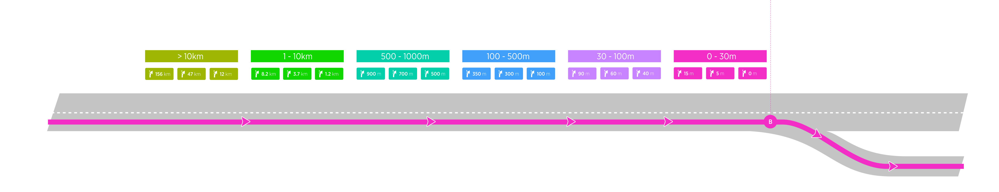
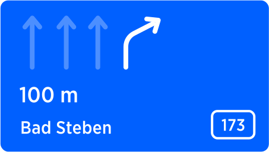
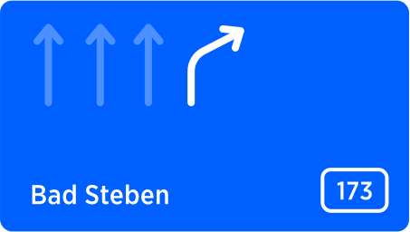

| **Interaction Designer** | [Alexey Opokin](https://tomtom.atlassian.net/wiki/people/70121:e8cb7861-9079-4b92-b96d-bfe8cd882680?ref=confluence) |
|---|---|
| **PO** | [Joost Pennings](https://tomtom.atlassian.net/wiki/people/712020:a6d50cb1-97be-4a9a-a279-3fbb3e2e1799?ref=confluence) |
| **ENG OWNER** | [Dennis Jakobsen](https://tomtom.atlassian.net/wiki/people/712020:c273d0e3-9a2a-456c-ad2f-6f56ca0e12b3?ref=confluence) → please assign |

Motivation
==========

Distance to the point of next manoeuvre is important components of Instruction information. This distance is surfaced at two places:  
  
As a **Visual distance** displayed permanently in the NIP (1): Distance is shown at the right side of the instruction arrow. This distance can be validated by driver at any time, since its value is constantly updating in real time as vehicle progresses toward the manoeuvre point. 

  
**Audio distance** announcement: Those announcements happen at predefined conditions and remind driver about upcoming manoeuvre. Audio instruction is announced by voice at every _**triggering point**_ ([more info](https://tomtom.atlassian.net/wiki/x/WQFmCQ) about triggering points). Audio announcements correspond to visual distance and must be synchronised. Depending on the distance value, there is distance formatting used.

Visual Distance formatting in the NIP
-------------------------------------

Depending on the value of distance, it is formatted in a way which is most appropriate for humans to consume and most helpful for them to estimate when the manoeuvre occurs. As vehicle approaches the manoeuvre point, distance value decreases by incremental steps, which are defined per distance range. We call this process _**Rounding**_. Rounding is needed in order to avoid too frequent numbers change and change that is not meaningful for humans in this particular context.

All distances should be rounded to the nearest "round" value, according to the range and rounding step.

Rounding rules are different for different metric systems. Following tables define Rounding rules for different metric systems:

**Rounding Steps - Metric (Meters, kilometres)**

| **Distance Range** | **Rounding Step** | **Examples** |
|--------------------|---|---|
| 0 \- 30m           | 5m | 5m, 10m, 15m, 25m, 30m |
| 30 \- 100m         | 10m | 30m, 50m, 80m, 100m |
| 100 \- 500m        | 50m | 150m, 200m, 350m, 500m |
| 500 \- 1000m       | 100m | 500m, 600m, 900m, 1km |
| 1 \- 10km          | 0\.1km | 2\.1km, 3\.6km, 7\.5km, 8km |
| \> 10km            | 1km | 11km, 15km, 25km, 376km |

**Rounding Steps - Imperial (Feet, Miles)**

| **Distance Range** | **Rounding Step** | **Examples** |
|--------------------|---|---|
| 0 \- 100f          | 10f | 10f, 20f, 30f, 50f |
| 100 \- 500f        | 50f | 100f, 150f, 250f, 300f |
| 500 \- 1000f       | 100f | 500f, 600f, 800f, 1000f |
| 1000f \- 1mi       | 0\.1mi | 0\.2mile, 0\.8mile, 1\.3mile, 2\.7miles |
| 1 \- 10mi          | 0\.1mi | 2\.2miles, 3\.7miles, 4\.5miles, 8\.6 miles |
| \> 10mi            | 1mi | 12miles, 25miles, 73miles, 347miles |

**Rounding Values - Imperial (Yards, Miles)**

| **Distance Range** | **Rounding Step** | **Examples** |
|--------------------|---|---|
| 0 \- 30yd          | 5yd | 5yd, 15yd, 25yd, 30yd |
| 30 \- 100yd        | 10yd | 40yd, 60yd, 80yd |
| 100 \- 300yd       | 50yd | 150yd, 200yd, 250yd, 300yd |
| 300yd  \- 3mi      | 0\.1mi | 0\.2mile, 0\.5mile, 1\.3miles, 2\.8miles |
| 1 \- 10mi          | 0\.1mi | 2\.2miles, 3\.7miles, 4\.5miles, 8\.6miles |
| \> 10mi            | 1mi | 12miles, 25miles, 73miles, 347miles |

Zero meters handling
--------------------

Distance countdown goes to the lowest point of rounded value (5 meters) and then it doesn't go to zero, but distance value is removed instead.  
…60…50…40…30…25…20…15…10…5… NOTHING

The value remains empty until next instruction value appears. Sometimes the manoeuvre path is long and it takes time to complete.

| 
**Close to manouvre**

 | 

**During the manoeuvre**

 |
| --- | --- |
| 

 | 

 |

Audio announcement distance Rounding
------------------------------------

Rounding distances for Audio announcements is done differently from soundings for visual display. The reason for such approach is that people perceive coarse rounded numbers easier and it shortens audio message as well. Additionally in different regions specific fractional units are used for communication distance verbally.  For example in US common units of distance are quarter of a mile, Half a mile, three quarters of a mile. For optimal audio communication it is recommended to stick to these units.

Distances are rounding to the nearest value according to the "Rounding Step", e.g. "1.49" → "1" while "1.50" → "2". If the result distance is on the boundary between m/km or ft/mi, the larger unit should be selected for announcement.

E.g

*   951 meters will be rounded to 1000 meters and 1000 m will be announced as 1km.
    
*   951 feet rounded to 1000 feet and 1000 feet will be announced as 1/4 mile
    

IMPORTANT: Audio roundings are different from visual roundings used in the NIP. The moment for audio distance announcement (triggering point) should be selected in such way that the audio announced distance matches the displayed one as close as possible. It doesn't have to match precisely, but to be close enough.

**Rounding Steps - Metric (Meters, kilometres)**

| **Distance Range** | **Rounding Step** | **Examples** |
|---|---|---|
| 0 \- 50m | \- | not announced |
| 50\-100m | 10m | sixty meters |
| 100 \- 1000m | 100m | one hundred, two hundreds, etc. |
| ~~1\-2km~~ | ~~0\.1km~~ | ~~one point 3 kilometre~~ |
| 1\-5km | 0\.5km | two kilometres, three and a half kilometres. |
| 5\-100km | 1km | eighty five kilometres |
| 100\-10000km | 10km | tho hungred thirty kilometers |

1.  Distances prior to 50m are not pronounced
    
2.  Zero fractional part must be truncated. E.g "two kilometers" (not two point zero kilometers) 
    
3.  Distances in kilometers, that ends with **.5** (e.g 1.5km, 2.5km ... 4.5km) should be pronounced as "one and a half",  "two and a half" ... "three and a half".
    

NOTE: Red row has been corrected as a result of this: [Audio announcement distance rounding for the 1-2 km range](https://tomtom.atlassian.net/wiki/spaces/GOSDK/pages/395615019/Audio+announcement+distance+rounding+for+the+1-2+km+range)

**Rounding Steps - Imperial (Feet, Miles)**

| **Distance Range** | **Rounding Step** | **Examples** |
|---|---|---|
| 0 \- 150f | \- | not announced |
| 150\-500f | 50f | three hundred fifty |
| 500 \- 1000f | 100f | six hundred, seven hundreds, etc. |
| 1000f \- 1mi | 1/4mi | one quater of the mile, half, 3/4 |
| 1\-10mi | 0\.5mi | 3 miles |
| 10\-100mi | 1mi | thirty four miles |
| 100mi\-1000mi | 10mi | three hundred sixty miles |

1.  Distances prior to 150f are not pronounced
    
2.  Zero fractional part must be truncated. E.g "two miles" (not two point zero miles) 
    
3.  Distances in miles, that ends with **.5** (e.g 1.5mi, 2.5mi ... 9.5mi) should be pronounced as "one and a half",  "two and a half" ... "nine and a half".
    

**Rounding Values - Imperial (Yards, Miles)**

| **Distance Range** | **Rounding Step** | **Examples** |
|---|---|---|
| 0 \- 50yd | \- | not announced |
| 50\-100yd | 10yd | seventy |
| 100 \- 400yd | 100yd | six hundred, seven hundreds |
| 400yd \- 1mi | 1/4mi | one quater of the mile, half, 3/4 |
| 1\-10mi | 0\.5mi | 3 miles |
| 10\-100mi | 1mi | thirty four miles |
| 100mi\-1000mi | 10mi | three hundred sixty miles |

1.  Distances prior to 50yd are not pronounced
    
2.  Zero fractional part must be truncated. E.g "two miles" (not two point zero miles) 
    
3.  Distances in miles, that ends with **.5** (e.g 1.5mi, 2.5mi ... 9.5mi) should be pronounced as "one and a half",  "two and a half" ... "nine and a half".
    

Legacy Distance formation from NK1 - Just for the reference for older product. Not to be used in NIE.
-----------------------------------------------------------------------------------------------------

This table is a legacy NK1 Rounding steps. It is not used in NIE, but it is still in use for NK1 based products. For that only reason this table is kept here.  
If you have any questions feel free to contact me  [Alexey Opokin](https://tomtom.atlassian.net/wiki/people/70121:e8cb7861-9079-4b92-b96d-bfe8cd882680?ref=confluence) 

|                             |  |  |  |                                   |  |  |  |                                    |  | **G\_008\_003** |
|-----------------------------|---|---|---|-----------------------------------|---|---|---|------------------------------------|---|---|
| **Distance range (metric)** | **Display format** | **Example** |  | **Distance range (miles / feet)** | **Display format** | **Example** |  | **Distance range (miles / yards)** | **Display format** | **Example** |
| \>\= 10 kilometer           | **1 km** steps | 312 km |  | \>\= 10 miles                     | **1 mile** steps | 312 mi |  | \>\= 10 miles                      | **1 mile** steps | 312 mi |
| 1 \~ \< 10 kilometer        | **0\.1 km** steps | 9\.3 km |  | 3 miles \~ \< 10 miles            | **0\.1 mile** steps | 2\.5 mi |  | 3 miles \~ \< 10 miles             | **0\.1 mile** steps | 2\.5 mi |
| 500 meter \~ \< 1 kilometer | **100 m** steps | 800 m |  | 1000 feet \~ \< 3 miles           | **0\.1 mile** steps | 1\.8 mi |  | 850 yards \~ \< 3 miles            | **0\.1 mile** steps | 1\.8 mi |
| 10 meter \~ \< 500 meter    | **10 m** steps | 380 m |  | 500 feet \~ \< 1000 feet          | **100 foot** steps | 600 ft |  | 500 yards \~ \< 850 yards          | **100 yard** steps | 800 yd |
| 0 \~ \< 10 meter            | not displayed |  |  | 30 feet \~ \< 500 feet            | **10 foot** steps | 360 ft |  | 10 yards \~ \< 500 yards           | **10 yard** steps | 320 yd |
|                             |  |  |  | 0 \~ \< 30 feet                   | not displayed |  |  | 0 \~ \< 10 yards                   | not displayed |  |