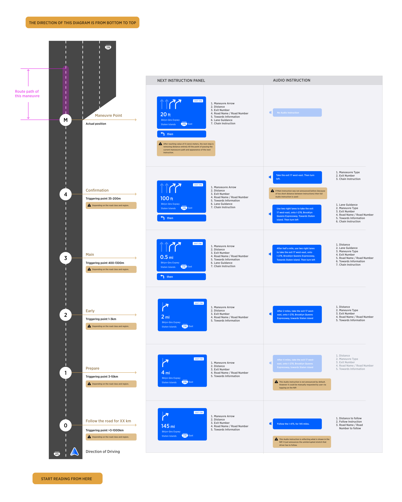
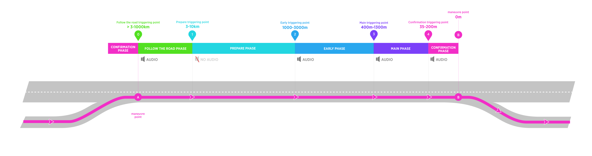
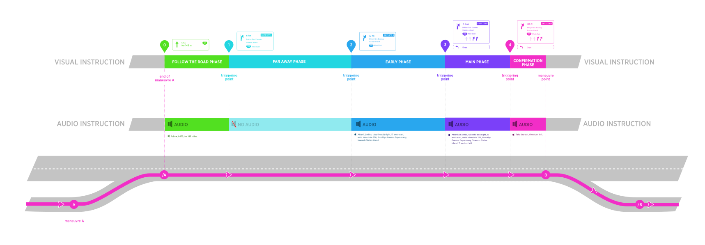
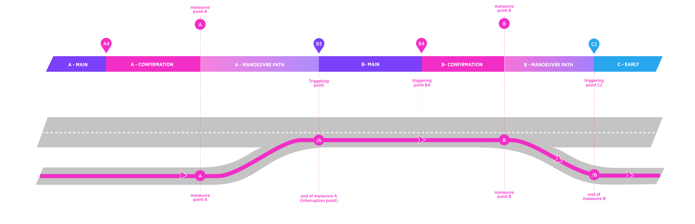
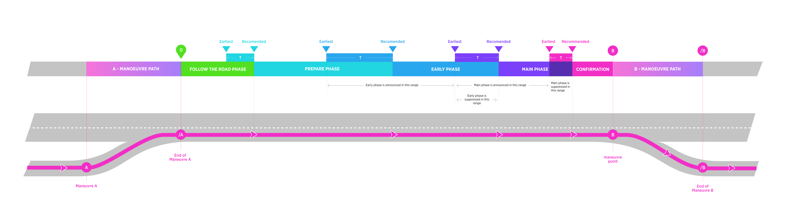
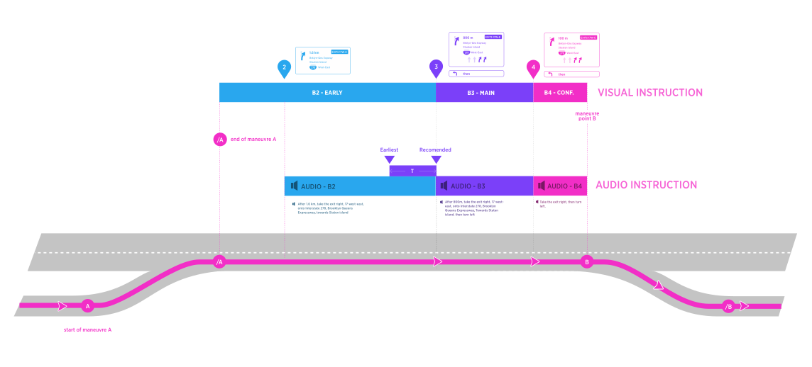
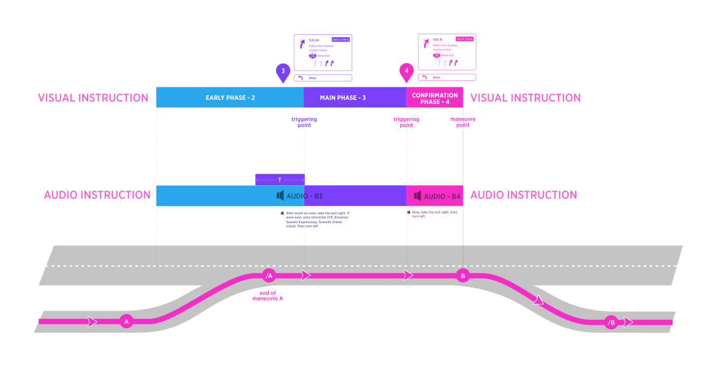

| **Interaction Designer** | [Alexey Opokin](https://tomtom.atlassian.net/wiki/people/70121:e8cb7861-9079-4b92-b96d-bfe8cd882680?ref=confluence) |
|---|---|
| **ENG OWNER** | [Oleh Kis](https://tomtom.atlassian.net/wiki/people/712020:bd4f4d9f-75d9-4d67-8408-8ace89f8fda6?ref=confluence) , [Bohdan Soroka](https://tomtom.atlassian.net/wiki/people/712020:d6cafcbe-bb3a-4305-bba3-02e3350309bc?ref=confluence) \- HCP3, |
| **Dev. team** | O\-light.  [NAV\-151478](https://tomtom.atlassian.net/browse/NAV-151478?src=confmacro)  |
| **PM** | [Joost Pennings](https://tomtom.atlassian.net/wiki/people/712020:a6d50cb1-97be-4a9a-a279-3fbb3e2e1799?ref=confluence) |
| **Code** | [https://bitbucket.tomtomgroup.com/projects/NAVKIT2/repos/nk2\-navigation\-instruction\-engine/commits](https://bitbucket.tomtomgroup.com/projects/NAVKIT2/repos/nk2-navigation-instruction-engine/commits) |

> [!NOTE]
> **WHAT CHANGED?**    Last revision of the document made following changes:
  1. Removed time component from triggering algorithm.
  2. Detached (put into expandable container) sections of the spec that should be handled (and owned) as part of dev. documentation.

> [!NOTE]
> **DISCLAIMER**   The document below is covering user experience and general guidelines for technical implementation. It might not cover exact methods for achieving this user experience, algorithms and heuristics. For more elaborative technical documentation please refer to corresponding dev. documentation.

Introduction
============

In order to guide driver along the route, navigation system invokes guiding Instructions for every manoeuvre.

Guiding Instruction contains Visual and Audio components which work in sync with each other. As vehicle is moving toward the point of the manoeuvre, visual instructions are displayed in the NIP (Next Instruction Panel) and audio instructions are triggered at certain conditions. Audio instructions are synchronised with appropriate visual instruction, so the distance to manoeuvre displayed in the NIP corresponds to spoken distance in audio instruction. Additionally, some Information displayed in the NIP might get reflected in the announcement.

Example of Visual and Audio Instruction
---------------------------------------

Instruction phases &amp; Triggering points
======================================

Information displayed in the NIP is not static and it changes as vehicle approaches the point of the manoeuvre. Additionally audio instructions provide key information as the user approaches the manoeuvre point. Those points where audio instruction is announced (and simultaneously, NIP content gets updated), are called _**Instruction triggering points**._ Segments between those points called _**Instruction phases**._ There are following _**Instruction phases:**_

*   Follow the road for XX km (doesn't belong to next instruction, in fact)
    
*   Prepare (silent, no audio instruction)
    
*   **Early**
    
*   **Main**
    
*   **Confirmation**
    

While we have 5 phases in total, first two are special and have different behaviour. The diagram below depicts Instruction Phases together with triggering points and corresponding Guiding information. 

Instruction Phases
------------------

Instructions are invoked far in advance in order to prepare driver for the manoeuvre. As vehicle progresses towards manoeuvre point, there are **5 phases of instruction** provided. Here is overview of all possible instruction phases which can occur on a long road stretch:   

*   All **Instruction phases** with the exception of 1 (Prepare) are accompanied by audio.
    
*   **Triggering points** are based on distance to the manoeuvre.  
    NOTE: There is also _**audio compensation**_ value added to the triggering point to compensate for the time which is required for audio announcement.  
    
*   In addition to those (automatically invoked) triggering points, there is a possibility of **manual (user invoked) triggering point**.
    

NOTE: This document only covers logic of **triggering** and does not define instructions themselves.

Instruction Phases in details
-----------------------------

In the table below described all instruction stages with their attributes.

| **Phase of Instruction:** | **Follow** | **Prepare** | **Early** | **Main** | **Confirmation** |
|---|---|---|---|---|---|
| Description | This instruction phase is executed at any distance bigger than Prepare Instruction phase. It does not refer to the next manoeuvre directly, but rather communicates long stretch ahead without any actions require from driver. This phase provides peace of mind and releases driver attention from following guidance. | This is the earliest reference to the actual upcoming manoeuvre. It informs the driver that there is upcoming manoeuvre in the near future. It appears silently and will be noticed only if driver scans the screen for the information. No action is needed at this point \- it just a heads up information. | Executed closer to manoeuvre point but still early for action. This is a mental preparation phase \- Driver makes himself comfortable with future action, creates a mental model of the manoeuvre. No action is required at this point. | Executed at the short time before manoeuvre. This is a first call for action \- driver is asked to start preparing for the manoeuvre, i.e. staring getting into the right lane, slowing down. | Executed at the moment \~ 2\-3 sec before the point where manoeuvre must be taken. There is still enough time for the driver to check the road situation and perform manoeuvre concisely and safely without rush.  NOTE: Keep in mind this is NOT an actual point of the manoeuvre. |
| Audio | Yes. Audio instruction is always announced at the moment when instruction is invoked. The audio informs the driver that there is a long stretch of uninterrupted road ahead. | Has NO Audio Instruction by default. Can be configurable internally to enable audio instruction. | Yes | Yes | Yes |
| Distance \- Motorways | After the completion of previous manoeuvre and above "Prepare" trigger. | 6 km | 3 km | 1000 m | 150 m |
| Distance \- Others | the same | 4 km | 2 km | 500 m | 70 m |
| Distance \- Urban | the same | 3 km | 1 km | 400 m | 35 m |

NOTE: Triggering distances should be defined not only in _**metric**_ system (above) but also in _**Imperial**_ and _**Imperial US.**_ When defining other metric systems values it is important to not just convert from metric, but find closest matching round value in target system which is close enough to the metric value. Example: **1000m (metric) = 1/4 mile (imperial).**

**Complete list of triggering points values defined per all road types for every supported metric system** MOVE TO DEV SPACE

Triggering Points values defined per type of roads

Triggering points are not universal and differ by road classes. We differentiate between 5 tiers of roads:

  

1.  **Motorways in NAM region**
    
2.  **Motorways the rest of the world**
    
3.  **Other roads (neither Motorways nor Urban)**
    
4.  **High Speed urban roads**
    
5.  **Urban Roads**
    

Triggering point / Motorways / North America
--------------------------------------------

| Instruction: | Follow the road | Prepare | Early | Main | Confirmation |
|---|-----------------|---|---|---|---|
| Distance  Metric (meters, Km) | \> 10 km        | 10 km | 3 km | 1300 m | 200 m |
| Distance  Imperial (feet, Miles) | \> 6 miles      | 6 miles | 2 miles | 1/2 miles | 600 feet |
| Distance  Imperial (Yards, Miles) | \> 6 miles      | 6 miles | 2 miles | 1/2 miles | 200 yards |

Triggering point / Motorways / Rest of the World
------------------------------------------------

| Instruction: | Follow the road | Prepare | Early | Main | Confirmation |
|---|-----------------|---|---|---|---|
| Distance  Metric (meters, Km) | \> 6 km         | 6 km | 3 km | 1000 m | 150 m |
| Distance  Imperial (feet, Miles) | \> 4 miles      | 4 miles | 1\.5 miles | 1/4 miles | 500 feet |
| Distance  Imperial (Yards, Miles) | \> 4 miles      | 4 miles | 1\.5 miles | 1/4 miles | 150 Yards |

OtherRoads (Neither Motorways nor Urban) / Applied for all regions
------------------------------------------------------------------

| Instruction: | Follow the road | Prepare | Early | Main | Confirmation |
|---|-----------------|---|---|---|---|
| Distance  Metric (meters, Km) | \> 4 km         | 4 km | 2 km | 500 m | 70 m |
| Distance  Imperial (feet, Miles) | \> 2\.5 miles   | 2\.5 miles | 1\.5 miles | 1/4 miles | 230 feet |
| Distance  Imperial (Yards, Miles) | \> 2\.5 miles   | 2\.5 miles | 1\.5 miles | 1/4 miles | 70 yards |

High speed urban roads / Applied for all regions
------------------------------------------------

| Instruction: | Follow the road | Prepare | Early | Main | Confirmation |
|---|-----------------|---|---|---|---|
| Distance  Metric (meters, Km) | \> 4 km         | 4 km | 2 km | 500 m | 100 m |
| Distance  Imperial (feet, Miles) | \> 2\.5 miles   | 2\.5 miles | 1\.5 miles | 1/4 miles | 150 feet |
| Distance  Imperial (Yards, Miles) | \> 2\.5 miles   | 2\.5 miles | 1\.5 miles | 1/4 miles | 50 Yards |

Urban Roads / Applied for all regions
-------------------------------------

| Instruction: | Follow the road | Prepare | Early | Main | Confirmation |
|---|----------------|---|---|---|---|
| Distance  Metric (meters, Km) | \> 3 km        | 3 km | 1 km | 400 m | 35 m |
| Distance  Imperial (feet, Miles) | \> 2 miles     | 2 miles | 1/2 miles | 1/4 miles | 100 feet |
| Distance  Imperial (Yards, Miles) | \> 2 miles   | 2 miles | 1/2 miles | 1/4 miles | 35 yards |

  
Interrupted and uninterrupted phase
======================================

Before moving on, we need to clarify situation with uninterrupted and interrupted instruction phase situations. Manoeuvres are scattered along the route in unpredictable way. There different gaps between manoeuvres. It could happen that there is 300km distance between two given manoeuvres, but it could happen also that there is 100m only with everything in-between. We call scenario **uninterrupted phase** it the stretch between last manoeuvre and the next one is big enough to include all 4 instruction phases (follow the road excludes as it is indefinite) in it. And the opposite - scenario that cannot embrace all 5 phases called **Interrupted**. Interrupted phase requires special logic for triggering that will be covered later.

  
Uninterrupted Instruction Phase scenario
-------------------------------------------

If a road stretch between two manoeuvres is long enough to include all instruction phases from 1 to 4, then the instruction phases will be triggered by predefined above distances and we call them **uninterrupted instruction phases**. Phase 0 (Follow the road) is excluded because it has indefinite length. **Triggering point** for **Follow the road** instruction is always defined in the end of previous manoeuvre. 

Following diagram depicts scenario of uninterrupted instruction phases on a road stretch between two manoeuvres. This diagram depicts full set of Instruction phases with both visual and audio components. There is a long stretch of the road between manoeuvres **A** and **B** with no manoeuvres in-between.

Interrupted Phase Scenario
--------------------------

**Interrupted instruction phase** occurs when road stretch between two manoeuvres is too short to include all instruction phases from 1 to 4.  
In the diagram below, Main phase of **manoeuvre B** is interrupted by the end of previous **manoeuvre (/A)**. It creates interruption point for Main phase of **manoeuvre B**. In this example the interruption point becomes new **triggering point for B3**.

IMPORTANT! Triggering Points **A4, B4** are not interrupted. Triggering point **B3** (and **C2**) are interrupted and they are announced at the end of previous manoeuvre.

###   
  
**Rule of Interrupted triggering point**

| Guidance must announce next manoeuvre always after finishing the previous one, regardless of the distance to it. |
|---|

 But which phase should be announced if previous manoeuvre end falls in the middle between two instruction phases? 

**Definition of Manoeuvre Path** MOVE TO DEV SPACE

Manoeuvre path

Manoeuvre Path - 
-----------------

Manoeuvres can be represented as point or as road stretches. Stretches are called **Manoeuvre path** and can be gathered from the NDS map road segment attributes. In depicted diagram **Manoeuvre path** Indicated the beginning of the manoeuvre and its end. During Instruction Path of **Manoeuvre A** the visual instruction in the NIP remains representing **manoeuvre A**.

  

  

  

Triggering Thresholds for Interrupted Instruction Phase
-------------------------------------------------------

Interruption point is a point where vehicle finishes previous instruction cycle and new instruction cycle starts. When **interruption point** falls somewhere in the **middle of instruction phase**, a decision should be made which triggering point should be activated now: this belongs to the current phase or the next one. The closer Interruption point to the next instruction triggering point, the more it makes sense to announce the next phase, skipping the current one. **Triggering threshold** **\- T** defines such decision point. 

**How Triggering Threshold works?**  
If point of interruption falls **before the threshold (T)**, then **current instruction phase** is announced. If point of interruption falls **inside threshold (T) range**, the current phase is skipped and **next instruction phase is announced**. 

| The purpose of this logic is to ensure that **shortly after the completion of the previous manoeuvre** an announcement for the next one is always given. In the same time it ensures reasonable gaps between instructions phases, so they don't repeat no matter where interruption point falls. The diagram below visualises triggering thresholds corresponding to each triggering point. |
|---|

**Definition of detailed logic for thresholds** MOVE TO DEV SPACE

Detailed definition of Treshold Values -&gt; Move this section to Development documentation

Following values are calculated by adding 50% (from the next phase value) to the corresponding instruction phases (see the diagram above). Tables below represent the distance range from _**earliest**_ possible point till the _**latest**_. _**Recommended**_ point is sitting somewhere between those two.

NOTE: Keep in mind that latest point for the main instruction equals to earliest point for confirmation, and so on for all phases.

### Distance ranges / Controlled Access Roads / North America

The table below defines possible distance ranges for every instruction phase under interrupted scenario

| Instruction phase: | Stay On | Prepare | Early | Main | Confirmation |
|---|---|---|---|---|---|
| Distance range   Metric (meters) | \- | 15000 \- 4500 | 4500 \- 1950 | 1950 \- 300 | 300\-0 |
| Recommended (used in uninterrupted phase)  Metric (meters) | \- | 10000 | 3000 | 1300 | 200 |

  

### Distance ranges / Controlled Access Roads / Rest of the World

The table below defines possible distance ranges for every instruction phase under interrupted scenario

| Instruction phase: | Stay On | Prepare | Early | Main | Confirmation |
|---|---|---|---|---|---|
| Distance range   Metric (meters) | \- | 9000 \- 4500 | 4500 \- 1500 | 150 \- 230 | 230 \- 0 |
| Recommended (used in uninterrupted phase)  Metric (meters) | \- | 6000 | 3000 | 1000 | 150 |

  

### Distance ranges / Other Roads / Applied for all regions

The table below defines possible distance ranges for every instruction phase under interrupted scenario

| Instruction phase: | Stay On | Prepare | Early | Main | Confirmation |
|---|---|---|---|---|---|
| Distance range   Metric (meters) | \- | 6000 \- 3000 | 3000 \- 750 | 750 \- 150 | 150 \- 0 |
| Recommended (used in uninterrupted phase)  Metric (meters) | \- | 4000 | 2000 | 500 | 100 |

  

### Distance ranges / City Roads / Applied for all regions

The table below defines possible distance ranges for every instruction phase under interrupted scenario

| Instruction phase: | Stay On | Prepare | Early | Main | Confirmation |
|---|---|---|---|---|---|
| Distance range   Metric (meters) | \- | 4500 \- 1500 | 1500 \- 600 | 600 \- 140 | 140 \- 0 |
| Recommended (used in uninterrupted phase)  Metric (meters) | \- | 3000 | 1000 | 400 | 70 |

  

### Example: Interruption point falls before the threshold

If **interruption point** falls **before the threshold** then current instruction phase is announced (both visual and audio). This effectively acts as a delayed triggering point (compared to uninterrupted scenario).

See the diagram below. When end of previous manoeuvre (A) lands at the point somewhere in the middle of instruction phase (Early, in this example) but before the threshold, the audio instruction for **current** instruction phase (Early, in this example) is invoked even though, the triggering point for this phase is passed.  At point **A** the "**Early** Instruction" is announced by audio.

### Example: Interruption point falls after the threshold

Similarly, When the end of previous instruction lands at the point point in the middle of instruction phase (Early, in this example) but after the threshold, the audio instruction for **NEXT** instruction phase (**Main**, in this example) is invoked (both visual and audio). In other words, triggering point **3** in migrated to point **/A**. At the point **/A** the "**Main** Instruction" is announced and shown.

This logic has an exception for the Confirmation message, it is always announced at the "recommended" time/distance, while the "earliest" range length is only used to suppress previous phase. That means, if the previous maneuver A is close enough to the next one B, that there is not enough time to speak out the Main message, then only the Confirmation for B will be spoken after maybe a pause.

Audio Instruction Duration Compensation
=======================================

Speaking Audio instruction takes time. Our goal is to start announcing audio instruction early enough that at the end of distance announcement (in two point five kilometers...) the value of the distance in the NIP should be matching just announced value as close as possible. Therefore audio should start a bit ahead of the distance displayed in the NIP in order to be synchronised with visual. How this could be achieved is beyond this document, but audio compensation logic should be defined on the engineering side.

**IMPORTANT!** We base this logic on the assumption that for all languages, the distance will be always announced at the beginning of the instruction: **“In 500m turn left”.** If this assumption is incorrect, the logic should be revisited but for now, there is no such evidence.

**NOTE:** Compensation is not applied to Confirmation, Follow the Road and Prepare instruction phases.

Manual Triggering of Instruction (Repeat last Instruction)
==========================================================

All triggering point are automatically generated by the system that results in the guidance Audio instructions to be delivered in optimal (from the system perspective) way in time to the driver. However, there are  situations when driver forgets the last announcement, because he was involved in the conversation or for whatever other reason. He might want to repeat the last announcement. This scenario is supported by manual user request. Interaction vise, It could be initiated via various methods, depending on the target platform, and it will generate triggering point at the moment of request. The result of this will be audio announcement of the next instruction.  

| **Value** | **What is announced** |
|---|---|
| Distance | Current distance with applied rounding rules |
| Instruction Phase | Based on Distance |

