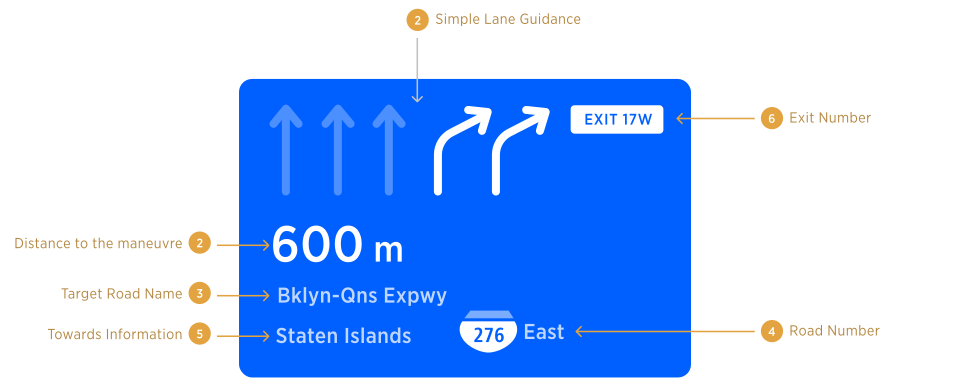
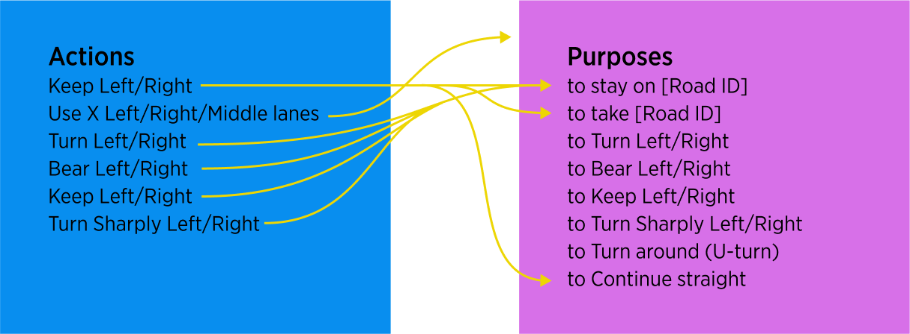
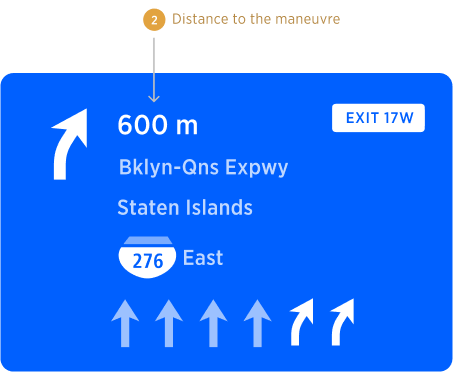

| **Interaction Designer** | [Alexey Opokin](https://tomtom.atlassian.net/wiki/people/70121:e8cb7861-9079-4b92-b96d-bfe8cd882680?ref=confluence) |
|---|---|
| **Visual Designer** | [Georgios Koultouridis](https://tomtom.atlassian.net/wiki/people/5be2fd44649a737c2342afbe?ref=confluence) |
| **PM** | [Joost Pennings](https://tomtom.atlassian.net/wiki/people/712020:a6d50cb1-97be-4a9a-a279-3fbb3e2e1799?ref=confluence) |
| **Dev. Teams** | PT Guidance |

Introduction to Guidance &amp; NIE
==============================

**Guidance (or Navigation)** refers to the process of providing drivers with information and directions that can help them reach their desired destinations safely and efficiently. This can include providing drivers with information about the route they should take, the distance to their destination, and any potential traffic or other hazards that they may encounter along the way.

Car navigation systems are designed to provide guidance to drivers by using a variety of technologies, such as GPS tracking, mapping software, and other sensors. These systems can be integrated into a car's dashboard.

Car navigation systems may also provide drivers with real-time traffic updates, alerts about potential hazards or accidents on the roadway, and other information that can help them make informed decisions about their route and travel plans.

TomTom provides a set of guidance methods that operate simultaneously and cover different aspects of guidance:

**Map** - provides visualisation of the road network around current position with visualisation of the projected **route.**

**NIP** - Next instruction panel. Provides schematic visualisation of **Next Instruction.**

**Audio Guidance -** Provides navigation instruction by audio.

**NIE**- New instruction Engine refers to a successor of NK1 - (NavKit 1) engine that was used by TomTom navigation systems until now. NIE redefines the set of methods and rules focusing on flexibility and sets a new standard for Navigation.

Audio Instruction Architecture
==============================

**NIE** uses **Audio** and **Visual** Instructions as methods for Navigation.  
**Audio Instruction** is description of an **manoeuvre** required from the driver in order to follow specific route.   
While driving along the route the driver will need to perform **Manoeuvres,** which are actions involving control of the vehicle by the driver. This is loosely defined and dependent on the perception of the driver.

The NIE delivers Audio Instructions, constructed in a modular way so they can communicate not only simple messages like _**Keep left**_ but more elaborate instructions like _**Keep left to stay on A100**_ or _**Use two right lanes to take the exit**_. To provide such elaborate instructions NIE introduces **Instruction Components.** There are 5 possible Instruction Components: **Distance, Pointer, Action, Purpose, Direction**. Out of all components only **Action** is mandatory and must always be present, while others are optional and depend on the specific use manoeuvre and distance to it.  

Visual Instruction Architecture
===============================

**Visual instruction,** is represented by the **NIP - Next Instruction Panel**, and, similarly to Audio Instruction, it consists of Components. Those Components can be mapped to Audio Instruction Components mentioned earlier. NIP Components are:

**Distance**  
**Instruction Arrow**  
**Exit Number**  
**Road Name/Number**  
**Towards Information**  
**Lane Guidance**

Here is an example of the NIP with all possible components in it:

**Audio Instruction** compliments the NIP Visual instruction and helps driver to navigate with less dependency on the screen. Our goal is to reduce reliance on the screen for guidance, provides full set of audio information required for successful performing of a manoeuvre.  Audio instruction attributes are referring to visual attributes in the NIP.

| **Distance \->** | **Pointer \->**  | **Action \->**      | **Purpose ->**              | **Direction \-/**                                |
|------------------|------------------|---------------------|-----------------------------|--------------------------------------------------|
| in 600 meters    | after the tunnel | use two right lanes | to take the exit No. 17 West | onto Interstate 276 East, towards Staaten Island |

Categories of Instructions
==========================

Instructions can be categorised by types. Here are all available types of instructions grouped into 4 categories:

| **Road network instructions**, concerning changing from one road to another at an intersection                                                                                                       | **Controlled access (Motorways)** **instructions**, concerning interacting with high\-speed interchanges via physically separated channels. | **Modal instructions**, describing interaction with non\-topological aspects of the road infrastructure. | **Route instructions,** describing the journey itself rather than actual maneuvers |
|------------------------------------------------------------------------------------------------------------------------------------------------------------------------------------------------------|---|---|---|
| Turn Left/Right   Bear Left/Right   Turn Sharply Left/Right   Turn around (U\-turn)   Turn around when possible   Follow road to Left/Right   Continue straight   Roundabout  Keep Left/Right (at fork) | Take Motorway (join Highway)   Take exit (leave Highway)   Keep Left/Right (Highway fork)   ~~Switch Highway (via exit)~~   Enter HOV lane   Exit HOV lane | Border Crossing   Toll Gates   Take Ferry   Take Car Train | Departure Instruction   Arrival Instruction   Follow road for XX km |

**How we define Instruction type?**  
In order to do define the instruction type, we need to look at two Components: **Action** and **Purpose**. One of them defines the type, but which one is depends on specific use case. **As a general rule, Purpose defines the instruction type when it is available. In the absense of Purpose, Action defines the instruction type.**

| **Distance \->** | **Pointer \->**      | **Action \->**      | **Purpose \->**   | **Direction \-/** |
|------------------|----------------------|---------------------|-------------------|---|
| in 800 meters    | at the traffic light | **turn right**      | \-\-\-            | onto Street name |
| in 800 meters    | at the traffic light | use two right lanes | **to turn right** | onto Street name |

In the first example, **Purpose is absent** and therefore the Instruction type is defined by the Action, which is Turn Right.

In the second example, **Purpose is defining** the type of the instruction (Turn Right), while Action is providing a secondary information.

> [!NOTE]
> **Terminology mismatch**   At the moment, instruction types categorisation described here is not aligned with categorisation used in NIE. Alignment work is required.

**Action** and **Purpose** components
==============================

**Action** and **Purpose** are the most important components of an instruction. There are the following Actions and Purposes available in the arsenal of Guidance. As illustrated, there are some items that can be used as both Actions and Purposes. Not all Actions can be used with all Purposes (this doesn't make practical sense), but only certain combinations are possible. Those are indicated by the arrows.

How to decide if Purpose component should be used or not?
---------------------------------------------------------

It is not always clear when instruction should have purpose component and when no, but following rules help to define those principles. To summarise the rules of Actions and purposes for turns we can use following table:

|**conditions for using purpose**|**action**|**purpose**|
| --- | --- |---| 
|at multilane junctions, when more then 1 lane is dedicated for the given turn. |use 2 right/left lanes to...|turn right/left|
|at multilane junctions, when continue straight instruction is used.|use 2 middle lanes...|to continue straight|
|on Motorway exits, when switching to another motorway.|take the exit... |to switch to...|
|always at bifurcations |keep left...|to stay on|
|always at bifurcations |keep right... |to take...|

Distance component
==================

Distance indicates numerical value of distance from current position to manoeuvre point. Distance is announced by audio at all triggering points (except of "confirmation") or manual user intent as well as displayed in the NIP.   

Distance attribute is used for all Types of instructions except those:

**Departure Instruction**  
**Turn around when possible**

For those instructions distance is not applicable because manoeuvre doesn't have a location point.

Pointer component
=================

Pointer or Landmark attribute refer to the following types of objects:

Currently Implemented:  
**Traffic Lights**  ...at the traffic light, turn left  
**Bridges**  ...after the bridge, turn **right**  
**Tunnels**  ...after the tunnel, keep right.  
**End of the road** ...at the end of the road turn left (currently in refinemnt)

PLANNED  
**Forks** ... at the fork, keep left...  
**Junctions**   
**Intersections**

When Pointers are present at the manoeuvre point they can (optionally) be used by guidance in order to improve orientation and provide additional confidence to the driver. Most Pointers are only announced by audio and not represented in the NIP, with one exception: Traffic Lights. Those pointers are displayed in the NIP.

Direction component
===================

Direction component can have several attributes: **Road names/numbers, Exit names/Numbers, Towards locations.** Directional attributes are announced by audio and displayed in the NIP.

**END OF DOCUMENT /**