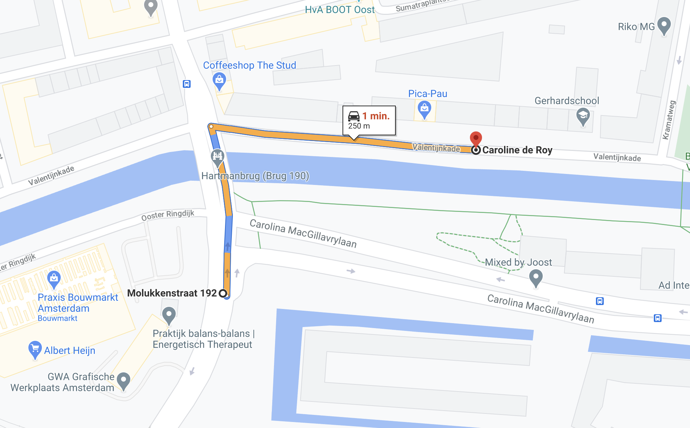

| **Design** | [Alexey Opokin](https://tomtom.atlassian.net/wiki/people/70121:e8cb7861-9079-4b92-b96d-bfe8cd882680?ref=confluence) |
|---|---|
| **Visual Designer** | [Georgios Koultouridis](https://tomtom.atlassian.net/wiki/people/5be2fd44649a737c2342afbe?ref=confluence) |
| PO | [Joost Pennings](https://tomtom.atlassian.net/wiki/people/712020:a6d50cb1-97be-4a9a-a279-3fbb3e2e1799?ref=confluence) |

Table of Contents
=================

*   [Table of Contents](#Landmark-Bridges-TableofContents)
*   [Introduction](#Landmark-Bridges-Introduction)
*   [Bridge](#Landmark-Bridges-Bridge)

  

**Introduction**
================

_TBD_

  

  

  

**Bridge** 
===========

  

| **Pointer** | After the bridge                                                                                                                                                                                                                                                                                                            | NOTE: term ***Landmark*** and ***Pointer*** are used interchangeably here. They refer to the same object, but ***Landmark*** refers to the object itself on the road in real world, while ***Pointer*** is UI element (and audio component) which is pointing to it. |
|---|-----------------------------------------------------------------------------------------------------------------------------------------------------------------------------------------------------------------------------------------------------------------------------------------------------------------------------|----------------------------------------------------------------------------------------------------------------------------------------------------------------------------------------------------------------------------------------------------------------------|
| **Description** | This pointer is given when crossing a bridge                                                                                                                                                                                                                                                                                |                                                                                                                                                                                                                                                                      |
| **Location** | 52\.358565421477536, 4\.9409775832840355                                                                                                                                                                                                                                                                                    |                                                                                                                                                                                                                                                                      |
| **Road Geometry** |                                                                                                                                                                                                                                                                                                    |                                                                                                                                                                                                                                  |
| **Visual Instruction** |                                                                                                                                                                                                                                                                                                    | Bridge Pointer is not visualised in the NIP.                                                                                                                                                                                                                         |
| **Audio Instruction** | In 500m, **after the bridge,** turn right onto Bundestraat                                                                                                                                                                                                                                                                  |                                                                                                                                                                                                                                                                      |
| **Audio Template** | **\[distance] \[pointer]\[purpose]\[road name/number]** Note: this is just an example of all the possible combinations that this pointer can have. See [NIE\_003 \- Audio Instructions](https://tomtom.atlassian.net/wiki/display/FlaminGO/NIE_003+-+Audio+Instructions?src=contextnavpagetreemode) for further details |

  

  

  

  

  

  

  

* * *

END OF THE DOCUMENT