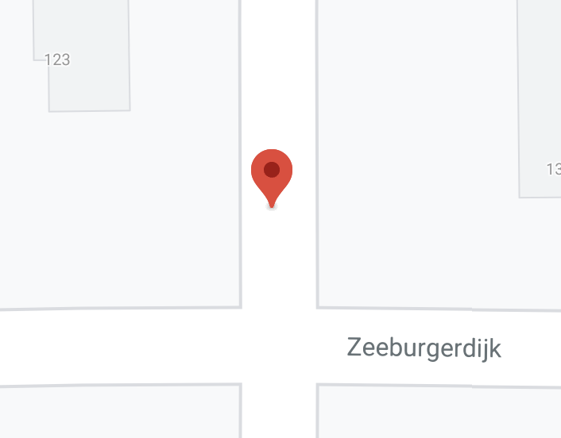

| **Design** | [Alexey Opokin](https://tomtom.atlassian.net/wiki/people/70121:e8cb7861-9079-4b92-b96d-bfe8cd882680?ref=confluence) |
|---|---|
| **Visual Designer** | [Georgios Koultouridis](https://tomtom.atlassian.net/wiki/people/5be2fd44649a737c2342afbe?ref=confluence) |
| PO | [Joost Pennings](https://tomtom.atlassian.net/wiki/people/712020:a6d50cb1-97be-4a9a-a279-3fbb3e2e1799?ref=confluence) |

Table of Contents
=================

*   [Table of Contents](#Table-of-Contents)
*   [Introduction](#Introduction)
*   [Traffic Lights](#Traffic-Lights)

  

**Introduction**
================

refers to a _TBD_

  

  

**Traffic Lights**  
====================

| **Instruction** | After the traffic lights                                                                                                                                                                                                                                                                                                                                                                                                       |  |
|---|--------------------------------------------------------------------------------------------------------------------------------------------------------------------------------------------------------------------------------------------------------------------------------------------------------------------------------------------------------------------------------------------------------------------------------|---|
| **Description** | Traffic lights landmark is indicated when manoeuvre happens at the point where traffic light is interrupting the flow (junction or intersection).       Multiple traffic lights rule.    If there are multiple traffic lights installed in the range between main and confirmation instruction triggering points, Traffic light landmark should not be used. It will create confusion due to multiple traffic lights on the way. |  |
| **Location** | 52°21'58\.5"N 4°56'22\.1"E                                                                                                                                                                                                                                                                                                                                                                                                     |  |
| **Road Geometry** |                                                                                                                                                                                                                                                                                                                                                                                                    |  |
| **Visual Instruction** | TBD                                                                                                                                                                                                                                                                                                                                                                                                                            |  |
| **Audio Instruction** | In 600m after the traffic light turn right                                                                                                                                                                                                                                                                                                                                                                                     |  |
| **Audio Template** | **\[distance] \[pointer]\[purpose]\[road name/number]**    Note: this is just an example of all the possible combinations that this pointer can have.    See [NIE\_003 \- Audio Instructions](https://tomtom.atlassian.net/wiki/display/FlaminGO/NIE_003+-+Audio+Instructions?src=contextnavpagetreemode) for further details                                                                                                         |

  

  

  

  

  

  

* * *

END OF THE DOCUMENT