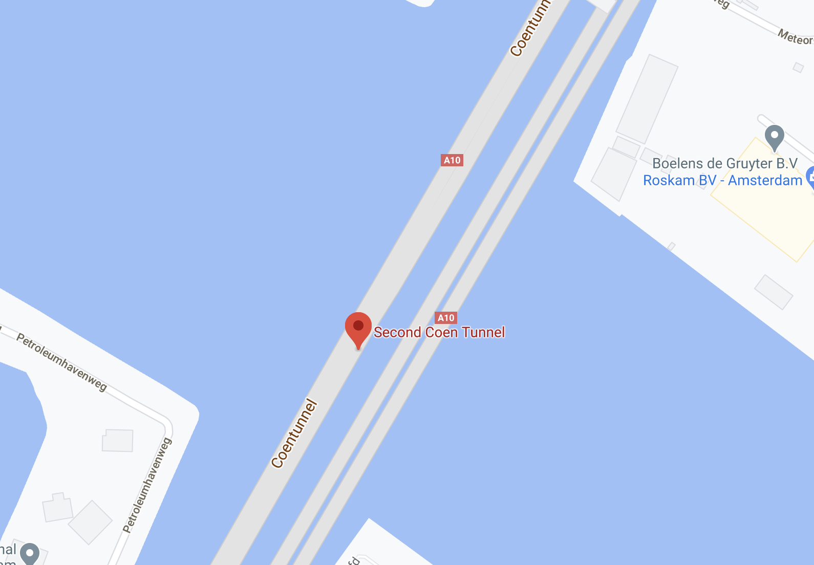
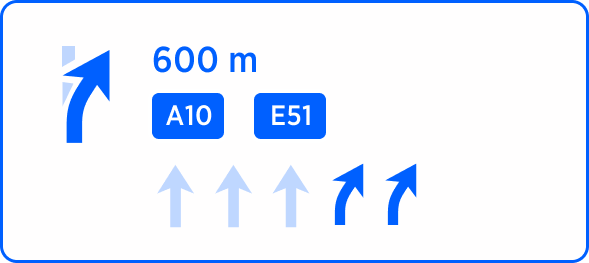
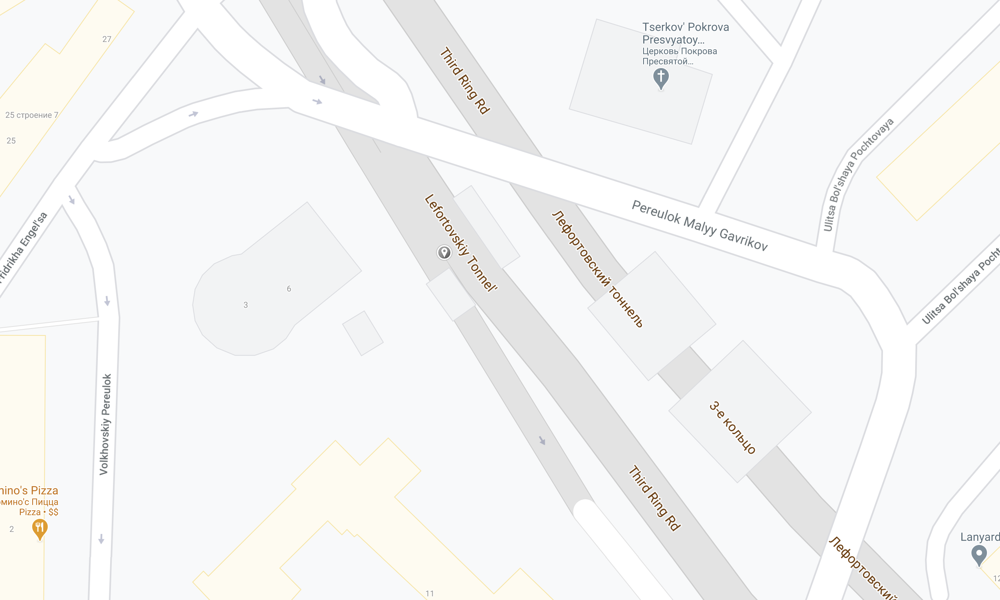

| **Design** | [Alexey Opokin](https://tomtom.atlassian.net/wiki/people/70121:e8cb7861-9079-4b92-b96d-bfe8cd882680?ref=confluence) |
|---|---|
| **Visual Designer** | [Georgios Koultouridis](https://tomtom.atlassian.net/wiki/people/5be2fd44649a737c2342afbe?ref=confluence) |
| PO | [Joost Pennings](https://tomtom.atlassian.net/wiki/people/712020:a6d50cb1-97be-4a9a-a279-3fbb3e2e1799?ref=confluence) |

Table of Contents
=================

*   [Table of Contents](#Table-of-Contents)
*   [Introduction](#Introduction)
*   [Tunnel](#Tunnel)

  

**Introduction**
================

refers to a _TBD_

  

  

**Tunnel**
==========

  

| **Instruction** | After the tunnel                                                                                                                                                                                                                                                                                                                 |  |
|---|----------------------------------------------------------------------------------------------------------------------------------------------------------------------------------------------------------------------------------------------------------------------------------------------------------------------------------|---|
| **Description** | This Instruction is given when crossing a tunnel                                                                                                                                                                                                                                                                                 |  |
| **Location** | 52\.413661634111705, 4\.863716817291281                                                                                                                                                                                                                                                                                          |  |
| **Road Geometry** |                                                                                                                                                                                                                                                                                                      |  |
| **Visual Instruction** |  Visual design must be reviewed                                                                                                                                                                                                                                                                      |  |
| **Audio Instruction** | In 600m **after the tunnel** turn right onto Bundestraat                                                                                                                                                                                                                                                                         |  |
| **Audio Template** | **\[distance] \[pointer]\[purpose]\[road name/number]**  Note: this is just an example of all the possible combinations that this pointer can have.  See [NIE\_003 \- Audio Instructions](https://tomtom.atlassian.net/wiki/display/FlaminGO/NIE_003+-+Audio+Instructions?src=contextnavpagetreemode) for further details |

| **Instruction** | Into the tunnel                                                                                                                                                                                                                                                                                                                |  |
|---| ---                                                                                                                                                                                                                                                                                                                              |---|
| **Description** | When a manoeuvre occurs inside a tunnel                                                                                                                                                                                                                                                                                        |  |
| **Location** | 55\.774051, 37\.684679                                                                                                                                                                                                                                                                                                         |  |
| **Road Geometry** |                                                                                                                                                                                                                                                                               |  |
| **Visual Instruction** |  Visual design must be reviewed                                                                                                                                                                                                                                                                    |  |
| **Audio Instruction** | In 600m turn right into the tunnel                                                                                                                                                                                                                                                                                             |  |
| **Audio Template** | **\[distance] \[action]\[direction]\[pointer]**  Note: this is just an example of all the possible combinations that this pointer can have.  See [NIE\_003 \- Audio Instructions](https://tomtom.atlassian.net/wiki/display/FlaminGO/NIE_003+-+Audio+Instructions?src=contextnavpagetreemode) for further details                  |

  

  

  

  

  

  

  

  

* * *

END OF THE DOCUMENT