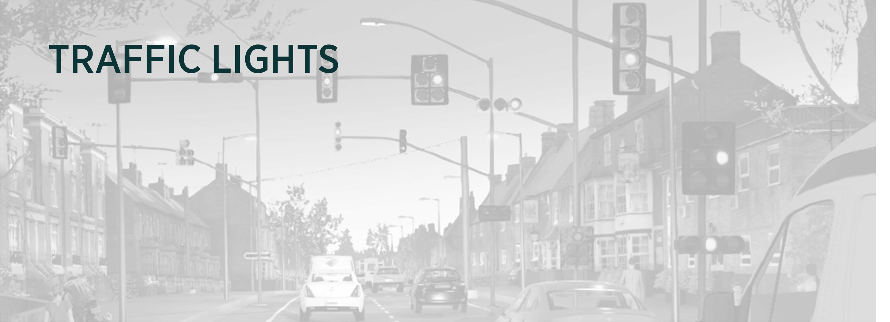
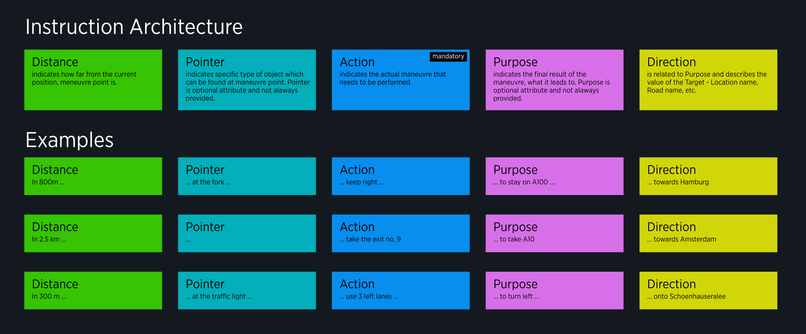
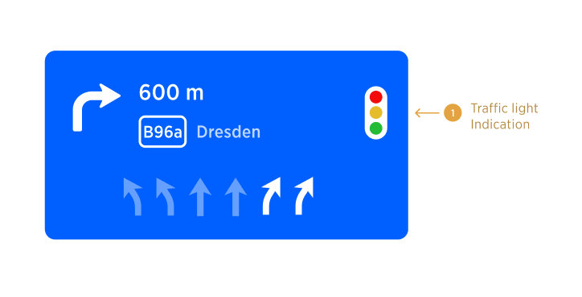

| **Interaction Designer** | @Matteo Fanchin  [Alexey Opokin](https://tomtom.atlassian.net/wiki/people/70121:e8cb7861-9079-4b92-b96d-bfe8cd882680?ref=confluence) |
|---|-----------------------------------------------------------------------------------------------------------------------------------------|
| **Visual Designer** | [Georgios Koultouridis](https://tomtom.atlassian.net/wiki/people/5be2fd44649a737c2342afbe?ref=confluence)                               |
| PM | [Joost Pennings](https://tomtom.atlassian.net/wiki/people/712020:a6d50cb1-97be-4a9a-a279-3fbb3e2e1799?ref=confluence)                   |

  

Table of Contents
=================

*   [Table of Contents](#Table-of-Contents)
*   [Landmarks Introduction](#Landmarks-Introduction)
*   [Manifestation of Traffic Lights](#Manifestation-of-Traffic-Lights)
*   [Visual Representation](#Visual-Representation)
*   [Audio Instruction](#Audio-Instruction)
*   [Map Representation](#Map-Representation)
*   [Multiple instances of Traffic Light](#Multiple-instances-of-Traffic-Light)

  

Landmarks Introduction
======================

**Landmarks** is defined as an object or feature of a landscape or town that is easily seen and recognized from a distance, especially one that enables someone to establish their location. User research in Europe and Asia shows that users commonly explain routes in relation to **landmarks, junctions and paths. Traffic lights** are most common landmarks.   
  
Landmarks appear in instruction sequence as **Pointers**, as shown in the diagram below. 

  

NOTE: It is important to note that **Pointers re not the same as Landmarks**, because there are some pointers (at the Fork) which are not Landmarks, but rather traffic figures. Pointers contain Landmarks but they have wider usage.

  

Manifestation of Traffic Lights
===============================

Traffic light are manifested at following touch points:

*   As a visual indication in the NIP.
*   As a Pointer in Audio Instruction.
*   Landmarks could be rendered on the map.

  

  

Visual Representation 
======================

Traffic light icon appears in the NIP at the right side, instead of Exit Number. 

NOTE: Traffic light and exit numbers cannot be present simulteniusely due to uninterrupted traffic flows on Highways and similar roads.

Audio Instruction 
==================

Traffic light is represented as a _pointer_ in audio instruction sequence. Thera are several possibilities for the instruction depending on the location of the manoeuvre in relation to the traffic light:

| Distance | Pointer | Action | Purpose | Direction | Conditions | Notes |
|---|---|---|---|---|---|---|
| In 600m | at the traffic light | turn right to B96a | \-\- | towards Dresden | Used when manoeuvre located at the junction that is controlled by this traffic light. | TR icon is shown in the NIP. |
| in 600m | before the traffic light | turn right to B96a | \-\- | towards Dresden | Used when manoeuvre located just (max 50m) before the junction. | TR icon is not used in the NIP in this case. |
| in 600m | after the traffic light | turn right to B96a | \-\- | towards Dresden | Used when manoeuvre located just (max 50m) after the junction. | TR icon is not used in the NIP in this case. |

NOTE: "Before" and "After" should only be used inside the 50m threshold. Out of those, the whole landmark is not announced.

  

Map Representation
==================

Target Traffic light should also be displayed on the map. There several aspects of this visualisation that need to be decided:  
  
Which zoom levels traffic will be displayed at?  
How would it coexist without collision with other graphical guiding elements present at the same place such as Maneuvre arrow?  
If there are multiple traffic lights between current position and the next maneuvre, they all need to be displayed.

  

  

Multiple instances of Traffic Light
===================================

It often happens that there are multiple instances of traffic light occurs during the stretch of the road before the manoeuvre. In this case it could be misleading to indicate specific traffic light for the maneuvre, because driver cannot identify the correct one. In order to mitigate this, following method is used: At given triggering point, amount of instances of traffic lights till the manoeuvre is counted.  
  
If there is just one traffic light, announcement given: "at the traffic light".  
If there are 2 traffic lights, the instruction announces "at the second traffic light".  
If more then 2, traffic light is not announced at all.  
  
See the following table of audio announcements for details:

| Triggering point \-\&gt; | Far Away | Early | Main | Confirmation | Amount of traffic lights before the maneuvre |
|---|---|---|---|---|----------------------------------------------|
|  | \-\- | \-\- | At the traffic light | \-\- | 1                                            |
|  | \-\- | \-\- | At the second traffic light | \-\- | 2                                            |
|  | \-\- | \-\- | \-\- | \-\- | \> 2                                         |

NOTE: "Before" and "After" are not used for multiple instances. In other words, if there are multiple instances and "before" or "after" must be used, the whole landmark is removed. We should not get announcements like "before the second traffic light".

NOTE: Visual representation of traffic light in the NIP supports the audio announcement.  
  
NOTE: In case multiple instances of the landmark, only one icon shown in the NIP.