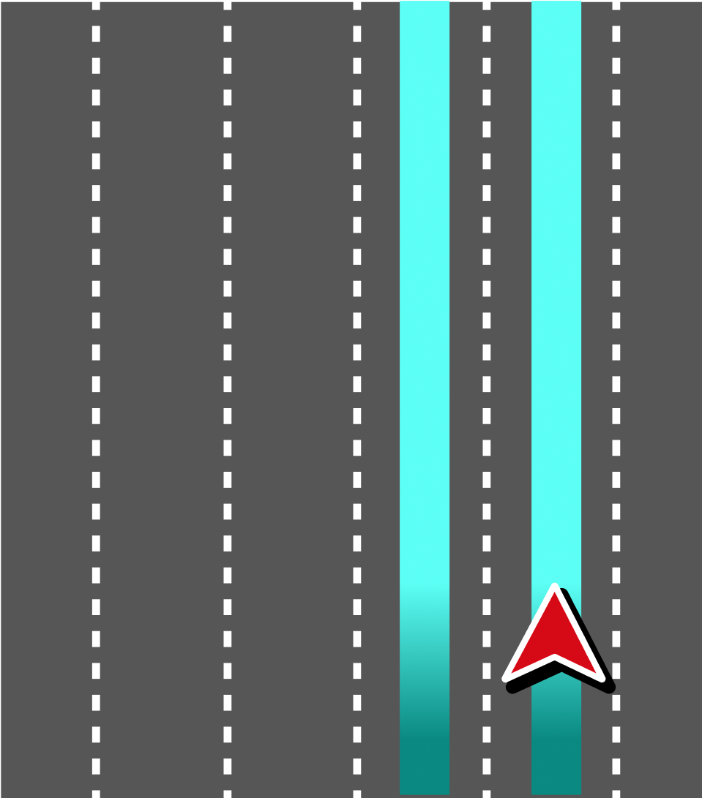
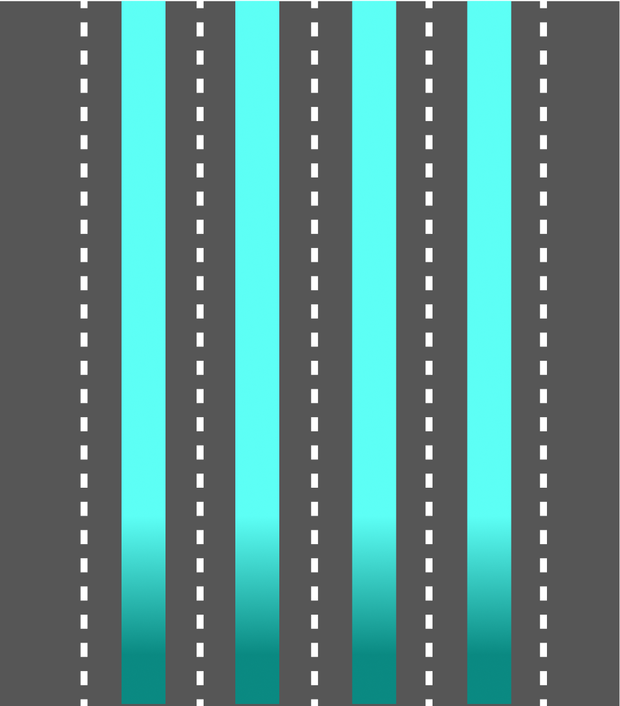
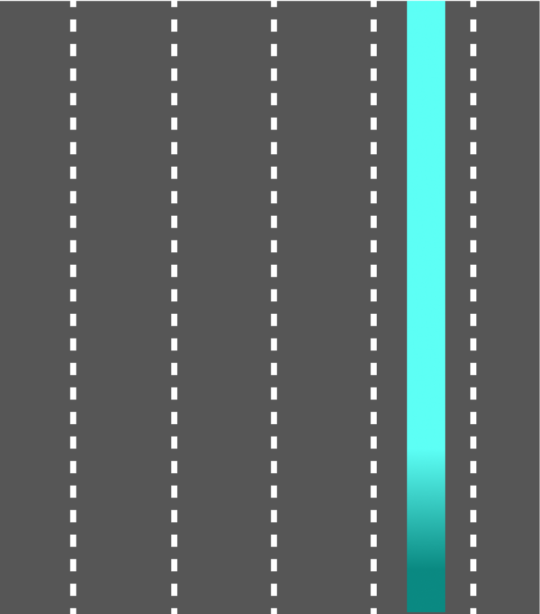
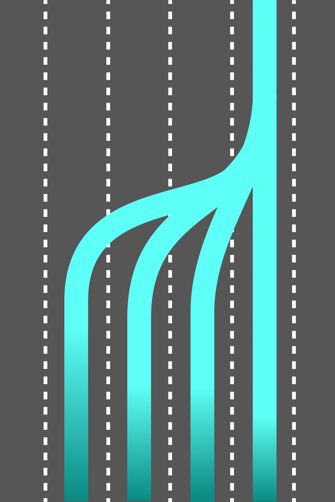

| **created by** | [Alexey Opokin](https://tomtom.atlassian.net/wiki/people/70121:e8cb7861-9079-4b92-b96d-bfe8cd882680?ref=confluence) |
|---|---|
| **PM** | [Joost Pennings](https://tomtom.atlassian.net/wiki/people/712020:a6d50cb1-97be-4a9a-a279-3fbb3e2e1799?ref=confluence) |
| **ENG OWNER** | undefined |

Visualisation of current vehicle position
=========================================

Current vehicle position is visualised on top of the recommended lanes.

| **Illustration** | **Description** |
|---|---|
|  | If localisation is provided, the real position of the chevron can be achieved and visualisation should reflect the real position of the car. The chevron is positioned in the middle of localised lane. |
|  | If localisation is provided, the real position of the chevron can be achieved and visualisation should reflect the real position of the car. Chevron doesn't have to stick to the route line all the time and can travel across lanes according to real situation.
The chevron is positioned in the middle of localised lane. |
|  | If localisation is not provided, the real position of the chevron can not be gathered. Approximated position is shown instead. Chevron is positioned in the middle of recommended lanes. |

Continuous lane guidance
========================

Continuous lane guidance as a method of visualising recommended lanes all the time, regardless of route events. LLG sessions in guidance are activated around manoeuvres areas. There are gaps of no lane recommendation between the sessions. Inside those gaps lane recommendations are not provided as they don't make much sense - all lanes are equally recommended, and there is no preference for one over other (with the exception of preference for the right lanes in EU, as it prescribed by the EU traffic rules).

Even though, continuous lane recommendation are not needed from purely guidance perspective, there are some future use cases that might require them. Those are _**lane level traffic**_, _**road closures, obstacles on the way**_, etc.  Currently those features are not supported, but we might need to look ahead and prepare for them. Also, it might still make sense to display lane level map continuously, depending on the preferences of the client. To address this, we need to display the recommended lanes in the entire route path between LLG sessions. Generally, when no manoeuvres ahead, any lane becomes recommended, which means we should highlight all available lanes.
  

Transition point
----------------

Transition point is a point where lane recommendation changes. 

|  |                                                                                                                                                                                                                                                                                                                                                                                                                              |
|---|------------------------------------------------------------------------------------------------------------------------------------------------------------------------------------------------------------------------------------------------------------------------------------------------------------------------------------------------------------------------------------------------------------------------------|
|  | **All lanes are recommended**  Generally, outside of LLG sessions, when no manoeuvres ahead, any lane becomes recommended, which means we should highlight all available lanes.      **EXCEPTION:** We should not highlight lanes that lead to an exit or turn which we don’t need to take.
This scenario is explained below.                                                                                              |
|  | **Inside LLG Session**  When getting closer to the manoeuvre point, only lanes leading through the manoeuvre become recommended. Usually one or 2 lanes.                                                                                                                                                                                                                                                                      |
|  | **Transition point**  There is a need for transition from all lanes recommended to just one (or more) lane. This transition needs to be visualised in such way that lane connectivity is not broken, meaning, no lane should stop, but rather merge into other lane.  **NOTE:** The exact geometry of transition point (how multiple lanes converge into one) is defined by the map visualisation, and not part of this design. |

\----------- END OF DOCUMENT -----------
========================================