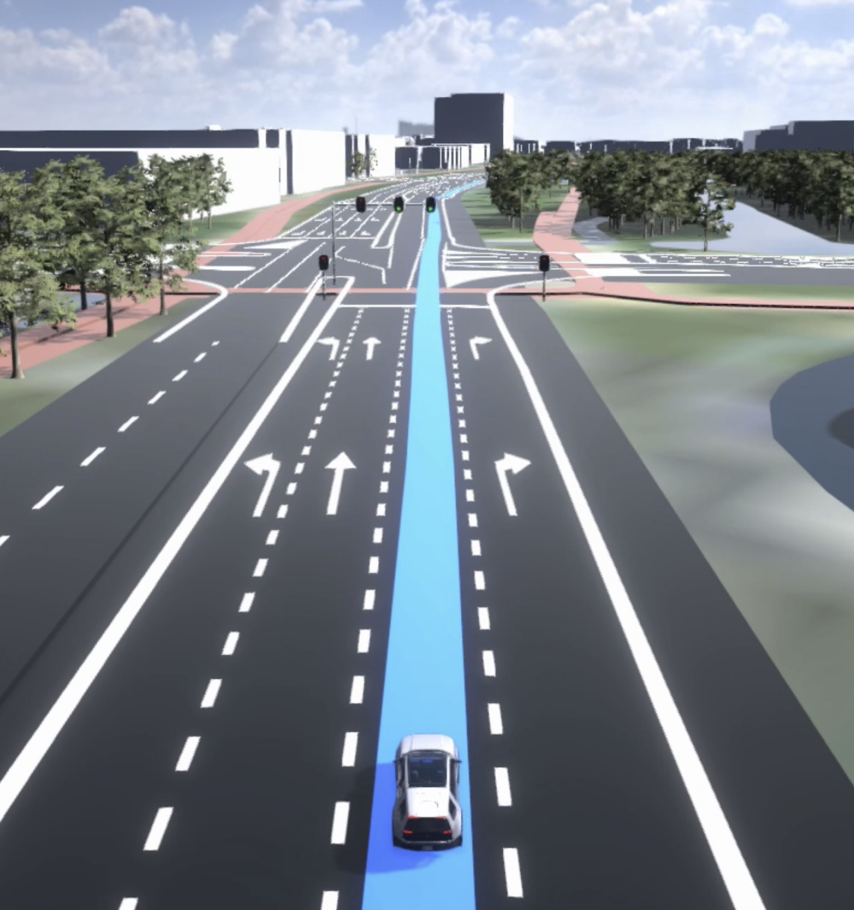

| **created by** | [Alexey Opokin](https://tomtom.atlassian.net/wiki/people/70121:e8cb7861-9079-4b92-b96d-bfe8cd882680?ref=confluence) |
|---|---|
| **PM** | [Joost Pennings](https://tomtom.atlassian.net/wiki/people/712020:a6d50cb1-97be-4a9a-a279-3fbb3e2e1799?ref=confluence) |
| **ENG OWNER** | [Matthew Exon](https://tomtom.atlassian.net/wiki/people/712020:f34dc359-a067-45ee-88e1-4e2edb5bfab7?ref=confluence) |

Introduction
============

Lane Level Guidance (LLG) stands for advanced method of guidance utilising precise lane level positioning and visualisation. Lane Level Guidance integrates guidance into the map elements to provide an extremely clear and high-fidelity representation of where the driver should go.



**Guidance**  
Visualising target lanes driver required to take in order to navigate through a manoeuvre.  
  

**Traffic**  
Showing turn dependent traffic jams, jam tail warnings on an exit or traffic flow per lane is valuable.  
  
**Lane restrictions &amp; rules**  
Showing a certain lane is an HOV lane, has a different speed limit or is closing in 300 meters due to roadworks is valuable.  
  
**Safety warnings**  
When we know the position of the driver’s car, and also of other cars around, we can provide useful warnings such as blind spot warnings. However, cars already have great interfaces for this, so fully relying on a map view in the cluster is not the best approach!  
  
**Automated driving functionalities**  
Cars become more automated. Showing what the car sees, is doing &amp; will do, will create transparency and trust. I.e. lane keep assist, automatic lane change &amp; 360 degrees situational awareness.  

Terminology
===========

Following terminology is used throughout this topic.

| **Description**                                                                                                                                                                                                                                                                                                                                                                                     | **Illustration** |
|-----------------------------------------------------------------------------------------------------------------------------------------------------------------------------------------------------------------------------------------------------------------------------------------------------------------------------------------------------------------------------------------------------|---|
| **Manoeuvre point** \- a point where actual road arcs are split in the map geometry. This point doesn't reflect the reality of where lane markings are put on the road, so it cannot be used for precise lane guidance, however this point is used as a reference.                                                                                                                                  |  |
|                                                                                                                                                                                                                                                                                                                                                                                                     |  |
| **Manoeuvre path** \- short stretch of the road that is considered to be the actual area of the manoeuvre. Guidance needs to know when manoeuvre starts and ends precisely. Manoeuvre cannot always be defines as "Manoeuvre point" and sometimes have duration. Manoeuvre path is defined by two points: **MAN\-S** and **MAN\-E.**    Manoeuvre paths are often used at complex intersections. |  |
|                                                                                                                                                                                                                                                                                                                                                                                                     |  |
| **Lane Change Point**. Point at which the driver has to change lane in order to stay on the route. This point is not always present as manoeuvres can often be performed without changing lanes.                                                                                                                                                                                                    |  |
|                                                                                                                                                                                                                                                                                                                                                                                                     |  |
| **Lane Configuration Change**(LCC) point. Point on the road where lane configuration (lane count) changes on the real road. It could be lane split or lane merge. LLC is created to accommodate upcoming intersection and relates to it.     Keep in mind that LLC can happen just before the intersection, as well as far in front of it. This determined by the road design.                      |  |
|                                                                                                                                                                                                                                                                                                                                                                                                     |  |
| **LLG Session** \- Period of time (if measured by time) or section of the road (if measured by geometry) at which lane level fidelity visualisation is displayed together with recommended lanes and vehicle position (if provided).  LLG session is defined by two points: **LLG\-S** and **LLG\-E**.                                                                                                |  |
|                                                                                                                                                                                                                                                                                                                                                                                                     |  |
| **Recommended lanes** \- are lanes that are optimised for the upcoming manoeuvre taking including all chained manoeuvres. Those lanes are highlighted in LLG.                                                                                                                                                                                                                                       |  |

Further topics
==============

[LLG Sessions](https://tomtom.atlassian.net/wiki/spaces/FlaminGO/pages/157715656/LLG+Sessions)

[Recommended Lanes](https://tomtom.atlassian.net/wiki/spaces/FlaminGO/pages/157715600/Recommended+Lanes)

[Audible Lane Guidance](https://tomtom.atlassian.net/wiki/spaces/FlaminGO/pages/157715706/Audible+Lane+Guidance)  

[Lane Visualisation](https://tomtom.atlassian.net/wiki/spaces/FlaminGO/pages/157715753/Lane+Visualisation) 

\-

\-

\-

\-

\----------- END OF DOCUMENT -----------