| **created by** | [Alexey Opokin](https://tomtom.atlassian.net/wiki/people/70121:e8cb7861-9079-4b92-b96d-bfe8cd882680?ref=confluence) |
|---|---|
| **PM** | [Joost Pennings](https://tomtom.atlassian.net/wiki/people/712020:a6d50cb1-97be-4a9a-a279-3fbb3e2e1799?ref=confluence) |
| **ENG OWNER** | [Dennis Jakobsen](https://tomtom.atlassian.net/wiki/people/712020:c273d0e3-9a2a-456c-ad2f-6f56ca0e12b3?ref=confluence) → please define |

**Which lanes are Recommended?**
================================

How do we know which lanes to highlight at any given moment? The following method can be used. Highlighting lanes are selected based on their "cost". The **"Lane cost"** is a calculated attribute representing how easy is to complete given manoeuvre from this particular lane. The lowest lane cost is the lane that requires least amount of lane changes through the manoeuvre and those changes are safest.   
  

| **Attribute** | **What it measures**                                                                                                                                                                                                                                                                                                                                                               | **Abbreviation** | **Format** | **Notes** |
|---|------------------------------------------------------------------------------------------------------------------------------------------------------------------------------------------------------------------------------------------------------------------------------------------------------------------------------------------------------------------------------------|---|---|---|
| Lane Cost | Calculated value per lane representing **effectiveness** of this particular lane for passing given manoeuvre. Lane cost is a number representing amount of lanes that needs to be crossed in order to perform given manoeuvre from given lane from given position.      Lowest cost is 0 (zero) which means that no lanes need to be crossed in order to perform next manoeuvre | **Cost(Lane)** | **0 \- ∞** | Whole numbers only. Realistic range is 0\-20 |

  
  
  
**Heuristic for detection of Recommended lanes**  
In order to decide which lanes to select, we need to calculate **Cost(Lane)** for every lane at the current position.  
NOTE: Keep in mind that cost is measured per position (at the exact point where the cost is indicated) on the diagrams below and might change through the passage.

   
After this, we select all lanes with lowest **Cost(Lane).** Those lanes must be highlighted. As vehicle progresses towards manoeuvre point, and passes LCC (Lane Configuration Change) point, highlighting must dynamically be recalculated to reflect new lane configuration.

  
Motorway Scenarios 
======================

Following scenarios are used to explain intended logic for Lane Guidance trough Motorway Exits. Those are typical road configurations for Motorways.

| **Scenario**                                                                                                                                                                                         | **Road Geometry** | **Lane Guidance Diagram** | **Notes**                                                                                                                                                                                                                   |
|------------------------------------------------------------------------------------------------------------------------------------------------------------------------------------------------------|---|---|-----------------------------------------------------------------------------------------------------------------------------------------------------------------------------------------------------------------------------|
| **S1\.1  **    **Taking an Exit:** Trivial Highway exit scenario. Route takes the exit that develops from the existing right lane.  LOCATION  52\.46330191303815, 13\.44798959212175 |  | 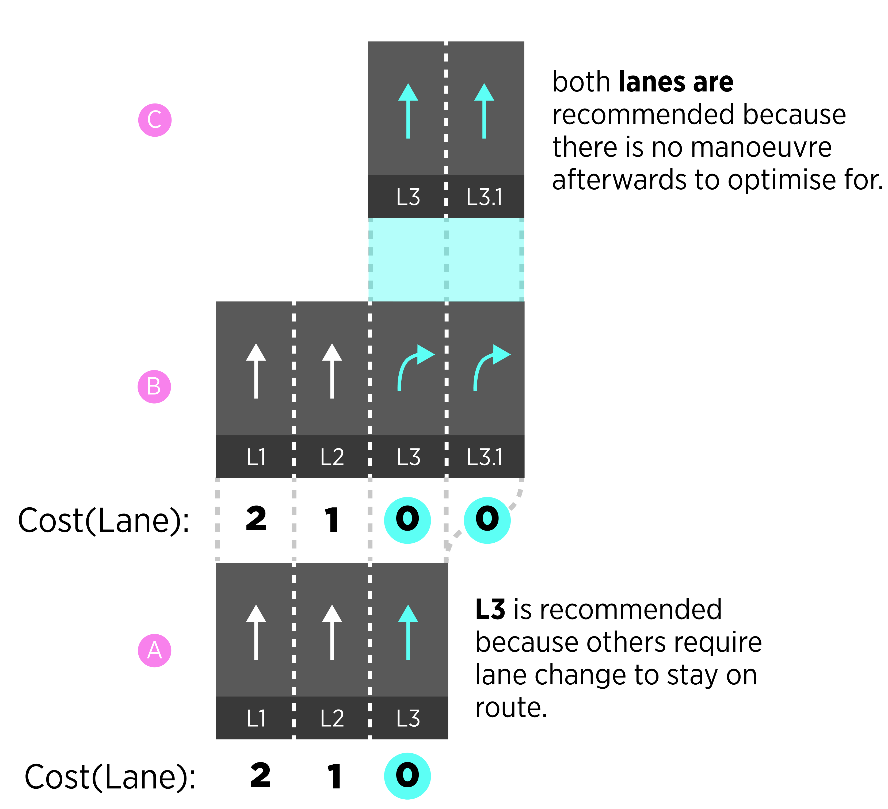 | New lanes that appear out of existing lane are numbered as a subset of this existing lane. I.e. L3 gets additional lane L3\.1  **There is no LCP point in this manoeuvre if** we stay in L3 through entire path.    |
| **S1\.2  **  Trivial Highway exit scenario. Route stays on the Highway while passing by an Exit (Keep Left instruction).      LOCATION  52\.46330191303815, 13\.44798959212175       |  | 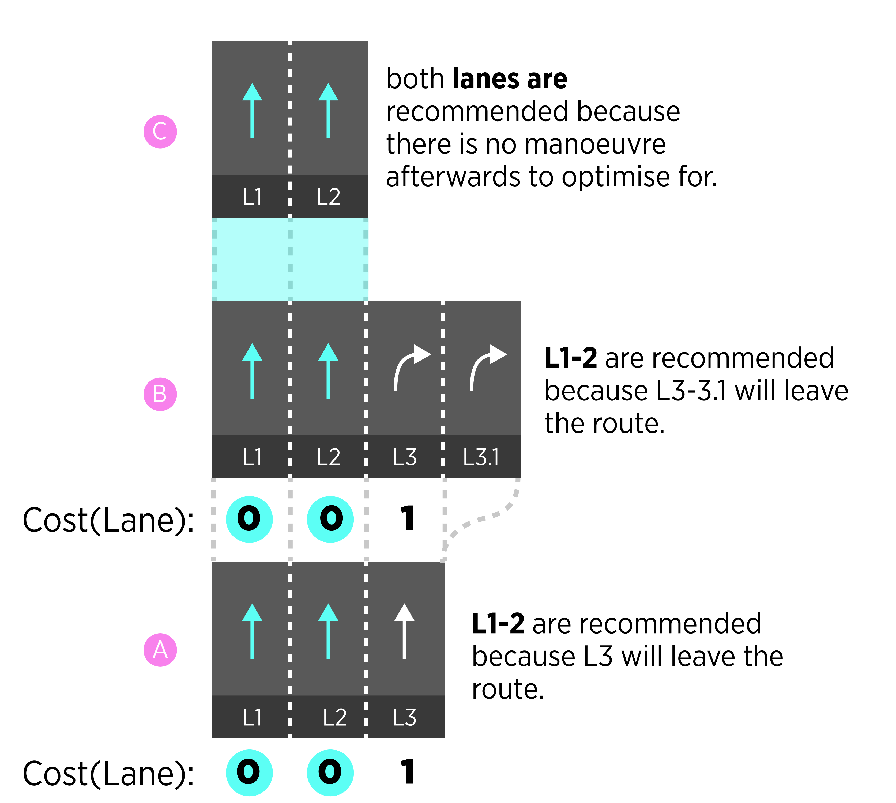 | **There is no LCP point in this manoeuvre.** We stay in L1, L2 through entire path.   New lanes that appear out of existing lane are numbered as a subset of this existing lane. I.e. L3 gets additional lane L3\.1 |
| **S2\.1  ** Route stays on the main road while passing two consecutive exits.      LOCATIOn  52\.4617641835758, 13\.45562346903908                                                   |  | 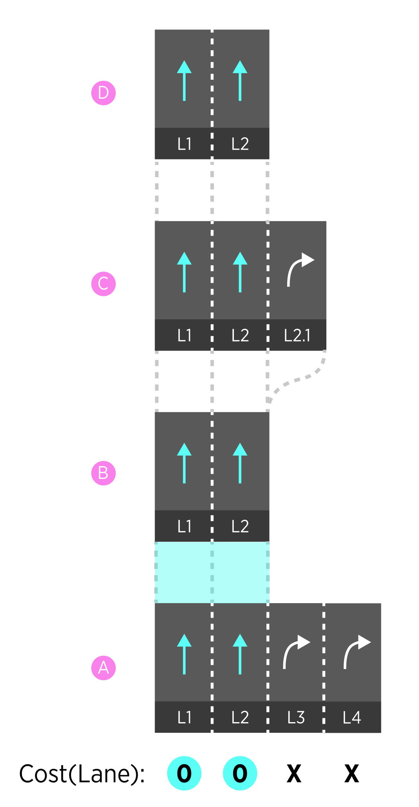 | There is no LCP point in this manoeuvre. We stay in L1, L2 through entire path.                                                                                                                                             |
| **S2\.2  ** Taking second exit  Route passes by the first exit, but takes the second one.      LOCATION  52\.4617641835758, 13\.45562346903908                                       |  | 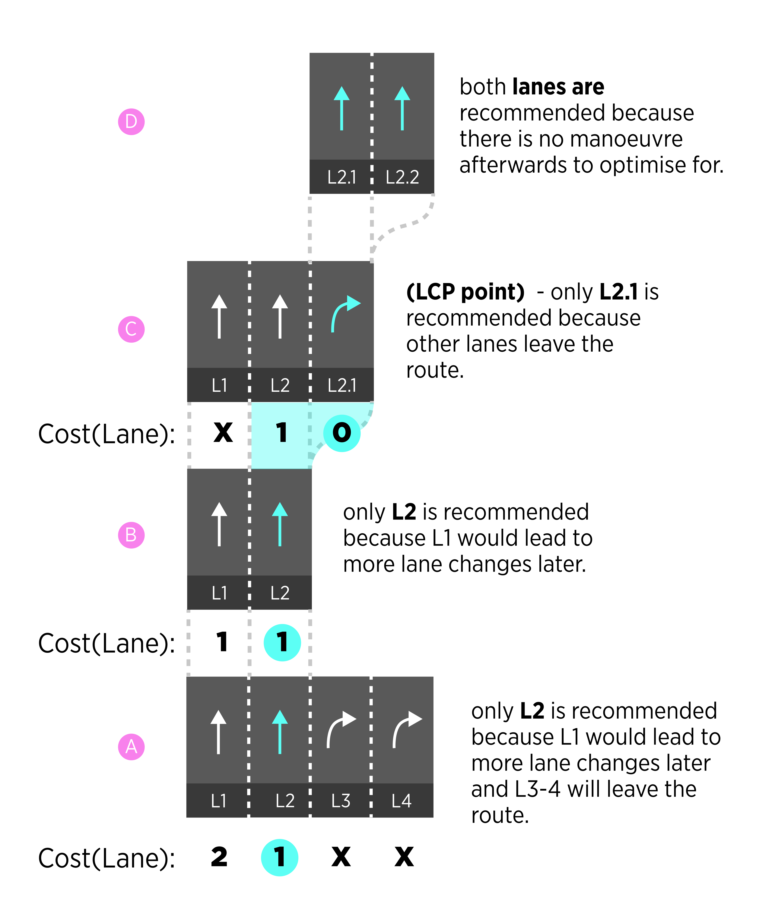 | There is one LCP point in this manoeuvre. Switch from L2\-\>L2\.1                                                                                                                                                           |
| **S3\.1 ** Double Exit  Taking second exit                                                                                                                                                       |  | 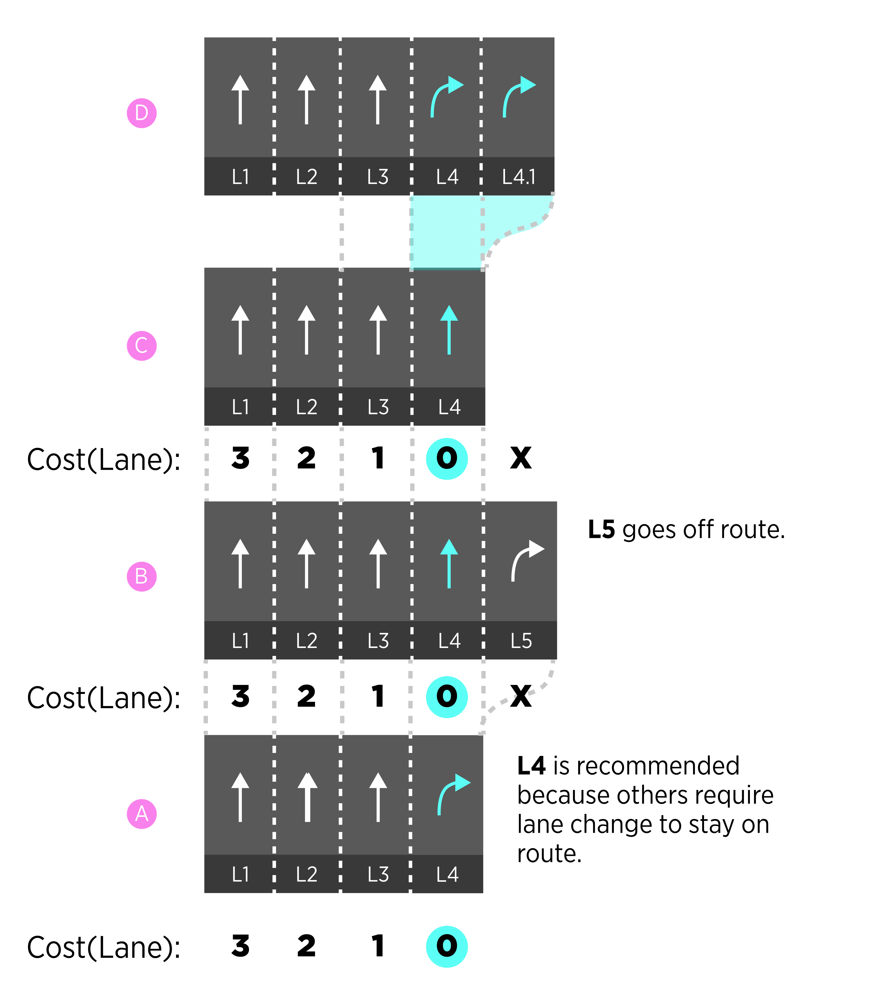 | There is no LCP point in this manoeuvre. We stay in L4 through entire path.                                                                                                                                                 |

  
  

Serial manoeuvres 
==================

_**Serial manoeuvres**_ are manoeuvres that located close enough to each other that would require one uninterrupted LLG session to cover them all. The reason for using one LLG session it to avoid in and out (of LLG session) zooming behaviours that will be unnecessary and distracting for the drivers.  _**Serial manoeuvres**_ are detected by measuring distance between them. If the distance falls into serial manoeuvre threshold, two or more manoeuvres are considered to be _**serial.**_ Threshold value is not universal but depends on road classes and is defined in this table:

| **Urban**|**Motorways**|**Others**|
| --- | --- | --- |
| 200m | 1000m | 500m |

**NOTE: Serial manoeuvre threshold is not the same as Chain instruction detection method - they serve different purposes and not related to each other.**

**!!! NOTE: Use this also for MPO logic.**

The resulting behaviour of serial manoeuvres will be uninterrupted LLG session from the first manoeuvre till the last one in a series.

Urban Scenarios
===============

Following scenarios are used to explain intended logic for Lane Guidance trough Complex Traffic Figures - those usually include serial micro-manoeuvres connected via complex, fast changing lane configurations. Along with complex intersection there are _**serial manoeuvres**_ often happen in urban areas - scenarios where several manoeuvres take place close to each other. Serial manoeuvres and complex intersections should be covered by one LLG session.

| **Scenario** | **Lane Configuration** | **Schematic Diagram** | **Notes** |
|---|---|---|---|
| **S1**Crossing Complex Traffic figure (Roundabout) |  | 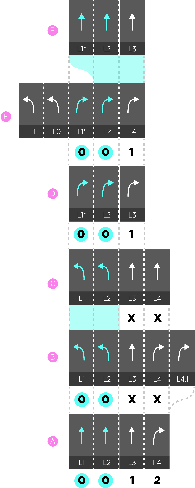 | Two lanes (L2,3\) are recommended through entire intersection because they have minimal (0\) cost. |
| **S2\.1**Turn right and then keep left at a fork. |  |  | One lanes (L4\) out of 2 possible is recommended because it has minimal (1\) cost.  NOTE: assuming lane connectivity at a junction is guessed correctly. |
| **S2\.2**Turn right and then keep right at a fork. |  | 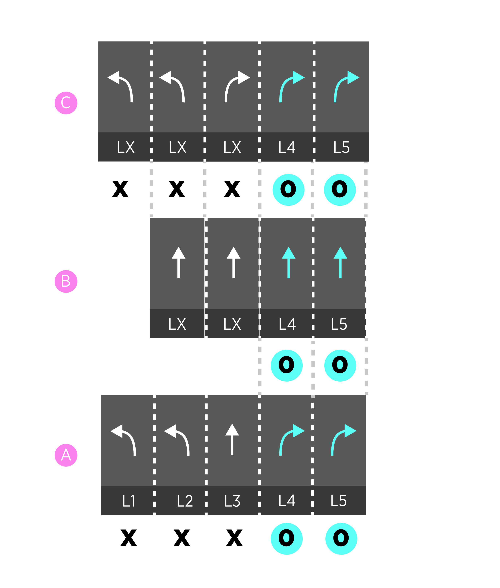 | Both lanes (L4,5\) out of 2 possible are recommended because they has minimal (0\) cost.  NOTE: assuming lane connectivity at a junction is guessed correctly. |
|  |  | 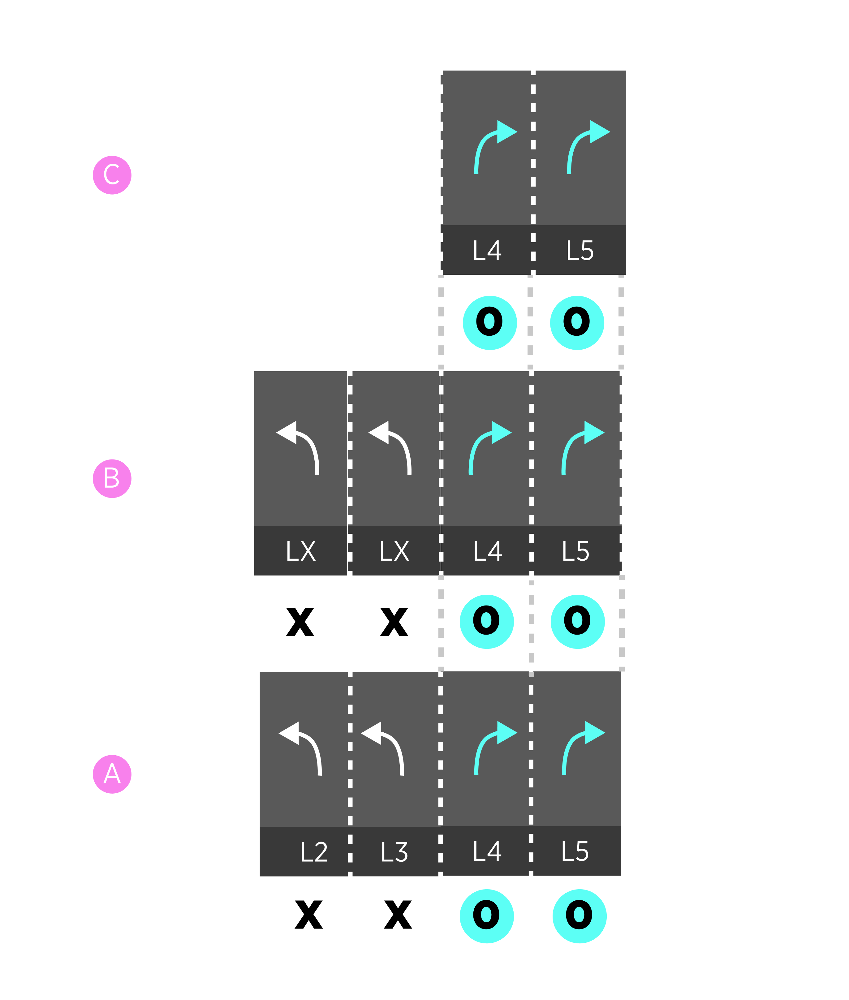 |  |
|  |  | 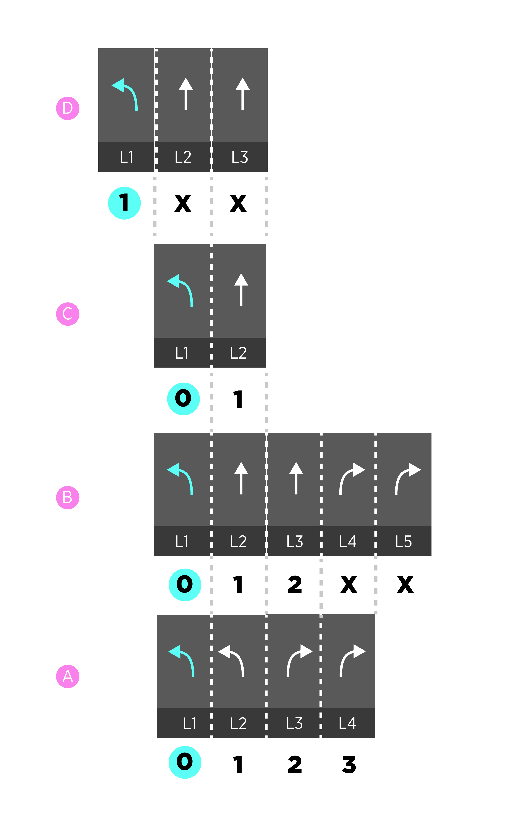 |  |

Audio LLG with lane positioning
===============================

When Lane GPS positioning is provided by the system, more precise audio guidance can be enabled. The purpose of Audio LLG is to nudge driver towards correct lane/s without reliance on the screen.  
  
  
Audio LLG should only be activated if driver is on the  wrong lane at the required time.

If Driver doesn't react to audio instruction, the instruction should be repeated after time out.  
  

**Possible Scenarios of Audio LLG**

| **Scenario**|**Vehicle Position**|**Audio instruction**|
| --- | --- | --- |
| Exiting to the right |vehicle is on the straight direction lanes| Keep Right || 
Continue straight while passing an exit | vehicle is on the exit lanes | Keep Left |
| At a fork, continue to the right branch | vehicle is on the left branch lanes | Keep Right |
| At a fork, continue to the left branch | vehicle is on the right branch lanes | Keep Left |
| Lane dependant traffic jam tail on the right lane/s | vehicle is on the right lane/s | Keep Left|

  

Visualisation of current vehicle position
=========================================

Current vehicle position is visualised on top of the recommended lanes.

| **Illustration** | **Description** |
|---|---|
|  | If localisation is provided, the real position of the chevron can be achieved and visualisation should reflect the real position of the car. |
| 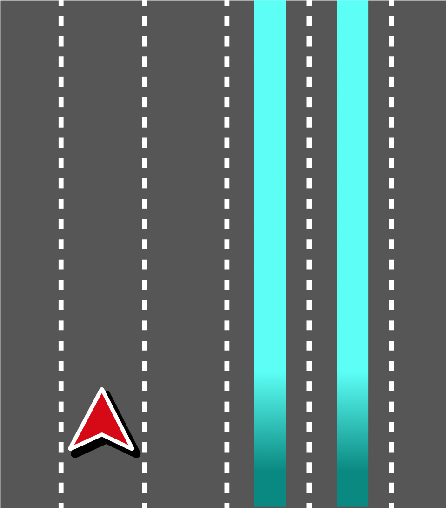 | If localisation is provided, the real position of the chevron can be achieved and visualisation should reflect the real position of the car. Chevron doesn't have to stick to the route line all the time and can travel across lanes according to real situation. |
| 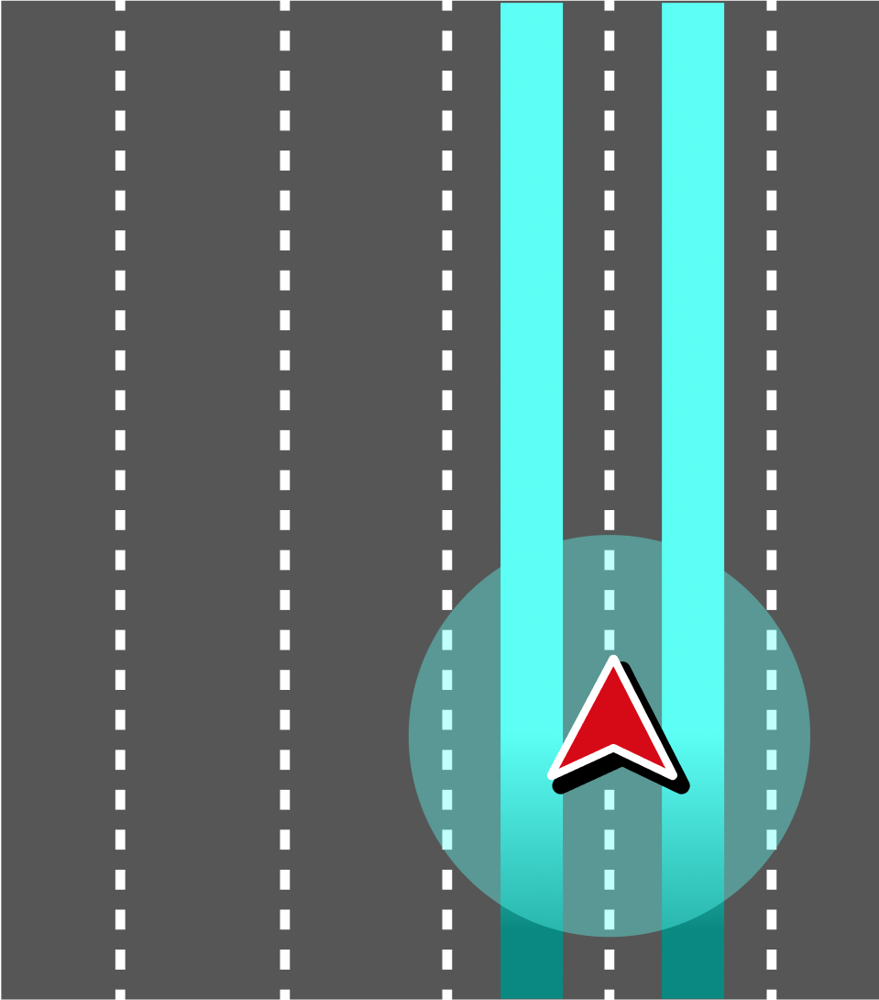 | If localisation is not provided, the real position of the chevron can not be gathered. Approximated position is shown instead. Chevron is positioned in the middle of recommended lanes. |

\----------- END OF DOCUMENT -----------
========================================