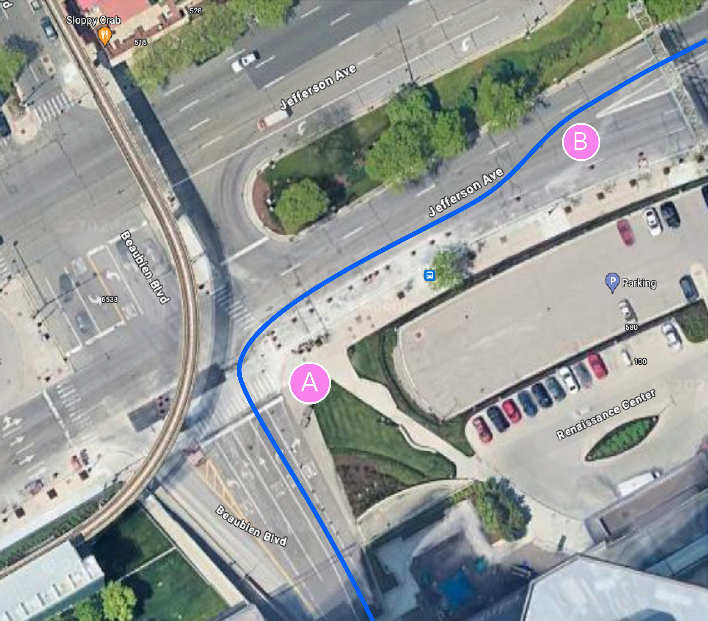
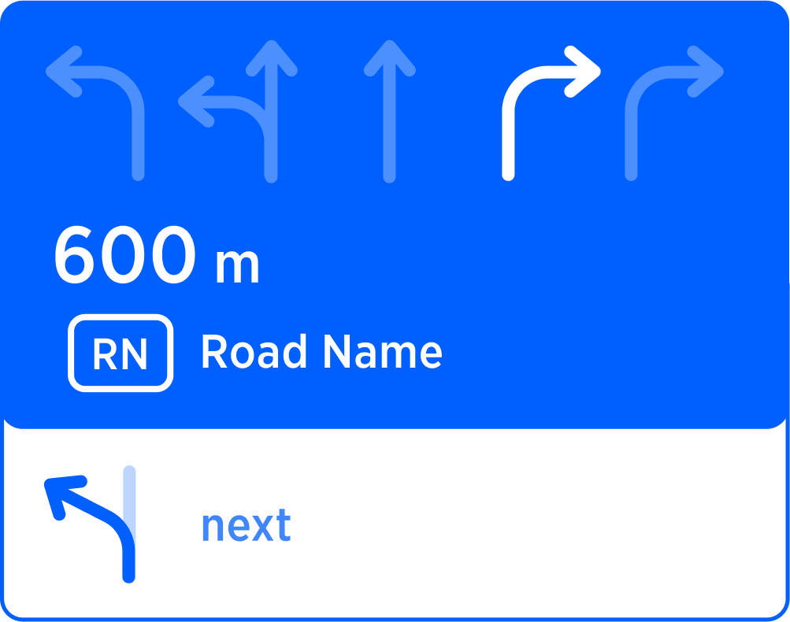
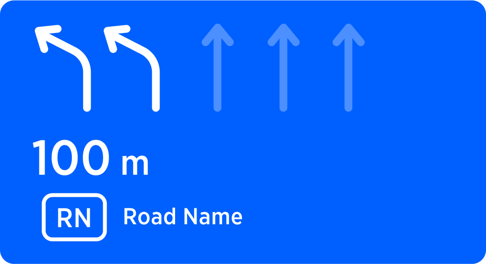
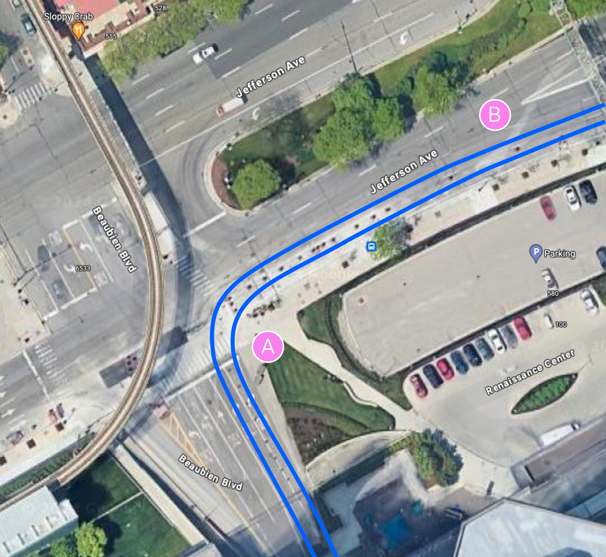
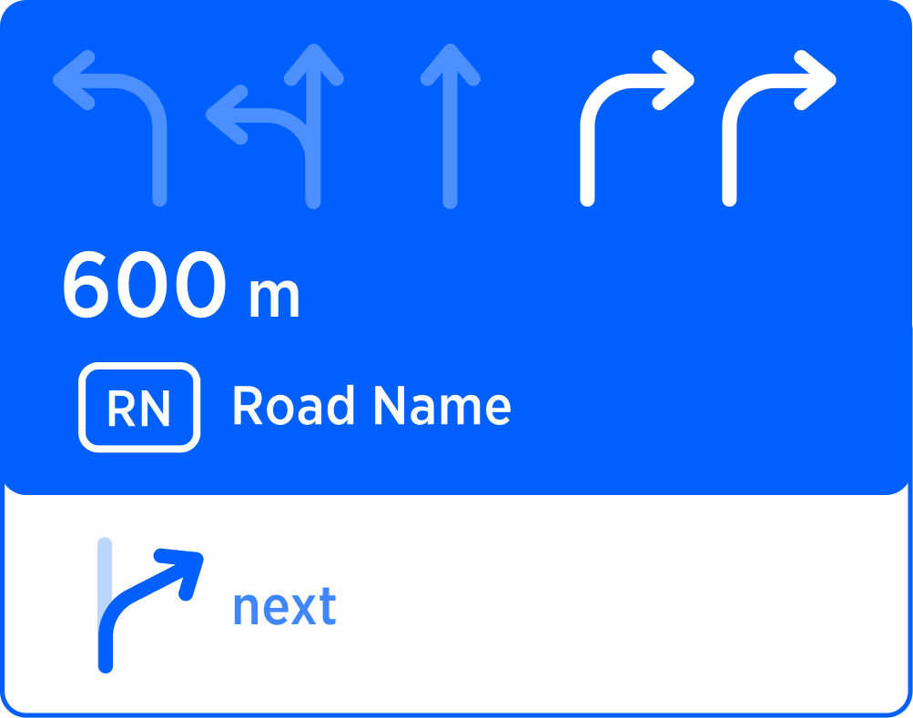
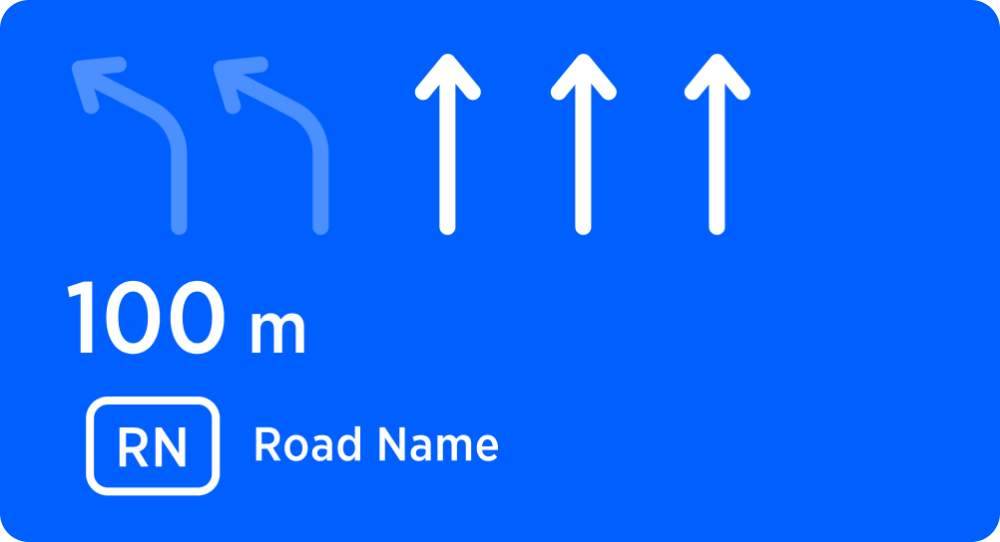
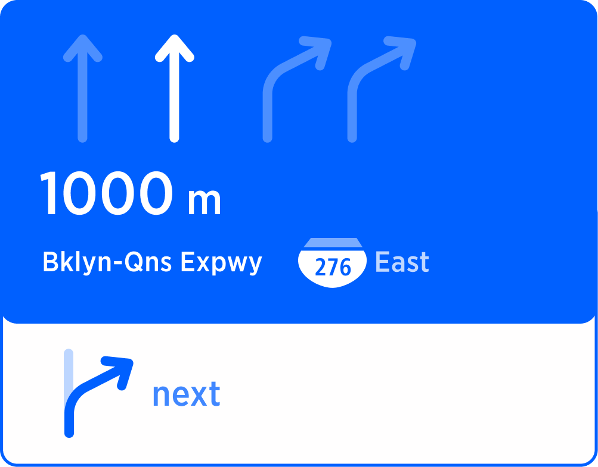
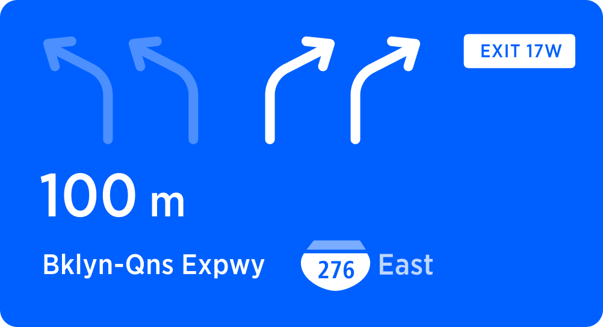

| **Status** | APPROVED |
|---|---|
| **created by** | [Alexey Opokin](https://tomtom.atlassian.net/wiki/people/70121:e8cb7861-9079-4b92-b96d-bfe8cd882680?ref=confluence) |
| **PM** | [Joost Pennings](https://tomtom.atlassian.net/wiki/people/712020:a6d50cb1-97be-4a9a-a279-3fbb3e2e1799?ref=confluence) |
| **ENG. OWNER** | [Matthew Exon](https://tomtom.atlassian.net/wiki/people/712020:f34dc359-a067-45ee-88e1-4e2edb5bfab7?ref=confluence) |

Motivation
==========

In multi-lane environments, guidance indicates lane configuration at the manoeuvre point. Normally, any lane suitable for manoeuvre taking is highlighted in [SLG module](https://tomtom.atlassian.net/wiki/spaces/FlaminGO/pages/157680032). This highlighting is also supported by the audio instruction (_use two right lanes to turn right_), when applicable. However, scenario involving series of close manoeuvres, requires slightly different logic. While navigating through series of manoeuvres on multi-lane intersections, we want to minimise amount of lane changes for the driver, especially when those changes has to be made in quick succession. Quick successive lane changes increase the stress and chance of error, therefore guidance calculates the optimal path for such scenarios, suggesting to use not all possible lanes but just _**optimal ones**_. Those lanes are called _**Recommended Lanes,**_ and the process of optimising is called _**Manoeuvre Path Optimisation - MPO.**_

It is important to note that _**MPO**_ is only effective for close to each other manoeuvres and doesn't provide any value if distance between them is significant, for longer stretches lane changes don't pose any troubles. This document describes the logic of the _**Recommended lanes**_ are how they applied in guidance under different conditions.

NOTE: This document focuses on the internal logic of MPO only and does not define methods used in it, such as [NIP - next instruction panel](https://tomtom.atlassian.net/wiki/pages/viewpage.action?pageId=157679965), [SLG - simple lane guidance](https://tomtom.atlassian.net/wiki/pages/viewpage.action?pageId=157680032), [Chain instructions](https://tomtom.atlassian.net/wiki/pages/viewpage.action?pageId=157680675&amp;src=contextnavpagetreemode). Those methods are defined by corresponding pages.

Scenarios
=========

The best way to illustrate the idea of _MPO_ is by looking at typical scenarios of chain instructions. Not in every scenario the effect of MPO is visible, but the general effect is minimal lane changes through series of manoevers.

Turn right, followed by the left fork
-------------------------------------

This scenario involves a turn right followed by fork left. The effect of MPO work here is in the highlighting _**only second right lane**_ for the right turn. While both lanes are perfectly suitable for the manoeuvre A, following lane change is easier to perform being on the second lane from the right side.

| **Diagram** | **Manoeuvre A**                                                                | **Manoeuvre B** |
|---|--------------------------------------------------------------------------------|---|
|  |                                                       |  |
| The optimal manoeuvre path is the one from the second lane from the right, since it it requires only 1 lane change, while the rightmost lane would require 2 lanes. | AUDIO   **use second right lane, to turn right to ... and then keep left** | AUDIO    **Keep left** |

Turn right followed by the right fork
-------------------------------------

This scenario involves a turn right followed by fork right. The effect of MPO work here is not visible as both right lanes are perfectly optimised for the manoeuvre.

| **Diagram** | **Manoeuvre A**                                                              | **Manoeuvre B** |
|---|------------------------------------------------------------------------------|---|
|  |                                                     |  |
| The optimal manoeuvre paths are both right lanes as no lane changes required for passing both manoeuvres. | AUDIO    **use 2 right lanes, to turn right to ... and then keep right** | AUDIO    **Keep right** |

Keep left followed by the exit
------------------------------

This Motorway scenario involves two consecutive road splits. The first one is bifurcation, where driver has to keep left in order to stay on the left branch, but immediately after bifurcation, comes the exit. The effect of MPO work here is in highlighting only one left lane out of 2 possible at the first manoeuvre.

| **Diagram** | **Manoeuvre A** | **Manoeuvre B** |
|---|---|---|
|  |  |  |
| For the optimal manoeuvre path it is necessary to take second  lane from the left at manoeuvre A. | AUDIO    **use the second lane from the left to stay on...** | AUDIO    **take the exit 17 west** |

Serial manoeuvres detection
===========================

To summarise the examples above, the effect of MPO is **lane recommendation based on minimal lane changes though the series of manoeuvres.**

_**MPO**_ effect illustrated above is applied to 2 manoeuvres, however number of lane optimised chain instructions is not limited to 2. Any amount of chained instructions can have MPO. But how we detect serial manoeuvres? The logic of detection of serial manoeuvres is identical to the logic used for the same purpose for LLG sessions. _**Serial manoeuvres**_ are detected by measuring distance between them. If the distance falls into serial manoeuvre threshold, two or more manoeuvres are considered to be _**serial.**_ Threshold value is not universal but depends on road classes and is defined in this table:

| **Urban**|**Motorways**|**Others**|
| --- | --- | -- |
|200m |1000m|500m|

**NOTE:** Serial manoeuvre threshold is not the same as Chain instruction detection method - they serve different purposes and not related to each other.

**END OF DOCUMENT /**