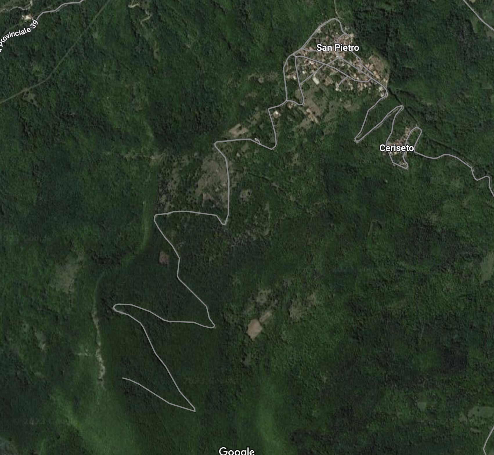
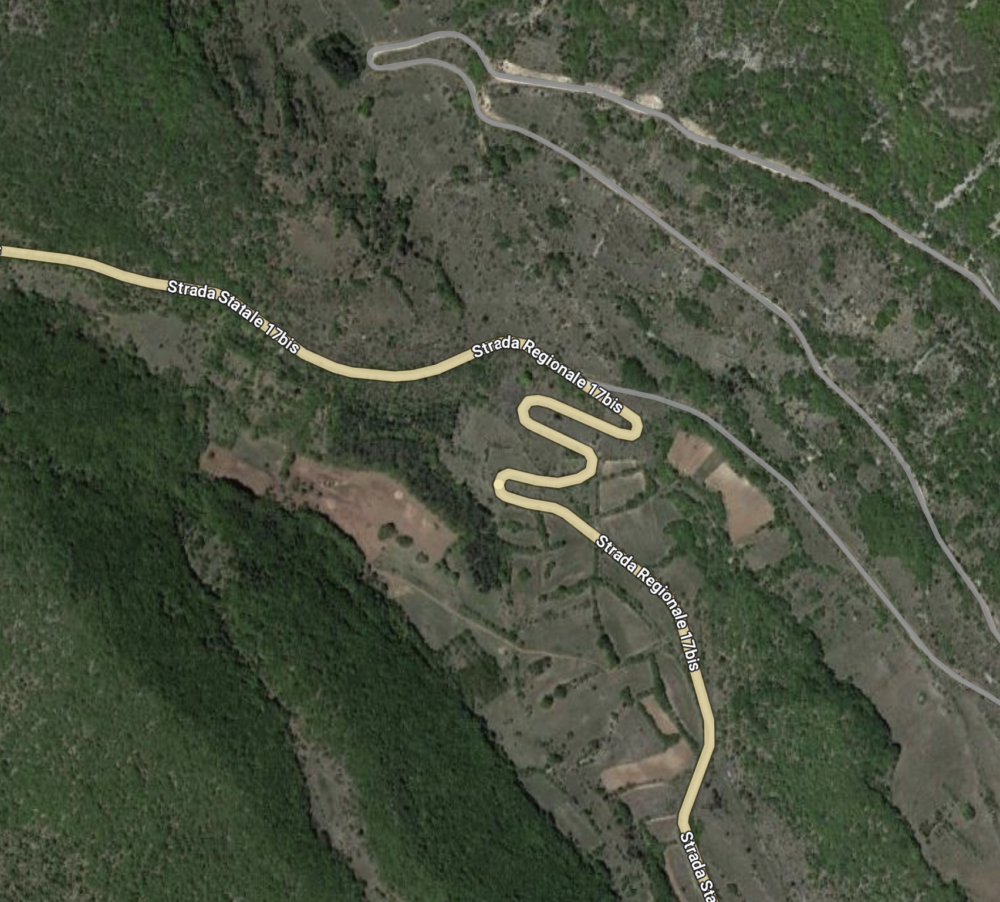
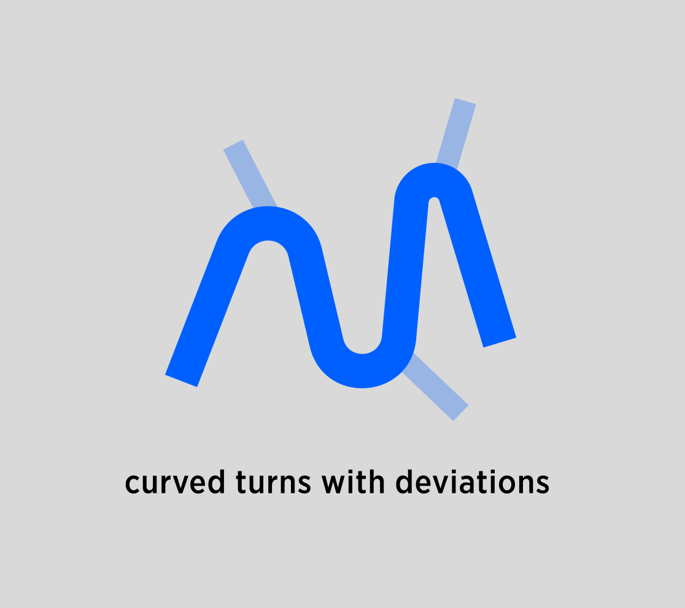
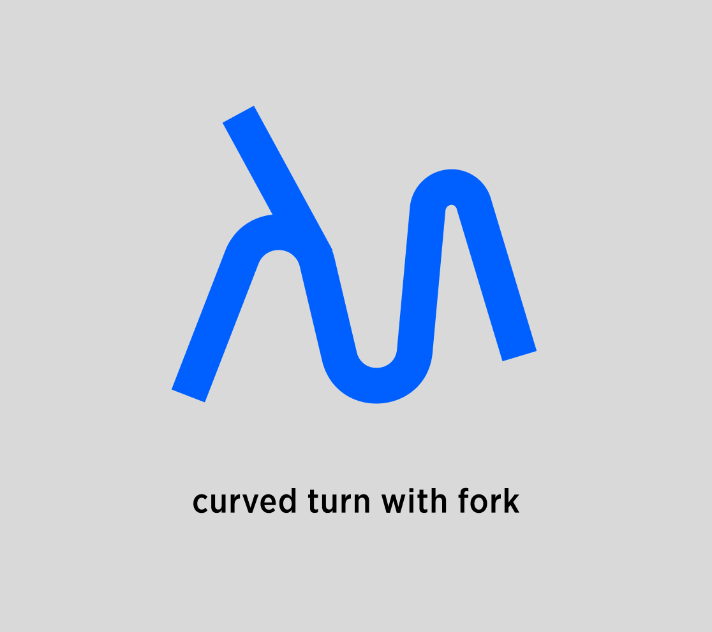

| **PM** | [Joost Pennings](https://tomtom.atlassian.net/wiki/people/712020:a6d50cb1-97be-4a9a-a279-3fbb3e2e1799?ref=confluence) |
|---|---|
| **created by** | [Maksym Osadchuk](https://tomtom.atlassian.net/wiki/people/712020:fb261b5b-de23-442e-854b-8b08f3e29b6f?ref=confluence) [Alexey Opokin](https://tomtom.atlassian.net/wiki/people/70121:e8cb7861-9079-4b92-b96d-bfe8cd882680?ref=confluence) |
| **ENG OWNER** | [Maksym Osadchuk](https://tomtom.atlassian.net/wiki/people/712020:fb261b5b-de23-442e-854b-8b08f3e29b6f?ref=confluence) |

Read me first

=============

Before reading this document is is recommended to get yourself familiar with the terminology used here: [Motorway Guidance Glossary](https://tomtom.atlassian.net/wiki/spaces/NAV/pages/104678579/Motorway+Guidance+Glossary)

What is Natural Continuation?
=============================

Term **Natural Continuation** (NC) is a method used by Guidance engine for answering fundamental question: **Is Instruction required at given route point or not?** The NC method could return one of the two values: Yes or No. If yes, the engine produces an instruction (appropriate to the given situation), if not - no instruction is generated. In other words, following the route is considered as natural (hence term "Natural") for the driver without any guidance. NC is a complicated heuristic method which analyzes various attributes of road geometry. Therefore it is more appropriate to keep the core logic close to the code on GitHub. This page just gives an introduction of NC and links to these development documentation on GitHub.

How Natural Continuation value is gathered?
-------------------------------------------

There are various road situations possible and different intersection types. For each type of intersection **Natural Continuation** must be checked individually. 

Intersection types
------------------

NIE classifies following intersection types:  
**Uninterrupted traffic flow** intersections and scenarios - which has general name _**Forks**_. Forks consist of _**Bifurcations** **Trifurcations**_ and _**Exits**_**.** More info about Fork Intersection types and glossary can be found here: [Motorway Guidance Glossary](https://tomtom.atlassian.net/wiki/spaces/NAV/pages/104678579/Motorway+Guidance+Glossary)

**Interrupted traffic flow** types of Intersections - **Junctions**, which splits into **Simple junctions**, **T-junctions**, **Roundabouts.** 

For each of these types we will define NC checking methods.

Natural Continuations at Forks
==============================

Forks as non-interrupted traffic flow intersections consist 3 types of intersections: **Exits**, **Bifurcations**, **Trifurcations.** The principles used to detect NC are the same for all of them. Simplified general principle of NC can be summarised as: 

**If there's a road stretch before a Fork that contains only on-route lanes, then it's a NC.**  
And other way around **- If a road stretch before a Fork contains at least 1 off-route lane - this is not NC.**

While this generic principle can be used most of the time, real world situations bring many complicated use cases that require special attention, therefore more detailed break-down is required. This detailed breakdown of all possible scenarios provided in this document:   
[https://github.com/tomtom-internal/navigation-instruction-engine/blob/main/documentation/implementation/situation\_handlers/natural\_continuation/natural\_continuation.adoc](https://github.com/tomtom-internal/navigation-instruction-engine/blob/main/documentation/implementation/situation_handlers/natural_continuation/natural_continuation.adoc)  → Birfurcations

NC at Interrupted traffic flow intersections - Junctions
========================================================

Interrupted traffic flow intersections (Junctions) requires totally different approach for NC detection. This approach takes following attributes in account:

1.  **Angle of road outcomes** in relation to incoming lane.
    
2.  **Amount of outcomes**
    
3.  **Attributes of outcomes** compared to incoming lanes.
    

Detailed heuristic for NC at junctions is defined in details here:  
[https://github.com/tomtom-internal/navigation-instruction-engine/blob/main/documentation/implementation/situation\_handlers/natural\_continuation/natural\_continuation.adoc](https://github.com/tomtom-internal/navigation-instruction-engine/blob/main/documentation/implementation/situation_handlers/natural_continuation/natural_continuation.adoc)  → Intersections

If NC is negative at given route point, NIE analyses the situation further to assign an appropriate instruction to it.  

 NC on curved roads - typical in mountain areas.
================================================

Mountain regions typically have very curved roads that climb on mountain via serpantine type of geometry to reduce the incline. Those roads have very sharp turns (sometime close to 180 degree) and often at these turns there are deviations from the main road in a form of local small road. Examples of such roads can be seen below:

|  |  |  |
| --- | --- | --- |

Those scenarios can be schematically represented as this:

| **Natural continuation scenario** | **Fork scenario** |
|---|---|
|  |  |
| deviating branches are minor roads, usually short, and lower road class  | deviating branch is the same road class. |

Those scenarios should not be judged by angles for NC, since angles are quite meaningless in those situations.

**END OF DOCUMENT /**
=====================