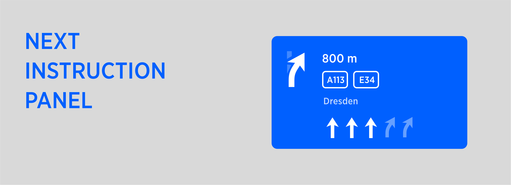
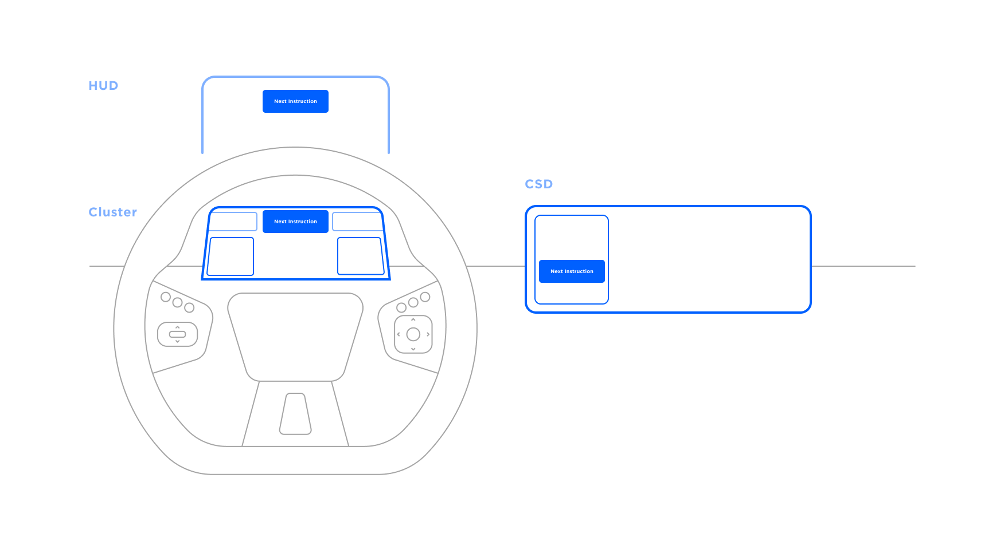
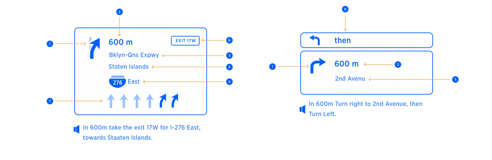

PIC: Example of Next Instruction Panel in the context of Horizon Panel.

| **Interaction Designer** | [Alexey Opokin](https://tomtom.atlassian.net/wiki/people/70121:e8cb7861-9079-4b92-b96d-bfe8cd882680?ref=confluence) |
|---|---|
| **Visual Designer** | [Georgios Koultouridis](https://tomtom.atlassian.net/wiki/people/5be2fd44649a737c2342afbe?ref=confluence) |
| **PO** | [Joost Pennings](https://tomtom.atlassian.net/wiki/people/712020:a6d50cb1-97be-4a9a-a279-3fbb3e2e1799?ref=confluence) |
| **Dev. Teams** | PT Guidance |
| **Visual Design Specification** | www.figma.com |

Definition
==========

Visual Instruction  (also known as NIP-Next Instruction Panel) is a UI component that is used to visualise Instruction in order to provide Guidance for a driver. Guidance is a complex experience consists of visual instruction, Audio instruction, Map with representation of the route on it and various other elements. Audio and Visual Instructions change in time as vehicle progresses to the manoeuvre point. This logic is described in details in this document: [Instruction Triggering Logic](../Instruction%20Triggering%20Logic/Instruction_Triggering_Logic.md).

UI Touchpoints
==============

Visual instruction is represented at following touch point in a car: HUD, Cluster Display, Central stack display. Each of those touch points have different visual design of the NIP and layout. For now we describe only CSD touch point.

Components of Visual Instruction (NIP)
======================================

|   | **Item**                                                                                                | **Context**                                  | **Mandatory** | **Occurence** | **Description**                                                                                                                                                                                                                                                                                                                                                                                                                                                                                                                                                                                                                                                                                                                                                                                                                                                                                                                                                                                                                                                                                                                                                                                                                                                                                                                                                                                               |
|---|---------------------------------------------------------------------------------------------------------|----------------------------------------------|---------------|---------------|---------------------------------------------------------------------------------------------------------------------------------------------------------------------------------------------------------------------------------------------------------------------------------------------------------------------------------------------------------------------------------------------------------------------------------------------------------------------------------------------------------------------------------------------------------------------------------------------------------------------------------------------------------------------------------------------------------------------------------------------------------------------------------------------------------------------------------------------------------------------------------------------------------------------------------------------------------------------------------------------------------------------------------------------------------------------------------------------------------------------------------------------------------------------------------------------------------------------------------------------------------------------------------------------------------------------------------------------------------------------------------------------------------------|
| 1 | Next Instruction schematic representation of the upcoming Manoeuvre. Also called ***Manoeuvre Arrow.*** | any                                          | yes           | Single        | Graphical image representing next manoeuvre schematically                                                                                                                                                                                                                                                                                                                                                                                                                                                                                                                                                                                                                                                                                                                                                                                                                                                                                                                                                                                                                                                                                                                                                                                                                                                                                                                                                     |
| 2 | Distance to next instruction                                                                            | not applicable for some special instructions | yes           | Single        | Distance to point of main manoeuvre. Distance units follow special formatting rules described here: [G\_008 Distance and Time Notation\#Distanceformatting](https://tomtom.atlassian.net/wiki/spaces/NAVUISPECS/pages/87264846#G_008DistanceandTimeNotation-Distanceformatting)                                                                                                                                                                                                                                                                                                                                                                                                                                                                                                                                                                                                                                                                                                                                                                                                                                                                                                                                                                                                                                                                                                                               |
| 3 | Road Name  Representation of Directional Information                                                    | any                                          | No            | Single        | **Road name** (part of Directional info) is a road driver will continue on after completing manoeuvre. There are two use cases here that need to be separated: 1. **Signpost** is not available for the manoeuvre. In this case Road name is taken from map data as a name of a road manoeuvre leads to.  NOTE: Only significant roads should be selected. Connecting road links should not be mentioned.  2. **Signpost** is available. In this case Road name must be in sync with signpost information even if map date provides different information.  Road names ofter refer to the same object as Road numbers. Additional information about usage of **Road names** and **Road Numbers** provided in this document: [Directional Information (Road names, Road numbers)](./../../Guidance%20Framework%20-%20Methods%20%26%20Components/Directional%20Information%20-%20Road%20names%2C%20Road%20numbers%2C%20Towards/Directional_Information-Road-names_Road-numbers_Towards.md)                                                                                                                                                                                                                                                                                                                                                                                                  |
| 4 | Road Number  Representation of Directional Information                                                  | any                                          | No            | Multiple      | **Road number** (part of Directional info) is a number assigned to a road and usually corresponds to the Road name above. Visually road numbers represented as graphical shapes which vary by location and the number inside. Sometimes Road numbers have direction (East) attached to them. Some roads have both: Road name and Road numbers, some only road names and some only road numbers.   There are two use cases here that need to be separated:  1. **Signpost** is not available for the manoeuvre. In this case **Road number** is taken from map data as a number of a road manoeuvre leads to. Only significant roads should be selected. Connecting road links should not be mentioned.  2. **Signpost** is available. In this case Road number must be in sync with signpost even if map date provides different information.  If multiple Road numbers provided, only those that route goes through must be displayed.  Road names ofter refer to the same object as Road numbers. Additional information about usage of **Road names** and **Road Numbers** provided in this document: [Directional Information (Road names, Road numbers)](./../../Guidance%20Framework%20-%20Methods%20%26%20Components/Directional%20Information%20-%20Road%20names%2C%20Road%20numbers%2C%20Towards/Directional_Information-Road-names_Road-numbers_Towards.md) |
| 5 | Towards Information                                                                                     | any                                          | No            | Single        | An area/city TOWARDS which the user will be heading after the manoeuvre. This information is taken from Signpost. If multiple Towards are provided there, we should show the one that Route goes through and ignore others.  NDS DATA   NDS DATA ISSUE Currently in NDS data, **Road names/numbers** sometimes provided as **Towards** information. This seems to be incorrect and needs to be clarified with NDS. For now, we provide some heuristic algorithm that filters out **Road names/numbers** from Towards information.                                                                                                                                                                                                                                                                                                                                                                                                                                                                                                                                                                                                                                                                                                                                                                                                                                                     |
| 6 | Exit Numbers                                                                                            | Highways only                                | No            | Multiple      | **Exit Number** is a method by which exits are identified on roads in most areas. must match the real\-world sign information Could contain an array of numbers with or without cardinal direction information (i.e. Sout\-East)      EXCEPTION In some areas (California and Russia are known to have such logic) exit numbers are not used always or not used at all. Instead to identify the exit they use Towards or Directional information.                                                                                                                                                                                                                                                                                                                                                                                                                                                                                                                                                                                                                                                                                                                                                                                                                                                                                                                                                 |
| 7 | Lane guidance                                                                                           | on multi\-lane roads                         | No            | Single        | Graphical image representing lane structure at the point of next manoeuvre                                                                                                                                                                                                                                                                                                                                                                                                                                                                                                                                                                                                                                                                                                                                                                                                                                                                                                                                                                                                                                                                                                                                                                                                                                                                                                                                    |
| 8 | Chain Instruction                                                                                       | any                                          | No            | Single        | Is used where another manoeuvre occurs very soon after the main manoeuvre.                                                                                                                                                                                                                                                                                                                                                                                                                                                                                                                                                                                                                                                                                                                                                                                                                                                                                                                                                                                                                                                                                                                                                                                                                                                                                                                                    |
| 9 | Intersection names                                                                                      | Region specific                              | No            | Single        | Intersection names are used only in some Asian regions: Japan, Koerea, etc. They often used instead of other directional information such as Road names/numbers.                                                                                                                                                                                                                                                                                                                                                                                                                                                                                                                                                                                                                                                                                                                                                                                                                                                                                                                                                                                                                                                                                                                                                                                                                                              |

> [!WARNING]
> **Please Note**    Items #3,4,5 must match SignPost information for this particular manoeuvre if it is available. If any of these items are not available in the signpost, they should not be shown in the NIP either.   If road geometry is contradicting with Signpost information, Signpost information overwrites road geometry.    If Signpost is not provided at all for this particular manoeuvre, road name (#3) should be taken from next Significant road name and not connecting path which might lead to this road.

### Localisation       UPDATED 14 May 2024 

The background colour of the NIP and Exit numbers is based on the colour of real world road signs for the highest class road per country. Colors are defined per individual countries, but if country is not listed here, the default for the region color should be used. Defaults are defined for the following regions: Africa, Europe, Middle East, America, Asia/Oceania

**Default style of the NIP and Exit numbers**

| **Region** | **NIP background color** |**Exit number background color**|**Exit number outline color**|**Exit number text color**|**Exit icon or label**|
| --- |-----------------------| -- | --- | --- | -- |
| Africa| Blue | White| White| Black| Icon|
| Europe| Blue |Blue|White| White|Icon|
|Middle East| Blue | Blue| White|White|Icon|
| America| Green   |Green |White | White  |Label |
| Asia/Oceania  | Green | Green | White | Green | Label|

**Exceptions list**

| **Country** | **NIP background color** | **Exit number background color** | **Exit number outline color** | **Exit number text color** | **Exit icon or label** |
|---|---|---|---|---|---|
| **Africa** |
| South Africa | Blue | White | White | Black | – |
| Tunisia | Blue | White | Black | Black | Icon |
| **Europe** |
| Austria | Blue | Blue | White | White | Icon |
| Belarus | Blue |  |  |  |  |
| Belgium | Blue | Green | Yellow | Yellow | Icon |
| Bosnia and Herzegovina | Green | Green | White | White | Icon |
| Macedonia | Green | Green | White | White | Icon |
| Croatia | Green | Green | White | White | Icon |
| Czech Republic | Green | Green | White | White | Icon |
| Denmark | Green | White | White | Red | – |
| Finland | Green | Blue | White | White | Icon |
| France | Blue | White | Black | Black | Icon |
| Germany | Blue | Blue | White | White | Icon |
| Greece | Green | Green | White | White | Icon |
| Hungary | Blue |  |  |  |  |
| Ireland | Blue | Dark blue / Black | White | White | – |
| Italy | Green | White | White | Black | Label |
| Lithuania | Blue |  |  |  |  |
| Luxembourg | Blue | White | Black | Black | Icon |
| Netherlands | Blue | Blue | White | White | Icon |
| Norway | Blue | White | Black | Black | Icon |
| Poland | Blue |  |  |  |  |
| Portugal | Blue | Yellow | Black | Black | – |
| Serbia | Green | Green | White | White | Icon |
| Spain | Blue | Blue | White | White | Icon |
| Sweden | Green | Yellow | Black | Black | Icon |
| Swiss | Green | White | Black | Black | Icon |
| Ukraine | Green |  |  |  |  |
| United Kingdom | Blue | Dark blue / Black | White | White | – |
| **Middle East** |
| Israel | Blue |  |  |  |  |
| Saudi Arabia | Blue |  |  |  |  |
| Turkey | Green |  |  |  |  |
| U.A.E. | Blue |  |  |  |  |
| **America** |
| Argentina | Green | Green | White | White | Label |
| Canada | Green | Yellow | Yellow | Black | Label |
| Chile | Blue | Blue | White | White | Icon |
| Mexico | Green |  |  |  |  |
| Peru | Green | Yellow | Black | Black | Label |
| United States | Green | Yellow | Yellow | Black | Label |
| **Asia / Oceania** |
| Australia | Green | White | Green | Green | Label |
| China | Green | White | White | Green | Label |
| Indonesia | Green | White | Black | Black | Label |
| Japan | Green | White | White | Green | Label |
| New Zealand | Green | Green | White | White | Label |
| Singapore | Blue |  |  |  |  |
| South Korea | Green | Black | White | White | Icon |
| Taiwan | Green | Yellow | Black | Black | – |
| Thailand | Blue |  |  |  |  |

### All Instruction Arrows used in NIE & NK1

This page lists all guidance related assets - Manoeuvre arrows that are used in the NIP.

This set contains all legacy items from NK1 but also include new arrows fron NIE.

Download All Assets here:

[Guidance Icons 30.08.2022.zip](https://tomtom.atlassian.net/wiki/download/attachments/157698687/Guidance%20Icons%2030.08.2022.zip?version=1&amp;modificationDate=1661857472000&amp;api=v2)

[Assets overview (Figma)](https://www.figma.com/design/sdmy74pICyTr9Z6bmuItQj/Next-Instruction-Panel-(NIP)?node-id=6914-15805&amp;t=wrBRPF6mf7lREn1y-1)

| **Icon**                                                                                                                        | **Description**                                                                                          | **Asset Name**                                                                                   | **NavKit Version** |
|---------------------------------------------------------------------------------------------------------------------------------|----------------------------------------------------------------------------------------------------------|--------------------------------------------------------------------------------------------------|--------------------|
| [**Turn instructions**](./../../Instructions/Turn%20Instructions/Turn_Instructions.md)                                          |
|                                                                                                        | Turn Left / Right                                                                                        | ic\_nip\_arrow\_turnleft                                                                         | NK1 \& NIE         |
|                                                                                                        | Keep left / Right  Exit highway                                                                          | ic\_nip\_arrow\_keepleft\_background  ic\_nip\_arrow\_keepleft\_foreground                       | NK1 \& NIE         |
|                                                                                                        | Bear Left / Right                                                                                        | ic\_nip\_arrow\_bearleft                                                                         | NK1 \& NIE         |
|                                                                                                        | Turn sharply Left / Right                                                                                | ic\_nip\_arrow\_sharpleft                                                                        | NK1 \& NIE         |
|                                                                                                        | Turn around                                                                                              | ic\_nip\_arrow\_uturn                                                                            | NK1 \& NIE         |
|                                                                                                        | [Follow the road](./../../Instructions/Follow%20the%20road%20for%20XX%20km/Follow_the_road_for_XX_km.md) | ic\_nip\_arrow\_continue                                                                         | NK1 \& NIE         |
|                                                                                                        | [Merge](./../../Instructions/Merge%20Instructions/Merge_Instructions.md)                                 | ic\_nip\_arrow\_mergeleft\_background  ic\_nip\_arrow\_mergeleft\_foreground                     | NK1 \& NIE         |
|                                                                             | End of the road                                                                                          | tt\_icon\_nip\_arrows\_end\_of\_the\_road                                                        |                    |
|                                                                                 | Fork 1 Bear left                                                                                         | tt\_icon\_nip\_arrows\_fork\_1\_bear\_left                                                       |                    |
|                                                                                  | Fork 1 Continue                                                                                          | tt\_icon\_nip\_arrows\_fork\_1\_continue                                                         |                    |
|                                                                                 | Fork 2 Bear Left / Right                                                                                 | tt\_icon\_nip\_arrows\_fork\_2\_bear\_left                                                       |                    |
| [**Roundabouts**](./../../Instructions/Roundabouts/Roundabouts.md)                                                              |
|                                                                                                        | Roundabout around                                                                                        | ic\_nip\_arrow\_roundaboutaround                                                                 | NK1 \& NIE         |
|                                                                                                        | Roundabout cross UK  Roundabout cross                                                                    | ic\_nip\_arrow\_roundaboutcross\_uk\_background  ic\_nip\_arrow\_roundaboutcross\_uk\_foreground | NK1 \& NIE         |
|                                                                                                        | Roundabout left UK  Roundabout right                                                                     | ic\_nip\_arrow\_roundaboutleft\_uk\_background  ic\_nip\_arrow\_roundaboutleft\_uk\_foreground   | NK1 \& NIE         |
|                                                                                                        | Roundabout left  Roundabout right UK                                                                     | ic\_nip\_arrow\_roundaboutleft                                                                   | NK1 \& NIE         |
|                                                                                                        | Roundabout left 1 UK  Roundabout right 1                                                                 | ic\_nip\_arrow\_roundaboutleft1\_uk\_background  ic\_nip\_arrow\_roundaboutleft1\_uk\_foreground | NK1 \& NIE         |
|                                                                                                        | Roundabout left 1  Roundabout right 1 UK                                                                 | ic\_nip\_arrow\_roundaboutleft1                                                                  | NK1 \& NIE         |
|                                                                                                        | Roundabout left 3  Roundabout right 3 UK                                                                 | ic\_nip\_arrow\_roundaboutleft3\_background  ic\_nip\_arrow\_roundaboutleft3\_foreground         | NK1 \& NIE         |
|                                                                                                        | Roundabout left 3 UK  Roundabout right 3                                                                 | ic\_nip\_arrow\_roundaboutleft3\_uk\_background  ic\_nip\_arrow\_roundaboutleft3\_uk\_foreground | NK1 \& NIE         |
|                                                                                  | Roundabout Exit                                                                                          | tt\_icon\_nip\_arrows\_roundabout\_exit                                                          |                    |
| [**Border crossing**](./../../Instructions/Border%20Crossing/Border_Crossing.md)                                                |
|                                                                                                        | Border crossings                                                                                         | ic\_nip\_border\_crossings\_background  ic\_nip\_border\_crossings\_foreground                   | NIE                |
|                                                                              | Border crossings                                                                                         |                                                                                                  | NIE                |
| **Arrival**                                                                                                                     |
|                                                                                                        | Destination ahead                                                                                        | ic\_nip\_destination                                                                             | NK1 \& NIE         |
|                                                                                                        | Destination left                                                                                         | ic\_nip\_destination\_left\_background  ic\_nip\_destination\_left\_foreground                   | NK1 \& NIE         |
|                                                                                                        | Destination right                                                                                        | ic\_nip\_destination\_right\_background  ic\_nip\_destination\_right\_foreground                 | NK1 \& NIE         |
|                                                                                                        | Waypoint ahead                                                                                           | ic\_nip\_waypoint\_background  ic\_nip\_waypoint\_foreground                                     | NK1 \& NIE         |
|                                                                                                        | Waypoint Left                                                                                            | ic\_nip\_waypoint\_left\_background  ic\_nip\_waypoint\_left\_foreground                         | NK1 \& NIE         |
|                                                                                                        | Waypoint Right                                                                                           | ic\_nip\_waypoint\_right\_background  ic\_nip\_waypoint\_right\_foreground                       | NK1 \& NIE         |
| [**Ferry \& Car Train connections**](./../../Instructions/Ferry%20%26%20Car%20Train%20connections/Ferry_%26_Car_Train_connections.md) |
|                                                                                                        | Ferry                                                                                                    | ic\_nip\_ferry\_background  ic\_nip\_ferry\_foreground                                           | NK1 \& NIE         |
|                                                                                                        | Car train                                                                                                | ic\_nip\_cartrain\_background  ic\_nip\_cartrain\_foreground                                     | NK1 \& NIE         |
|                                                                                                        | Toll Gate                                                                                                | ic\_nip\_tollgate                                                                                | NK1 \& NIE         |
|                                                                                                        | Enter Motorway                                                                                           | ic\_nip\_motorway\_background  ic\_nip\_motorway\_foreground                                     | NK1 \& NIE         |
| [**Departure instructions**](./../../Instructions/Departure%20Instruction/Departure_Instruction.md)                             |
|                                                                                                        | Cardinal direction North                                                                                 | ic\_nip\_cardinal\_direction\_north                                                              | NIE                |
|                                                                                                        | Cardinal direction Northeast                                                                             | ic\_nip\_cardinal\_direction\_northeast                                                          | NIE                |
|                                                                                                        | Cardinal direction East                                                                                  | ic\_nip\_cardinal\_direction\_east                                                               | NIE                |
|                                                                                                        | Cardinal direction Southeast                                                                             | ic\_nip\_cardinal\_direction\_southeast                                                          | NIE                |
|                                                                                                        | Cardinal direction South                                                                                 | ic\_nip\_cardinal\_direction\_south                                                              | NIE                |
|                                                                                                        | Cardinal direction Southwest                                                                             | ic\_nip\_cardinal\_direction\_southwest                                                          | NIE                |
|                                                                                                        | Cardinal direction West                                                                                  | ic\_nip\_cardinal\_direction\_west                                                               | NIE                |
|                                                                                                        | Cardinal direction Northwest                                                                             | ic\_nip\_cardinal\_direction\_northwest                                                          | NIE                |