| Term                  | Description                                                     |
| --------------------- | --------------------------------------------------------------- |
| Maneuver              | An action required by the driver to follow a guided route.      |
| OFA                   | Optische Fahranweisungen or Optical driving instructions        |
| Side street           | The Off\-route roads at an intersection before Maneuver point.  |
| Multi\-Digitized Road | Road with more than one side and digitized as two links in map. |

This page depicts all the discussion and requirements for interfaces Audi and eSolutions can use in the implementation of the OFA feature. The OFA is highlighted in the Cluster Instrument. Navigation shall provide therefore information at every intersection when the guidance is active.

Requirement
===========

Audi has requested the below requirement in order to support OFA

1. Maneuver data
   1. Instruction turn angle
   2. Driving side
   3. Side street at Maneuver point
2. Side streets before Instruction
3. For combined maneuvers, multiple full images will be used. The image is replaced when switching to the next sub-maneuver.
4. Next/following street name (e.g. "B533-Deggendorf") where turn to
5. Distance from current car position to maneuver point until the current car position passes the intersection/crossroads.

##### Maneuver data:

Instruction turn angle: The turn angle provided to OFA should match the instruction angle. 

| 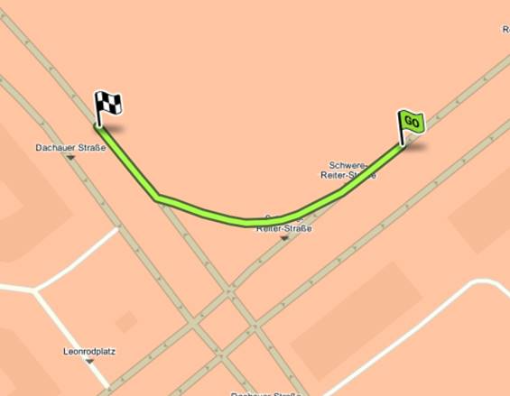 | For guidance purposes links marked as "Plural Junction" are skipped, so here a "Turn right" instruction is given with the start offset at the beginning of the link.  OFA will show 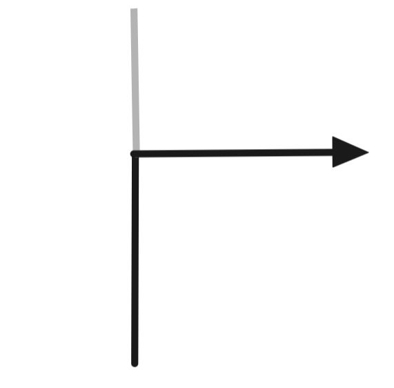 |
| ------------------------- |:------------------------------------------------------------------------------------------------------------------------------------------------------------------------------------------------------------------------------------------------------------------------------------- |

For the complex intersection, the only off-route road at the maneuver point will be shown and the internal geometry will not be shown. 

| 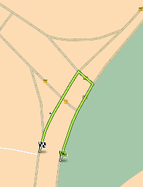 | This is a complex intersection and guidance gives U\-Turn instruction.  OFA will show   *   Simple U\-Turn with two off\-route roads at maneuver point  *   Multi\-digitized off\-route road will be shown as the single road (As shown in gray color in the Image) 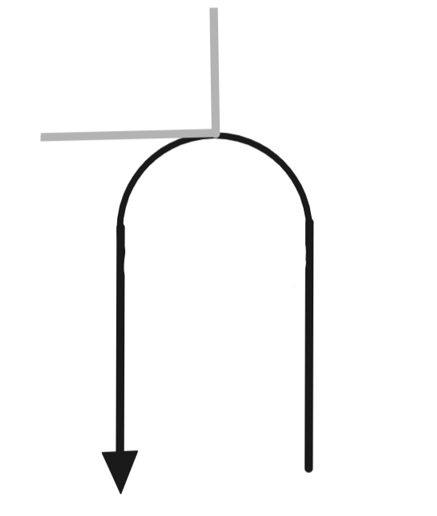 |
| ------------------------- | ----------------------------------------------------------------------------------------------------------------------------------------------------------------------------------------------------------------------------------------------------------------------------------------------------------------------------------------------------------------------------- |
| 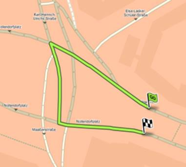 | It is a complex intersection with a U\-turn with a quite large distance between different sides of the dual\-carriageway road.  Guidance generate "U\-Turn" instruction.   OFA will show   *   It will be shown as a simple U\-Turn with three off\-route road 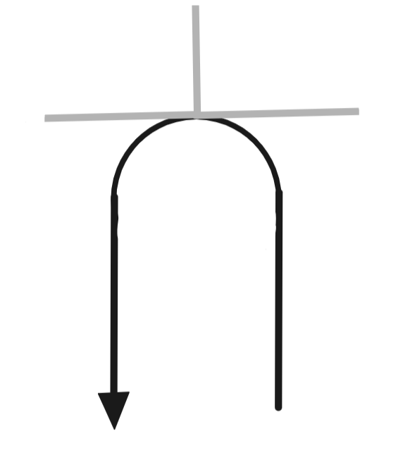                               |

For Roundabout,

* A tangent angle for exit will not be provided, only an inner angle will be provided.  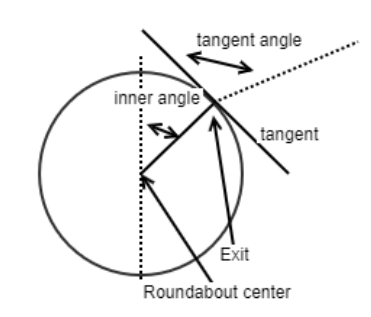   
* Entry only road should be eliminated so that it will be consistent with current Instruction behavior.  

| 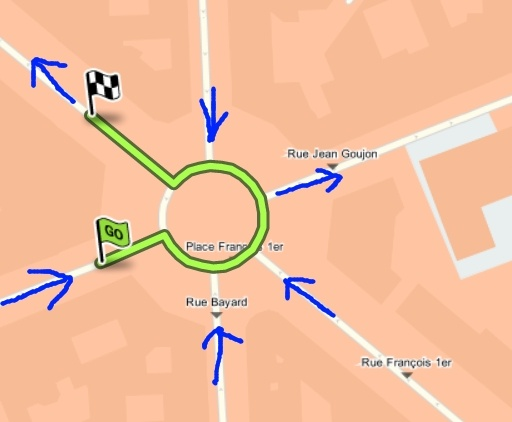 | OFA will show exits only. 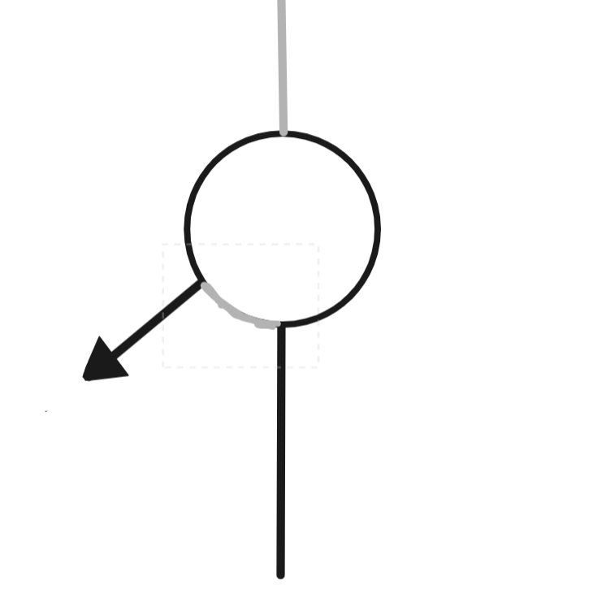 |
| ------------------------------------------------------------ |--------------------------------------------------------------------------------------------|

##### Side streets before Instruction:

* The side street will be given with only two angles (left or right), which means they will not match the real-life side street angle.  

|  | OFA will show below the image 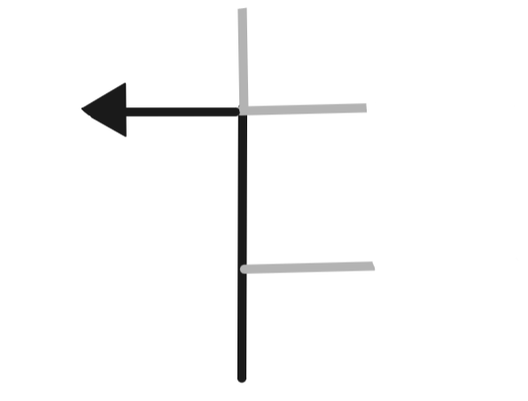 |
| ------------------------------------------------------------ | ----------------------------------------------------------------------------------------- |

* Only those roads will be shown which driver can take. 
* Multi-digitized side roads with a higher distance between them will be shown separately as users will perceive them as different roads.

| 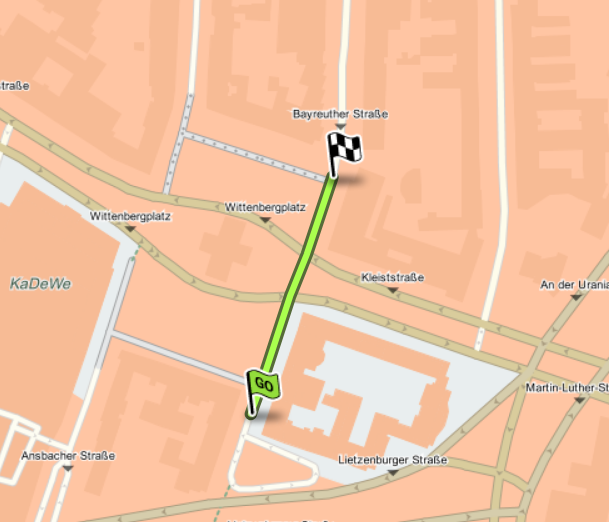 | OFA will show the below image. 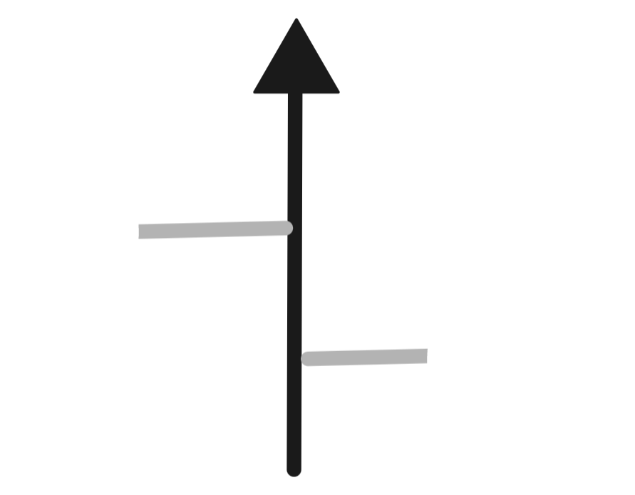 |
| ------------------------------------------------------------ | ------------------------------------------------------------------------------------------ |

Discussion
==========

| **Coordinate**         | **Route**                                                                             | **Comment**                                                                                                                                                                                                                                                                                                                                                                                                                                                                                                                                                                                                                                                                                                                                                                                                                                                                                                                                                                                                                                                                                                                                                                                                                                                                                                                                                                                                                                                                                                                                                                                                                                                                                                                                      |
| ---------------------- | ------------------------------------------------------------------------------------- | ------------------------------------------------------------------------------------------------------------------------------------------------------------------------------------------------------------------------------------------------------------------------------------------------------------------------------------------------------------------------------------------------------------------------------------------------------------------------------------------------------------------------------------------------------------------------------------------------------------------------------------------------------------------------------------------------------------------------------------------------------------------------------------------------------------------------------------------------------------------------------------------------------------------------------------------------------------------------------------------------------------------------------------------------------------------------------------------------------------------------------------------------------------------------------------------------------------------------------------------------------------------------------------------------------------------------------------------------------------------------------------------------------------------------------------------------------------------------------------------------------------------------------------------------------------------------------------------------------------------------------------------------------------------------------------------------------------------------------------------------ |
| 52\.501650, 13\.343897 |                           | As side road are perceived as separate road. How side road will be shown in such cases?    \[Meeting] The side road is shown as two different road in this case. 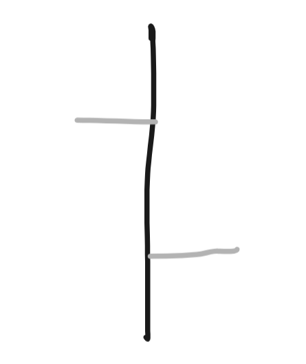 \- OFA will show only the side road which driver can take turn to. \- Multi\-digitized side road with higher distance between them will be shown separately                                                                                                                                                                                                                                                                                                                                                                                                                                                                                                                                                                                                                                                                                                                                                                                                                                                                                                                                                                                                                                                                                                                                                                                                                                                                                                                                |
| 48\.159536, 11\.547404 | 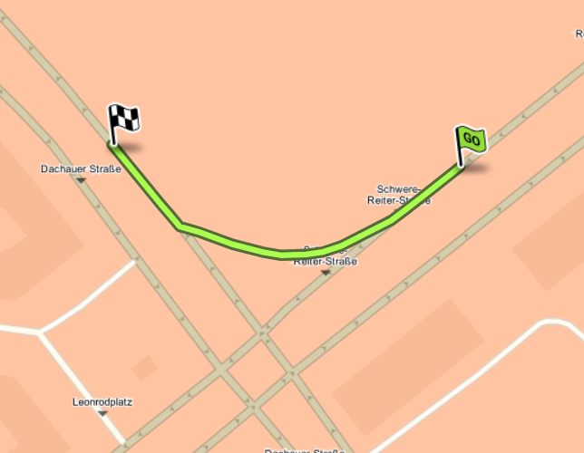                          | Here we give a Turn Right instruction. What should be shown in the cluster display and when? \[EH] As there are no streets before the turn, this would be represented as a simple “keep right” \[Guidance]  For guidance purposes links marked as "Plural Junction" are skipped, so here a "Turn right" instruction is given with the start offset at the beginning of the link.    Would you confirm, that  OFA should display "Slight right" reflecting road geometry, not the given instruction?  \[EH] yes, correct  \[Meeting] *   Angle in OFA should match with the instruction turn angle. * So OFA will show  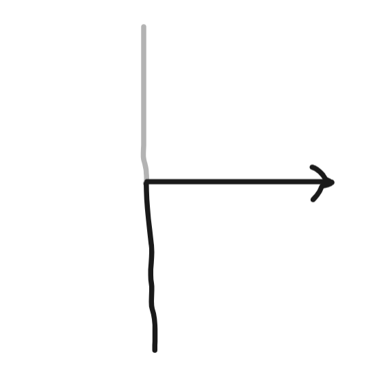\[EH] OK – see screenshot from MIB3  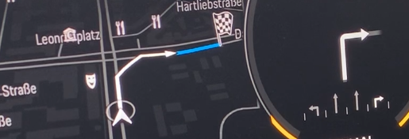\[Guidance] There are no intersection side roads displayed at the given screenshot, is the new system going to show them? \[EH] Yes: we plan to show intersecting/incoming/outgoing side roads – there seem to be some errors in the version, used to create the videos                                                                                                                                                                                                                                                                                                                                                                                                                                                                                                                                                                                                               |
| 48\.159536, 11\.547404 | 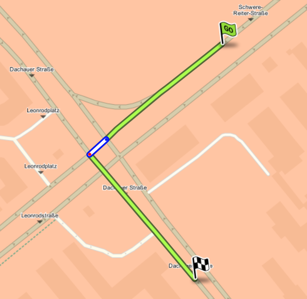                          | We get a Turn Left instruction here. What should be shown in the cluster display and when? \[EH] at the green flag: 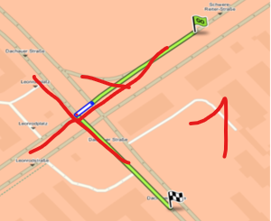 After passing the right shortcut: 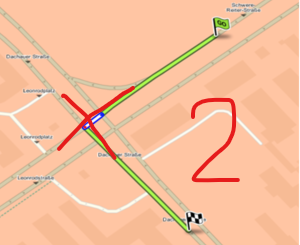  \[Guidance] As we understood the drawing, the expectation is that OFA will show 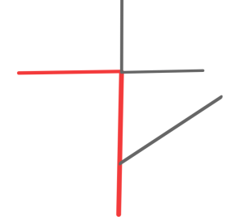 (assuming, that the double\-carriage roads here are displayed as single lines)   but by requirements the angle for cross roads is not provided, so they are always shown perpendicular to the route: 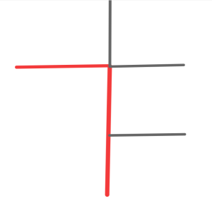 Would you please confirm, which OFA should be displayed?   \[EH] You are right: 2nd should be shown (I just drew the geometry)                                                                                                                                                                                                                                                                                                                                                                                                                                                                                                                                                                                                                                                                                                                                                                                                                                                                                                                                                                                                   |
| 48\.76742,11\.41157    | 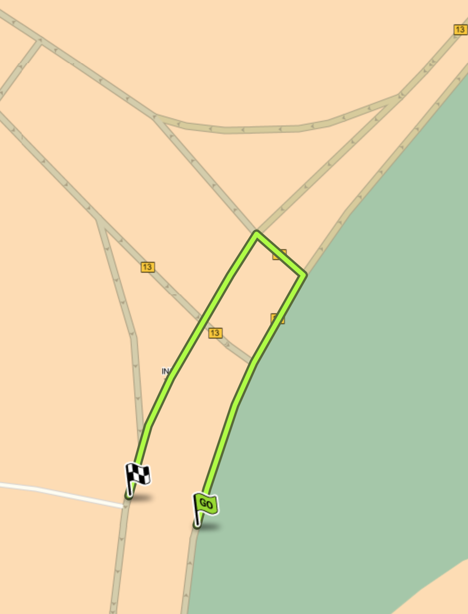                          | \[Guidance] What OFA is expected here? Guidance instruction:    "Make a U\-Turn" \[EH] Need to check with Benoit  \[Meeting] * Simple U\-Turn will be shown with two off\-route road at maneuver point * Multi\-digitized off\-route road will be shown as single road (As shown in gray color in Image) 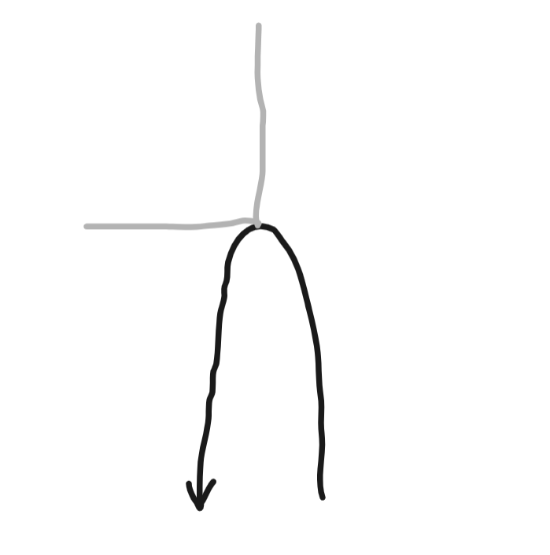  \[EH]   see row below: Uturn is OK                                                                                                                                                                                                                                                                                                                                                                                                                                                                                                                                                                                                                                                                                                                                                                                                                                                                                                                                                                                                                                                                                                                                                                                                                                                               |
| 52\.49975,13\.35430    | ****                                                         | It is a complex intersection with a U\-turn with a quite large distance between different sides of dual\-carriageway road. Here we give "U\-Turn" instruction. What should be shown in the cluster display and when? \[EH] \<removed the images to have a more compact view as they are anyway not relevant anymore\>  \[Guidance] * As the highlighted links have attribute "Plural junction", only one instruction "Make a U\-turn" will be generated for this complex intersection, with the start offset at the red point. This instruction and zero distance will be displayed within the whole Instruction Path (blue line)  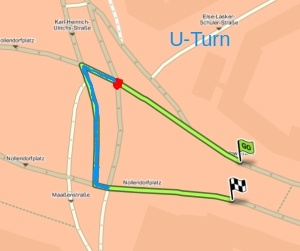 However, according to the drawing, OFA should display 2 consecutive "Turn Left" maneuvers for "inner" junctions. These "sub\-maneuvers" and distance displayed in the cluster display will be then different from the Instruction and distance in the Instruction Panel. Would you please confirm that it is expected?  \[EH] will check again and give feedback  \[Meeting] * It will be shown as simple U\-Turn with three off\-route road * Still, this is open question and cariad will get back to us. 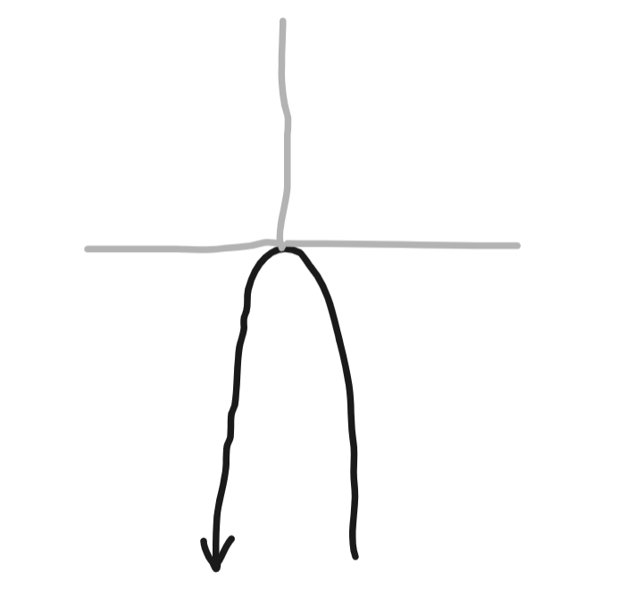 \[EH] screenshot from MIB3 system: 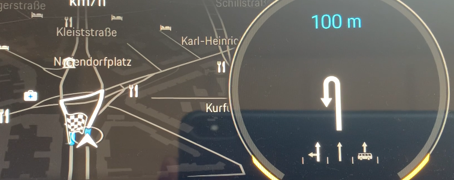\-\-\> showing as uturn without intermediate connected streets is OK   \[Guidance] There are no intersection side roads displayed at the given screenshot, is the new system going to show them? \[EH] Yes: we plan to show intersecting/incoming/outgoing side roads – there seem to be some errors in the version, used to create the videos |
| 55\.74247,37\.86565    | 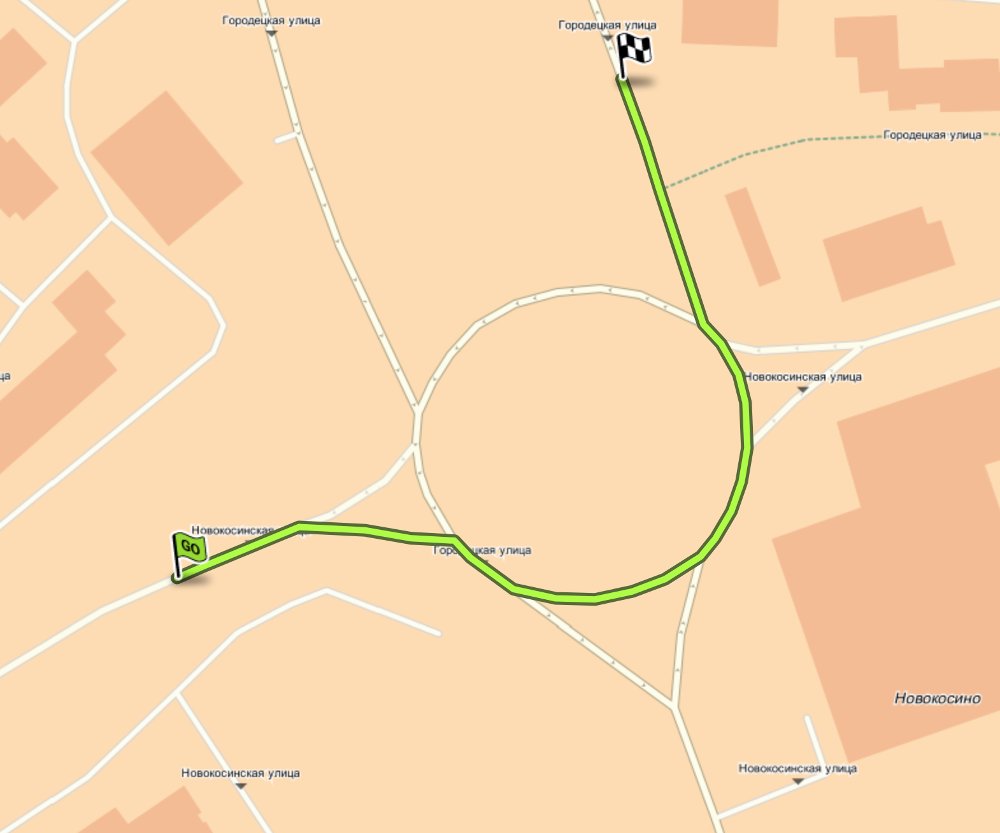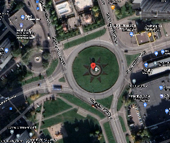 | \[Guidance] What would you expect to see in the cluster display for this route?   \[EH] see also [https://etf.esolutions.de/user/?etf\_id\=3233178](https://etf.esolutions.de/user/?etf_id=3233178) This is from previous system (MIB3\). 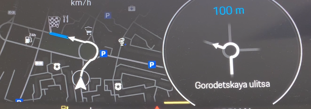  \[Meeting] * Entry only road should be eliminated so that it will be consistent with current Instruction behavior.                                                                                                                                                                                                                                                                                                                                                                                                                                                                                                                                                                                                                                                                                                                                                                                                                                                                                                                                                                                                                                                                                                                                                                                                                                                                                                                              |
| 55\.74247,37\.86565    | 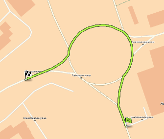                                                             | \[Guidance] What would you expect to see in the cluster display for this route? (In particular, what side roads and where?)  \[EH] see also [https://etf.esolutions.de/user/?etf\_id\=3233178](https://etf.esolutions.de/user/?etf_id=3233178) This is from previous system (MIB3\).  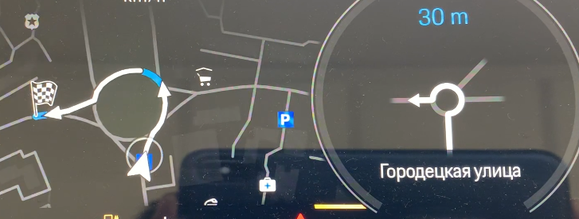  \[Meeting] * Tangent angle for exit will not be provided, only inner angle will be provided. \[EH] OK                                                                                                                                                                                                                                                                                                                                                                                                                                                                                                                                                                                                                                                                                                                                                                                                                                                                                                                                                                                                                                                                                                                                                                                                                                                                                       |
| 48\.866250, 2\.307707  |                                                              | \[Guidance] So in this example, there are four entry\-only roads and two exit\-only roads. The instruction generated is " At the roundabout take the second exit.". We do not count 3 entry\-only roads in this case.  What should be shown in the cluster display? 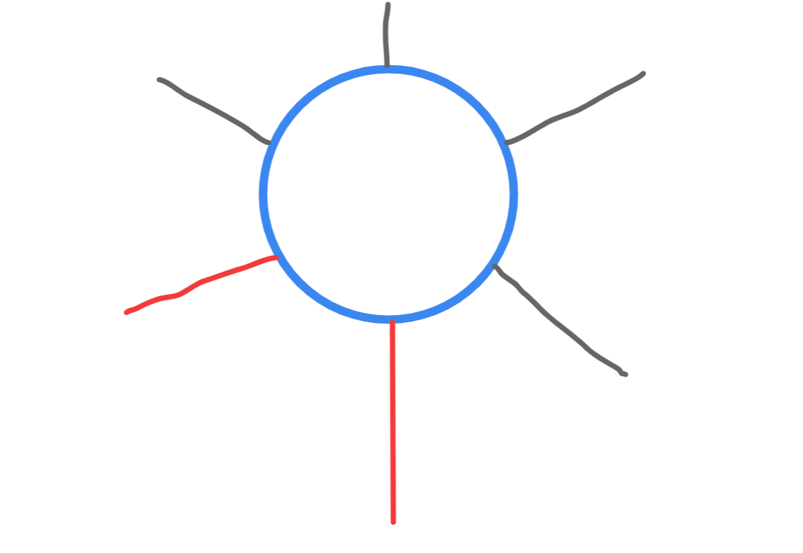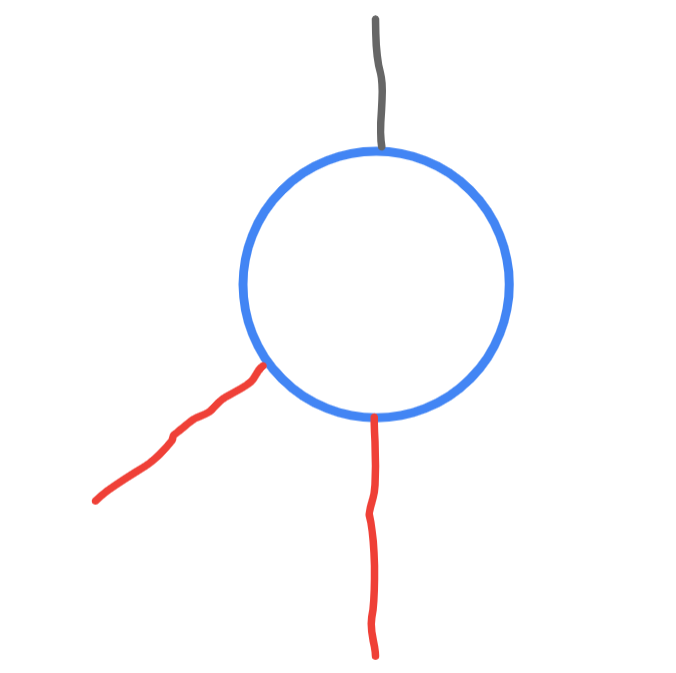  \[Meeting] * As OFA will show only exit road for roundabout, the second image will be shown in such cases.  \[EH] OK – see also screenshot from MIB3 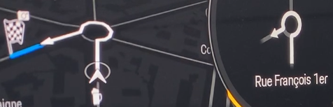                                                                                                                                                                                                                                                                                                                                                                                                                                                                                                                                                                                                                                                                                                                                                                                                                                                                                                                                                                                                                                                                                                                                 |

Some of the examples from the previous system. 

| 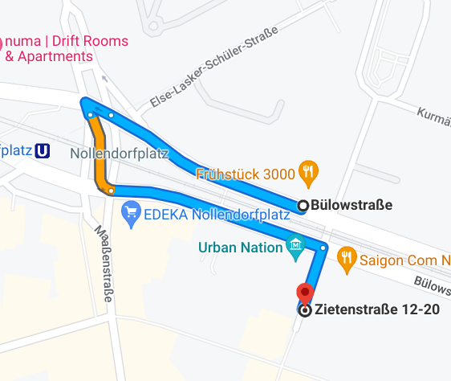                                    | [Location On Map](https://www.google.com/maps/dir/52.4990808,13.3567043/52.4982652,13.3567381/@52.4995642,13.3548422,16.74z/data=!4m2!4m1!3e0)    [EH] see screenshots 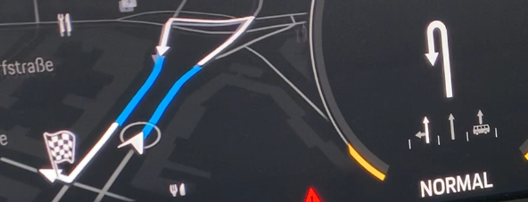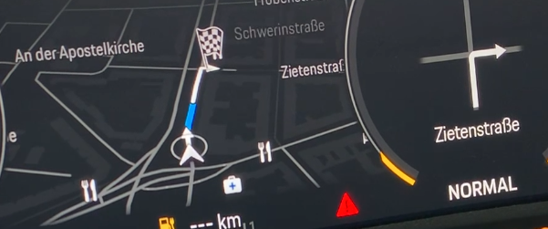 |
| ------------------------------------------------------------ | ---------------------------------------------------------------------------------------------------------------------------------------------------------------------------------------------------------------------------------- |
|  | [Location On Map](https://www.google.com/maps/dir/52.4865349,13.298148/52.4891196,13.2988488/@52.4879209,13.2984535,17.34z/data=!4m2!4m1!3e0)  [EH] see screenshots 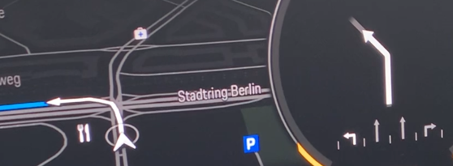    |
| 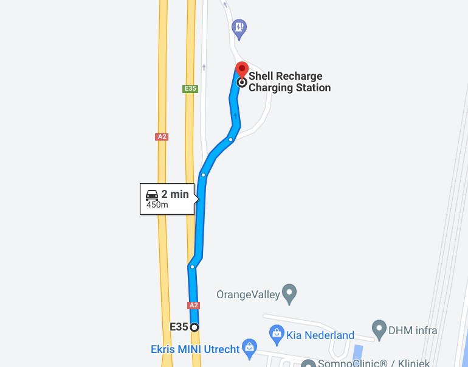 | [Location On Map](https://www.google.com/maps/dir/52.1800429,4.9867601/52.1838643,4.9878293/@52.1826432,4.9864314,16.22z/data=!4m2!4m1!3e0)  [EH] see screenshots 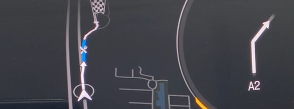 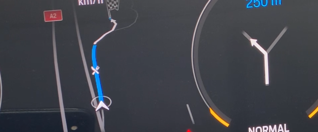      |