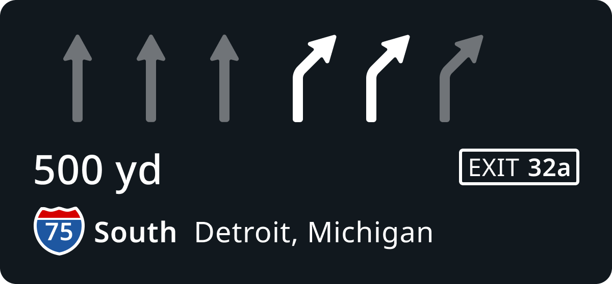
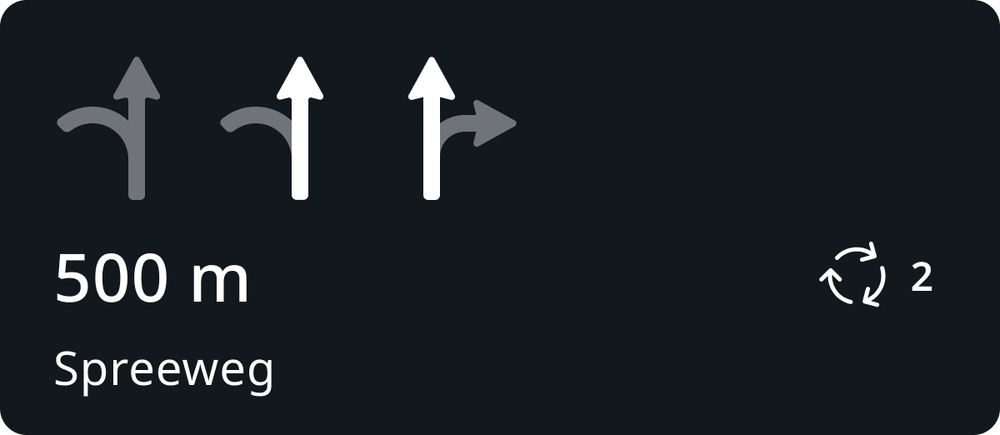
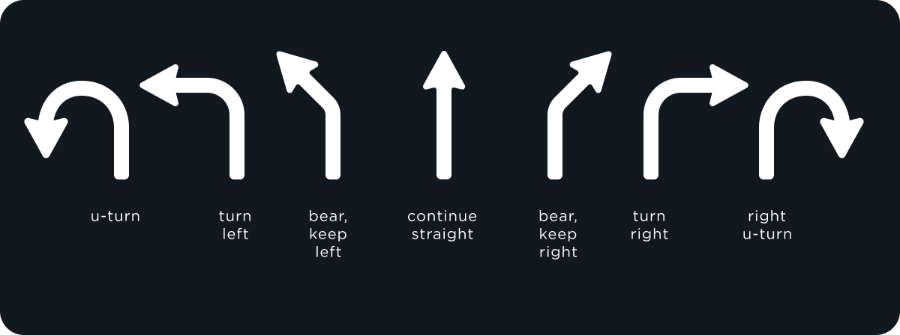
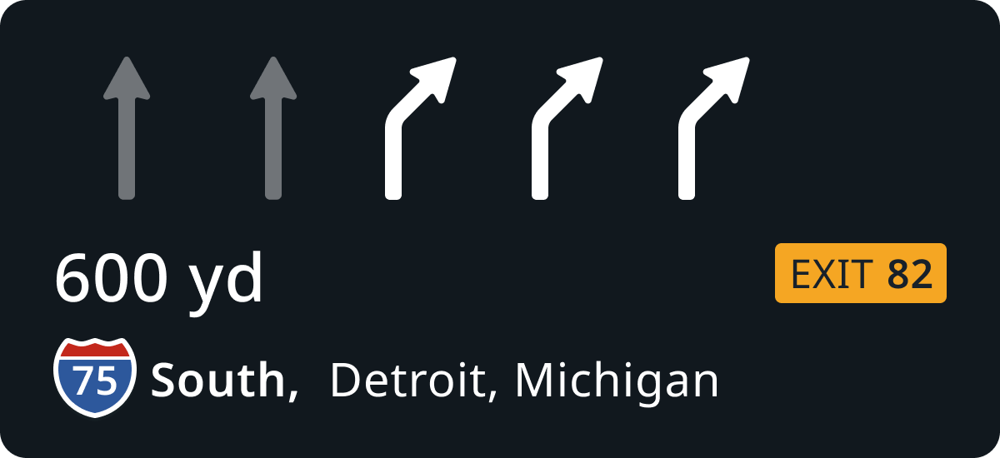
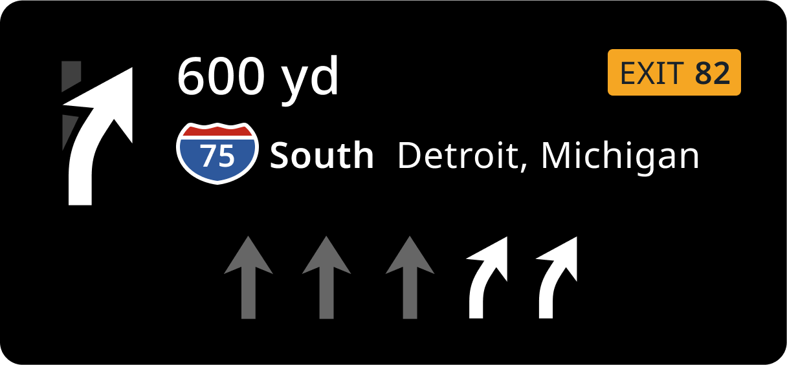

testing review

| **UX** | [Alexey Opokin](https://tomtom.atlassian.net/wiki/people/70121:e8cb7861-9079-4b92-b96d-bfe8cd882680?ref=confluence) |
|---|---|
| **VD** | [Georgios Koultouridis](https://tomtom.atlassian.net/wiki/people/5be2fd44649a737c2342afbe?ref=confluence) |
| **ENG OWNER** | ??? |
| **PM** | [Joost Pennings](https://tomtom.atlassian.net/wiki/people/712020:a6d50cb1-97be-4a9a-a279-3fbb3e2e1799?ref=confluence) |

Introduction
============

Simple Lane guidance (SLG) defines a set of methods intended for precise guidance in multi-lane environments, where manoeuvres are often not as straightforward as in single lane situations. SLG provides both: visual Instruction (NIP) and Audio Instruction. Visually, SLG is represented as a schematic diagram at the bottom part of the NIP and depicts lane geometry _**at the point of the manoeuvre**_. Target lanes are highlighted, while the rest are greyed out. The general principle of Lane guidance remains the same across all use cases. Her are some examples of various contexts:

|**Motorways**|**Non-Motorways**|**Roundabouts**|
| --- | --- | --- |
|  |  |  |

Touch Points
============

SLG as a visual component could be represented across various touch points in the vehicle. Typically it is combined with the NIP - next instruction panel.

NOTE: Simple lane Guidance (SLG) and Lane Lane Guidance (LLG) are two different solutions targeting the same goal - providing precise lane positioning. ~Both SLG and LLG work together, but the general rule is they should not be simultaneously shown on the same display (Cluster display, Central stack display, Heads up display).~ 

Use Cases
=========

Lane Guidance can be used by any instruction **with exception for Non-guiding instructions**: Departure, Arrival (to final destination and to a waypoint), Border Crossing.  
Specific usage of SLG is defined by instruction type, therefore it is worth to check appropriate instruction definitions:

[Turn Instruction](https://tomtom.atlassian.net/wiki/spaces/FlaminGO/pages/157679963)

[Roundabout Instruction](./../../Instructions/Roundabouts/Roundabouts.md)

[HOV instruction](./../../Instructions/High%20occupancy%20Lanes%20(HOV)%20%20/High_occupancy_Lanes(HOV).md)

[Forks &amp; Exit instructions](./../../Instructions/Furcations%20-%20%20Bifurkations%2C%20Trifurcation%2C%20Exits%20%20/Furcations-Bifurkations_Trifurcation_Exits.md). 

Additionally, it is important to mention [Interim Exit scenario](./../../Instructions/Furcations%20-%20%20Bifurkations%2C%20Trifurcation%2C%20Exits%20%20/Interim%20Exit%20Scenario%20%20/Interim_Exit_Scenario.md) where LG plays critical role.

Visualisation of SLG
====================

SLG uses schematic arrows representing lane directions for visualisation. Any valid for driving lane (no shoulder lanes), should be represented by the arrows.  
NOTE: At the moment there is no special treatment for bus (public transport) lanes. Bus lanes should be treated as normal lanes for now.

**Here are following possible states for each individual LG arrow**

**Example of usage of SLG in the Unified NIP.**

Highlighted SLG arrow represents (one) direction which is required by the current route. Greyed out arrows represent (one) alternative direction which should not be taken (following current route). Keep in mind, in reality there could be multiple directions associated with any given lane, but the engine is only indicating one of them.

**There are following rules that SLG must follow:**

| 1 | Different directions outcomes must be represented by different direction arrow. |
|---|---|
| 2 | Identical directions outcomes must be represented by identical direction arrows. |
| 3 | Amount of arrow must match amount of lanes at reference point |
| 4 | Arrows representing direction of the route must be highlighted |
| 5 | Arrows representing off\-route direction must be greyed out |
| 6 | Highlighted arrow must be announced by audio if applicable for given instruction |
| 7 | SLG should not be used if there is only 1 legal lane to drive |
| 8 | SLG should not be used if all legal lanes stay on route |

Visually, all individual arrows are consolidated together to schematically represent real lane order of the road.

**The resulted schematic image is attached to the top part of the NIP**

|  |  |
|---|---|

Manoeuvre arrow &amp; SLG arrows
----------------------------

Manoeuvre arrow represent the instruction and is used at early and far away instruction phases. Later at main instruction phase it is replaces by SLG arrows (if lane guidance is present). This behaviour is true for **Unified NIP** design which is depicted below:

**Unified NIP layout**

Unified NIP substitutes manoeuvre arrow with SLG closer to the manoeuvre point, so they never displayed together. Manoeuvre arrow angle ( turn-90°, bear-45°, straight-180°) doesn't have to match the manoeuvre angle precisely. However in case of the current NIP design:

**Current NIP layout**

SLG arrow are displayed alongside with the manoeuvre arrow. In this case we should match the angle between them to avoid confusion. Current NIP layout is in use at 25 Jul 2024 .

Audio Lane Guidance
===================

While visual LG is always displayed in the NIP, Audio LG information should be announced only under certain conditions. First, lets define types of audio lane guidance. There are two types:

1.  **Approximated Audio Lane Guidance - AALG**  
    This method doesn't elaborate on specific lanes, but rather tells which side driver is required to keep: _**Keep left/right, stay in the middle...**_ Approximated lane guidance has been always used by NK, and it is not new.  
    
2.  **Explicit Audio Lane Guidance - EALG**  
    This is a newly introduced by NIE method tells driver specific lane numbers to stay at: _**use two right lanes to** "perform given manoeuvre"._  
    

EALG can used for all major Instruction types: Turns, Bears, Continue straight but not for others:

|Instruction type | Explicit Audio LG|
| --- | - |
|Turns|yes|
|Bears| Yes|
|Sharp turns| Yes|
|Roundabouts| Yes|
| Forks| Yes|
| Exits| Yes|
| HOV| Yes|
| Mandatory turn| No|
| Departure instructions|No|

Exact logic for EALG usage is dependant on the manoeuvre type, therefore rules defining usage of AALG and EALG are defined individually per instruction type: 

[NIE\_011 - Turn manoeuvres overview](https://tomtom.atlassian.net/wiki/spaces/FlaminGO/pages/157679963)  
[NIE\_013 - Forks Instructions (Bifurkations, Trifurcation, Exits)](./../../Instructions/Furcations%20-%20%20Bifurkations%2C%20Trifurcation%2C%20Exits%20%20/Furcations-Bifurkations_Trifurcation_Exits.md)  
[NIE\_010 - Roundabouts](./../../Instructions/Roundabouts/Roundabouts.md)

Strings
=======

Following strings cover the whole range of scenarios for SLG.

| String ID | Description | String proposal | Reviewed string | Translated |
|---|---|---|---|---|
| 1 | Points the vehicle to the leftmost/rightmost lane | use the leftmost/rightmost lane to take the ... | Use the leftmost/rightmost lane to take the ... |  |
| 2 | Keeps the vehicle at the leftmost/rightmost lane | stay in the leftmost/rightmost lane to continue on... | Stay in the leftmost/rightmost lane to continue on... |  |
| 3 | Points the vehicle to 2, 3 or 4 lanes from the right or left | use two/three/four left/right lanes to take... | Use the two/three/four left/right lanes to take... |  |
| 4 | Keeps the vehicle at 2nd, 3rd or 4th lanes from the right or left | stay in two/three/four left/right lanes to continue on... | Stay in the two/three/four left/right lanes to continue on... |  |
| 5 | Points the vehicle to middle lane | use the middle lane to take the... | Use the middle lane to take the... |  |
| 6 | Keeps the vehicle at the middle lane | stay in the middle lane to continue on... | Stay in the middle lane to continue on... |  |
| 7 | Points the vehicle to 2, 3, 4 middle lanes | use the two/three/four middle lanes to take the... | Use the two/three/four middle lanes to take the... |  |
| 8 | Keeps the vehicle at 2, 3, 4 middle lanes | stay in the two/three/four middle lanes to continue on... | Stay in the two/three/four middle lanes to continue on... |  |
| 9 | Points the vehicle to a specific lane counting from the left or right | use the second/third lane from the left/right to take the... | Use the second/third lane from the left/right to take the... |  |
| 10 | Keeps the vehicle at the specific lane counting from the left or right | stay in the second/third lane from the left/right to continue on... | Stay in the second/third lane from the left/right to continue on... |  |
| 11 | Points the vehicle to a specific 2 lanes counting from the left or right | use the second or third lane from the left/right to take the... | Use the second or third lane from the left/right to take the.. |  |
| 12 | Keeps the vehicle at the specific 2 lanes counting from the left or right | stay in the second or third lane from the left/right to continue on... | Stay in the second or third lane from the left/right to continue on.. |  |

Further ideas &amp; open questions
==============================

### Real-time guidance vs manoeuvre point

One of the major issues with SLG is mismatch between drivers expectations to see actual LG directions at the moment they are looking at the screen, in other words, drivers expect SLG to act in real-time, while the logic of the NIP and all it's component always refer to a point in the future - manoeuvre point. Tee issue is especially prominent in so called "interim exit" scenario - when driver passes two consecutive exits and he needs to take second one.

It is not clear how to address this issue with the static methods, such as SLG. There are following possible paths discovered:

1.  LLG - Lane level guidance will eventually replace SLG partially or entirely. LLG, by it's nature acts in real time and able to reflect real situation.
    
2.  Consider combining real-time logic with future point - this approach has been implemented in NK1.
    

Further work is needed in this area.

### Lane change warning

As a result of evaluation, it has been discovered, that drivers are missing warnings about lane changes: lane merges and splitting. The question remains if those changes are attached to a manoeuvre upfront or not.

### Multi-directional LG arrows

Most prominent competitors, (Google Map, Waze, Apple Maps) use different method of displaying LG arrows - their arrows depict all possible directions of the lane (which is often also marked on the road surface) in the arrow itself, while highlighting only the correct one. This approach has clear advantages and will be integrated eventual as part of Unified NIP design.

### Manoeuvre path optimisation

For serial manoeuvres (which we handle by Chain instructions) optimised manoeuvre path could be different from possible path. In other words, in order to complete the passage with minimal amount of lane changes, only specific lanes should be used. The algorithm of selection of such lanes called _**Manoeuvre path optimisation**_. This method is defined in details here: [NIE\_027 - Lane Level Guidance (LLG)](./../../Guidance%20Framework%20-%20Methods%20%26%20Components/Lane%20Level%20Guidance%20(LLG%2CLLN)/Lane_Level_Guidance(LLG_LLN).md)

/ END OF DOCUMENT
=================