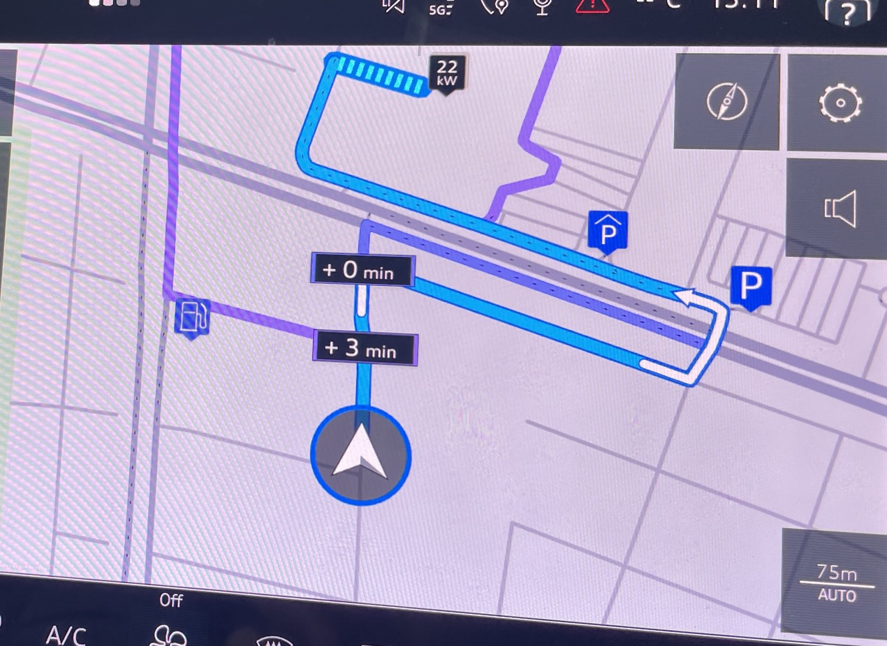
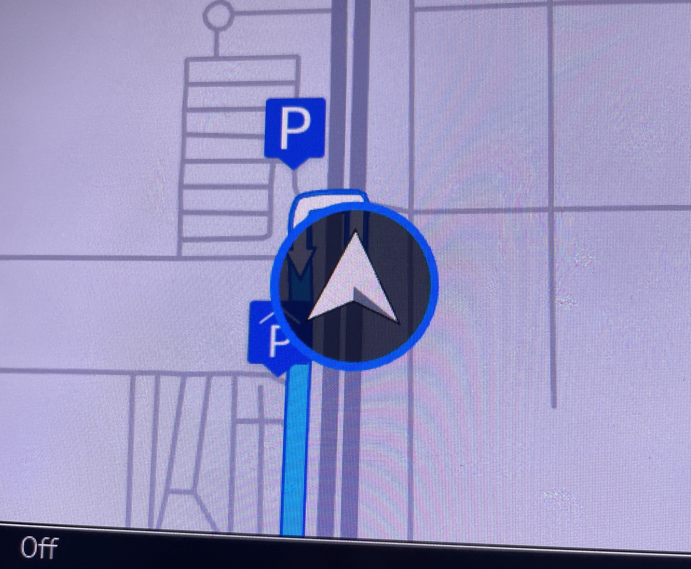
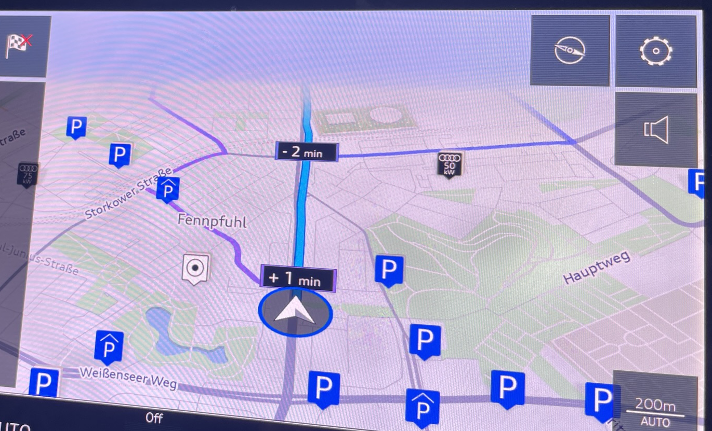
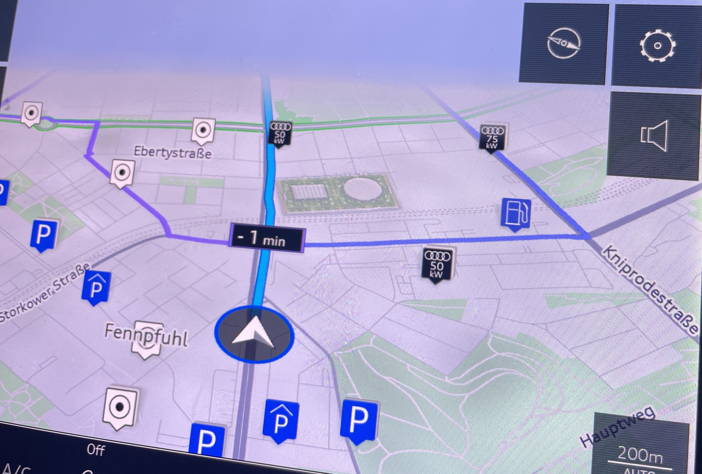
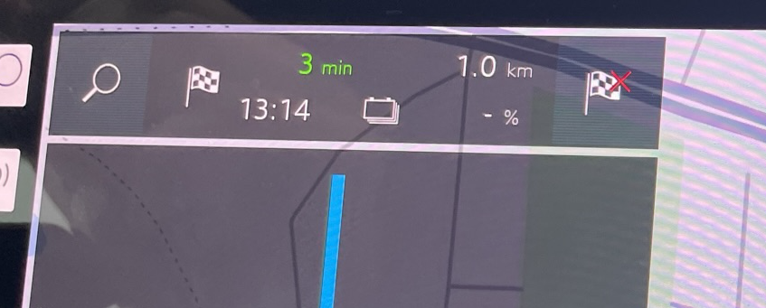
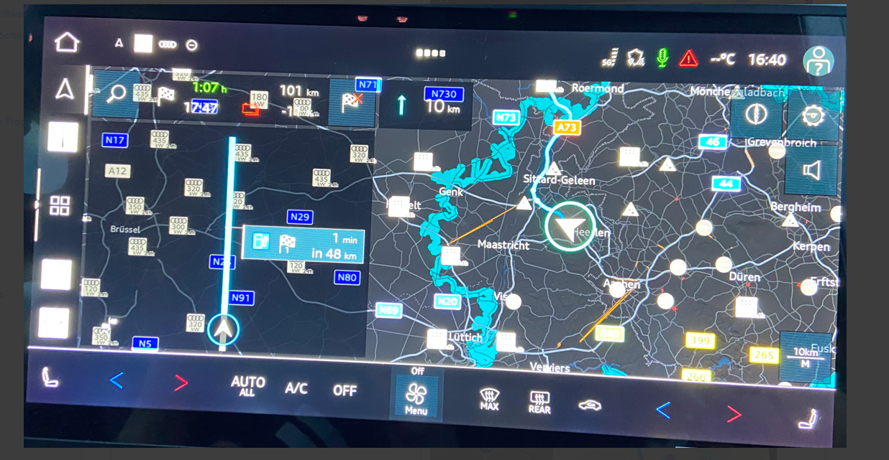
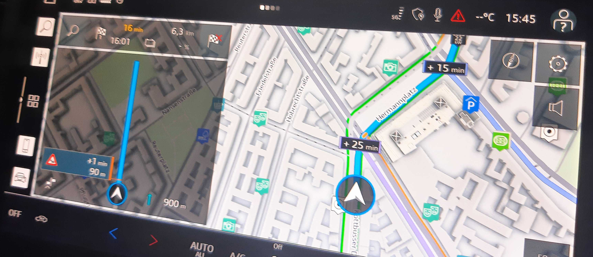

| Organised by | [Michał Słonina](https://tomtom.atlassian.net/wiki/people/70121:30dcc9c2-9716-4606-81a9-709ec084944b?ref=confluence) [Stanislav Yelenskiy](https://tomtom.atlassian.net/wiki/people/712020:83f483c8-1dd6-4d55-a653-ab45bec6f3da?ref=confluence) |
|---|---|
| PM | [Joost Pennings](https://tomtom.atlassian.net/wiki/people/712020:a6d50cb1-97be-4a9a-a279-3fbb3e2e1799?ref=confluence) |

  

  
Introduction
===============

The Drive test took place in Berlin with following participants: [Michał Słonina](https://tomtom.atlassian.net/wiki/people/70121:30dcc9c2-9716-4606-81a9-709ec084944b?ref=confluence) [Stanislav Yelenskiy](https://tomtom.atlassian.net/wiki/people/712020:83f483c8-1dd6-4d55-a653-ab45bec6f3da?ref=confluence)  [Alexey Opokin](https://tomtom.atlassian.net/wiki/people/70121:e8cb7861-9079-4b92-b96d-bfe8cd882680?ref=confluence)  
Two platforms were used for the test: Audi e-Tron car with in-dash system

  

Stability
=========

Multiple system crashes happened during the test. Stability of the system was very low.  
  
  

Audi UI Issues
==============

We know that UI is not something we can fix, but it is important to influence as it is the area where the most of critical issues occur. Unfortunately, we observe a major degradation here from the previous version we tested a year ago. Here are the most important issues. 

| **Issue** | **Domain** | **Illustration**                                                    | **Description**                                                                                                                                                                                                                                                                                                                                                                                                                                                                                                                        | **Impact** |
|---|---|---------------------------------------------------------------------|----------------------------------------------------------------------------------------------------------------------------------------------------------------------------------------------------------------------------------------------------------------------------------------------------------------------------------------------------------------------------------------------------------------------------------------------------------------------------------------------------------------------------------------|---|
| Route Panel functionality. | Audi UI |                                   | The panel on the left, depicting route line is very confusing element. It is not in sync with the map view nor with the maneuvre visualisation. Even if map shows manoeuvre in 20m, the route line remains straight and empty. It is not clear what was the design intention of this element and why it takes the most of the screen while remaining empty.                                                                                                                                                                            | Major |
| Next Instruction visualisation | Audi UI |                                   | Next Instruction is extremely tiny icon which completely lost among other elements at the bottom of the screen. Considering that this is the most important guiding element, it is hard to understand this design decision.      This version, while clearing the map space, is a major degradation from previous one, where the NIP was much bigger. There is enough space in the Route panel to accommodate the NIP in the proper sizing.                                                                                      | Extreme!!! |
| Route Alternatives | Map UI |  | Route alternative are provided all the time and in the most inappropriate moments, especially on arrival, where a side road is highlighted as an alternative.      Most of the time alternatives don't make logical sense: show 0 min benefit or just inappropriate.      They create a lot of visual destruction, interfere with the main route, time labels cover the most important intersection on the map, etc.      Colors of alto route are hard to distinguish from the main route.  This feature should be better removed altogether. | Extreme!!! |
| Alternative route labels | Map UI |                         | Alternative routes labels are impossible to understand \- which one belongs to what route which makes them absolutely useless.      labels cover important junctions.                                                                                                                                                                                                                                                                                                                                                                    | Major |
| Chevron icon | Map UI |                                   | Chevron icon is so big that it covers next instruction on most zoom levels making guidance impossible at the maneuvre point.                                                                                                                                                                                                                                                                                                                                                                                                           | Medium |
| Parking POIs | Map UI |                                   | Parking garages POIs are shown all the time. They are big and cover major areas of the map. Most of the time they are inappropriate because driver has no intention to park and destination is far away.                                                                                                                                                                                                                                                                                                                               | Major |
| Anonymous POIs | Map UI |                                   | There are many anonymous POI icons (white with black dot) shown all the time. It s unclear what the benefit of this feature, but the negative impact is very clear.                                                                                                                                                                                                                                                                                                                                                                    | Major |
| End Route function | Audi UI |                                   | Tapping on destination flag with red cross icon, instantly kills the route without any confirmation.                                                                                                                                                                                                                                                                                                                                                                                                                                   | Medium |
| Top Panel layout | Audi UI |                                   | The layout of the panel seems to be chaotic and not structured at all. It is very hard to make sense of the information displayed and understand the interactivity.                                                                                                                                                                                                                                                                                                                                                                    | Major |
| Map panning performance | Map UI | https://github.com/user-attachments/assets/2b1e29e7-b17e-4548-8ecd-a92c9b2a5d91 | The map scrolling is not really smooth. Definetly not 2023 level. More like early '90s.                                                                                                                                                                                                                                                                                                                                                                                                                                                | Major |
| Night View | Audi UI / Map UI |                                   | There seems to be some problem with POI display and UI trasparency handling.  |Major|                                                                                                                                      

**NIE Guidance related Issues**
===============================

Here collected issue rooted in NIE. 

| Issue | Domain | Illustration | Description | Impact |
|---|---|---|---|---|
| Route deviation missing experience | Experience |  | At route deviation nothing happens. No new announcement. Te instruction is silently replaced | Major |
| Missing main instruction phase | Triggering |  | Couple of times the main instruction phase was missing. It is hard to track this specific location , but we will try later. | Major |
| Misleading follow the road instruction | Instruction logic |  | Follow the road instruction announced 6km, while next menuvre was in 4\. | Major |
| Roundabout that is not technically roundabout | Instruction logic |  | There is no instruction given at the roundabout that is not technically roundabout (no roundabout sign). | Major |
| Missing chain instruction |  |  | At least one we experienced missing chain instruction. | Major |
| Alternative route with \+25min shown. |  |  | Alternative routes with \+25min and \+15min were shown. | Medium |
| Missing "Cross the roundabout" | Instruction logic |  | A the crossing a roundabout, there was Missing "Cross the roundabout" part of the instruction | Medium |
