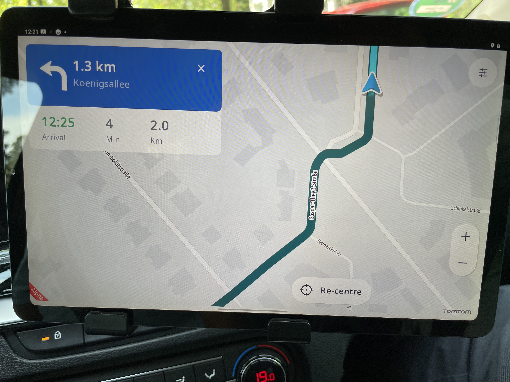
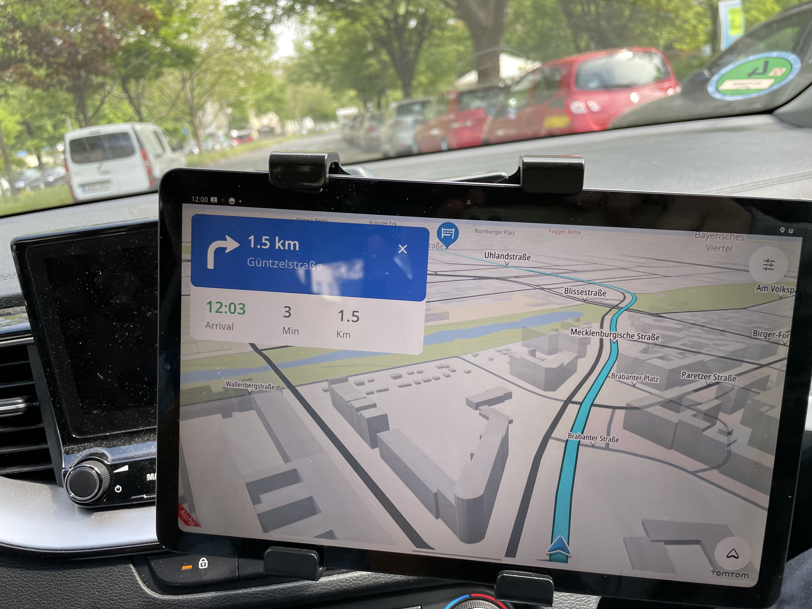
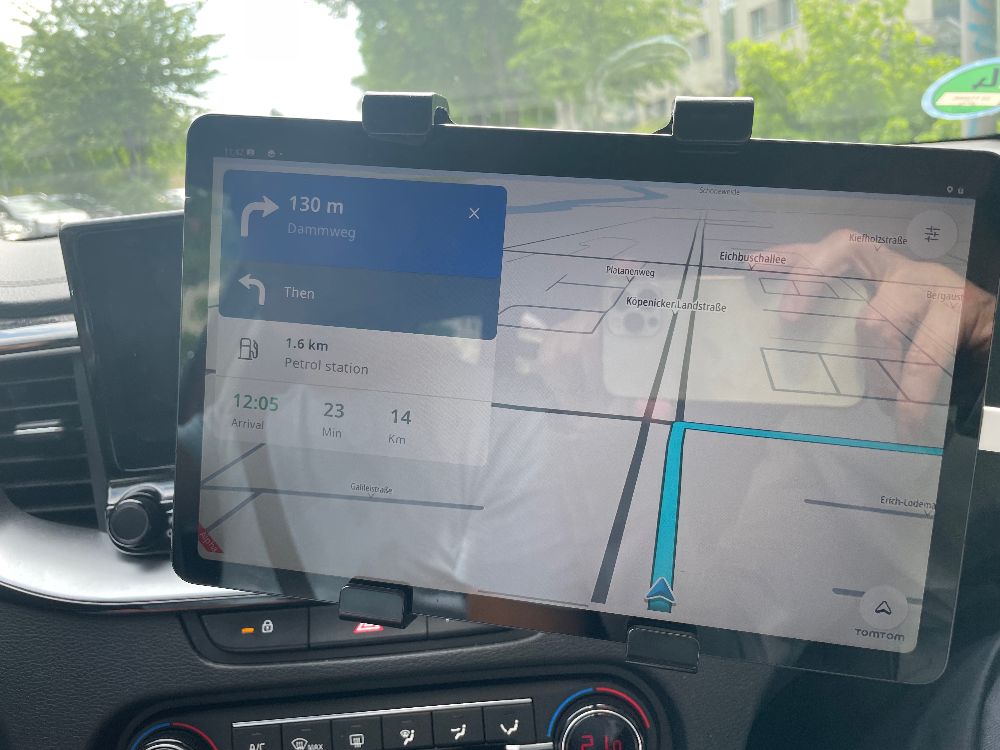
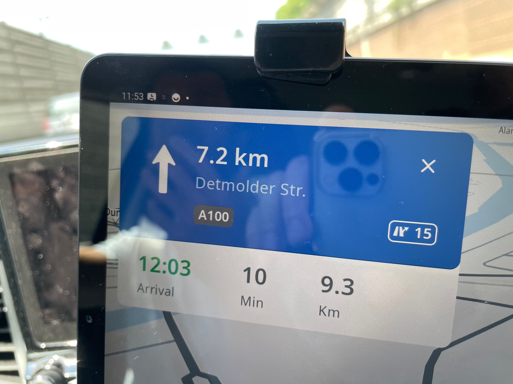
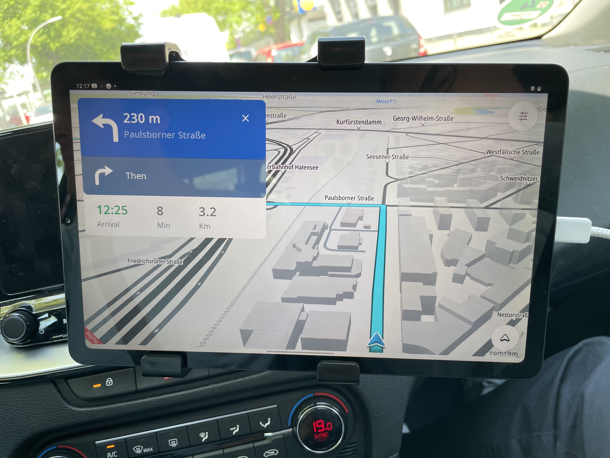
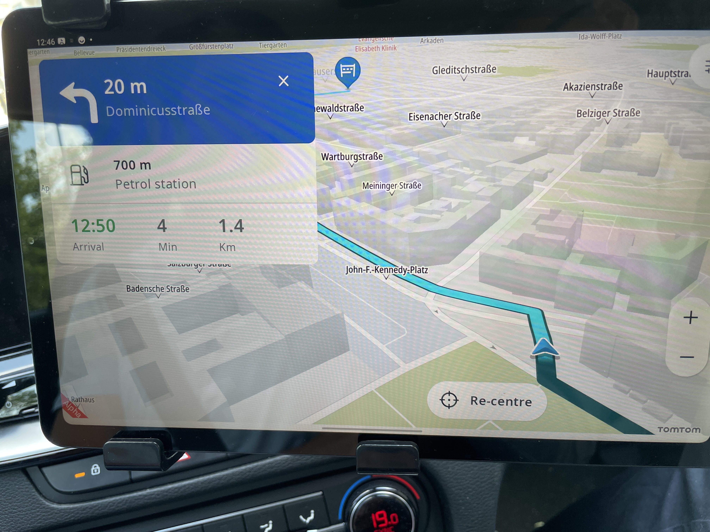
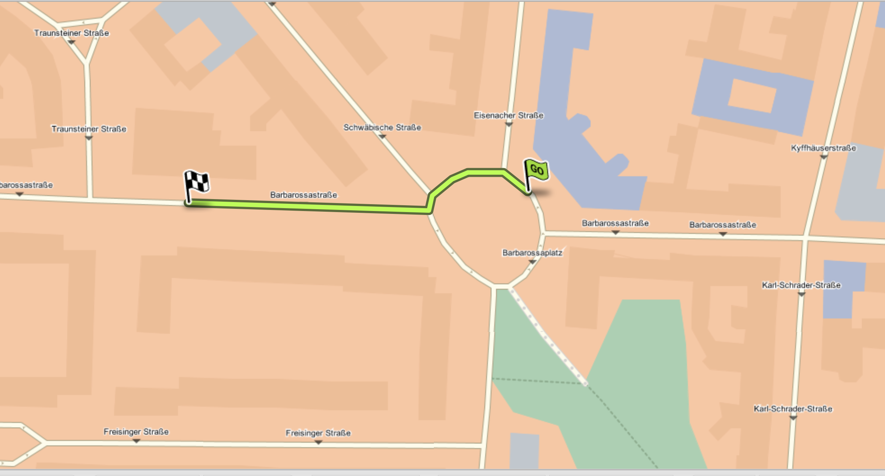
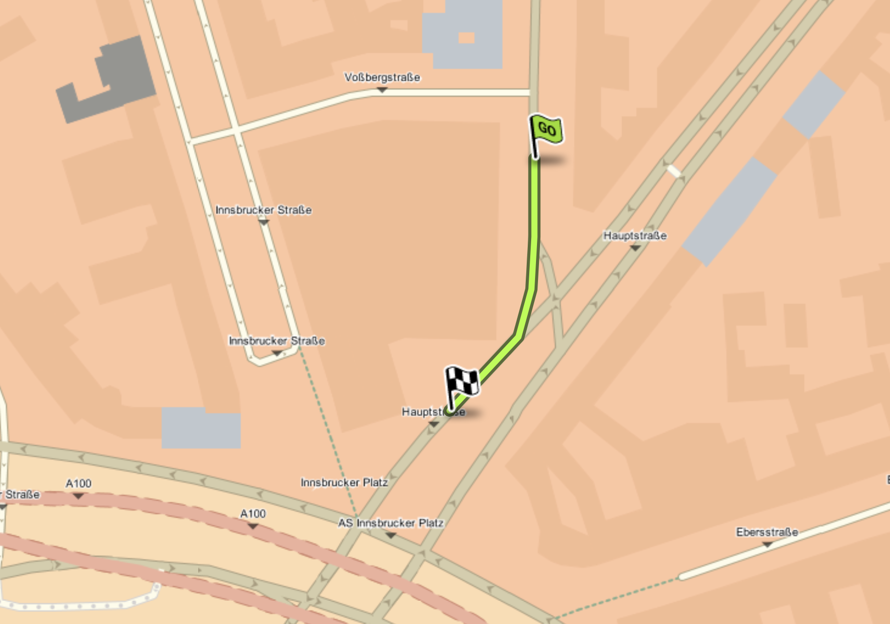
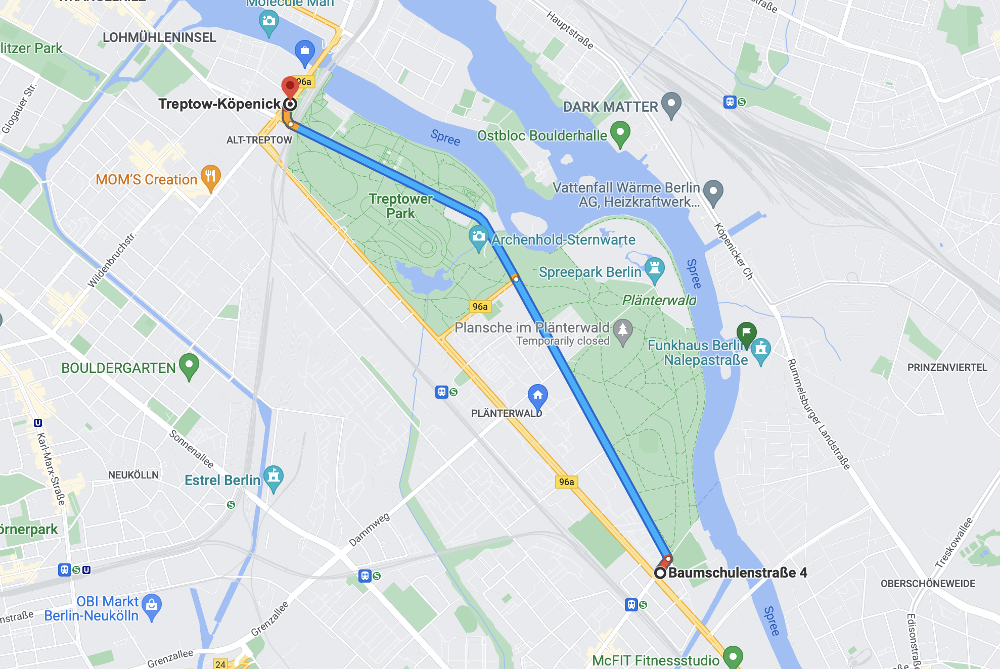

| **Owner** | [Alexey Opokin](https://tomtom.atlassian.net/wiki/people/70121:e8cb7861-9079-4b92-b96d-bfe8cd882680?ref=confluence) |
|---|---|
| PM | [Joost Pennings](https://tomtom.atlassian.net/wiki/people/712020:a6d50cb1-97be-4a9a-a279-3fbb3e2e1799?ref=confluence) |

  

  
Introduction
===============

The Drive test took place in Berlin with following participants: [Alexey Opokin](https://tomtom.atlassian.net/wiki/people/70121:e8cb7861-9079-4b92-b96d-bfe8cd882680?ref=confluence) [Vladimir Sinenko](https://tomtom.atlassian.net/wiki/people/712020:5206fef6-cc5b-4004-b718-381d8785098b?ref=confluence) [Former user (Deleted)](https://tomtom.atlassian.net/wiki/people/712020:949d5275-659f-47e3-9e07-bef883342456?ref=confluence)  
The tested platform was Samsung Galaxy S6 tablet with latest Automotive UI build. Map version - TT maps (without lane guidance).  
This is a second Drive test of NIE. First one was performed a year ago.

  

Test Setup Issues
=================

Setting up a proper environment for testing appeared to be not very straightforward.  
  
Installation Automotive UI  
[https://tomtom.atlassian.net/wiki/x/LlwKD](https://tomtom.atlassian.net/wiki/x/LlwKD)  
  
Installation Onboard Maps  
[https://tomtom.atlassian.net/wiki/x/RzQ2Bg](https://tomtom.atlassian.net/wiki/x/RzQ2Bg)  
  
  
We faced following issues:

**Impossible to identify which map is used by the App (with FTX or without)**  
Suggestion - Can we put map ID and map engine (Online / onboard) it directly on the screen as an overlay? That would make our lives so much easier.

  
**TT Maps with FTX are not readily available.**  
The only map available with FTX (lane guidance) was the whole Europe. The map was too big to install on the target device. Splitting the map process is extremely difficult, and It's not currently even possible to build a custom smaller map on the NDS Portal as the service is down.  
  
Suggestion: Can we make pre-built Maps for main testing regions (Germany, Detroit, Netherlands)?   
Suggestion: Can we extend the tablet with a 128Gb SD-card. 

  
  
With such issues I dont expect that our remote testers could setup the testing environment properly.

**Can we do something to simplify the process?**  
  
  

Issues Discovered
=================

| Issue | Description | Image | Location | Domain | Design status | Impact                                                                                                                                  | Ticket |
|---|---|---|---|---|---|-----------------------------------------------------------------------------------------------------------------------------------------|---|
| Rounding of distance value at triggering points (Audio). | Triggering points (Audio) should have round values (400, 450, 500…) and not 410, 420, 460… | N/A |  | NIE | **Ready** | **CRITICAL**  This issue is 1 year old and has been discovered at previous drive test.                                            | [NAV\-76138](https://tomtom.atlassian.net/browse/NAV-76138?src=confmacro)   [NAV\-54235](https://tomtom.atlassian.net/browse/NAV-54235?src=confmacro) |
| Return to position tracking after panning the map. | After manual panning the map, it doesn’t return to position tracking automatically but stays at the fixed location. |  |  | Map Interactions | **Not ready** | **CRITICAL**  it is also a Safety issue.                                                                                                  | [NAV\-82661](https://tomtom.atlassian.net/browse/NAV-82661?src=confmacro)        As this is a UI issue, it  is also valid for Automotive UI powered by NK1 and not specific to the New Instruction Engine |
| Current position marker location | Current position marker is too close to the bottom edge of the screen. |  |  | Map Interactions | **Ready** | **MAJOR**  it creates the impression of unrefined UI                                                                                      | [NAV\-80383](https://tomtom.atlassian.net/browse/NAV-80383?src=confmacro)       As this is a UI issue, it  is also valid for Automotive UI powered by NK1 and not specific to the New Instruction Engine |
| Chain Instruction | Chain instructions appear even if chain instruction in 2km distance from the main manoeuvre. Seems to be a bug. |  |  | NIE | **Ready** | **CRITICAL**                                                                                                                            | [NAV\-82992](https://tomtom.atlassian.net/browse/NAV-82992?src=confmacro)  |
| Follow the road for XXkm | Follow the road instructions in the NIP is combined with the next Instruction which comes afterwards. NIP shows exit number and street name (related to a next instruction).    Probably a Bug on UI side. |  |  | NIE / UI | **Ready** | **MAJOR**  the implantation of this instruction seems to be wrong.                                                                        | [NAV\-82766](https://tomtom.atlassian.net/browse/NAV-82766?src=confmacro) |
| Audio Instruction mismatch | Audio says “ in 2 km…”  and the NIP shows 1\.5km |  |  | NIE | **Ready** | **MINOR**                                                                                                                                 |  |
| Interrupted Triggering points are messed up | Two announcements in 500 and 400m |  |  | NIE | **Ready** | **MAJOR**                                                                                                                               | [NAV\-82994](https://tomtom.atlassian.net/browse/NAV-82994?src=confmacro)  |
| Early arrival | Reaching a waypoint announced 300m before actual location of the waypoint. | N/A |  | NIE | N/A | **MINOR**                                                                                                                               |  |
| No instructions is given at this intersection | At this, non standard geometry intersection no instruction has been given at all. At least two instructions are expected. |          | [52\.491780, 13\.286318](https://www.google.com/maps/@52.4918198,13.2858039,3a,75y,287.84h,101.55t/data=!3m6!1e1!3m4!1sYrfZteavhubhgzT-JDRUCA!2e0!7i13312!8i6656) | NIE | **Not Ready** | **MAJOR**  This is a complex intersection and doesn't happen often, but he impact is still high because drivers are completely lost here. | [NAV\-83002](https://tomtom.atlassian.net/browse/NAV-83002?src=confmacro)  |
| Confirmation phase trigger | At one particular place, Confirmation instr. is given at 150m | N/A |  | NIE | N/A | **MINOR**  even though the issue is minor it is worth to look why it is happening. Can point bigger problems                              |  |
| Absence of instruction after Merge to Highway | After merging to highway instruction is not announced at 3\.5km | N/A |  | NIE | **Not Ready** | **MAJOR**                                                                                                                               |  |
| "Follow the road"instruction is not always used appropriate. | Follow the road is not needed here |  |  | NIE | **Not Ready** | **MAJOR**                                                                                                                               |  |
| “At the end of the road” landmark | This landmark needs refactoring because it is used inappropriate most of the time. | N/A |  | NIE | **Not Ready** | **MAJOR**                                                                                                                               | [NAV\-69400](https://tomtom.atlassian.net/browse/NAV-69400?src=confmacro) |
| Roundabout Issue | At Barbarossaplatz after start navigation, we got turn left while still driving on the roundabout. Can't reproduce locally with a DevApp, could have been a mapmatching issue.      [Location](https://nds.tomtomgroup.com/webviewer/43617/?action=GetRoute%3FSRS%3DEPSG%3A3857%26lon0%3D1486059.228867%26lat0%3D6889623.2408034%26scale0%3D1893.424903431867%26lon1%3D1485814.2949317%26lat1%3D6889615.2884029%26scale1%3D1893.424903431867%26zoomTo%3Dtrue%26panTo%3Dtrue%26lang%3DNULL%26poiCategoryCollectionId%3D0%26iconCollectionId%3D0%26disputantId%3D0%26routingService%3D0%26theme%3DDEFAULT%26routeType%3DTIME_WITH_PENALTY%26vehicleType%3DPERSONAL_CAR%26labeling%3Dtrue%26icons%3Dtrue&amp;zoom=17.99999999984758&amp;lat=52.49224&amp;lon=13.3484&amp;layers=FFFBFFFFFFFFF000FFFTTF0000T&amp;&amp;poiCategoryCollectionId=0&amp;iconCollectionId=0&amp;disputantId=0&amp;lang=NULL&amp;theme=DEFAULT&amp;routingService=0&amp;routeType=TIME_WITH_PENALTY&amp;vehicleType=PERSONAL_CAR&amp;labeling=true&amp;icons=true) |  | [Location](https://nds.tomtomgroup.com/webviewer/43617/?action=GetRoute%3FSRS%3DEPSG%3A3857%26lon0%3D1486059.228867%26lat0%3D6889623.2408034%26scale0%3D1893.424903431867%26lon1%3D1485814.2949317%26lat1%3D6889615.2884029%26scale1%3D1893.424903431867%26zoomTo%3Dtrue%26panTo%3Dtrue%26lang%3DNULL%26poiCategoryCollectionId%3D0%26iconCollectionId%3D0%26disputantId%3D0%26routingService%3D0%26theme%3DDEFAULT%26routeType%3DTIME_WITH_PENALTY%26vehicleType%3DPERSONAL_CAR%26labeling%3Dtrue%26icons%3Dtrue&amp;zoom=17.99999999984758&amp;lat=52.49224&amp;lon=13.3484&amp;layers=FFFBFFFFFFFFF000FFFTTF0000T&amp;&amp;poiCategoryCollectionId=0&amp;iconCollectionId=0&amp;disputantId=0&amp;lang=NULL&amp;theme=DEFAULT&amp;routingService=0&amp;routeType=TIME_WITH_PENALTY&amp;vehicleType=PERSONAL_CAR&amp;labeling=true&amp;icons=true) | NIE | **??** |                                                                                                                                         |  |
| Obligatory turn missing | Missing (?) an obligatory turn at a regulated intersection with 1 option:    [Location](https://nds.tomtomgroup.com/webviewer/43617/?action=GetRoute%3FSRS%3DEPSG%3A3857%26lon0%3D1485554.8731758%26lat0%3D6887356.4783206%26scale0%3D2132.729584174852%26lon1%3D1485502.3226138%26lat1%3D6887206.5897857%26scale1%3D2132.729584174852%26zoomTo%3Dtrue%26panTo%3Dtrue%26lang%3DNULL%26poiCategoryCollectionId%3D0%26iconCollectionId%3D0%26disputantId%3D0%26routingService%3D0%26theme%3DDEFAULT%26routeType%3DTIME_WITH_PENALTY%26vehicleType%3DPERSONAL_CAR%26labeling%3Dtrue%26icons%3Dtrue&amp;zoom=19&amp;lat=52.47935&amp;lon=13.34481&amp;layers=FFFBFFFFFFFFF000FFFTTF0000T&amp;&amp;poiCategoryCollectionId=0&amp;iconCollectionId=0&amp;disputantId=0&amp;lang=NULL&amp;theme=DEFAULT&amp;routingService=0&amp;routeType=TIME_WITH_PENALTY&amp;vehicleType=PERSONAL_CAR&amp;labeling=true&amp;icons=true) |  | [Location](https://nds.tomtomgroup.com/webviewer/43617/?action=GetRoute%3FSRS%3DEPSG%3A3857%26lon0%3D1485554.8731758%26lat0%3D6887356.4783206%26scale0%3D2132.729584174852%26lon1%3D1485502.3226138%26lat1%3D6887206.5897857%26scale1%3D2132.729584174852%26zoomTo%3Dtrue%26panTo%3Dtrue%26lang%3DNULL%26poiCategoryCollectionId%3D0%26iconCollectionId%3D0%26disputantId%3D0%26routingService%3D0%26theme%3DDEFAULT%26routeType%3DTIME_WITH_PENALTY%26vehicleType%3DPERSONAL_CAR%26labeling%3Dtrue%26icons%3Dtrue&amp;zoom=19&amp;lat=52.47935&amp;lon=13.34481&amp;layers=FFFBFFFFFFFFF000FFFTTF0000T&amp;&amp;poiCategoryCollectionId=0&amp;iconCollectionId=0&amp;disputantId=0&amp;lang=NULL&amp;theme=DEFAULT&amp;routingService=0&amp;routeType=TIME_WITH_PENALTY&amp;vehicleType=PERSONAL_CAR&amp;labeling=true&amp;icons=true) | NIE | **??** |                                                                                                                                         |  |
| Missing Arrows markers on the Map | No arrow markers in Michi where we have instructions. Probably due to Michi only knowing about the online, not onboard instructions. |  |  | Map |  | **MAJOR**                                                                                                                               | [NAV\-26332](https://tomtom.atlassian.net/browse/NAV-26332?src=confmacro) |
| Missing Instruction | On this [route](https://www.google.com/maps/dir/52.4693208,13.4917466/52.4935676,13.4603458/@52.4813667,13.458719,14z/am=t/data=!3m1!4b1!4m2!4m1!3e0,)  after the first left turn there was no voice announcement, although NIP displayed the Follow phase for a while. |  |  | NIE | **??** | **MAJOR**                                                                                                                               |  |