| **Owner** | [Andrii Boiko](https://tomtom.atlassian.net/wiki/people/712020:0a3e9057-2737-4d7d-be74-b6cde60cc5a8?ref=confluence) |
|---|---|
| Participants | [Alexey Opokin](https://tomtom.atlassian.net/wiki/people/70121:e8cb7861-9079-4b92-b96d-bfe8cd882680?ref=confluence) [Oleh Kapustianov (Deactivated)](https://tomtom.atlassian.net/wiki/people/712020:1c17ed7a-f663-4533-92fb-fead3aaa2959?ref=confluence). [Chaitali Alatgi](https://tomtom.atlassian.net/wiki/people/712020:003ff124-8882-4abf-a6fc-b7be1c2788ce?ref=confluence) |

> [!NOTE] 
>  This page is still in progress...
  This page is being constructed. Not complete yet.

Test Purpose
==================

Our goal was to have a first hand experience of EV long range driver. We wanted to understand all the pain points associated with it. As a side goal we aimed at testing Guidance and overall Driving experience using both NK1 and NK2 guidance engines.

  

Test Setup Issues
=================

Unfortunately we were not able to connect the Automotive UI to the car via special BT dongle. As a result we could not get readings from the car in real time. This was limiting the test of the associated functionality in Automotive UI, however it was still useful for getting overall experience of EV driver.  
  
  

  

EV Experience
=============

In this section we collect all issues related to EV experience.

| Issue | **Description**                                                                                                                                                                                                                                                                                                                                                                                                                                                                                                                                                                                                                                                                                                                                                                                                                                                                              | **Image** | **Location** | **Domain** | **Impact** | **Design Status** | **Ticket** |
|---|----------------------------------------------------------------------------------------------------------------------------------------------------------------------------------------------------------------------------------------------------------------------------------------------------------------------------------------------------------------------------------------------------------------------------------------------------------------------------------------------------------------------------------------------------------------------------------------------------------------------------------------------------------------------------------------------------------------------------------------------------------------------------------------------------------------------------------------------------------------------------------------------|---|---|---|---|---|---|
| EV Payment | Each charging spot is owned by different provider who requires to download a dedicated, for this provider only, App for the payment. Setting up the payment turned out to be a long and painful process because only credit cards are accepted. (see the picture attached). Credit cards are not reliable methods for online payments and security is severely lacking. They often fail to be accepted for this reason. How could we address this pain point?  As a bare minimum, It would be good to have everything set up for payment before the drive and not at the arrival. In order to do this we need to communicate the charging provider information upfront, so drivers could set up everything in safe environment.  Moreover, our algorithm of selection of charging stations should prioritise known (used already) providers over the new ones, that require a new setup. | 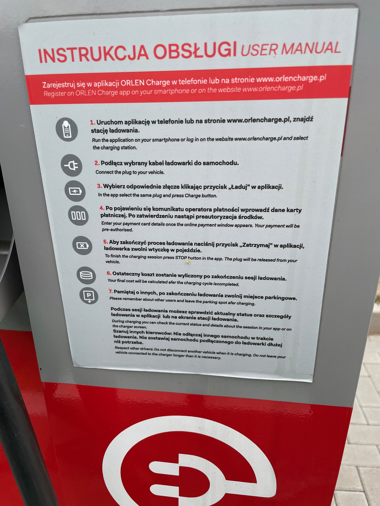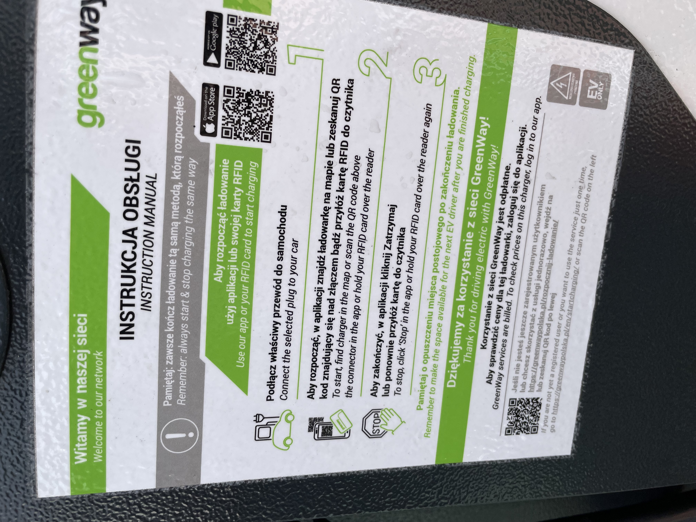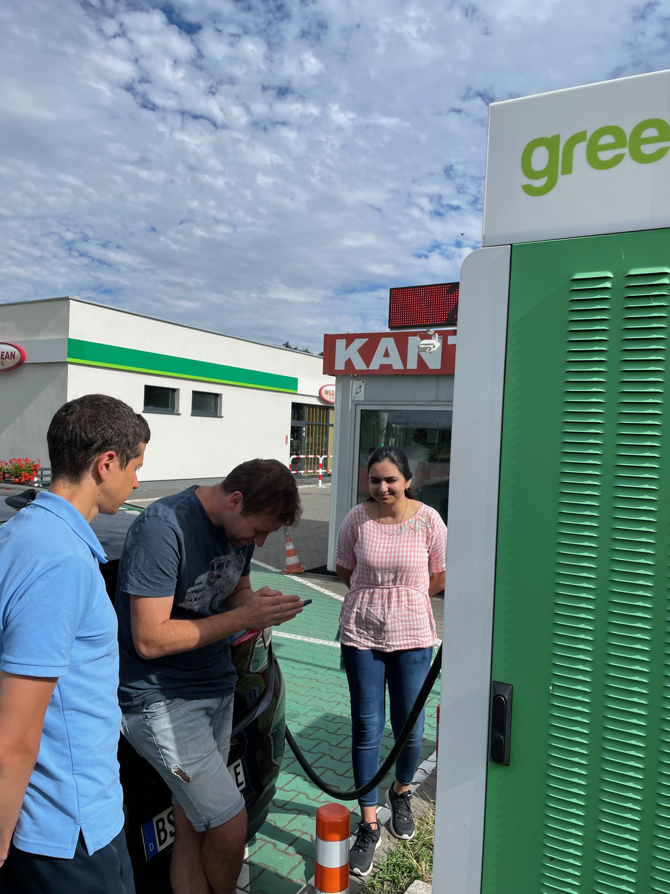 | N/A | EV UX | High | NnNot |  |
| Range anxiety before the drive | Even before the drive started we had serious doubts that stations that have been selected on the way will be there and we will actually manage to charge. Therefore we checked upfront that those stations were not the only ones in the proximity, and only after that check, we proceeded with drive.  We should always show other (alternative) charging stations if they are available in the area. Maybe we should make it clear that there are alternatives that can be reached even in worse scenario.                                                                                                                                                                                                                                                                                                                                                                                  | 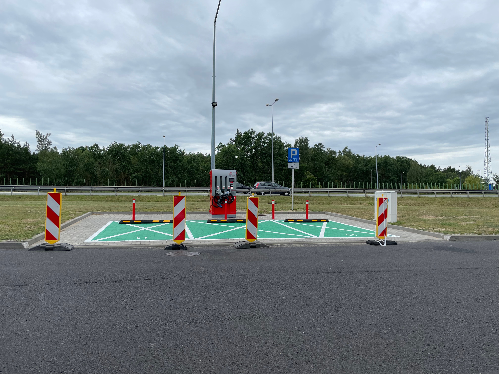 |  | EV UX | Medium |  |  |
| Range estimation | It turns out that car range estimation is highly dependant on external conditions such as passengers amount, car speed, wind, rain. Different combination of those create different ranges and in our experience calculation were all wrong. We cannot really rely on the range and assume it will be correct, but rather plan for easy change of charging stops without bothering drivers and making it transparent to avoid range anxiety.      Moreover, more conservative thresholds should be used (20% instead of 10%) in order to avoid recalculations on the way.                                                                                                                                                                                                                                                                                                                      |  |  | EV UX | High |  |  |
|  |                                                                                                                                                                                                                                                                                                                                                                                                                                                                                                                                                                                                                                                                                                                                                                                                                                                                                              |  |  |  |  |  |  |
|  |                                                                                                                                                                                                                                                                                                                                                                                                                                                                                                                                                                                                                                                                                                                                                                                                                                                                                              |  |  |  |  |  |  |

Guidance  / NK2 based
=====================

In this section we collect all issues related to Guidance based on NK2 engine.

| Issue | **Description** | **Image**                                                                                                  | **Location** | **Domain** | **Impact** | **Ticket** |
|---|---|------------------------------------------------------------------------------------------------------------|---|---|---|---|
| Duplicate of instructions | Random repetitions of instruction phases. Main instruction phase is given at 400m (correct) and then additional one at 280m (incorrect). This issue cannot be reliably reproduced, therefore the is no point in giving location. |                                                                                                            |  | NIE | Major |  |
| No Voice announcement for street names | Occasionally road name was not announced as part of the instruction. Example: "In 300m turn left towards Magdeburg" |                                                                                                            |  | NIE | Medium |  |
| Merge instruction was skipped | Occasionally, Merge instruction was not given while joining a Highway. |                                                                                                            |  | NIE | Minor |  |
| Repeated follow the road for XX km instruction | Instruction "Follow the road for XX km" was frequently repeated. Sometimes every minute. |                                                                                                            |  | NIE | Major |  |
| Next Instruction announced too early | This issue happened at various scenarios, but most prominent is taking an exit from a Highway to the connecting leaf ramp leading to another highway. In such scenario, the next (after the exit) instruction is given at the time of performing an exit from the highway.  We need to wait a bit more and make sure that the current manoeuvre is safely completed before announcing next instruction. |                                                                                                            |  | NIE | Major |  |
| ETA values changes | Sometimes ETA unexpectedly changes and the same applicable for the battery level.  eg: ETA changed from 10pm to 8pm entering Poland 6km, road A12 E30 then again changed to 9:30pm. |                                                                                                            |  | ??? | Medium | [NAV\-83381](https://tomtom.atlassian.net/browse/NAV-83381) |
| Follow the road for XXkm | Follow the road for XXkm instruction has wrong format and wrong audio instruction. Towards information was used instead of Road ID in the announcement. | 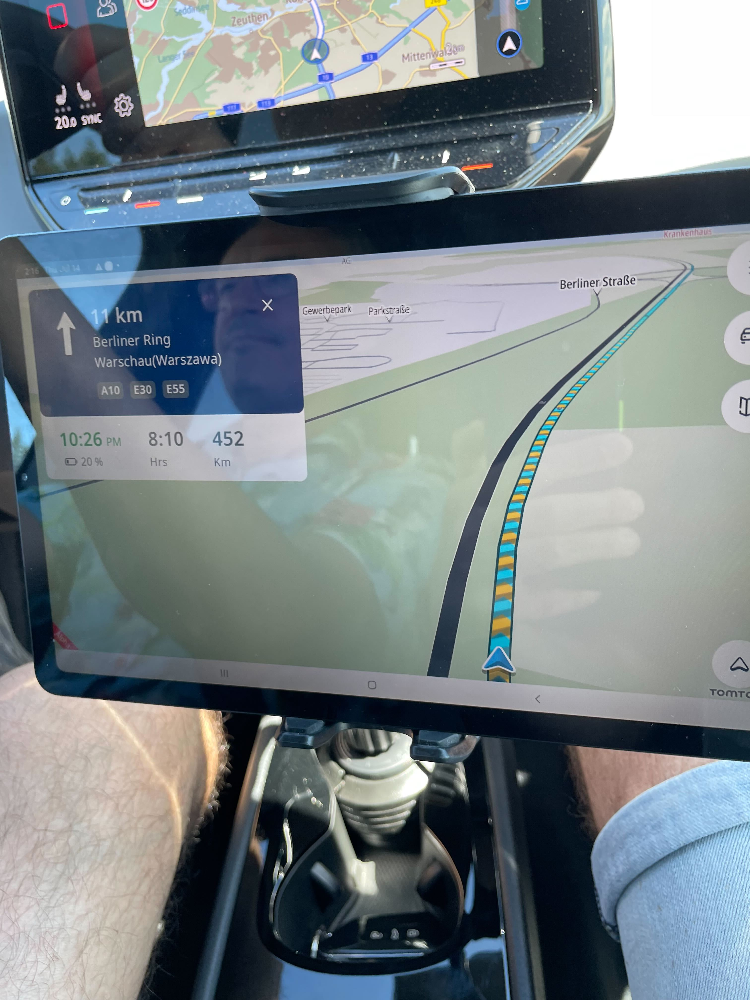                                                   |  | NIE | Major |  |
| Meaningless Lane Guidance | At certain instructions that involve LG, all lanes were highlighted. Such Lane guidance is meaningless and should not be shown at all. | 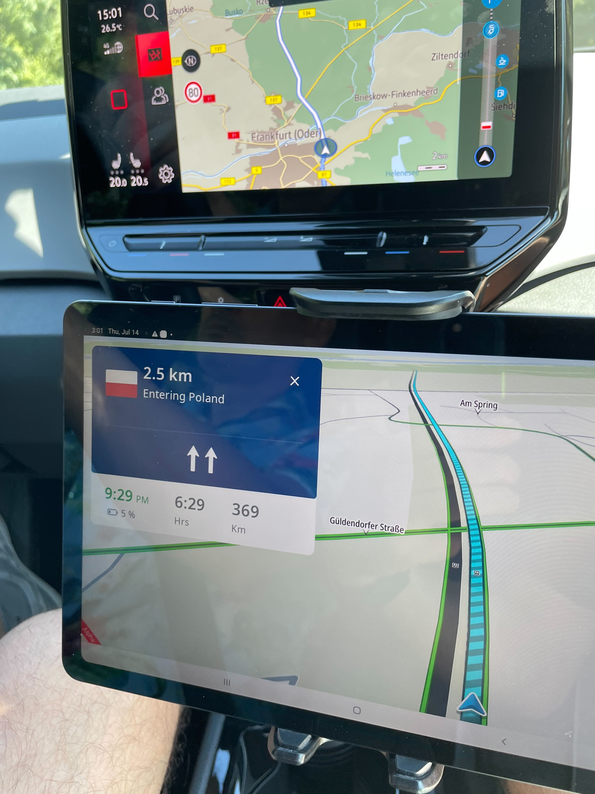                       |  | NIE | Major |  |
| App crashing | App was crashing 3 times after re\-routing. |                                                                                                            |  | ??? |  |  |
|  | Wrong instruction of keeping the straight instead of turning left/right |                                                                                                            |  | NIE |  |  |
|  | Confirmation instruction was too early before the actual turn left. |                                                                                                            |  | NIE |  |  |
|  | Missing of the fork instruction happening on the roundabout. |                                                                                                            |  | NIE |  |  |
|  | Follow voice instructions too many times and streetname shouldnt be shown instead it should be “Follow the road for x km” |                                                                                                            |  | NIE |  |  |
| Both road name orders are shown in the NIP | Some roads have two orders of names: High order and low order. In such cases we display just one based on heuristics. For urban areas we select lowest order, and for non\-urban \- highest.      In this example both Road orders are shown. | [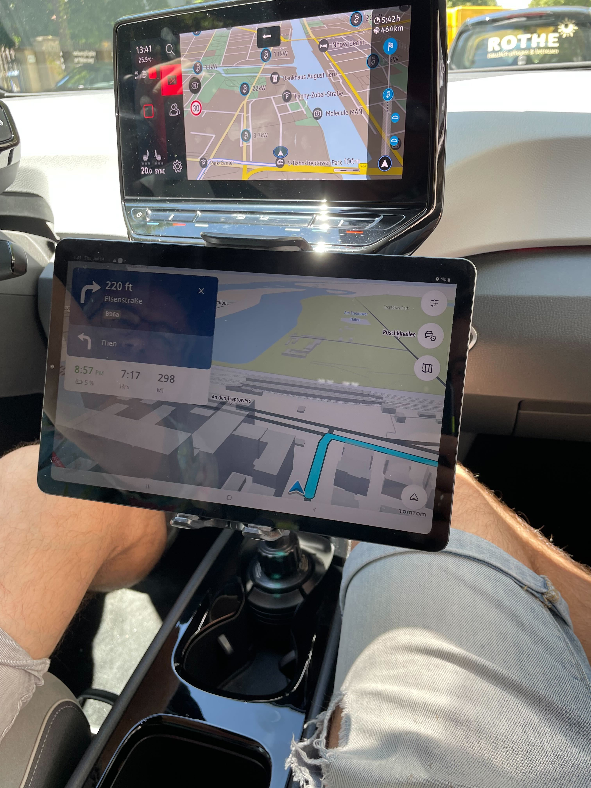](https://files.slack.com/files-pri/T0LFAG45S-F03QKD8JHMW/image_from_ios.jpg) |  |  |  |  |
| Too many Road numbers | We need to investigate why are so many road numbers together with Road name are shown here. |                                                                                |  |  |  |  |
| Towards information order | Comparing two navigation systems, it becomes apparent that our information order is not optimal. First we need to list Road Id and after that Towards information, the same order as it is announced.       NOTE: It is interesting treatment of Towards information in VW system via adding a little arrow to it. | 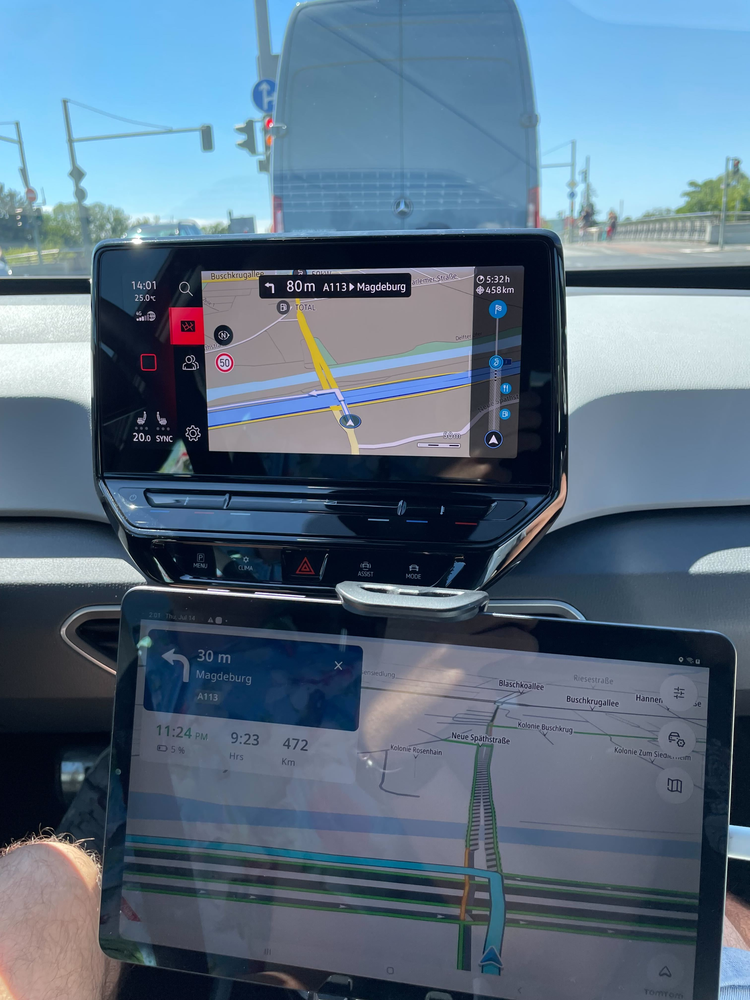                                                                               |  |  | Minor |  |
| Border Crossing | While our Border crossing instruction provided just bare info about entering another country, competitors app provided info about new driving defaults such as default speed limit in the country. | 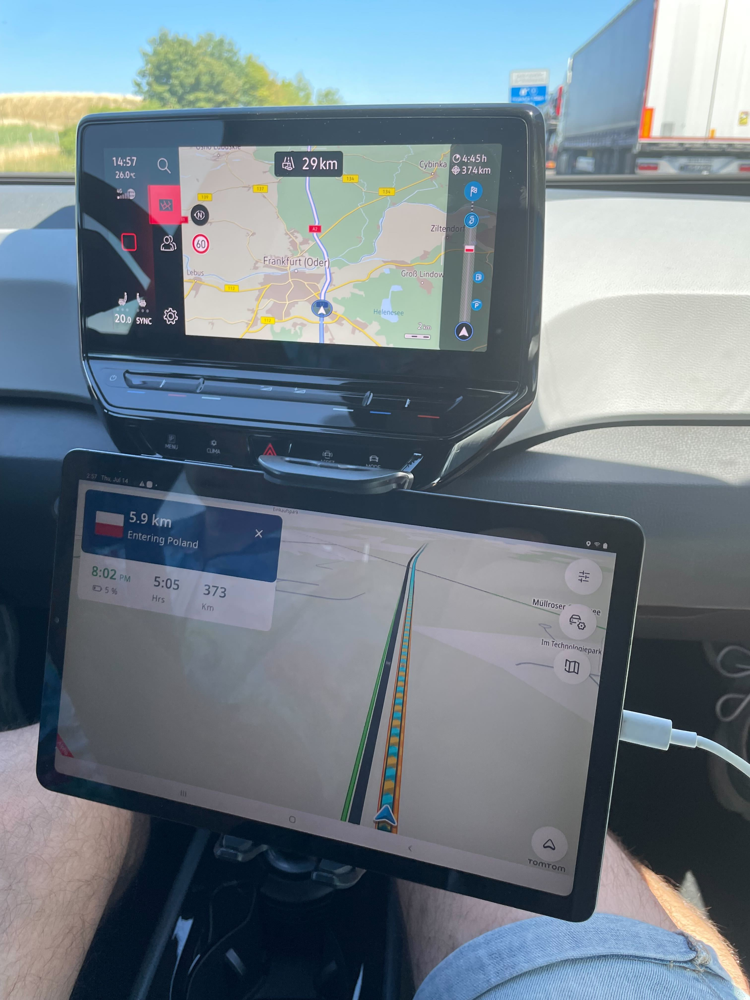                                                                               |  |  | Minor |  |
| Toll Gates LG | At the entrance to the toll gate all lanes lead to the same type of gate. The LG is meaningless in this case. |                                                                                |  |  | Minor |  |
|  |  | 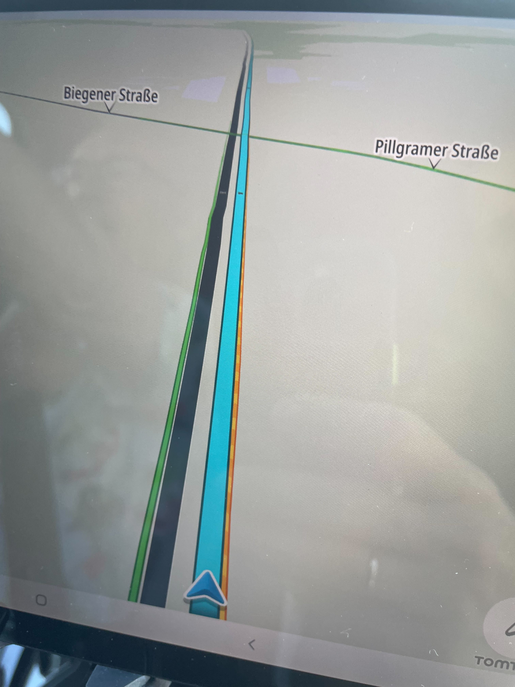                                                   |  |  |  |  |

  

Guidance / NK1 based
====================

In this section we collect all issues related Guidance based on NK engine.

| Issue | **Description** | **Image** | **Location** | **Domain** | **Impact** | **Ticket** |
|---|---|---|---|---|---|---|
| Short issue title | Detailed description of the issue | Screenshots and images related to the issue | Location of the issue if applicable | Domain of the issue (NK, UI, etc) | How important to fix the issue | Post tickets related to the issue here |
|  | Missing of the crossing border instruction Poland / Germany, Frankfurt Oder. |  |  |  |  |  |
|  | Wrong road number towards Berlin, was A2/2/E30 but the actual number A12/E30\. |  |  |  |  |  |
|  | Road towards the airport was shown and pronounced as BER, without airport ending. |  |  |  |  |  |
|  | Follow road for x km no voice instructions |  |  |  |  |  |
|  | Plan EV route changed units crashes the application |  |  |  |  |  |
|  | Passed through the tollgate without distance for voice instructions |  |  |  |  |  |

  

Overall Driving Experience
==========================

In this section we collect general issues of Driving Experience unrelated to Guidance and EV

| Issue | **Description** | **Image** | **Location** | **Domain** | **Impact** | **Ticket** |
|---|---|---|---|---|---|---|
| Map viewport optimisation | Map view was very unsatisfactory during the trip specifically on highways. In general, viewport is not optimised at all for guidance on highways and was just useless most of the time. Most noticeable issues:  ISSUE: On long stretches of highway, map was zoomed in and showed empty map all the time which was moving very fast.  SOLUTION: Map viewport is zoomed out much more and map is more tilted to show more horizon. No fast map movement.      ISSUE: During turns to the left, map was useless because NIP covers the turn.    SOLUTION: Shift map centre in order to embrace manoeuvre.  ISSUE: During the manoeuvre on intersections, the whole manoeuvre is not visible    SOLUTION: optimise map viewport to embrace the manoeuvre. |  |  |  |  |  |
| Route Comparison |  | 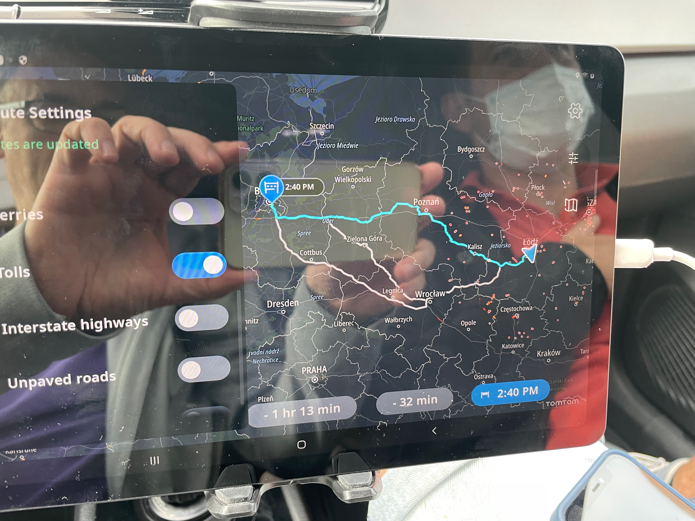 |  |  |  |  |
|  |  |  |  |  |  |  |
|  |  |  |  |  |  |  |
|  |  |  |  |  |  |  |