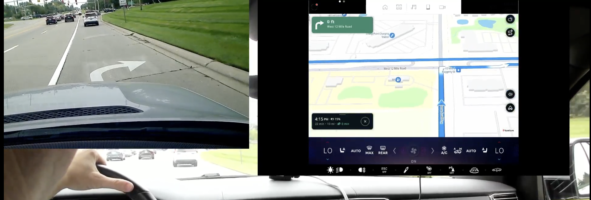
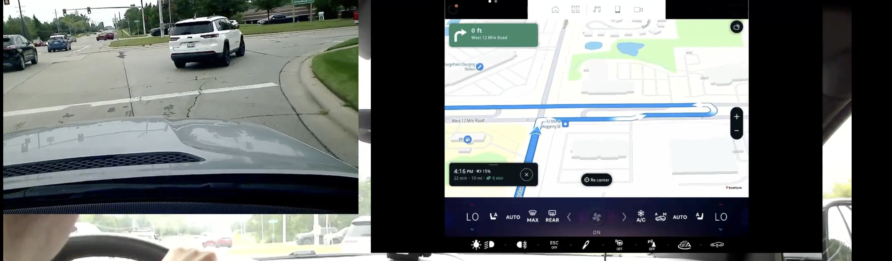
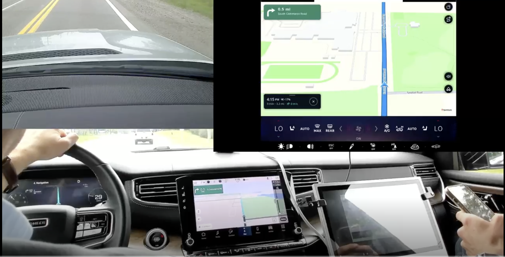
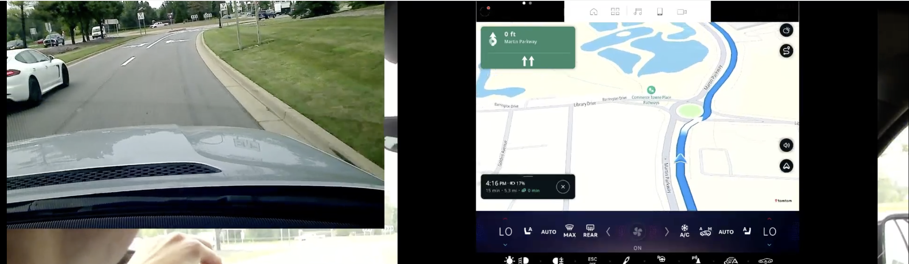
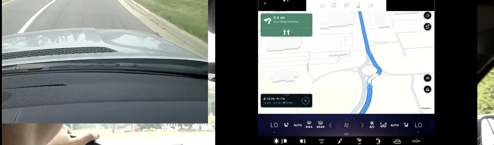
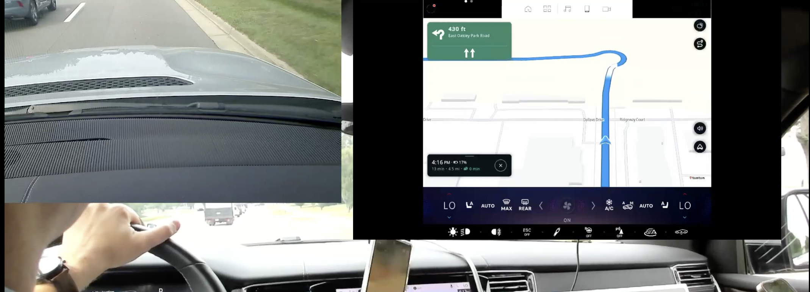
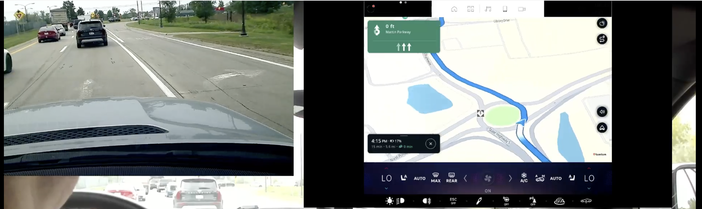

| Performed by | [Bram van der Vlist](https://tomtom.atlassian.net/wiki/people/70121:e4e15f50-31e4-489a-bfb9-2a2f762cac95?ref=confluence) [Murray Wolters](https://tomtom.atlassian.net/wiki/people/615c1d5a7a6be40071f4032e?ref=confluence) [Victoria Aliyeva](https://tomtom.atlassian.net/wiki/people/712020:e12f3e93-0315-4df3-8967-3136803ec0e1?ref=confluence) |
|---|---|
| Location | Michigan, US |

Testing system
==============

Testing system was R2 at the stage where it had a lot of integration issues. The most prominent was positioning, which was extremely unstable and erratic. This causes distance jumps in the NIP, map jumps ahead of the manoeuvre, incorrect manoeuvre to be displayed as a result, etc. We cannot really evaluate the system and make any conclusions with such positioning quality, as it messes up everything. Must be fixed first before the next testing round. Any findings from this report should be evaluated taking this in account.  

  
General issues
=================

**Audio instructions** were missing entirely - at least I didn’t hear it, maybe it was on, but could not be heard from the recording. As a result we could not evalueate the quality of audio instructions.

**Road shields** were not available globally as the feature is still not in the production stage.

**Missing/Incorrect lane data** \- as a result of this LG was absent or misleading in a lot of cases.

**Guidance Issues** - incorrect instructions implementations. It is unclear at this point if those are integration issues or rooted in Guidance engine.

**Map related** - Inadequate map viewport most of the time.

**Naming issues** - Abbreviations like Pkwy, Hwy, etc were not used.

List of Issues
==============

| **Issue**                                                                                                                                                                            | **Screen** | **Possible cause** |
|--------------------------------------------------------------------------------------------------------------------------------------------------------------------------------------|---|---|
| **Chain Instruction and SLG is missing at Michigan Left.**   Michigan left should be accomplished by chain instruction.  SLG information should be displayed in the NIP. |  | Most likely integration issue. Possibly Guidance Issue.     28 Aug 2024 Test result 42°29'45\.2"N 83°26'10\.3"W  to  42°29'45\.2"N 83°26'10\.3"W  AmiGO:   Orbis \- no lane guidance or combined instruction \- route is same as test drive      Genesis \- has lane guidance but takes a different route (It skips the first 2 possibilities to make the Michigan u\-turn on 12 mile rd)    [NAV\-156458](https://tomtom.atlassian.net/browse/NAV-156458?src=confmacro) |
| Illustration of Michigan left                                                                                                                                                        |  | [NAV\-156510](https://tomtom.atlassian.net/browse/NAV-156510?src=confmacro) |
| **Follow the road for XX km has SLG component.**   Follow the road for XX km should never have SLG component.                                                                  |  | Possibly Guidance issue  [Bram van der Vlist](https://tomtom.atlassian.net/wiki/people/70121:e4e15f50-31e4-489a-bfb9-2a2f762cac95?ref=confluence) [Murray Wolters](https://tomtom.atlassian.net/wiki/people/615c1d5a7a6be40071f4032e?ref=confluence) [Vincent Demuynck](https://tomtom.atlassian.net/wiki/people/712020:c2e160cd-68cd-4d17-a388-576e87fad80a?ref=confluence) Do we have the exact location?      [GOSDK-30485](https://tomtom.atlassian.net/browse/GOSDK-30485)  |
| **Map camera angle is inappropriate**  Compared to R1 view which provides much better view                                                                                     |  | Most likely integration issue. |
| **SLG is missing here**                                                                                                                                                              |  | Orbis \- missing data |
| **SLG is missing here**                                                                                                                                                              |  | Orbis \- missing data |
| **SLG is missing here**                                                                                                                                                              |  | Orbis \- missing data |
| **All Lanes are highlighted in SLG at a roundabout.**   All lanes should never be highlighted. If all lanes valid \- no SLG should be shown.                                           |  | Could be Guidance or integration issue. |
| **All Lanes are highlighted in SLG at a roundabout**  All lanes should never be highlighted. If all lanes valid \- no SLG should be shown.                                             |  | Could be Guidance or integration issue. |
| **All Lanes are highlighted in SLG at a roundabout**  All lanes should never be highlighted. If all lanes valid \- no SLG should be shown.                                             |  | Could be Guidance or integration issue. |
| **All Lanes are highlighted in SLG at a roundabout**  All lanes should never be highlighted. If all lanes valid \- no SLG should be shown.                                             |  | Could be Guidance or integration issue. |
| **Wrong SLG at a roundabout**                                                                                                                                                        |  | Orbis \- wrong data |
| **SLG is absent**                                                                                                                                                                    |  | Orbis \- missing data |

  

Conclusion
==========

Generally, System is not really ready for the guidance testing at this stage. In order to properly test Guidance following should happen:

1.  Positioning issue must be fixed
    
2.  Road shields deployed
    
3.  Audio enabled
    

  
Despite this, we can still observe some, unrelated to positioning Guidance issues, that can be split in:

**Orbis data problems** - this is a major issue that has following implications:  
Misleading and contradicting instruction when SLG data is incorrect.  
Absence of lane guidance when data is missing.  
Inconsistency between scenarios when LG data is present and when not.  
  
Given the amount of issues of this type, current state is absolutely not acceptable by any standards and cannot be released.  

**Guidance bugs** - most of those have been reported and fixed in the past. We need to investigate why those appear again. Bugs observed are quite serious, and also must be fixed.