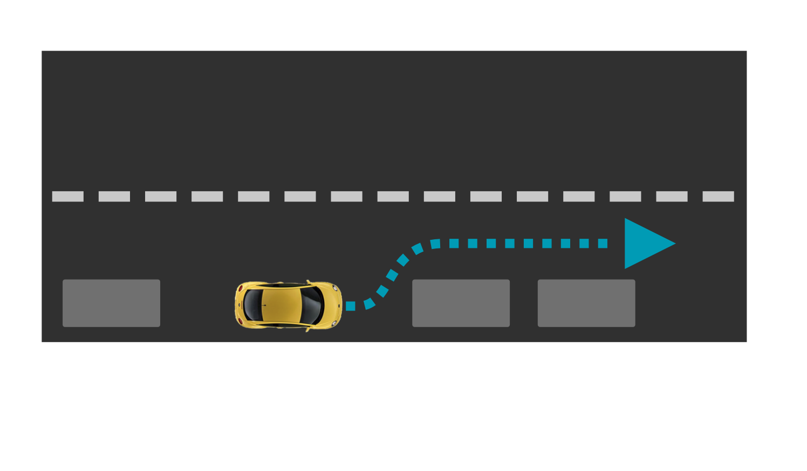
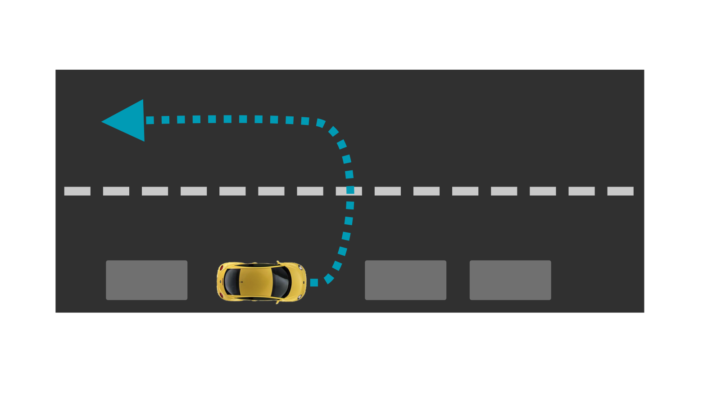
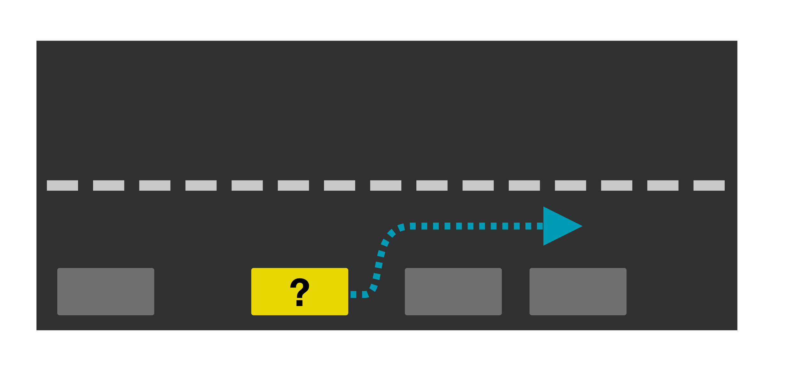
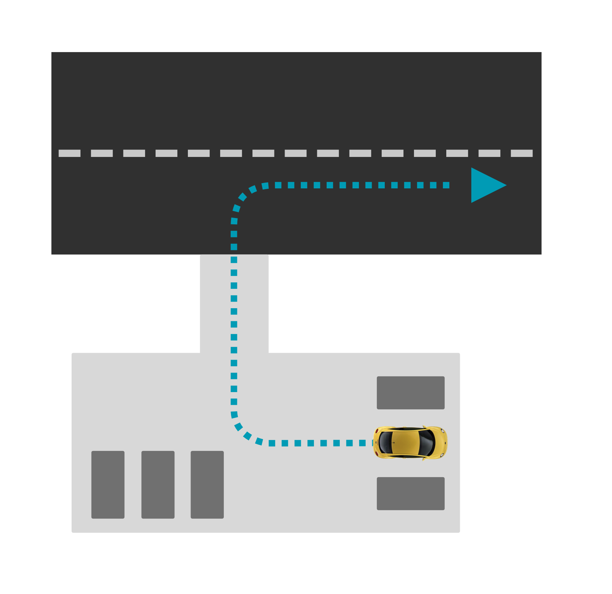

| **Interaction Designer** | [Alexey Opokin](https://tomtom.atlassian.net/wiki/people/70121:e8cb7861-9079-4b92-b96d-bfe8cd882680?ref=confluence) |
|---|---|
| **Visual Designer** | [Georgios Koultouridis](https://tomtom.atlassian.net/wiki/people/5be2fd44649a737c2342afbe?ref=confluence) |
| PM | [Joost Pennings](https://tomtom.atlassian.net/wiki/people/712020:a6d50cb1-97be-4a9a-a279-3fbb3e2e1799?ref=confluence) |

  

Introduction
============

The start of the guidance session is accomplished by Departure instruction. The instruction serves two goals: first - indicating to the driver the start of the guidance session, and second - providing a direction of initial movement. If the navigation system knows the initial car heading, the departure instruction could be more informative. This design covers various scenarios and provides departure instructions for all of them. 

  

Initial Conditions
==================

Vehicle can be parked under under following conditions:

1.  Car is parked on the road which is registered on the map.
2.  Car is parked outside of registered road - at the parking lot or in the field
3.  Car is parked in underground garage. GPS position is unknown.

On top of this there are two possible states of car initial heading:

1.  Car's heading is unknown.
2.  Car's heading is known.

Different combination of those factors dictate the following possible scenarios

  

  

Scenarios
=========

There are multiple possible scenarios involving different car initial position in relation to the first road segment which is recognised by the map. 

Departure instructions we use a different structure because there is no distance involved. Departure instruction must be performed right now.

  

Scenario-1
----------

Car is parked along the road, which is registered by the map. Initial car Heading Direction is known and it is aligned with the planned route.

| **Illustration** |  |
|---|---|
| **Notes** | This is a happiest scenario. In this case simple Instruction to start driving is sufficient. |
| **End of Instruction** | The instruction should be replaced with next instruction after stable car heading based on motion is established \- roughly 3sec of movement to the right direction. If car is moving in the wrong direction, appropriate instruction should be used. |
| **Audio Instruction** | Start driving on Richard\-Strauss\-Straße |
| **Audio Instruction template** | **\[action] \[road name/number]** |
| **NIP** |  |

  

  

  

Scenario-2
----------

Car is parked along the road, which is registered by the map. Initial Car Heading Direction is known and it is opposite to the planned route. Road doesn't have solid separation line which prohibits driving in the opposite direction.

| **Illustration** |                                                                                                                                                                                                                                                                                                                                                                                                                                           |
|---|--------------------------------------------------------------------------------------------------------------------------------------------------------------------------------------------------------------------------------------------------------------------------------------------------------------------------------------------------------------------------------------------------------------------------------------------------------------------|
| **Notes** | Car need to be guided into opposite direction from current heading, however it is unclear if making U\-Turn is possible or safe at this point. The street could be too narrow or opposite car stream could make it too dangerous.  NOTE: We should guide drivers to make U\-turn only if there is significant time advantage in doing so. That means "time penalty" should be applied to this instruction. Otherwise we should proceed with Scenario 1 solution. |
| **End of instruction** | The instruction should be replaced with next instruction after stable car heading based on motion is established \- roughly 3sec of movement to the right direction. If car is moving in the wrong direction, appropriate instruction should be used.                                                                                                                                                                                                              |
| **Audio Instruction** | Turn around on Richard\-Strauss\-Straße when possible.                                                                                                                                                                                                                                                                                                                                                                                                             |
| **Audio Instruction template** | **\[action] \[road name/number]**                                                                                                                                                                                                                                                                                                                                                                                                                                  |
| **NIP** |                                                                                                                                                                                                                                                                                                                                                                                                                                           |

  

  

Scenario-3
----------

Car is parked along the road, which is recognised by the map. Initial Car Heading Direction is unknown.

| **Illustration** |  |
|---|---|
| **Notes** | The only indication of the direction of driving in such case could be absolute direction (North, South, West, East, North\-East, South\-West, etc.). Manoeuvre arrow should reflect the cardinal direction.    NOTE: Even though cardinal directions are not universally used in all areas, they will provide value for some (direction aware) drivers. |
| **End of Instruction** | The instruction should be replaced with next instruction after stable car heading based on motion is established \- roughly 3sec of movement to the right direction. If car is moving in the wrong direction, appropriate instruction should be used. |
| **Audio Instruction** | Head South\-East on Richard\-Strauss\-Straße |
| **Audio Instruction template** | **\[action] \[direction] \[road name/number]** |
| **NIP** |  |

  

  

  

  

  

  

Scenario-5
----------

Car is parked in the area that is not covered by the road network. From map perspective this is a field without roads - it could be a parking lot not registered on the map or private house garage. In order to start guidance vehicle must first be brought to the closest road.

| **Illustration** |  |
|---|---|
| **Notes** | Visual instruction in the NIP consists of two elements: Cardinal direction pointing to the closest road point along the straight line, and dynamic arrow pointing to the same direction. This functionality is based on the compass data. As vehicle starts to move, the arrow keeps the direction to the target point reacting in real time. |
| **End of Instruction** | The instruction should be replaced with next instruction after reading the point where meaningful next instruction can be provided. |
| **Audio Instruction** | Head South\-West towards Richard\-Strauss\-Straße |
| **Audio Instruction template** | **\[action] \[road name/number]** |
| **NIP** |  |

  

  

  

  

  

Strings
=======

Start driving towards (Road ID)

Head (Cardinal direction) towards (road ID).