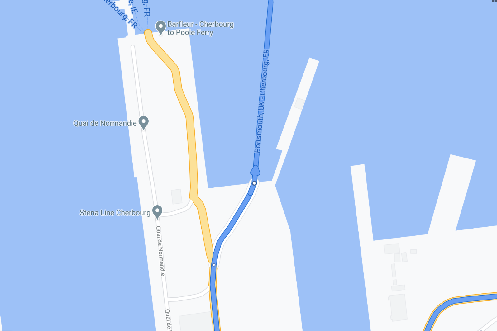
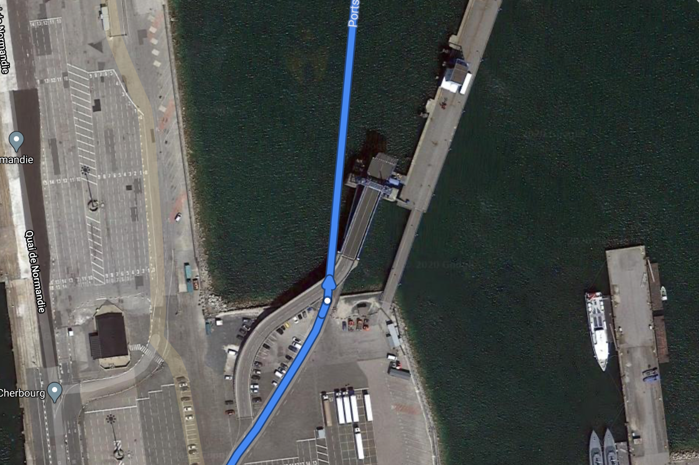
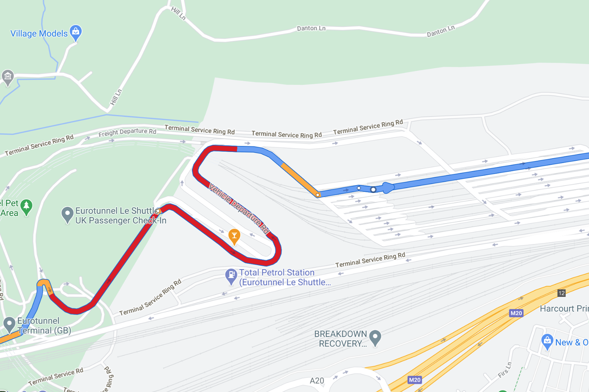
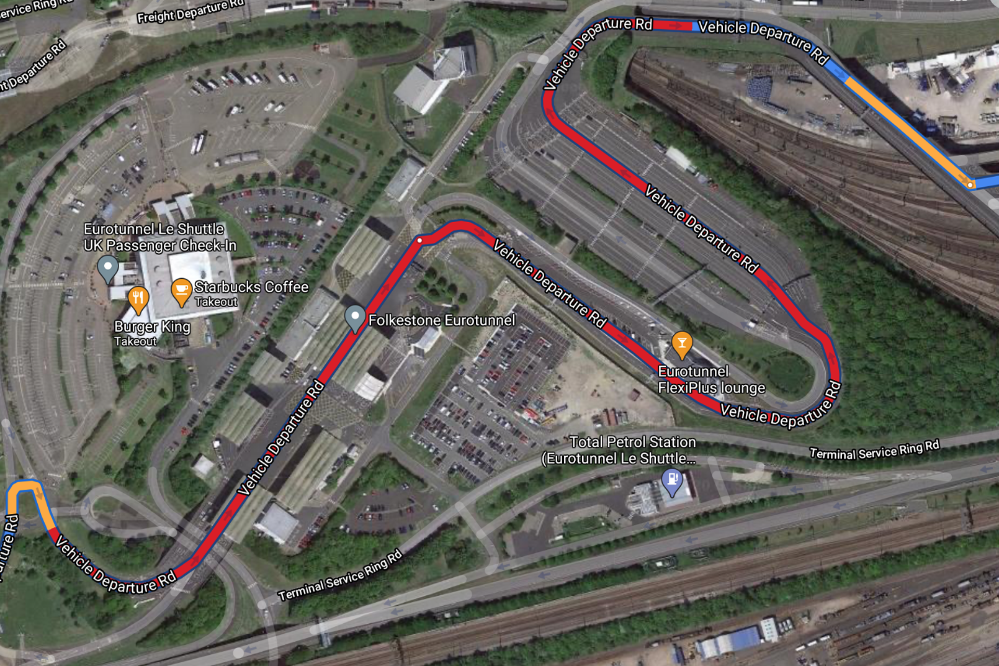

| **Interaction Designer** | [Alexey Opokin](https://tomtom.atlassian.net/wiki/people/70121:e8cb7861-9079-4b92-b96d-bfe8cd882680?ref=confluence) |
|---|---|
| **Visual Designer** | [Georgios Koultouridis](https://tomtom.atlassian.net/wiki/people/5be2fd44649a737c2342afbe?ref=confluence) |
| **PM** | [Joost Pennings](https://tomtom.atlassian.net/wiki/people/712020:a6d50cb1-97be-4a9a-a279-3fbb3e2e1799?ref=confluence) |
| **ENG OWNER** | TBD |

  
  
Introduction
==================

Following Instruction are covering special cases of out of the car transportations. Those are Ferry and Car-Train connections.

Take Ferry Connection
---------------------

This Instruction is given on Ferry terminals before entering a Ferry and on leaving the Ferry on the other side.

| **Instruction** | Take Ferry Connection                                                                                                                                                           |  |
|---|---------------------------------------------------------------------------------------------------------------------------------------------------------------------------------|---|
| **Location** | [Location URL](https://www.google.de/maps/dir/49.633649,-1.5895337/50.7787073,-1.8769172/@49.646823,-1.6129346,17z/am=t/data=!4m6!4m5!3e0!6m3!1i0!2i2!3i0?hl=en&amp;authuser=0) |  |
| **Road Geometry** |                                                                                                                                                        |  |
| **Visual Instruction** |                                                                                                                                                        |  |
| **Audio Instruction** | In 600m **Take the ferry**  Portsmouth \- Cherbourg                                                                                                                             |  |
| **Audio Instruction template** | **\[distance] \[action] \[Name of the ferry]**                                                                                                                                  |  |
| **Notes** | This Instruction is given on approaching ferry connection.  Name of the ferry is formatted as:      **\[Starting location]**                                                    |  |

| \- \[destination]  In case Ferry connection crosses country border, appropriate message should be added at the Instruction: **Entering \[country name]. **During travelling on Ferry, "Leave the ferry" instruction should be shown on NIP. No audio instruction is required. ### Missing data In NDS map ferry connection is identified as **\[starting location] \[destination]** of the ferry. We assume that this is how Ferry identified in reality, but it requires validation.  ### Missing data We don't know if the actual manoeuvre point is located in relation to the actual ferry.  Depending where this point is located we might not need confirmation instruction. To be refined in the future. |  |
|----------------------------------------------------------------------------------------------------------------------------------------------------------------------------------------------------------------------------------------------------------------------------------------------------------------------------------------------------------------------------------------------------------------------------------------------------------------------------------------------------------------------------------------------------------------------------------------------------------------------------------------------------------------------------------------------------------|---|

Take Car Train Connection
-------------------------

This Instruction is given on Car Train terminals before entering a Car Train.

| **Instruction** | Take Car train Connection                                                                                                                                                                                                                                                                                                                                                                                                                                                                                                                                                                                                                   |  |
|---|---------------------------------------------------------------------------------------------------------------------------------------------------------------------------------------------------------------------------------------------------------------------------------------------------------------------------------------------------------------------------------------------------------------------------------------------------------------------------------------------------------------------------------------------------------------------------------------------------------------------------------------------|---|
| **Location** | [Location URL](https://www.google.de/maps/dir/51.2722045,0.9818408/50.9272542,2.0063159/@51.095486,1.1238671,15.7z/am=t/data=!4m2!4m1!3e0?hl=en&amp;authuser=0)                                                                                                                                                                                                                                                                                                                                                                                                                                                                             |  |
| **Road Geometry** |                                                                                                                                                                                                                                                                                                                                                                                                                                                                                                                                                                                                                    |  |
| **Visual Instruction** |                                                                                                                                                                                                                                                                                                                                                                                                                                                                                                                                                                                                                    |  |
| **Audio Instruction** | In 600m Take the Eurostar train to Coquelles                                                                                                                                                                                                                                                                                                                                                                                                                                                                                                                                                                                                |  |
| **Audio Instruction template** | **\[distance] \[action] \[Train name] \[Train destination]**                                                                                                                                                                                                                                                                                                                                                                                                                                                                                                                                                                                |  |
| **Notes** | This Instruction is given on approaching Car Train Connection. Name of the train is formatted as     **\[Train name]** **\[Train destination]**   During travelling by train, "Leave the train" instruction should be shown in NIP. No audio instruction is required.  ### Missing data In NDS map train connection is identified as **\[destination]** of the train. We assume that this is how train identified in reality, but it requires validation.   ### Missing data We dont know if actual manoeuvre point is located in relation to actual train.  Depending wher this point is located we might not need confirmation instruction. |  |