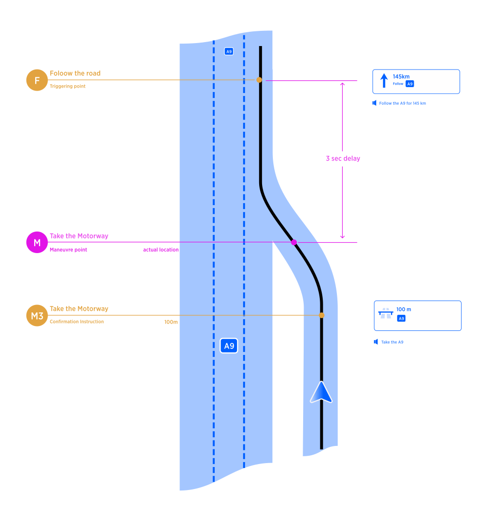

| **Interaction Designer** | [Alexey Opokin](https://tomtom.atlassian.net/wiki/people/70121:e8cb7861-9079-4b92-b96d-bfe8cd882680?ref=confluence) |
|---|---|
| **Visual Designer** | [Georgios Koultouridis](https://tomtom.atlassian.net/wiki/people/5be2fd44649a737c2342afbe?ref=confluence) |
| **PM** | [Joost Pennings](https://tomtom.atlassian.net/wiki/people/712020:a6d50cb1-97be-4a9a-a279-3fbb3e2e1799?ref=confluence) |
| **ENG OWNER** | [User d987e](https://tomtom.atlassian.net/wiki/people/712020:9a48e539-50aa-491e-acff-bfff512d987e?ref=confluence) |

Motivation
==========

Follow the road instruction is given on a long stretch of a route which doesn't have any manoeuvres and only action required is to continue following current road without deviations. The instruction is intended to **provide the driver with the peace of mind**, ensuring him that for the next long stretch he does not need to pay attention to navigation and can relax and listen to the music or have conversation with the passenger. Unlike any other instruction it doesn't instruct to do anything but the opposite - to take a brake from navigation.

Design Intention
================

By this design we want to achieve following outcome:

**Inform the driver every time he enters significantly long road segment that he has to drive uninterrupted for XX km.**

Triggering point
================

Follow the road instruction is triggered after taking any manoeuvre (most often Merge manoeuvre, as long stretches mostly happen on Motorways) after which there is a significantly long uninterrupted by instruction driving section. To ensure the instruction is not interrupting current Merge manoeuvre, we use **3 sec time-out** between teh end of the merge and follow the road instruction. Following diagram (read from bottom to top) depicts the exact location of the triggering point:

Conditions for Instruction
==========================

Follow the road instruction can be triggered in two ways depending on the conditions.

1.  Visual and Audio instructions together
    
2.  Just Audio instruction, while prepare phase is shown in the NIP.
    

Visual and Audio instruction triggering - uninterrupted phase scenario
----------------------------------------------------------------------

Instruction is triggered under the following condition: Distance between current position and next _**interrupting**_ instruction is greater then:

| **Urban (Non\-Motorways)** | **Motorways** | **Rest** |
|---|---|---|
| 3000m | 6000m | 4000m |

Those values correspond to **prepare phase** - silent phase of the instruction. In other words Follow the road is triggered **before prepare phase**. See the **Instruction triggering logic** pages for more details.

Not all instructions considered _**interrupting**_ though. There are some instruction that can be generated during long stretch of the road that don't affect the road path anyhow. Those are:

**Border crossings** - if the road class doesn't change

**Interim Exits** - always.

**Forks** - if the route path stays on the same road after the fork.

**Enter / Exit HOV** - if road doesn't change.

Mentioned instruction types should be ignored and stretch of the road considered **uninterrupted**.

###   
  
Distance

Distance displayed in the NIP refers to the distance till the next _**interrupting**_ manoeuvre, even though the manoeuvre itself is not (yet) shown. That means during this sections multiple _**uninterrupting**_ instructions could be executed.

Just Audio Triggering - Interrupted phase scenario
--------------------------------------------------

It could happen in **interrupted phase** scenario that motorway segment is joined at prepare phase (of next instruction), therefore next instruction NIP visual instruction should be already shown. At this point Follow the road audio instruction should be announced as audio only.

Audio Announcements
===================

Follow the road instruction can have following variation in audio announcements depending on the scenario.

| **Scenario** | **Road Identity** | **Audio Announcement** |
|---|---|---|
| Uninterrupted road identity | Road number (A100\) | Follow the A100 for … |
| Uninterrupted road identity | Road number (A100\) and Road Name (Berliner Ring) | Follow the A100 for … |
| Interrupted road identity | Whatever | Follow the course of the road for … |

Interrupted Road Identity
=========================

There are situation when **roads identity** (road name/number) changes during the stretch of _**follow the road**_ instruction. There is no manoeuvre at the change point therefore no instruction is required, however changing current road name could create a confusion for a driver. The original intention of this instruction type is communication the _**no action zone**_ to the driver. In other words, during this instruction range driver can relax and shift his attention from guidance instruction. Changing road name should not be important to the driver in this scenario. However, instruction format uses road name, and if the road name changes we cannot use it as intended. For that reason, we conclude following. If road identity changes during the span of the instruction, we:

1.  Visual instruction (NIP) would reflect the current road name and it will change if road name changes, silently.
    
2.  At the point of road name change no special audio instruction is announced, however reference to road name in the NIP must be silently updated.
    

Feedback
========

People react on instructions differently. Here I’d like to collect the feedback that was given to this design.

|  | **Feedback** | **Design comments** |
|---|---|---|
|  | For me the opposite happens (from giving peace of mind). The straight\-on NIP hides what will come next, making me more anxious. For example, deciding whether to over take someone depends on how close you are to the exit. With the SONIP this decision becomes more difficult. |  |
|  | I’d prefer to see what happen next even if it is far away, lets say 30km, however if it is 300km i’d prefer to have follow the road instruction. |  |
|  | Even for shorter distances (2\-5km) follow the road in some form (audio only) is useful. |  |