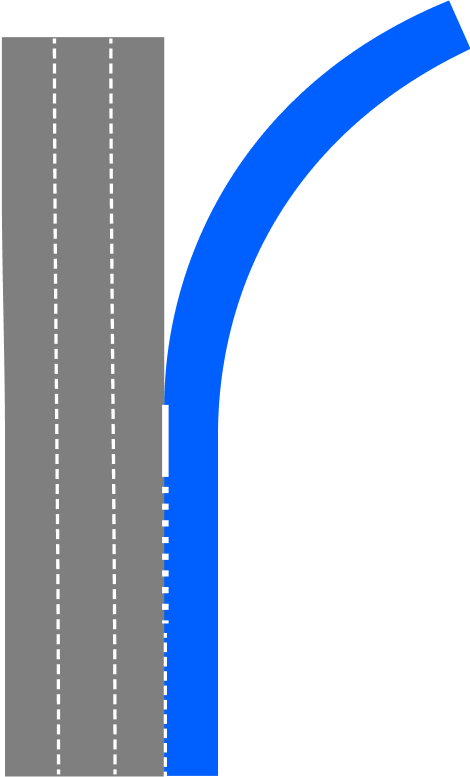
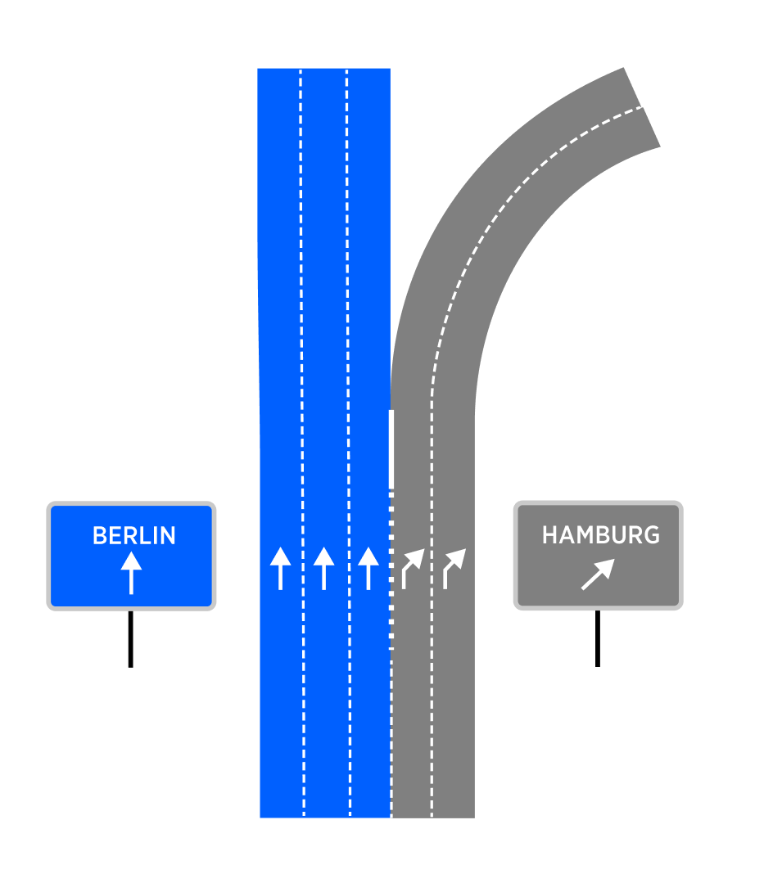
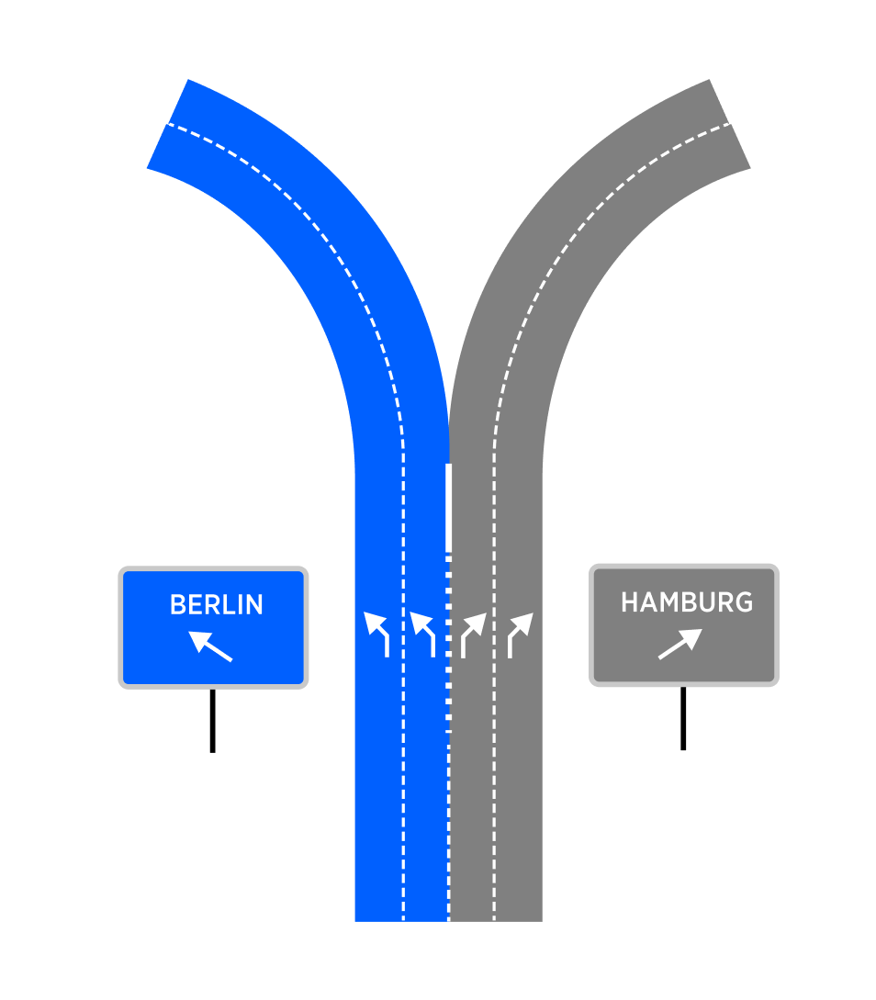

| **Interaction Designer** | [Alexey Opokin](https://tomtom.atlassian.net/wiki/people/70121:e8cb7861-9079-4b92-b96d-bfe8cd882680?ref=confluence) |
|---|---|
| **Visual Designer** | [Georgios Koultouridis](https://tomtom.atlassian.net/wiki/people/5be2fd44649a737c2342afbe?ref=confluence) |
| **PM** | [Joost Pennings](https://tomtom.atlassian.net/wiki/people/712020:a6d50cb1-97be-4a9a-a279-3fbb3e2e1799?ref=confluence) |

**Furcations - Exits, Bifurcations, Trifurcations**
===================================================

**Furcation** - is an intersection type where the road splits without interrupting the traffic flow. Furcation is a split in the roadway where one or more lanes of traffic diverge, forming separate roadways that continue in different directions. A Furcation in the road can occur at any point, and it is typically marked with signs or other markers to help drivers navigate the split. Found primarily on [**Motorways**](./Motorways/Motorways.md), but they can also be found on lower road classes that share some properties with Motorways. (Those properties are: **Uninterrupted traffic flow** at the point of the manoeuvre, **Curved road geometry** designed for fast manoeuvre performance). 

**Bifurcation**  - is a Furcation with two outgoing roads. 

**Trifurcation**   - is a Furcation with three outgoing roads.

**Furcations** are intersection types which don't interrupt traffic flow.

**Exit** is a type of the Furcation and refers to the points at which drivers can leave a higher road class and enter onto a lower road class roadway. Exits are typically marked with signs that indicate exit number the name of the road or destination that can be reached by taking the exit. Some exits may also have ramps or other specialized features to help drivers safely merge onto the new roadway.

Here are some properties of each mentioned here intersection type.

**Uninterrupted flow.**   
Furcations are uninterrupted (NO traffic lights, yield signs or yield traffic rules) intersections. Vehicle can continue its path through either of the branches uninterrupted. This is unlike turns (any kind) which could have interruptions. However it is not a single defining factor differentiating Furcations from Turns (specifically Bear turns). Bear turns can share exactly the same properties.

**Motorways**  
Turn instructions cannot be used on motorways. Furcation instructions can be used on both motorways and below.

**Ange of turn and turn curvature,**  
Typically Furcations are optimised for high speed manoeuvring, unlike turns. That translates into a shallower angles of splits and/or bigger radius of curvature of the turn. However it is not a single defining factor differentiating Furcations from Turns (specifically Bear turns). Bear turns can share exactly the same properties.

**Multi-lane environment**  
Furcations are only used in multi-lane environments, where more then one lane is present before the intersection. For single lane roads that split we use _**bear**_ type of turn instruction.

**Presence of Signposts**  
All mentioned intersection types must be supported by signposts.

  
  
**Exits**
===============

There are two major types of exits that is worth to distinguish, since they require different treatment.

| **Exit Type**|**Schematic diagram**|**Attributes**|**Notes**|
| --- | --- | --- | --- |
|**Detached Exit** Exit lanes appear at short distance before the exit.|  |Signpost indication for exit direction only.  exit lanes appear &lt; 700m before the exit.|This is a most frequently used type of exit|
|**Split Exit** Exit lanes split up from the main road long distance before the exit|  |Signpost indication for both directions.  Exit lane splits up from the main road &gt; 700m before the exit.|This type of exit is not possible to safely distinguish from bifurcation in all cases. Helping factor could be a ratio between straight going lanes vs exit lanes and signpost information.  |

Exit Instruction design
-----------------------

Exit instruction design is covered in this section: [Exit instructions](./Exit%20Instructions/Exit_Instructions.md)

**Bifurcations**
================

Bifurcation intersections design varies greatly depending on the complexity of the split. Hre are some typical examples:

| **Furcation Type** | **Schematic diagram** | **Attributes** | **Notes** |
|---|---|---|---|
| Main road continues |  | Often, departing branch is indicated by exiting (angled) arrows  Often, continuing branch is indicated by straight arrows | This type of bifurcation happens when one of outgoing branches has the same road ID as the incoming path.    Directional arrows indication is manifested in the signpost and/or on the surface of the road. This data might be or might be not available in the map.  NOTE: Directional arrows might not be available for small lane count bifurcations. |
| Equal split |  | Typically, both branches indicated by exiting (angled) arrows. | This type of bifurcation happens when both of outgoing branches have different road IDs from the incoming path.  Directional arrows indication is manifested in the signpost and/or on the surface of the road. This data might be or might be not available in the map.  NOTE: Directional arrows might not be available for small lane count bifurcations. |

Bifurcation Instruction design
------------------------------

Bifurcation instruction design is covered in this section: [Bifurcation Instructions](./Bifurcation%20Instructions/Bifurcation_Instructions.md)

**How to differentiate between Bifurcations and Exits?**
========================================================


_**Detached exit**_ type can be clearly distinguished from bifurcations due to its unique lane configuration. The same cannot be said for _**Split exits**_. The table below list various attributes helping to identify Bifurcations an exits.

| **ID** | **Attribute** | **Verdict** | **Sufficient for the decision?** | **Notes** |
|---|---|---|---|---|
| 1 | Signpost presence | Exit / Bifurcation | \- | Bifurcations trifurcations and  Exits, **must be accomplished by Signposts**, which indicate various attributes, such as Exit number, Directional ID (road Number or Name), Towards ID (Location or road name).
 Without signposts we cannot |
| 2 | Exit number is present in the signpost | Exit | Yes | Exits are marked by ***Exit Number*** in the Signpost, but this rule is not universal in every region. For regions where it is in place, it can be used as sufficient indicator of exit. |
| 3 | Detached type of exit | Exit | Yes | ***Detached*** types of***Exits,*** exiting lane splits from the main road via dedicated Exit ramp which starts a short distance (700m) before the exit itself. |
| 4 | Split type of exit | Exit / Bifurcation | No | For ***Split Exits***, exiting branch splits from the most right lane (s) which doesn't appear before the exit, but rather was present all the time. (Fig. B)
. In this case splitting lane is indicated by a special (thicker) lane divider line. |
| 5 | Signpost is only indicating exiting direction and not the alternative | Exit | No | This attribute alone is NOT sufficient for safe detection of exit. Depending on regions this rule might be not consistent. |
| 6 | Signpost indicates both branches directions | Bifurcation | No | This attribute alone is NOT sufficient for safe detection of exit. Depending on regions this rule might be not consistent. |
| 7 | *Transition codes* | Bifurcation | Yes | *Transition codes* (when present) can be used for safely identify Bifurcations. |

**CONCLUSION**  
**Split types** of exits are indistinguishable from **bifurcations** generally, but given the fact that Exits are much more common Motorway intersection type, and Furcations are quite rare, we should decide for Exit type in case the choice cannot be made based on available attributes.

**Trifurcations**
=================

| **Schematic diagram** |  | **Attributes** | **Notes** |
|---|---|---|---|
|  |  | Three outgoing branches from the same intersection point  Signposts for all three directions |  |

Trifurcation Instruction design
-------------------------------

Trifurcation instruction design is covered in this section: [Trifurcations](./Trifurcations/Trifurcations.md)

**\- END OF DOCUMENT -**
========================