| **Interaction Designer** | [Alexey Opokin](https://tomtom.atlassian.net/wiki/people/70121:e8cb7861-9079-4b92-b96d-bfe8cd882680?ref=confluence) |
|---|---|
| **Visual Designer** | [Georgios Koultouridis](https://tomtom.atlassian.net/wiki/people/5be2fd44649a737c2342afbe?ref=confluence) |
| PM | [Joost Pennings](https://tomtom.atlassian.net/wiki/people/712020:a6d50cb1-97be-4a9a-a279-3fbb3e2e1799?ref=confluence) |

  

Table of Contents
=================

*   [Table of Contents](#Table-of-Contents)
*   [Introduction](#Introduction)
    *   [Visual Instruction](#Visual-Instruction)
*   [Where and how Lane Guidance direction is displayed?](#Where-and-how-Lane-Guidance-direction-is-displayed)
*   [Capturing fork geometry](#Capturing-fork-geometry)
    *   [Driver's perspective](#Drivers-perspective)

  

  

**Introduction**
================

Lane directions are used for drawing correct Lane Guidance arrows in the NIP, and for selcting correct Maneuvre arrow. We need to achieve that LG arrows in the NIP correspond to natural road geometry of the split and/or drawn on the road directional arrows.

### Visual Instruction

| **NIP** | **Signpost** | **Road Geometry** |
|---|---|---|
| 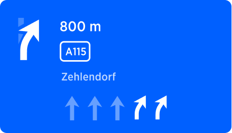 | 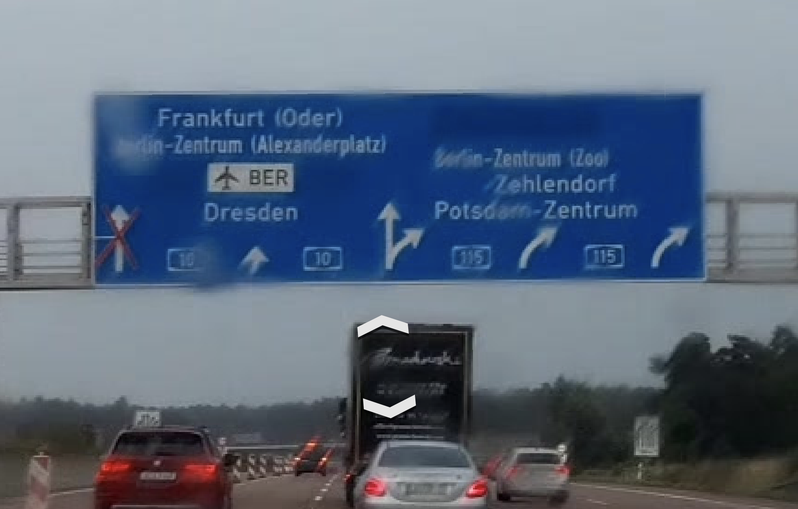 | 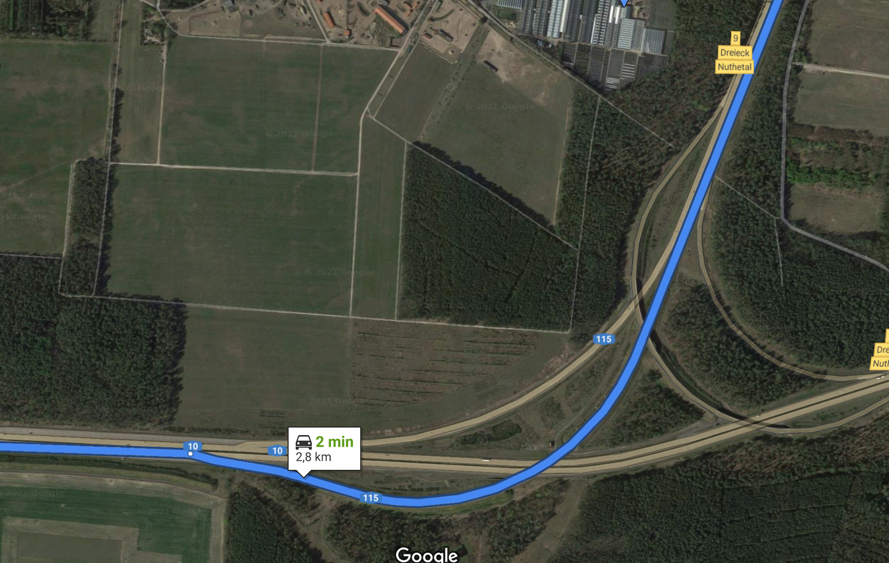 |

  

  

The question we want o answer on this page is: **How could we determine proper directions for LG arrows?**   
This question is only **relevant for forks instruction** as for exits and turns directions are obvious. Unfortunately, lane directions shown on the real signpost are not available in NDS map (what about Orbis?) which leaves us with some heuristic methods of calculating it. This information could be captured from two sources:  
  
**Drawn Arrows Data**
  
Arrows are often drawn on the asphalt of the road and this information is available in NDS map. (What about Orbis?)


  
**Angle gathered from arcs geometry**  

Angles could be captured from the natural geometry of the road split. This is more challenging task as it is not straightforward how to calculate those.  
  
  
Following section describe how each of these methods work and how they translate into Lane Guidance arrows.

Where and how Lane Guidance direction is displayed?
===================================================

Directions are used at the moment only for SLG - simple lane guidance. Potentially it could be used for customised maneuvre arrow - that would reflect the manoeuvre more close to reality. However, this is not in the product currently and can be only considered in the future.  Here are following possible states for each individual LG arrow.

  

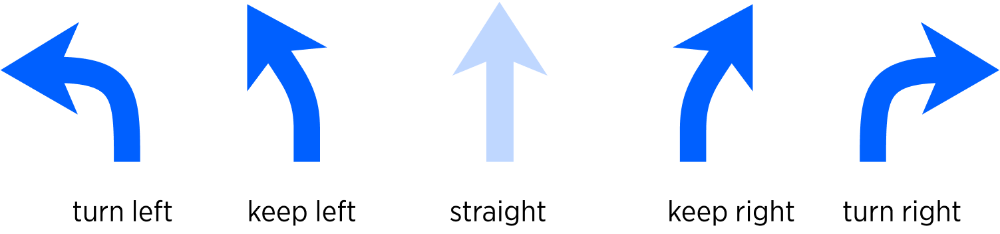  
  
  

There are following rules must be followed **for Forks** for LG directions:  

| 1                         | Two branches of fork cannot have identical direction. In other words, if one branch is “keep right” then another could be “continue straight” or “keep left”. |
|---------------------------|---------------------------------------------------------------------------------------------------------------------------------------------------------------|
| 2                         | Drawn arrows data (if available) overrides calculated angles.                                                                                                 |
| 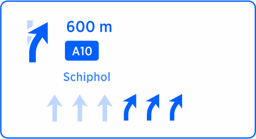 | 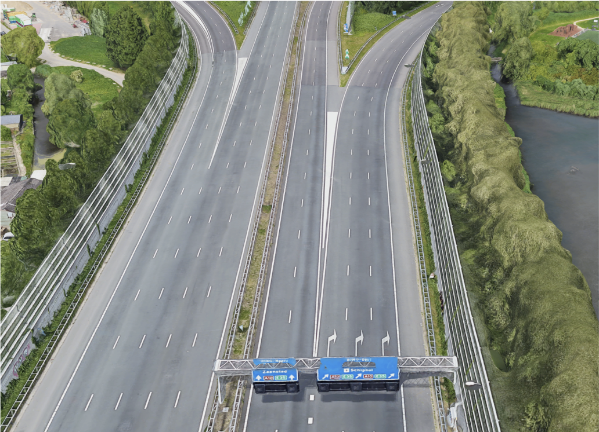                                                                                                                                     |

  

  

Capturing fork geometry
=======================

First, lets see what information we could gather from the geometry of a fork. There are various scales at which geometry could be captured and naturally the end result will be different per scale.  
  

| Bird eye view | Elevated view | Drivers perspective                                                                                                                                                                                                                                                                           |
|---|---|-----------------------------------------------------------------------------------------------------------------------------------------------------------------------------------------------------------------------------------------------------------------------------------------------|
|  |  |                                                                                                                                                                                                                                            |
| From the “bird\-view” the main road turns right, while the exit goes to the left. Resulted geometry looks like this schematically. | From elevated view like this one, the both main road and the right branch of the fork turn slightly right. | From the driver’s perspective the main road continues straight, but the exit goes to the left.      Only this perspective is interesting for determining proper direction of lane guidance arrows. This is also what sometimes reflected by the arrows drawn on the map and on a signpost. |
| 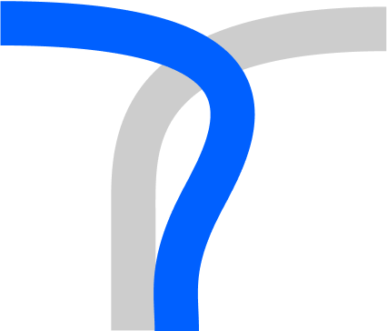 | 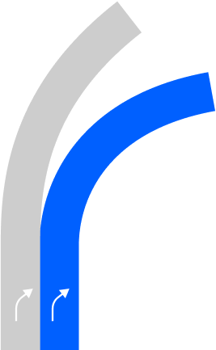 | 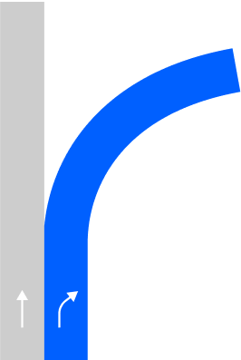                                                                                                                                                                                                                                                                     |

  

  

Driver's perspective
--------------------

How could we capture LG angles seen from the perspective of driver? There are various methods to do so. Driver can see clearly the geometry of a road ahead in a arange of 150-200m.  

| Sat image \- small scale                                                                                                                                                                                                                                                                                                                                    | NDS MAP \- Small Scale                                                                                                                                                                                                                                                          | NDS MAP \- Larger Scale                                                                                                                                                                                                                                                                           |
|-------------------------------------------------------------------------------------------------------------------------------------------------------------------------------------------------------------------------------------------------------------------------------------------------------------------------------------------------------------|---------------------------------------------------------------------------------------------------------------------------------------------------------------------------------------------------------------------------------------------------------------------------------|---------------------------------------------------------------------------------------------------------------------------------------------------------------------------------------------------------------------------------------------------------------------------------------------------|
| 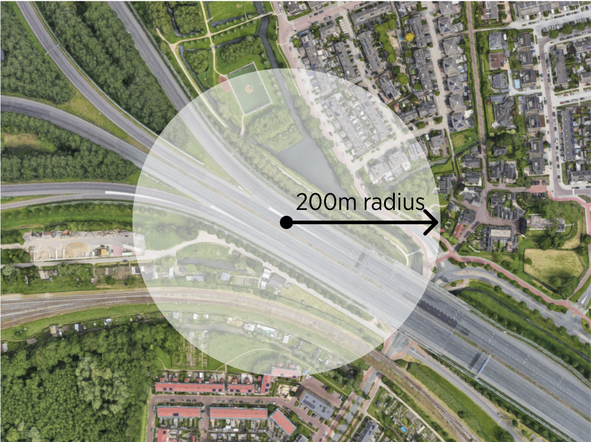                                                                                                                                                                                                                                                                                                                                   | 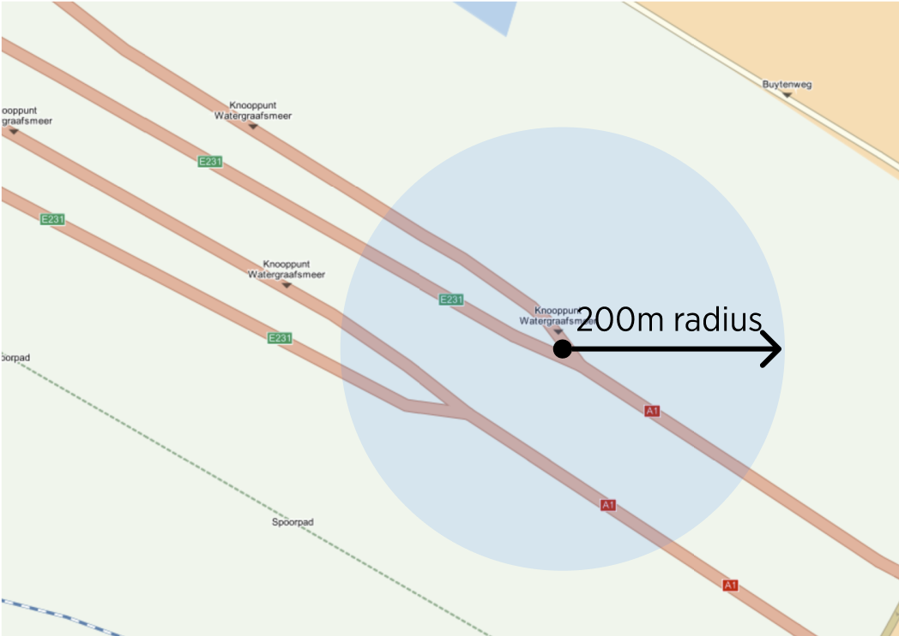                                                                                                                                                                                                                                            | 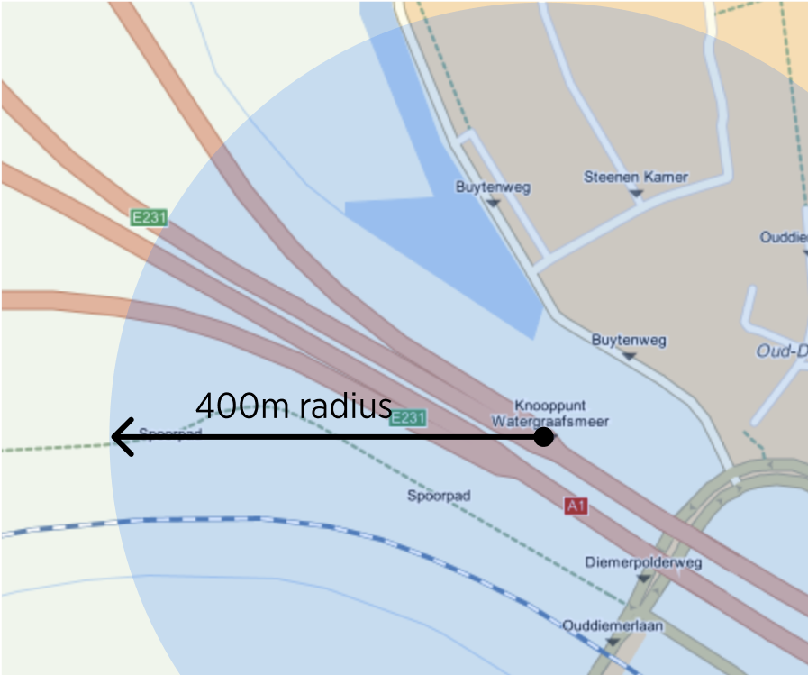                                                                                                                                                                                                                                                                         |
| We could try to use this range (150\-200m from the center of manoeuvre path) as a boundary for defining the geometry, however the issue we encounter is a mismatch between NDS map angle interpretation, at small scales, with reality.

      As seen from this example, the angle could be properly identified from the satellite image geometry. | Due to the rough segmentation of the map, the real angles of the split are lost at very small scales. It is impossible to see the same angles as seen on the image from satellite. Short segments of the road don't represent angles realistically creating quantisation error. | We need to get to larger scale in order to see those real angles. 

Judging from this example the recommended value for capturing geometry on Motorways is **around 400\-600m**.      Let's keep in mind that we don't know if this range is universal and will always give good results. |

  

**Next steps**

Try to use 400m rande on a wide variety of Motorway forks and validate the quality of the outcome. If we get good enough results, we can stop her and use this method. If not, lets try to change the value and see how it affects the results.

  

  
  
  
  

**.... END OF DOCUMENT  
  
  
  
**