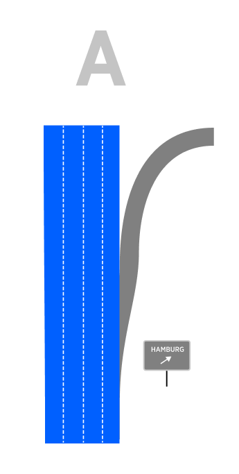
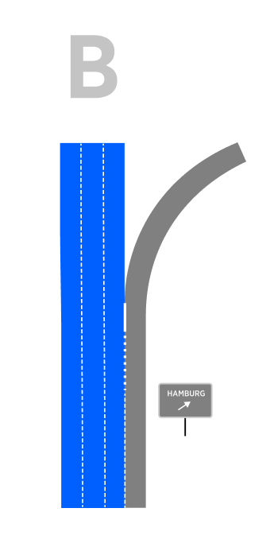
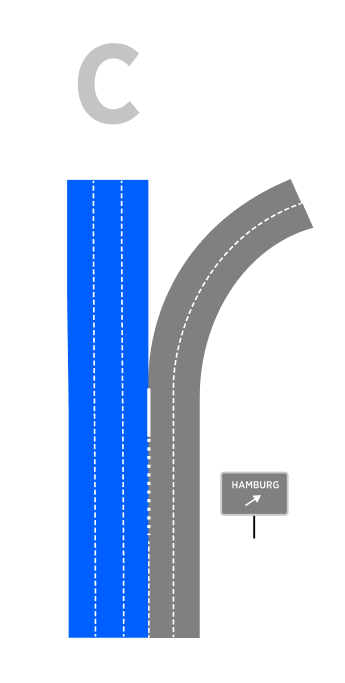
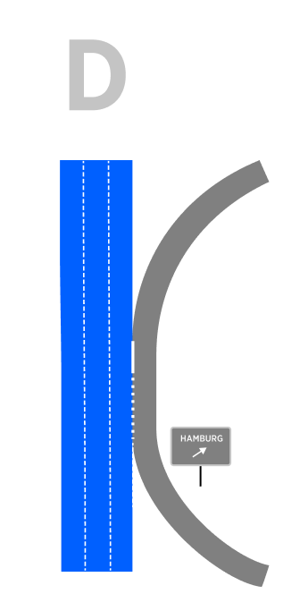
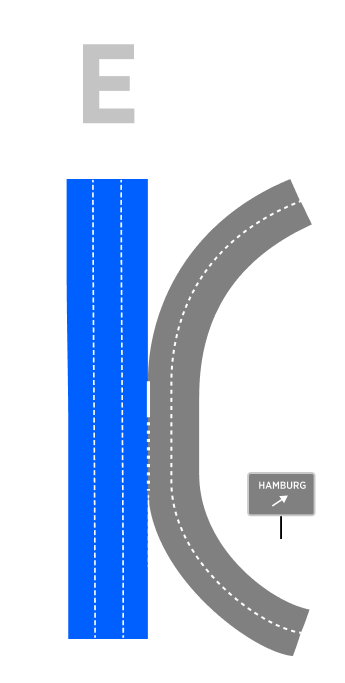
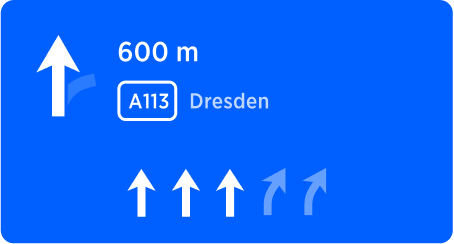

| **Interaction Designer** | [Alexey Opokin](https://tomtom.atlassian.net/wiki/people/70121:e8cb7861-9079-4b92-b96d-bfe8cd882680?ref=confluence) |
|---|---|
| **Visual Designer** | [Georgios Koultouridis](https://tomtom.atlassian.net/wiki/people/5be2fd44649a737c2342afbe?ref=confluence) |
| PM | [Joost Pennings](https://tomtom.atlassian.net/wiki/people/712020:a6d50cb1-97be-4a9a-a279-3fbb3e2e1799?ref=confluence) |

Table of Contents
=================

*   [Table of Contents](#Table-of-Contents)
*   [Introduction](#Introduction)
    *   [Passing by and Exit from configuration B or C](#Passing-by-and-Exit-from-configuration-B-or-C)
        *   [Visual Instruction](#Visual-Instruction)
*   [Ambiguous Exit instruction](#Ambiguous-Exit-instruction)
    *   [How we define Ambiguous Exit](#How-we-define-Ambiguous-Exit)

  

Introduction
============

Interim exits are exits located between the current location and next manoeuvre. Most common issue that drivers are facing here is they accidentally take interim exit instead of a correct one because they are not aware of two exits. Appropriate guidance is required to prevent driver from accidentally taking the interim exit. LG is crucial for such instruction as he has to stay at certain lanes. This scenario is very prominent and important for SLG definition because it creates a lot of sub-cases where LG is critical.

  

There are several types of scenarios that require different treatment in regards to handling interim exit:  
  
**Exit with a ramp** - this exit develops via splitting the lane to the right before the manoeuvre. In order to take the exit, driver must perform the manoeuvre, therefore no special instruction is required for preventing this accidental exit. This scenario doesn't require any treatment as it doesn't pose any troubles for drivers.  
  
**Exit that develops as a continuation of existing right lane/s.**  Unlike previous scenario, if exit lane is natural continuation of existing right lane, drives can accidentally take this exit, therefore special instruction is required in order to prevent this.

  

  

To cover the whole range of possible scenarios we need to look at different road geometries and manoeuvre configurations:

| A \- Exit via Exit Ramp                                                                                                                                                                                         | B \- Exit (of Bifurcation) via persistent right lane | C \-Bifurcation (or Exit) via persistent multiple lanes | D \- Exit via recently Merged lane | D \- Exit via recently Merged lanes |
|-----------------------------------------------------------------------------------------------------------------------------------------------------------------------------------------------------------------|---|---|---|---|
|                                                                                                                                                                                        |  |  |  |  |
| **Can only be an Exit** (not Bifurcation) and it doesn't require any instruction for the driver passing by.      NOTE: More then one lane could be developed for the exit. This doesn't affect the scenario. | **Could be both an Exit or Bifurcation** (depending on signpost attributes) and it is generally requires an instruction(keep left) for the driver who passes by.      EXCEPTION: If amount of on\-route lanes (blue) is significantly higher then amount of off\-route lanes (grey) the instruction is not required here. More detailed info is [here](https://github.com/tomtom-internal/navigation-instruction-engine/blob/main/documentation/architecture/src/adr/2022-09-27T12%3A35%3A00%2B0200_natural_continuation/bifurcations.adoc). | **Could be an Exit or Bifurcation** (depending on signpost attributes) and it is generally requires an instruction (keep left) for the driver who passes by.  EXCEPTION: If amount of on\-route lanes (blue) is significantly higher then amount of off\-route lanes (grey) the instruction is not required here. More detailed info is [here](https://github.com/tomtom-internal/navigation-instruction-engine/blob/main/documentation/architecture/src/adr/2022-09-27T12%3A35%3A00%2B0200_natural_continuation/bifurcations.adoc). | **Could be an Exit or Bifurcation** (depending on signpost attributes) and it generally doesn't require any instruction for the driver passing by.      EXCEPTION: The length of the common segment is critical. If it is too long (more then 700m) this case becomes case B. | **Could be an Exit or Bifurcation** (depending on signpost attributes) and it generally doesn't require any instruction for the driver passing by.      EXCEPTION: The length of the common segment is critical. If it is too long (more then 700m) this case becomes case B. |

  
  
NOTE: It is important to mention how could we distinguish scenarios **A from B (and D)**. In reality the section of the dedicated right lane can have any length and we need to agree on min length of the lane for it to be considered a **"dedicated"**. For the scenarios to be **considered B, the minimal length of the dedicated lane must be 700m**. Below this value we consider the lane to be a preparation for  the exit ramp, and the scenarios becomes **A**.  
  
Following diagram depicts dual exit scenario where the first exit should not be taken:  
  

Passing by and Exit from configuration B or C
---------------------------------------------

This scenario poses most troubles for drivers. The manoeuvre is to prevent driver who travels on the rightmost lane from accidentally exiting. As seen from the intersection geometry, one of the persistent route lanes leads to an exit, resulting for the driver travelling on a rightmost lane to end up exiting unintentionally, if he doesn't pay enough attention. To prevent this and make sure that driver stays on the main road we generate an instruction: **Keep left** at this interim exit point.  
  
[Location URL](https://goo.gl/maps/43xsogMigpsgGmWc7)

  

### Visual Instruction

| **NIP** | **Signpost** | **Road Geometry** |
|---|---|---|
|  |  |  |
| Visual instruction arrow reflects the Intersection geometry indicating that exiting branch deviates from straight direction. The same message is reinforced by SLG arrows. |  | Rightmost lane becomes an exiting lane and another lane is added from the ramp. |

  

  

  

**Audio Instruction**

| component | Value | Notes |
|---|---|---|
| Distance | in 600 meters | \-\- |
| Pointer | \-\- | Since there is no Bifurcation, or any other pointer applicable here, it is left blank. |
| Action | Keep left | Keeping left prevents driver to stay on right lanes that lead to exit. |
| Purpose | to take A113 | The final purpose of the manoeuvre is to stay on the original road, which is changing its name to A113\. |
| Direction | towards Dresden | Towards information is provided by the signpost |

  
  
  

Ambiguous Exit instruction
==========================

There are situations where the user may accidentally take the wrong exit because there are 2 (or more exits) very close together.  
This instruction aims to resolve this ambiguity by providing visual information (new maneuver arrows) and audio information (new voice instructions) in advance.

How we define Ambiguous Exit
----------------------------

*   The intersection is present on Controlled Access Roads.
    
*   2 exits are available at the same direction of turn (left or right). Bifurcations are not considered as Multiple Close Exits intersections.
    
*   The distance between the exits is &lt;= to 100 meters  
      
    Note: When the first exits the user is approaching is the correct one, it is not considered as Multiple Close Exits intersection  
    Note: We don’t cover situations with 3 exits so far. This needs to be handled later, if such locations exist.
    

  

| **Instruction** | Ambiguous Exit |                                                                                                                                                                                                                                                                                                                                                                                                                                                                   |
|---|---|-------------------------------------------------------------------------------------------------------------------------------------------------------------------------------------------------------------------------------------------------------------------------------------------------------------------------------------------------------------------------------------------------------------------------------------------------------------------|
| **Description** | This Instruction is given in Highway when 2 exits are very close together and the user should take the second one. |                                                                                                                                                                                                                                                                                                                                                                                                                                                                   |
| **Location** | [Location URL](https://www.google.de/maps/place/A+100,+10711+Berlin,+Germany/@52.4988324,13.2805073,360m/data=!3m2!1e3!4b1!4m5!3m4!1s0x47a850cebe3b8013:0x643cce9930d9e367!8m2!3d52.4988323!4d13.2814568?hl=en) | From: 52\.49853675765874, 13\.281703922757428 To: 52\.50133164878146, 13\.280364250433866                                                                                                                                                                                                                                                                                                                                                                     |
| **Road Geometry** |  |                                                                                                                                                                                                                                                                                                                                    |
| **Visual Instruction** |  | The Manouver arrow in Multiple Close Exit scenario is the only visual component that changes in the Horaizon Panel.      The basic idea is to improve the Monouvre arrow while adding the wrong exit components.      Monouver arrow consists of:      \- correct exit (here in blue)   \- wrong exit (here in light blue)   \- Straight road (here in light blue)    Note: Manouvre arrow can point right (right exit) and left (left exit) depending on highway structure |
| **Audio Instruction** | In 600m **stay in the fourth lane to take the exit** towards Magdeburg |                                                                                                                                                                                                                                                                                                                                                                                                                                                                   |
| **Notes** | Icon representing Ambiguous Exit instruction should reflect the geometry of the manoeuvre. In this particular case main road continues straight, while 2 exit roads deviate to the right. This geometry is reflected in the manoeuvre arrow and Lane Guidance arrows. |                                                                                                                                                                                                                                                                                                                                                                                                                                                                   |
| **Audio Template** | **\[distance] \[action] \[purpose] \[towards]** |                                                                                                                                                                                                                                                                                                                                                                                                                                                                   |

  

  

  

  

The diagram below shows how the VISUAL INSTRUCTIONS and the AUDIO INSTRUCTIONS change as the maneuver approaches.

The same Maneuver Arrow is displayed in all 3 phases: Early, Main and Confirmation.

Early and Main phases have the same Audio Instruction except for the "distance" part (e.g. “600”)  
  
Confirmation phase has dedicated Audio Instruction (e.g. “Take the exit")

  

  

  

Concider adding instruction for entering highway (and Bundestrasse) as continuation of the current road.