| **IXD** | [Alexey Opokin](https://tomtom.atlassian.net/wiki/people/70121:e8cb7861-9079-4b92-b96d-bfe8cd882680?ref=confluence)                                                                                                                                                                                                                                                                       |
|---|-------------------------------------------------------------------------------------------------------------------------------------------------------------------------------------------------------------------------------------------------------------------------------------------------------------------------------------------------------------------------------------------|
| **VD** | [Georgios Koultouridis](https://tomtom.atlassian.net/wiki/people/5be2fd44649a737c2342afbe?ref=confluence)                                                                                                                                                                                                                                                                                 |
| **PM** | [Joost Pennings](https://tomtom.atlassian.net/wiki/people/712020:a6d50cb1-97be-4a9a-a279-3fbb3e2e1799?ref=confluence)                                                                                                                                                                                                                                                                     |
| **ENG. OWNER** | [Vadym Khandus](https://tomtom.atlassian.net/wiki/people/712020:2b00ecb1-a543-4410-818c-575056da8b84?ref=confluence)                                                                                                                                                                                                                                                                      |
| **TICKETS** | [GOSDK\-27862](https://tomtom.atlassian.net/browse/GOSDK-27862?src=confmacro) [NAV\-69908](https://tomtom.atlassian.net/browse/NAV-69908?src=confmacro)  |

**Introduction to Trifurcation**
================================

_**Trifurcation**_ is an intersection type which splits one road into 3 outcomes. Trifurcations as well as _**Bifurcations**_ and _**Exits**_ are subsets of _**Forks**_ - uninterrupted traffic flow intersections primarily use on high speed roads. Examples of trifurcations collected here: [Improve guidance at trifurcations](https://tomtom.atlassian.net/wiki/spaces/~khandus/pages/213188826/Improve+guidance+at+trifurcations)

**Rules for  Trifurcations detection**
======================================

Like **bifurcations,** Trifurcations refer to a split in the roadway where one or more lanes of traffic diverge, forming 3 separate roadways that continue in different directions. A trifurcation is typically marked with signposts to help drivers navigate the split. In order to detect trifurcation intersection, use following set of rules:  

1.  **3 or more isolated outcomes at the same location.**  
     _"same location"_  should be detected using distance threshold values. The exact logic for this detections TBD by engineering team. This rule is needed  to distinguish trifurcations from successive forks that should be handled according to bifurcations rules.  
      
    
2.  **There is no major road class difference between branches.**  
    _"major road class difference"_ should be defined experimentally. Lets start from 2 classes difference. The purpose of this rule is to filter out "noise" of small roads (like leading to parking lots) that are not perceived as a valid option by drivers.  
      
    
3.  **Uninterrupted traffic flow.**  
    Normally, trifurcations should not be interrupted by traffic lights or restricting road signs. There are might be some exceptions from this rule, that we will cover at later stages.  
      
    
4.  **Presence of Signposts**  
    Normally, but not always, trifurcations are assisted by signpost clarifying the directions of every branch. This is not a strict condition, but it can be complimentary.
    

Trifurcation Instruction Design
===============================

Trifurcations instruction relies on special trifurcation _**manoeuvre arrow**_, **visual and audible** _**Lane guidance**_ and Signpost information.

  
  
**Manoeuvre Arrow &amp; Lane Guidance**
-----------------------------------------

Manoeuvre arrow for trifurcation consists of 3 branches, one of them being selected, and others greyed out.

|  | **Left Branch** | **Middle branch** | **Right Branch** |
|---|---|---|---|
|  |  |  |  |
| Manoeuvre arrow | 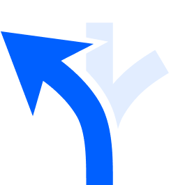 |  | 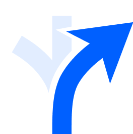 |
| SLG | 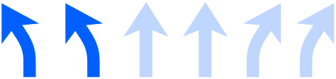 | 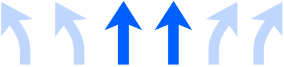 | 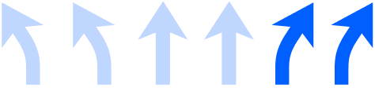 |
| Audio | ***use two left lanes** to take...* | ***use two middle lanes** to take...* | ***use two right lanes** to take...* |

**Signpost directional information**
------------------------------------

Signpost directional information handling is not special for trifurcations and follows standard procedure described here: [NIE\_020 - Road Signposts](./../../../Guidance%20Framework%20-%20Methods%20%26%20Components/Road%20Signposts/Road_Signposts.md)

Scenarios
=========

Example of trifurcations intersection and how they handled.

SCENARIO-1
----------

Motorway trifurcation with dedicated lanes for each direction.

[Location](https://www.google.com/maps/@47.4486264,8.5674592,3a,75y,102.45h,90t/data=!3m6!1e1!3m4!1sAF-G7lJKZsJrCHeWSizFEA!2e0!7i13312!8i6656?entry=ttu)

### Road Configuration

| **Driver’s view** | **Signpost** | **Road Geometry** |
|---|---|---|
|  | 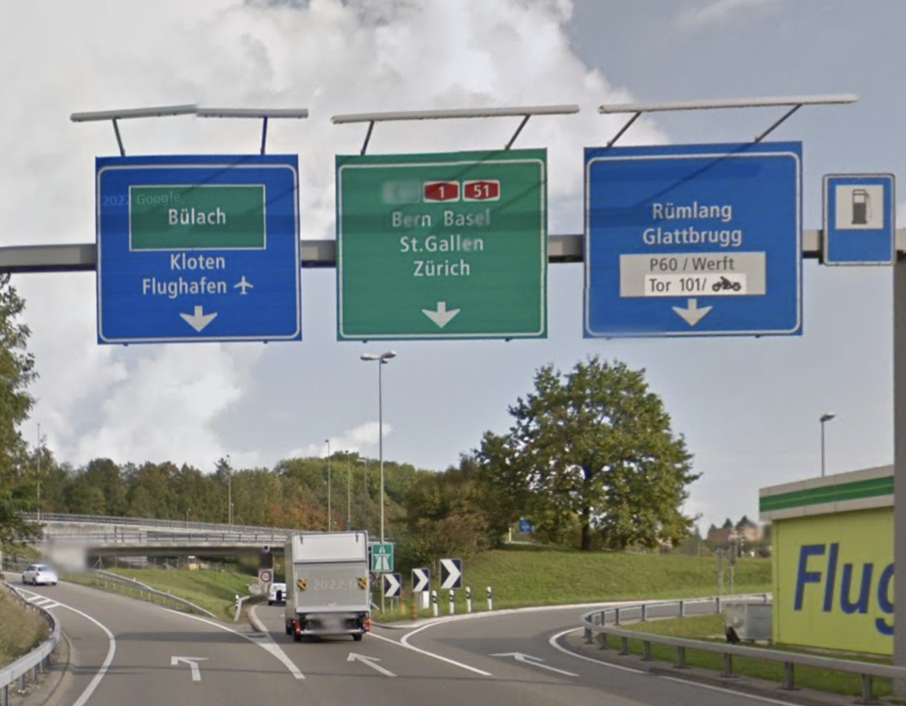 |  |

### **Instructions**

| **Left** | **Middle** | **Right** |
|---|---|---|
| 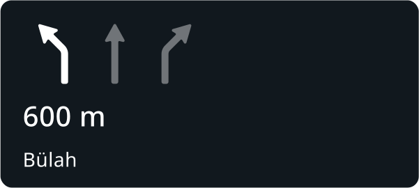 | 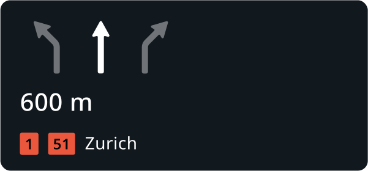 | 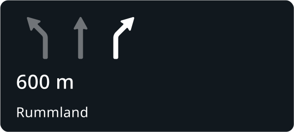 |
| **Audio** | **Audio** | **Audio** |
| at the fork, use the leftmost lane to go towards Bülach | at the fork, use the middle lane to take A51 towards Zurich | at the fork, use the rightmost lane to go towards RumMland |

SCENARIO-2
----------

Motorway trifurcation with mixed lane counts for each direction.  

### Road Configuration

| **Driver’s view** | **Signpost** | **Road Geometry** |
|---|---|---|
|  |  |  |

### **Instructions**

| **Left** | **Middle** | **Right** |
|---|---|---|
| 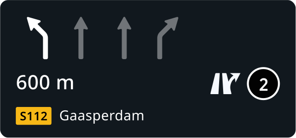 | 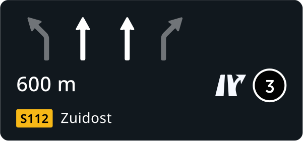 | 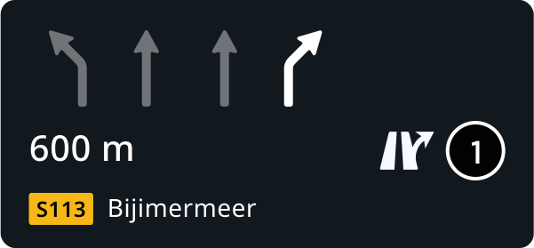 |
| **Audio** | **Audio** | **Audio** |
| At the fork, use the leftmost lane to take the exit No. 2 onto S112 towards Gaasperdam | At the fork, use the middle two lanes to take the exit No. 3 onto S112 towards Zuidost | At the fork, use the rightmost lane to take the exit No. 1 onto S112 towards Bijmermeer |

  
  
  
  
SCENARIO-3
----------------------

City trifurcation without separation lanes  
  
[Location](https://www.google.com/maps/@48.8281351,2.3922637,3a,75y,298.84h,83.87t/data=!3m6!1e1!3m4!1s-Sos8Ml4jwW6uaqgI9NtIA!2e0!7i16384!8i8192?entry=ttu)  
  

### Road Configuration

| **Road Geometry** | **Signpost** | **Road Geometry** |
|---|---|---|
| 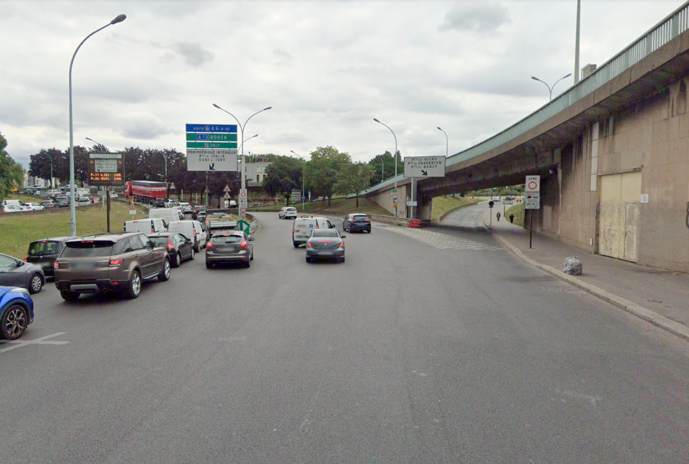 | 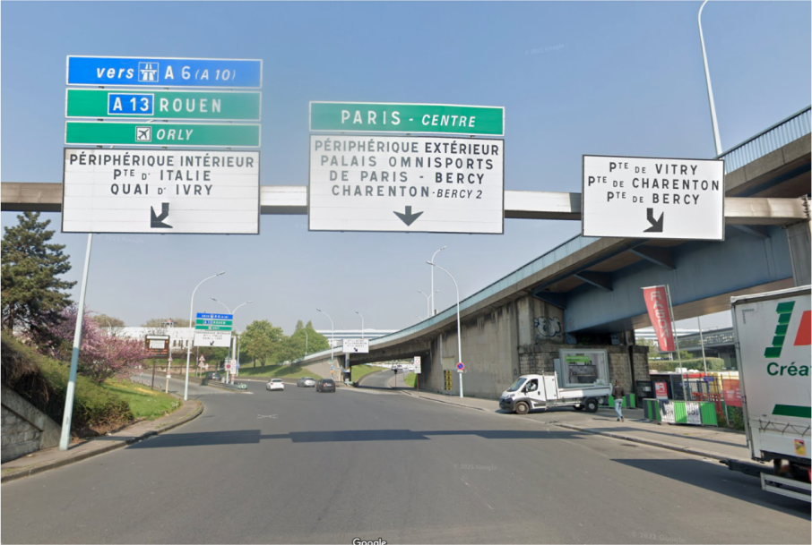 |  |

  

### **Instructions**

| **Left** | **Middle** | **Right** |
|---|---|---|
|  |  | 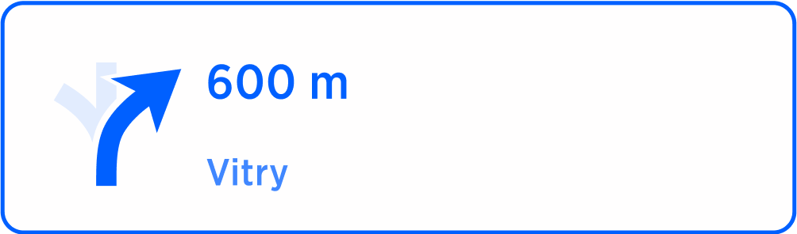 |
| **Audio** | **Audio** | **Audio** |
| At the fork, keep left to take A10 towards Airport | At the fork, stay in the middle towards Paris Centre | At the fork, keep right towards Vitry |

SCENARIO-4
----------

Motorway Trifurcation in the US

| **Driver’s View** | **Signpost** | **Road Geometry** |
|---|---|---|
| 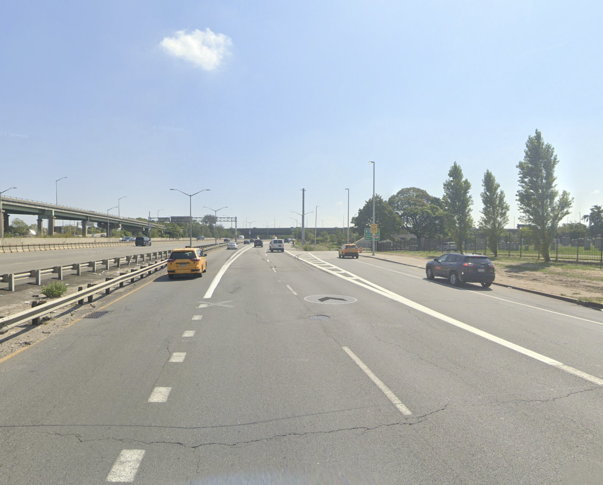 | 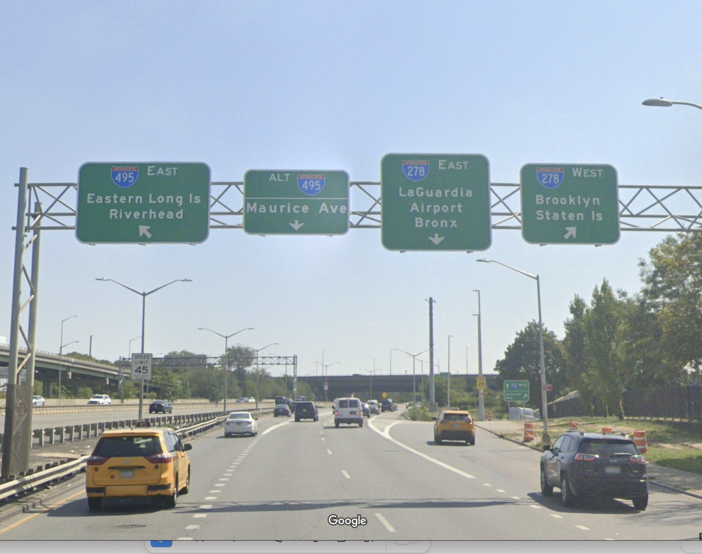 |  |

### **Instructions**

| **Left** | **Middle** | **Right** |
|---|---|---|
| 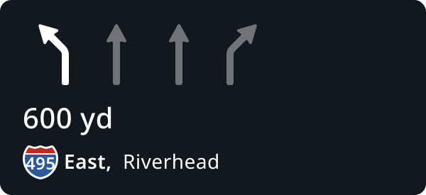 | 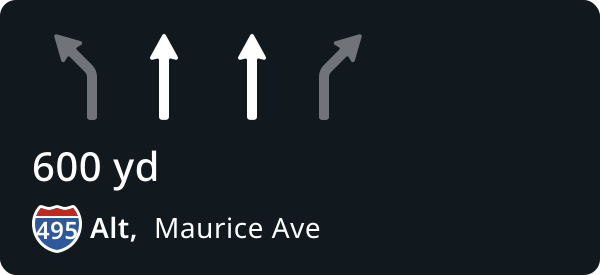 | 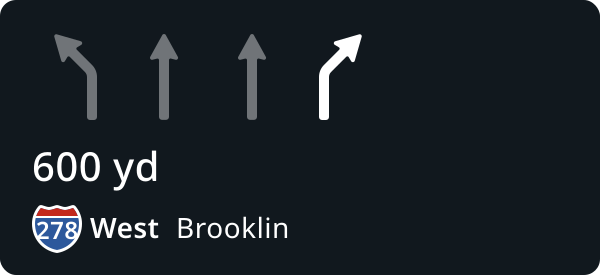 |
| **Audio** | **Audio** | **Audio** |
| At the fork, keep left to take I 495 towards Riverhead | At the fork, stay in the two middle lanes to continue on I 495 Alt towards Maurice Avenue | At the fork, keep right to take I 278 West, towards Brooklin |