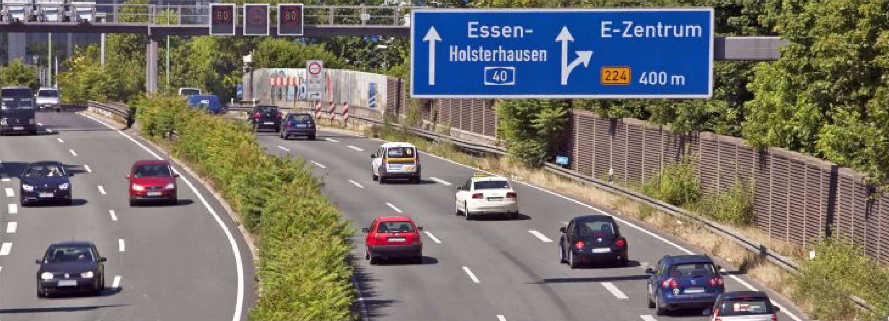
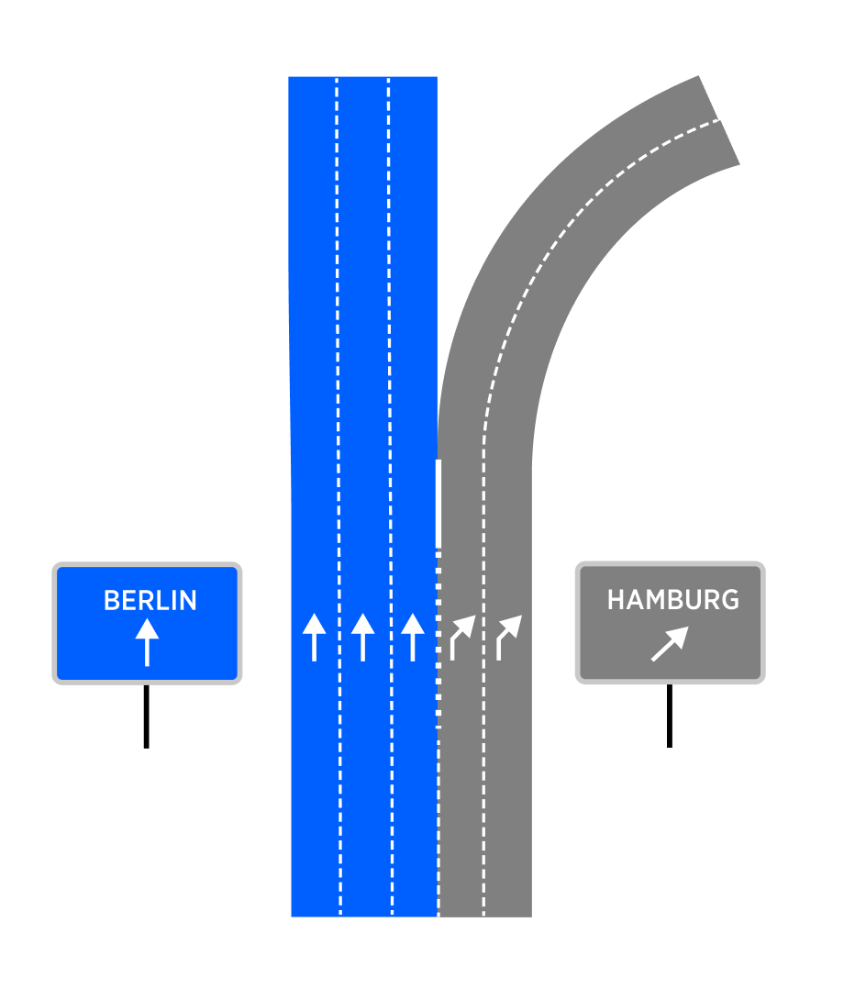
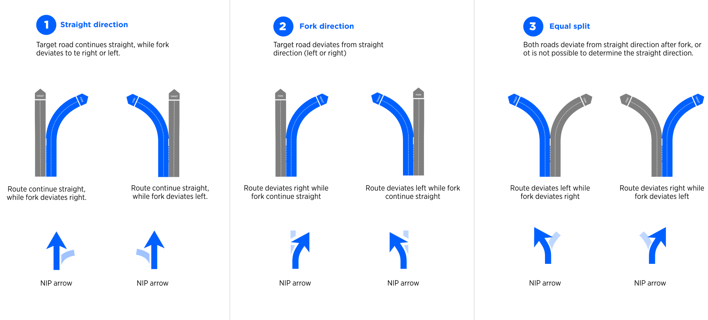
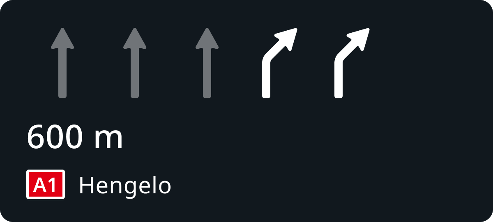
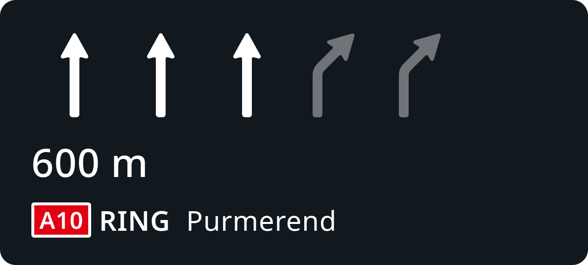
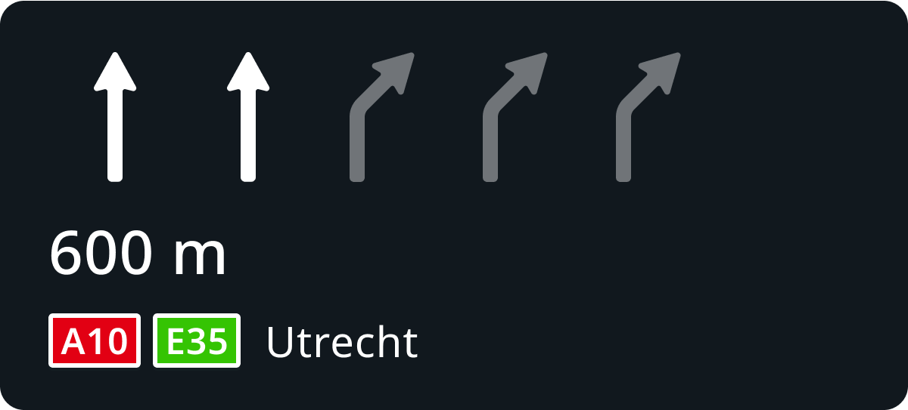
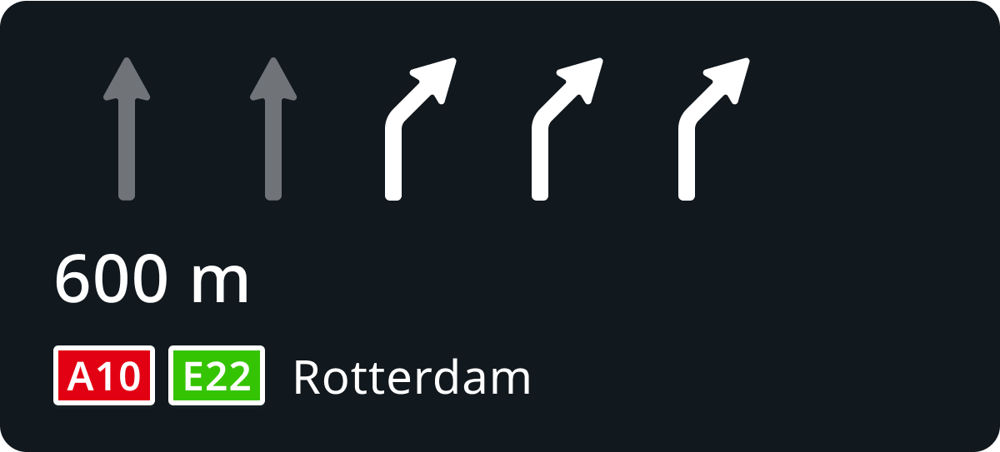

| **Interaction Designer** | [Alexey Opokin](https://tomtom.atlassian.net/wiki/people/70121:e8cb7861-9079-4b92-b96d-bfe8cd882680?ref=confluence) |
|---|---|
| **Visual Designer** | [Georgios Koultouridis](https://tomtom.atlassian.net/wiki/people/5be2fd44649a737c2342afbe?ref=confluence) |
| **ENG OWNER** | [Vadym Khandus](https://tomtom.atlassian.net/wiki/people/712020:2b00ecb1-a543-4410-818c-575056da8b84?ref=confluence) \- please change this when another person is assigned |
| **PM** | [Joost Pennings](https://tomtom.atlassian.net/wiki/people/712020:a6d50cb1-97be-4a9a-a279-3fbb3e2e1799?ref=confluence) |
| **Spec Review ticket** | [NAV\-151482](https://tomtom.atlassian.net/browse/NAV-151482?src=confmacro) |
| **GitHub Documents** | [https://github.com/tomtom\-internal/navigation\-instruction\-engine/blob/bc9915ebc23d1bdac3a34164aff5a3de260848ee/documentation/architecture/src/adr/2022\-09\-27T12%3A35%3A00%2B0200\_natural\_continuation/bifurcations.adoc](https://github.com/tomtom-internal/navigation-instruction-engine/blob/bc9915ebc23d1bdac3a34164aff5a3de260848ee/documentation/architecture/src/adr/2022-09-27T12%3A35%3A00%2B0200_natural_continuation/bifurcations.adoc) |

> [!NOTE]
> **Changes requested**   We've noticed that we have received many bug tickets from customers related to the natural continuation on bifurcations. It is not really clear to customers when and why our guidance decides not to provide bifurcation instructions in some cases.
>  The rules used to detect them are described in the [source code documentation](https://github.com/tomtom-internal/navigation-instruction-engine/blob/bc9915ebc23d1bdac3a34164aff5a3de260848ee/documentation/architecture/src/adr/2022-09-27T12%3A35%3A00%2B0200_natural_continuation/bifurcations.adoc). However, we would like to refine these rules for a general audience and include them in this UX specification.
>  The purpose of this is to have a better visual and textual explanation of our guidance that we can share with customers, enabling us to provide a single screenshot to explain some cases to clients.
>  After the UX specification is improved, we may need to adjust it and add it to the HCP3 version of the spec.

**Introduction to furcations (Bifurcations)**
=============================================

**furcations (Bifurcations) and Exits** are two types of intersections which don't interrupt traffic flow. Both are found primarily on **Motorways**, but they can also be found on lower road classes that share some properties with Motorways, such as **uninterrupted traffic flows** and **curved road geometry** designed for fast manoeuvre taking. For differentiating **furcations from Exits**, refer to this pages: [furcations Instructions (Bifurkations, Trifurcation, Exits)](./../Furcations-Bifurkations_Trifurcation_Exits.md)  
  
**TERMINOLOGY:** Term _**furcation**_ here and across the whole specifications is used interchangeably with term _**Bifurcation**_, however, keep in mind that _**furcations**_ also include _**Trifurcations**_.

Bifurcation intersections design varies greatly depending on the complexity of the split. Here are some typical examples:

| **furcation Type** | **Schematic diagram** | **Attributes**                                                                                                                | **Notes** |
|---|---|-------------------------------------------------------------------------------------------------------------------------------|---|
| Main road continues |  | Often, departing branch is indicated by exiting (angled) arrows Often, continuing branch is indicated by straight arrows. | This type of bifurcation happens when one of outgoing branches has the same road identity (Road Name/Number) as the incoming path.      ***Main road*** refers to the road that continues through the intersection. ***Departing road*** \- is the road that appears as new at the intersection.      Directional arrows indication is manifested in the signpost and/or on the surface of the road. This data might be or might be not available in the map.  The ratio between straight lanes and departing lanes affects the audio lane guidance message.      NOTE: Directional arrows might not be available for small lane count bifurcations. |
| Equal split |  | Typically, both branches indicated by exiting (angled) arrows.                                                                | This type of bifurcation happens when both of outgoing branches have different road IDs from the incoming path.  Directional arrows indication is manifested in the signpost and/or on the surface of the road. This data might be or might be not available in the map.  NOTE: Directional arrows might not be available for small lane count bifurcations. |

NOTE: Those bifurcations are just given as examples. The real configurations could be different from those and cannot be categorised precisely.

**Design Principles for furcation Instructions (WIP)**
======================================================

When providing Guidance at furcation Intersections, we need to pay attention at lane configurations and intersection and roads identities before and after the intersection. 

  
  
  
  
**Rules for furcation Instructions**
================================================

**Bifurcations Instructions** have following attributes:   
  
**1.** Pointer _**At the furcation**_  is used every time.  

**2\.** Actions: _**Keep Left/Right**_ (AALG), or _**Use XX lanes**_ (EALG)_**.**_ The choice between AALG (approximated audio lane guidance) and EALG (explicit audio lane guidance) is done based on the scenario.

**3\.** Purpose could be ether **Take the <road id="">** or **Continue on <road id="">**, depending on the scenario.

  
**Possible furcation scenarios are Illustrated in the table below:**

| **ID** | **Route path** | **Lane configuration** | **Pointer** | **Action** | **Purpose** | **Towards** |
|---|---|---|---|---|---|---|
| 1 | Continuation of the current road **A100** in the direction of **Hamburg**, while alternative branch is a new road. |  | **At the furcation...** | **Keep Left to**  REASON: Approximated LG is used for continuation when majority of lanes follow the route path. | **Continue on** ***A100***  REASON: ***Continue*** is used for continuation on the same road. | **towards** ***Hamburg*** |
| 1\.1 | Subset of **\#1** with different lane configuration |  | **At the furcation...** | **Stay in the left two lanes to**  REASON: Explicit LG is used for continuation when minority of lanes follow the route path.NOTE: ***Use*** will be used instead of ***Stay*** in some scenarios when lane localisation is supported. | **Continue on** ***A100***  REASON: ***Continue*** is used for continuation on the same road. | **towards*****Hamburg*** |
| 2 | Switching to a new road **A9** in the direction of **Berlin**, while alternative branch is a continuation of the current road |  | **At the furcation...** | **Use the right two lanes to**  REASON: Explicit LG is used for taking a new road | **take*****A9***  REASON: ***Take*** is used for taking a new road    ALSO: ***Switch to*** to can be used instead of ***Take***  word ***take*** is already in use in the same sentence. | **towards*****Berlin*** |
| 2\.1 | Subset of **\#2** with different lane configuration |  | **At the furcation...** | **Keep Right to**  REASON: Count of lanes which is **greater than 4 requires approximated LG** | **take*****A9*** | **towards*****Berlin*** |
| 3 | Switching to a new road **A9** in the direction of **Berlin**, while alternative branch is also a new road road |  | **At the furcation...** | **Use the right two lanes to**  REASON: Explicit LG is used for taking a new road | **take*****A9*** | **towards*****Berlin*** |
| 3\.1 | Subset of **\#3** with different lane configuration |  | **At the furcation...** | **Use the left two lanes to**  REASON: Explicit LG is used for taking a new road | **take*****A9*** | **towards*****Berlin*** |
| 4 | When only two lanes are available at the entrance of the furcation. |  | **At the furcation...** | **Keep right to**    REASON: Approximated LG is used when there are only 2 lanes and choice needs to be made between them | **...** | **...** |

**NOTE:** Scenarios illustrated above describe standalone manoeuvre situations when no, close following manoeuvre is present. Situations involving serial manoeuvres apply MPO - **manoeuvre path optimisation** logic that might output different lane configurations. Details about MPO can be found here: [Manoeuvre path optimisation](https://tomtom.atlassian.net/wiki/spaces/FlaminGO/pages/157680435/Manoeuvre+path+optimisation)

Directional Lane configuration 
===============================

Bifurcation can vary by the lane directions configuration. This configuration is usually reflected by the **directional arrows drawn on the road and indicated at the signpost**. In most scenarios left branch on the bifurcation has straight arrows, while right has turning right ones. However, the geometry could also be different.   
  

**Directional lane configuration on the road**

|**Driver's View**|**Top View**|**Top View close up**|
| --- | --- | --- |
|  |  |  |

  
  
This directional information **should be reflected in the Manoeuvre arrow and SLG**  if this information could be gathered from the map:  
  

**Visual Instruction Format - NIP**
===================================

| **Phase** | **NIP** | **Notes** |
|---|---|---|
| Early |  | Early instruction phase and earlier, do not display SLG, but only manoeuvre arrow. |
| Main |  | Main instruction phase and later, display only SLG component without manoeuvre arrow. |

**Instructions Examples**
=========================

Following examples illustrate how Instructions involving furcation intersections are constructed.

**furcations LOCATIONS**

| **ID** | **Map link** |
|---|---|
| 1 | https://maps.app.goo.gl/KB231fY9tWfdfdpE9 |
| 2 | https://maps.app.goo.gl/ZxTafaFXaakUKkwDA |
| 3 | https://maps.app.goo.gl/xqQ8PRiE9bLE9zZj6 |

Motorway furcation 1
--------------------

The left branch continues on RING A10, while the right branch takes a new road A9.

  
**INTERSECTION GEOMETRY**

|**Driver's View**|**Top View**|**Top View close up**|
| -- | -- | -- |
|  |  |  |
| | | |

  
  
**MAIN INSTRUCTION**

|  | **Left Branch** | **Right Branch** |
|---|---|---|
| **VISUAL** |  |  |
| **AUDIO** | In 600 meters, At the furcation, keep left to continue on A10 RING towards Purmerand | In 600 meters, At the furcation, use the right two lanes to take A1 towards Hengelo |

Motorway furcation 2
--------------------

The left branch (2 lanes) continues on RING A10 Ring-Noord towards Utrecht, while the right branch (3 lanes) takes a new road A10 Ring-west towards Rotterdam.

|**Driver's view**|**Top view**|**Top view close up**|
| --- | --- | --- |
|  |  |  |

**MAIN INSTRUCTION**

|  | **Left Branch** | **Right Branch** |
|---|---|---|
| **VISUAL** |  |  |
| **AUDIO** | In 600 meters, At the furcation, stay in the left two lanes to continue on A10, E35 towards Utrecht | In 600 meters, At the furcation, use the right three lanes to take E22 towards Rotterdam |

GitHub Reference design document
================================

For even detailed, low level analysis of bifurcation detections, please refer to this document:   
[https://github.com/tomtom-internal/navigation-instruction-engine/blob/bc9915ebc23d1bdac3a34164aff5a3de260848ee/documentation/architecture/src/adr/2022-09-27T12%3A35%3A00%2B0200\_natural\_continuation/bifurcations.adoc](https://github.com/tomtom-internal/navigation-instruction-engine/blob/bc9915ebc23d1bdac3a34164aff5a3de260848ee/documentation/architecture/src/adr/2022-09-27T12%3A35%3A00%2B0200_natural_continuation/bifurcations.adoc)

/ END OF DOCUMENT  
  

=======================</road></road>