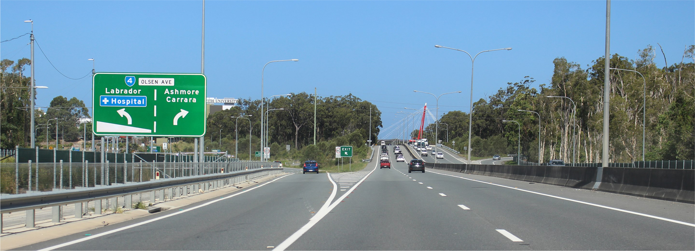

> [!NOTE]
> Due to an issue with the new Confluence, some images have disappeared from the page. The issue is being investigated right now.

| **Interaction Designer** | [Alexey Opokin](https://tomtom.atlassian.net/wiki/people/70121:e8cb7861-9079-4b92-b96d-bfe8cd882680?ref=confluence) |
|---|---|
| **Visual Designer** | [Georgios Koultouridis](https://tomtom.atlassian.net/wiki/people/5be2fd44649a737c2342afbe?ref=confluence) |
| **ENG. OWNER** | [Vadym Khandus](https://tomtom.atlassian.net/wiki/people/712020:2b00ecb1-a543-4410-818c-575056da8b84?ref=confluence) |
| **PM** | [Joost Pennings](https://tomtom.atlassian.net/wiki/people/712020:a6d50cb1-97be-4a9a-a279-3fbb3e2e1799?ref=confluence) |

**Introduction to Exits**
=========================

Exits are most common intersection types encountered on **Motorways** and other road classes that share one properties with **motorways**. **Exits** (as well as Bifurcations and Trifurcation) are subsets of **Forks  -** intersections that allow uninterrupted traffic flow which is a requirement for **Motorways**. For Introduction to the terminology like **Motorway**, **Exit**, **Fork**, etc make yourself familiar with the following documents:  
  
[https://tomtom.atlassian.net/wiki/spaces/FlaminGO/pages/157718797](https://tomtom.atlassian.net/wiki/spaces/FlaminGO/pages/157718797) Additional terminology that is used in this document:  
  
**EALG** - Explicit audio lane guidance. Method of announcement of specific lanes to be taken for the given manoeuvre - _**use the right two lanes…**_  
**AALG** - Approximate audio lane guidance. Method of announcement of the manoeuvre on multi-lane road without mentioning specific lane - _**Keep right…**_  
  
**Exit** is an intersection that enables deviation from the current (main) road to another road via connection line (exit ramp). Sometimes, Exits are marked on the road by **special Exit number** in Signpost.  
  

There are two major types of exits that is worth to distinguish, since they require different treatment.

| **Exit Type**                                                                             | **Schematic diagram** | **Attributes** | **Notes** |
|-------------------------------------------------------------------------------------------|---|---|---|
| **Detached Exit**   Exit lanes appear as new lanes at short distance before the exit. | 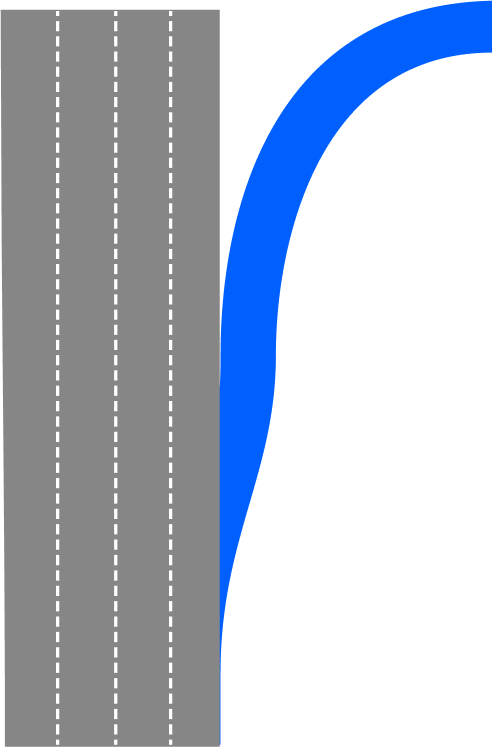 | Signpost indication for exit direction only.  exit lanes **appear \&lt; 700m** before the exit. | This is a most frequently used type of exit |
| **Split Exit**   Existing road lane/s depart from the main road forming an exit lane.      | 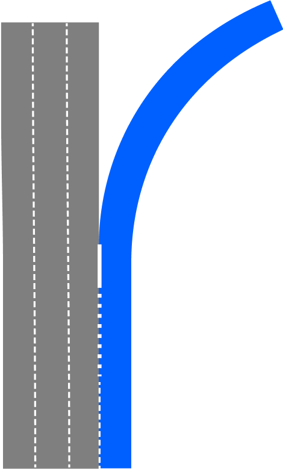 | Signpost indication for both directions.  Exit lane splits up from the main road **\&gt; 700m before** the exit. | This type of exit is not possible to safely distinguish from bifurcation in all cases. Helping factor could be a ratio between straight going lanes vs exit lanes and signpost information. |

   
  
  

**Rules for Exit Instructions**
===============================

**Exit  Instructions** must follow certain structure and use _Actions_ and _Purpose_ in the following way:

| **No.** | **Pointer** | **Action** | **Purpose** | **Direction / Road** | **Direction / Towards** |
|---|---|---|---|---|---|
| **1** | **N/A**    Since Exits are performed without interruptions (traffic lights) the only potential pointers are **Tunnels**. Most often exits don't have any pointers. | **Take the exit**   If LG is not provided by the map, EALG cannot be used. In this case we fall back to standard exit instruction without LG. | **N/A**   For AALG, there is no purpose required, as all information is delivered in *Action*. | **N/A**   Road information is not always provided by signposts | **...towards*****Hamburg*** |
| **2** | **N/A** | **Take the Exit No. 35**   No audio LG is available | **N/A**   For AALG, there is no purpose required, as all information is delivered in *Action*. | **onto A100** | **...towards*****Hamburg*** |
| **3** | **N/A** | **Use 2 Left/Right lanes**   Explicit Audio Lane Guidance \- ***EALG*** is used here. It instructs driver about lane configuration at the exit point. | **to take the Exit No. 35**   Since exit information is missing in *Action*, it should be delivered in *Purpose* | **onto A100** | **...towards*****Hamburg*** |

**Examples illustrating various scenarios of Exits**

| **Loc.** | **Road View** | **NIP** | **Exit type** | **Action** | **Purpose** | **Direction** | **Towards** |
|---|---|---|---|---|---|---|---|
| [Exit 1](https://maps.app.goo.gl/wGMS1qmq8qCUvEu68) | 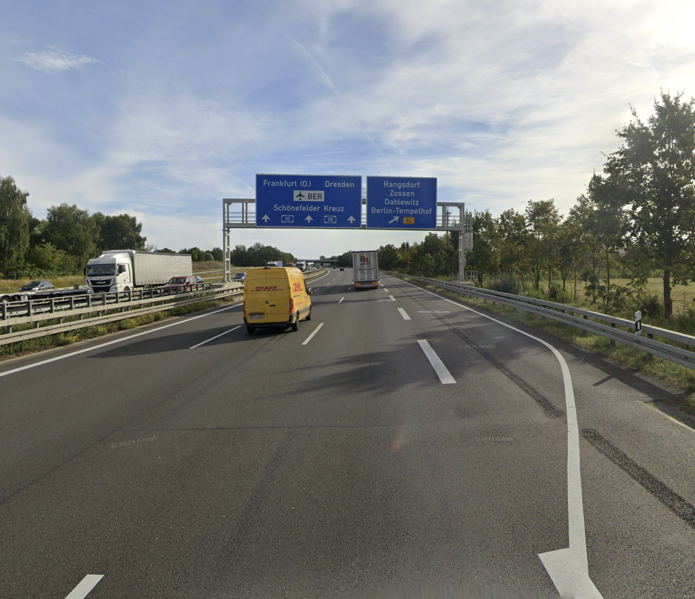 |  | **detached** exit lane appears shortly (\&lt; 700m) before the actual exit | **Use the rightmost lane**** EALG** is used for all types of exits \- detached and split. | **to take the Exit** | **onto*****B96*** | **towards*****Rangsdorf*** |
| [Exit 2](https://maps.app.goo.gl/uK1Gi1ymfCpLMyAP8) |  | 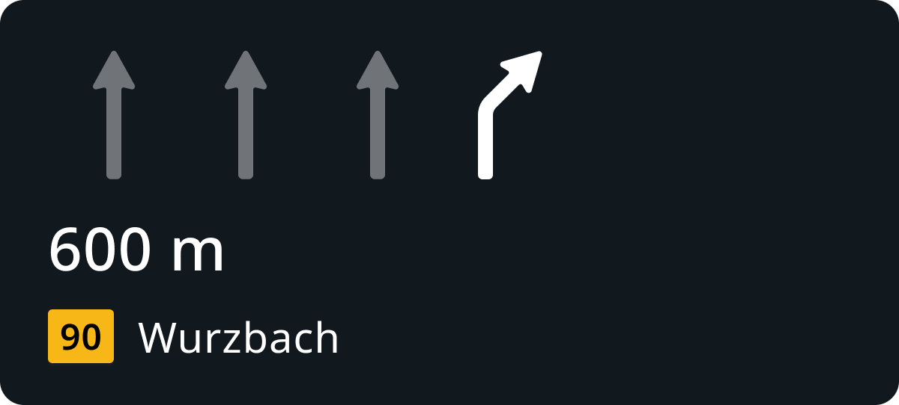 | **detached** exit lane appears shortly (\&lt; 700m) before the actual exit | **Use the rightmost lane** | **to take the Exit** | **onto*****B90*** | **towards*****Wurzbach*** |
| [Exit 3](https://maps.app.goo.gl/P9vW3tMMaN8cHDBu6) |  |  | **Split** exit lane appears far before (\&gt; 700m)  the actual exit | **Use the rightmost lane** | **to take the Exit** | **onto*****N946*** | **towards*****Huy*** |
| [Exit 4](https://maps.app.goo.gl/MqfUjWrpvYPCiDrAA) |  | 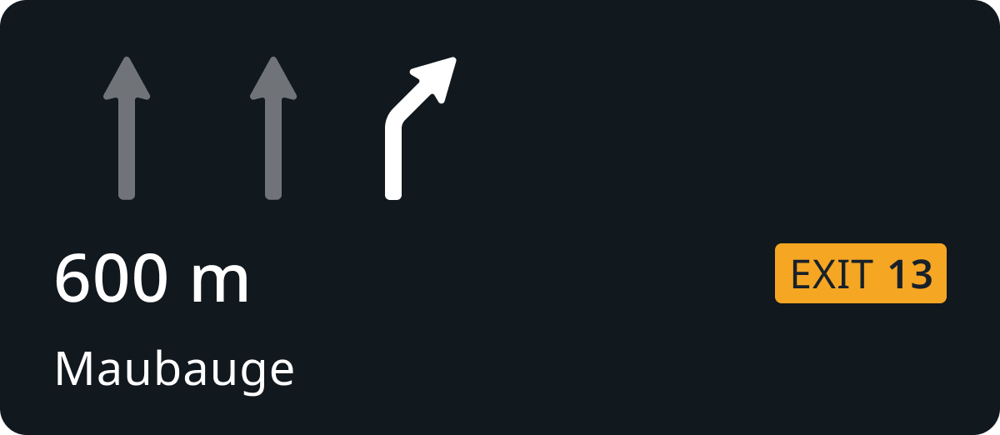 | **detached** | **Use the rightmost lane** | **to take the Exit** ***No. 13*** | **N/A** | **towards*****Maubeuge*** |
| [Exit 5](https://maps.app.goo.gl/WAT6dcUk7Sdt1B8B6) |  |  | **Split** | **Use the rightmost lane** | **to take the Exit** ***190A*** | **onto*****Interstate 94 East*** | **towards*****Port Huron*** |

  
**Attributes of exits**
==========================

Exit instructions have following attributes.

| **Attribute** | **Example** | **Description** |
|---|---|---|
| exit number | 21, 4, 18 | Exit numbers are part of signpost data.  They consist of simple ID number that used to define exits on highways. They also have specific graphical representation which varies per region. This attribute is not mandatory and it's usage varies between regions. Mostly use in EU. Less so in NAM regions. |
| Cardinal dir. | EAST, N | Cardinal direction could be attached to road identity to differentiate between two directions of the the same road. They can be represented either by full words (EAST, WEST) or just one letter (E, W). Cardinal directions can also be attached to exit numbers. Cardinal directions are mostly used in NAM region, less so in EU. |
| Towards | Zagreb, Airport | Towards information is part of signpost data and indicates major locations (usually cities, towns, airports) that this particular road is leading to. |
| Road Identity | A4, N207 | Road identity comes as road names or numbers and it is also part of signpost data. Road identity indicates roads that current road leads to. |

**Visualisation of exit numbers**
=================================

Exit numbers are graphical elements that carry certain visual style. This style is defined by local road authorities and varies per country/region. In NIE we support following regional varieties of exit numbers:

|**EU**|**US**|**UK**|
| --- | --- | --- |
| |  | 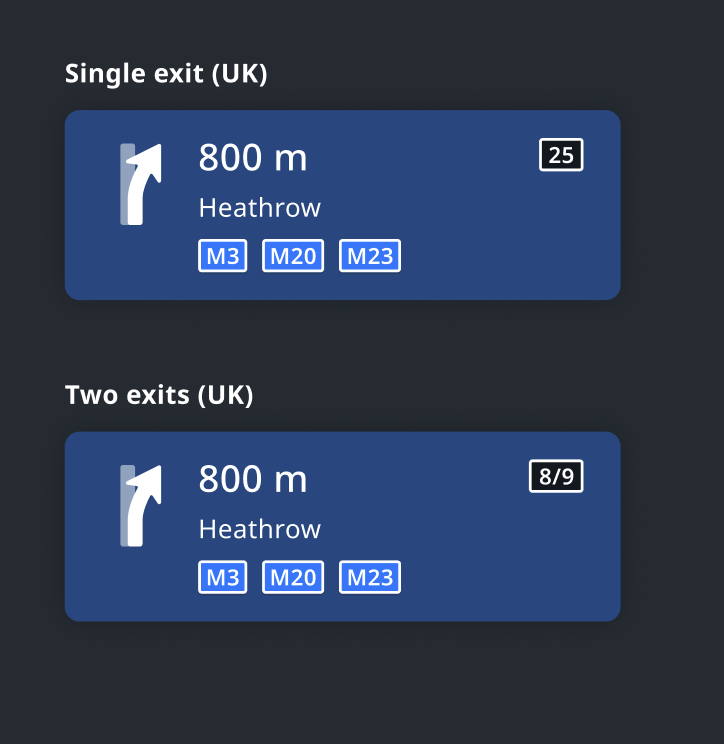 |

  
Detailed Visual Design of Exit numbers is located here:  

www.figma.com

Country specific variations of exit numbers
-------------------------------------------

In addition to regional support, we also support variations on country level. Those are captured in this spec: [NIE\_002 - Next Instruction Panel (NIP)#Localisation](https://github.com/tomtom-internal/nie-ux-spec/blob/main/Guidance%20Framework%20-%20Methods%20%26%20Components/Next%20Instruction%20panel%20-%20NIP/Next_Instruction_Panel.md)

under **section 3.1.1 Localisation.**

  
  
**Examples of Exit scenarios**  

=======================================

Example - 1
-----------

[Location](https://goo.gl/maps/kDzg9Md3ewLVFh4c6) - Split exit (from existing lane) in Urban area.

|**Driver’s View**|**Signpost**|**Split type**|
| -- | --- | --- |
| 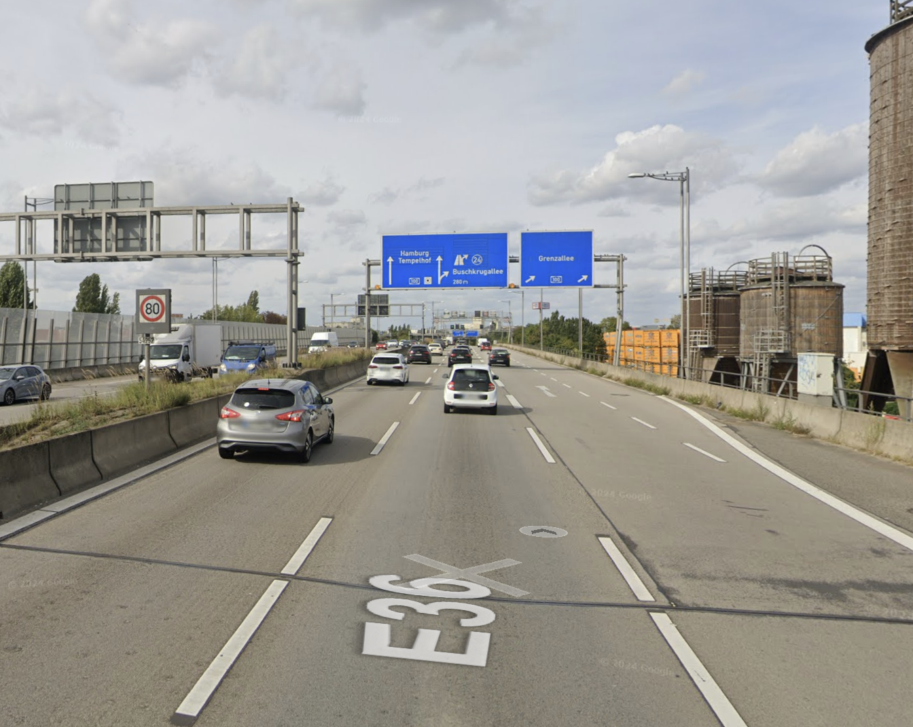 |  |  |
| |No exit number here. Only towards an road information|One lane appears as new, but second lane continues from the original path. This is a _**split**_ type of exit.|

### Instruction

| **NIP**|**Audio**|**Notes**|
| --- | --- | --- |
| |Use the right two lanes to take the exit onto A100 towards Grenzalee|There is no exit number in the signpost, but this intersection still should be classified as Exit.|

Example - 2
-----------

[Location URL](https://www.google.de/maps/dir/An+den+Treptowers+1,+12435+Berlin,+Germany/Lindauer+Str.,+10781+Berlin/@52.4768122,13.3466136,122m/am=t/data=!3m1!1e3!4m18!4m17!1m5!1m1!1s0x47a84efe675a1395:0x55dde691374698af!2m2!1d13.4616122!2d52.4954245!1m5!1m1!1s0x47a85045407613fd:0x7670e47ac3bbad02!2m2!1d13.3486065!2d52.4935864!3e0!6m3!1i0!2i2!3i1?hl=en&amp;authuser=0) - Exit can be clearly identified here because of the presence of exit number.

|**Driver’s View**|**Signpost**|**Split type**|
| -- | --- | --- |
| 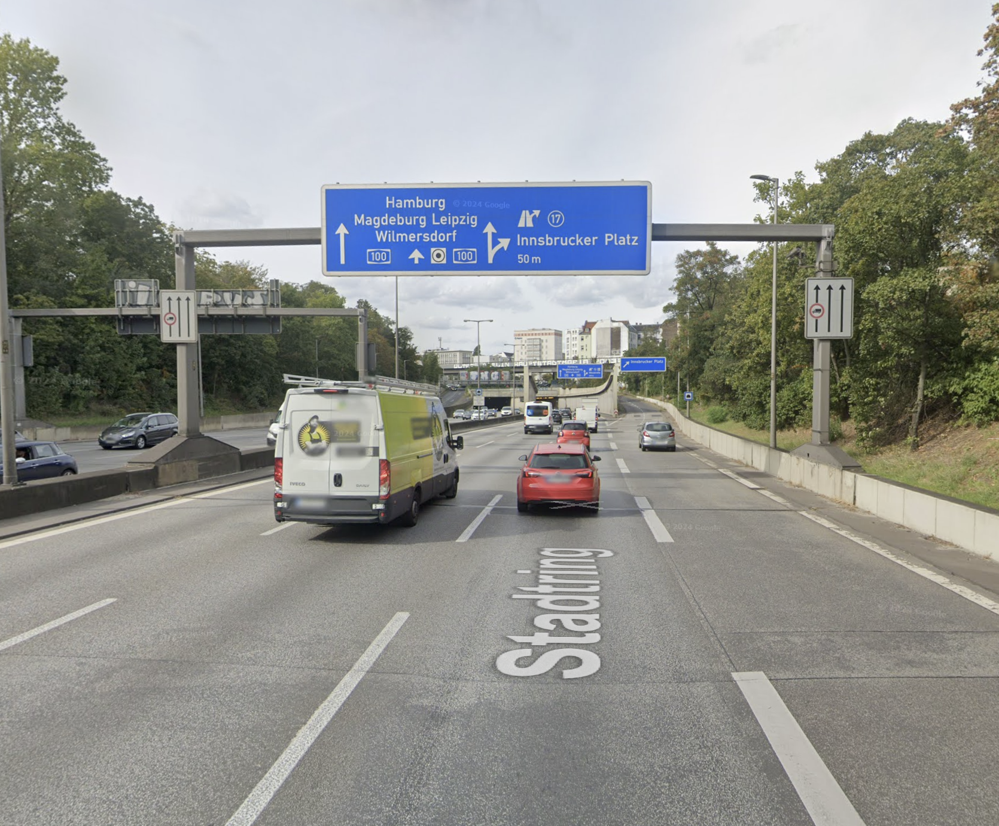| | |
||Exit number here and road information provided in te signpost|This is a _**split**_ type of exit.|

### Instruction

| **NIP**|**Audio**|**Notes**|
| --- | --- | --- |
| 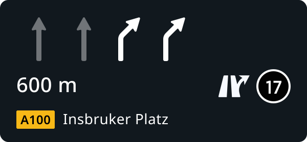 | Use the right two lanes to take the exit No. 17 towards Insbruker Platz | |

Example - 3
-----------

[Location](https://goo.gl/maps/gv821Mkbn2MgbF3SA) - There is an intersection of two Motorways, and the route switches from one to another **via an exit and connecting ramp**. This use case we call **Switch Highway**.

| **Driver’s View** | **Signpost** | **Intersection geometry** | **Split type** |
|---|---|---|---|
| 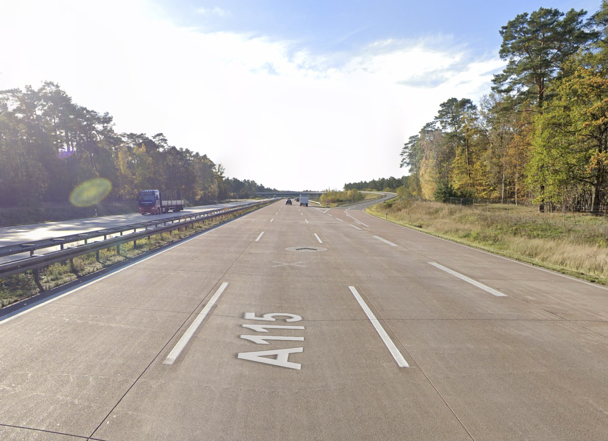 | 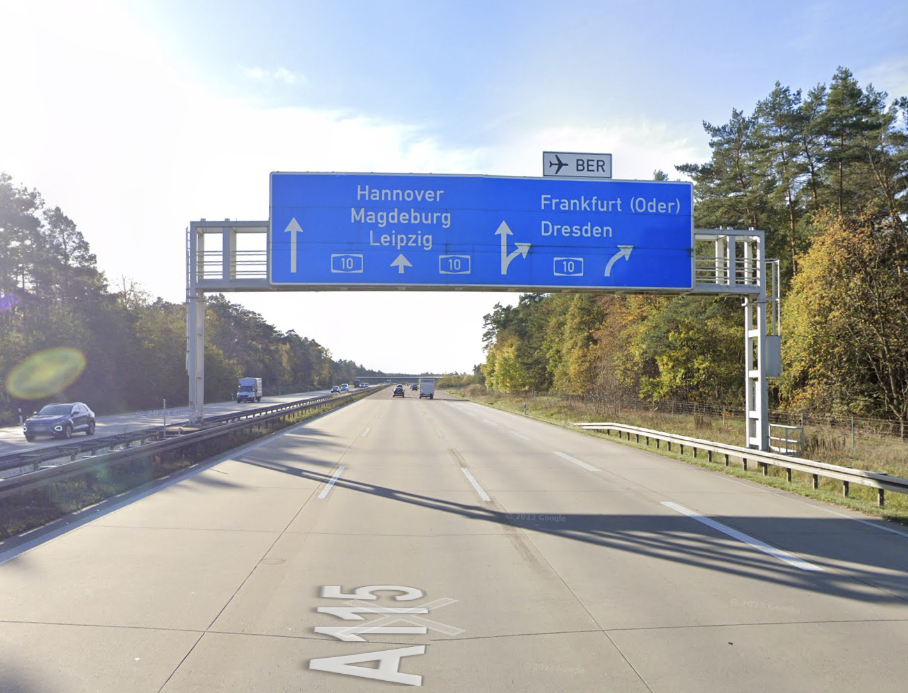 | 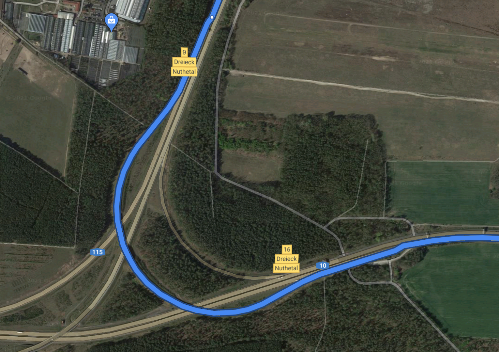 |  |
|  |  | Switch Highway manoeuvre type | Detached exit type, as new lane appears at the split point |

### Instruction

| **NIP**|**Audio**|**Notes**|
| -- | --- | --- |
| |Use the rightmost lane to take the exit No. 9 to switch to A10 towards Frankfurt Oder
| |

  
\- - END OF DOCUMENT --
=============================