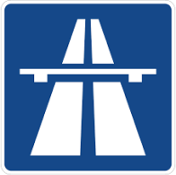
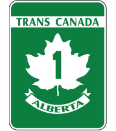

| **Interaction Designer** | [Alexey Opokin](https://tomtom.atlassian.net/wiki/people/70121:e8cb7861-9079-4b92-b96d-bfe8cd882680?ref=confluence) |
|---|---|
| **Visual Designer** | [Georgios Koultouridis](https://tomtom.atlassian.net/wiki/people/5be2fd44649a737c2342afbe?ref=confluence) |
| PM | [Joost Pennings](https://tomtom.atlassian.net/wiki/people/712020:a6d50cb1-97be-4a9a-a279-3fbb3e2e1799?ref=confluence) |

> [!NOTE]
> **What needs to be done**   Current definitions of Motorways might be out of date, especcially in the context of Orbis. This page must be synchronised or merged with glossary defined by [Maksym Osadchuk](https://tomtom.atlassian.net/wiki/people/712020:fb261b5b-de23-442e-854b-8b08f3e29b6f?ref=confluence)  here: [Motorway Guidance Glossary](https://tomtom.atlassian.net/wiki/spaces/NAV/pages/104678579/Motorway+Guidance+Glossary)

Table of Contents
=================

*   [Table of Contents](#Table-of-Contents)
*   [General definition of Motorway](#General-definition-of-Motorway)
    *   [Definition of Motorway in NIE](#Definition-of-Motorway-in-NIE)
*   [Motorway Glossary](#Motorway-Glossary)
    

  

  

**General definition of Motorway**
==================================

This document is an introduction to Motorway Instructions and lays the foundation and defines terminology.

  

**WHAT IS MOTORWAY?**

A motorway is a type of road that is designed for high-speed, long-distance travel and is typically reserved for through traffic. Motorways are characterized by their divided, multiple-lane roadways and are typically built to higher engineering standards than other types of roads.

Motorways are generally owned and operated by national or regional governments, and they are typically marked with specific signs and other markers to help drivers navigate the roadway. Motorways often have higher speed limits than other types of roads, and they are typically limited-access roads, meaning that there are few or no intersections or driveways along the roadway, and access is generally limited to specially-designated entry and exit points.

In many jurisdictions, motorways are also known as freeways or expressways. Motorways are typically used for long-distance travel and are designed to allow drivers to cover large distances quickly and efficiently. They are often the most direct route between two points and can help to reduce congestion on other types of roads.

In order to distill characteristics of Motorways, we are going to look at following criteria:

**Accessible via controlled paths only with acceleration/deceleration ramps** (this is a main deciding criteria)**Highest speed allowance** (&gt;=100km/h till unlimited)  
**Min speed limit is specified** (80km/h normally)  
**Mopeds, tractors and bicycles are not allowed**  
**Uninterrupted flow - No junctions or traffic light along the way.**

Depending on the country region they are referred to as: **Motorways, Highways, Freeways, Expressways, Interstate highways, etc**. Here and in the future we would use term Motorway (interchangeably with Highway) as a general term that covers whole range of high speed roads that might have different names in different country regions.


  

Additionally, Motorways can be identified by special road signs or Road shield that vary by region:

| Autobahn road sign in Germany (and EU) | Interstate road shield in US | Trans Canada road shield in Canada |
|---|---|---|
|  |  |  |

  

  

Definition of Motorway in NIE
-----------------------------

In order to provide rules for **Motorways in NIE**, we need to agree on our definition of Motorway. Unfortunately, there is no clear way to detect a Motorway based on NDS attributes. The problem is also complicated by the fact that there is no universally agreed standard for Motorways between countries. NDS map provides following attributes:

**IsControlledAccess** - identifies roads that have controlled access, however that non necessarily means they are Motorways. There are roads with second road class (Bundesstrasse in Germany) that can be (or can be not) belong to Controlled Access. Those second road class controlled access roads have all "Motorway" characteristics (separate directions, high speed, no traffic lights, entering via ramp only) and ideally should be treated as Motorways even though, technically they are not.

  
**IsMotorway** - identifies roads of highest road class (Autobahn in Germany, Interstate, Freeway, Expressway, etc. in US, Canada and some other areas). In EU those roads marked with special sign "Motorway". In US there is no standard markings because there are different types of Motorways and they have different indications.  
  
It is not clear what **Orbis** map provides in regards to Motorways.

  

| **How we define Motorway in NIE ?** |
|---|
| Presence of attribute **IsMotorway** is a sufficient condition for the road to be considered as **Motorway**. |
| In addition to it roads with attribute **IsControlledAccess** are considered to be a Motorways only if the speed limit at the segment of the road being checked exceeds 80km/h |

| Additional information useful for Motorways identification. |
|---|
| In EU the presence of **Autobahn** **(Motorway in German) roads sign** is sufficient to mark the road as Motorway. |
| In US, there are various types of high speed roads (Interstate for example), and each of them has special **road sign** identification |
| Other country regions might have different means for identifying high speed roads. |

  

  

Motorway Glossary
=================

Following terminology is used in the Motorway context in development documentation.

  

**Intersection** - is a point at which two or more roads cross or meet. From the developer's point of view, it's an NDS junction that has at least three outgoing arcs. Intersections are T-intersections, Y-intersections, forks, N-way intersections, and so on...

**Road situation** - is a route stretch at the junction where the instruction engine intentionally produces or suppresses the instruction. It's a pattern that consists of a set of rules. If rules are satisfied, then the road situation is detected.  Road situations may have the same names as intersections where they appear (e.g. bifurcation).

Important! It's possible to have different road situations at the same intersections depending on the route stretch.  
Let's analyze this intersection on the motorway as an example:  
[https://www.google.com/maps/place/51%C2%B014'02.3%22N+6%C2%B042'30.3%22E/@51.2338295,6.7084049,193m/data=!3m1!1e3!4m4!3m3!8m2!3d51.2339843!4d6.7084164?entry=ttu](https://www.google.com/maps/place/51%C2%B014)

This intersection type is a bifurcation since the road splits without interrupting the traffic flow.  
If the route goes through the right branch - then it's an exit road situation since it leads from a motorway to a non-motorway road:  
[https://www.google.com/maps/dir/51.2334091,6.7115605/51.2361533,6.7032187/@51.2346495,6.7048156,725m/data=!3m1!1e3!4m2!4m1!3e0?entry=ttu](https://www.google.com/maps/dir/51.2334091,6.7115605/51.2361533,6.7032187/@51.2346495,6.7048156,725m/data=!3m1!1e3!4m2!4m1!3e0?entry=ttu)

If the route continues straight - it's a natural continuation situation since the driver does not need any instruction to pass through this intersection:  
[https://www.google.com/maps/dir/51.2334091,6.7115605/51.2345804,6.7052171/@51.2338614,6.7071022,363m/data=!3m1!1e3!4m2!4m1!3e0?entry=ttu](https://www.google.com/maps/dir/51.2334091,6.7115605/51.2345804,6.7052171/@51.2338614,6.7071022,363m/data=!3m1!1e3!4m2!4m1!3e0?entry=ttu)

This way, it's possible to have a natural continuation road situation at the bifurcation intersection type. 

  

**Motorway** - is a road whose corresponding arc has either the IsMotorway flag set to true or the IsControlledAccess flag set to true and a specified minimum speed limit of 80 km/h.

**Fork** - is an intersection type where the road splits without interrupting the traffic flow.

**Bifurcation (intersection type)** - is a fork with two outgoing roads. 

**Bifurcation (road situation)** - is a road situation that happens on bifurcations (intersection type) only and always requires a fork(left, right) instruction to take one of the two possible options.

**Trifurcation (intersection type)**  - is a fork with three outgoing roads.

**Trifurcation (road situation)** - is a road situation that happens on trifurcations (intersection type) only and always requires fork(left, middle, right) instruction to take one of the three possible options.

**Highway** **Switch** - is a road situation that happens on motorways and requires a special switch highway instruction to leave the current motorway (via exit or fork) in order to take another one.

**Exit** - is a road situation which happens at forks and requires special exit instruction to leave the current motorway.

**Natural** **Continuation** - is a group of road situations when the driver does not need any instruction to pass through the intersection and stay on the route.

  

  

  

  
  

------

**/- END OF DOCUMENT -/**