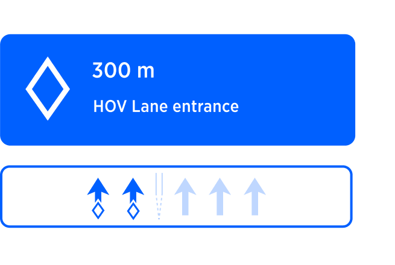

| **Interaction Designer** | [Alexey Opokin](https://tomtom.atlassian.net/wiki/people/70121:e8cb7861-9079-4b92-b96d-bfe8cd882680?ref=confluence) |
|---|---|
| **Development support** | [Alex Levin](https://tomtom.atlassian.net/wiki/people/63e4cab2614cb4ba5303b527?ref=confluence) |
| **Visual Designer** | [Georgios Koultouridis](https://tomtom.atlassian.net/wiki/people/5be2fd44649a737c2342afbe?ref=confluence) |
| PM | [Joost Pennings](https://tomtom.atlassian.net/wiki/people/712020:a6d50cb1-97be-4a9a-a279-3fbb3e2e1799?ref=confluence) |
| DEV | [User dd444](https://tomtom.atlassian.net/wiki/people/712020:1ccf91fe-75c0-4288-b527-3bcbfb0dd444?ref=confluence) [User 4944b](https://tomtom.atlassian.net/wiki/people/70121:30dcc9c2-9716-4606-81a9-709ec084944b?ref=confluence) |
| Visual Design Specification | TBD |

  

Table of Contents
=================

*   [Table of Contents](#Table-of-Contents)
*   [Introduction to HOV lanes](#Introduction-to-HOV-lanes)
    *   [Markings of HOV lanes](#Markings-of-HOV-lanes)
    *   [Signage of HOV lanes](#Signage-of-HOV-lanes)
*   [Guidance approach to HOV Lanes](#Guidance-approach-to-HOV-Lanes)
*   [HOV Exit Instruction triggering](#HOV-Exit-Instruction-triggering)
*   [QUESTIONS](#QUESTIONS)
    *   [Rules](#Rules)
    *   [Entry/exit rules for HOV](#Entryexit-rules-for-HOV)
    *   [Lane identification](#Lane-identification)
    *   [Lane recommendations](#Lane-recommendations)

Introduction to HOV lanes
=========================

High Occupancy Vehicle (HOV) lanes, also known as carpool lanes or diamond lanes, are designated lanes on highways and freeways in the United States that are reserved for vehicles with multiple occupants. These lanes are designed to promote carpooling and reduce traffic congestion by providing preferential treatment to vehicles carrying a certain number of passengers.

Here are some key points about HOV lanes in the USA:

**1\. Purpose:** The primary objective of HOV lanes is to encourage ridesharing and reduce the number of single-occupancy vehicles on the road, thereby improving traffic flow and air quality.

**2\. Occupancy Requirements:** HOV lanes typically require vehicles to have a minimum number of occupants to qualify for their use. The exact occupancy requirements may vary from state to state and even within different sections of highways.

**3\. Eligible Vehicles:** In addition to carpools, HOV lanes often allow certain types of vehicles to use them, even with a single occupant. These may include motorcycles, buses, vanpools, plug-in hybrid or electric vehicles (EVs), or specific low-emission or alternative fuel vehicles. The eligibility criteria for these vehicles can vary depending on the state and local regulations.

**4\. Operating Hours:** HOV lanes are typically operational during peak traffic hours to maximize their impact on congestion relief. The specific hours of operation may vary by location, but they are usually indicated by signage.

**5\. Lane Separation:** HOV lanes are physically separated from regular lanes to maintain traffic flow and minimize interference from non-HOV vehicles. Separation may be achieved through the use of double yellow lines, barriers, or solid white lines.

**6\. Markings and Signs:** HOV lanes are clearly marked with signage indicating their purpose and the occupancy requirements. Signs may display the minimum number of occupants required or specific vehicle types eligible for the lane. These signs are usually located at regular intervals along the roadway to inform drivers.

**7\. Enforcement:** HOV lane usage is enforced by law enforcement officers who monitor compliance with occupancy requirements. Violators can be subject to fines or other penalties, which discourage unauthorized use of these lanes.

It's important to note that regulations regarding HOV lanes can vary from state to state and even within different municipalities. Therefore, it is advisable to consult local traffic laws or the specific state department of transportation's website for precise information regarding HOV lane rules and regulations in a particular area.

  

Markings of HOV lanes
---------------------

| Description                                                                                                                                                                                                                                                                                                                                                                                                                                                                                                                                                                                                                                                                                                                      | Schematic view | Driver View |
|----------------------------------------------------------------------------------------------------------------------------------------------------------------------------------------------------------------------------------------------------------------------------------------------------------------------------------------------------------------------------------------------------------------------------------------------------------------------------------------------------------------------------------------------------------------------------------------------------------------------------------------------------------------------------------------------------------------------------------|---|---|
| 1. **Diamond Symbol:** HOV lanes are often marked with a diamond symbol placed on the pavement at regular intervals. The diamond symbolizes the designation of the lane as a high occupancy vehicle lane.  2. **Solid (or double) White Lines:** HOV lanes are typically separated from regular lanes by solid (or double) white lines. These lines indicate that crossing into and out of the HOV lane is not allowed, except at designated entry or exit points.  3. **Double Yellow Lines:** In some cases, HOV lanes may be separated from regular lanes by double yellow lines. Crossing the double yellow lines is prohibited, indicating that vehicles should not enter or exit the HOV lane except at designated points. |  |  |
| There are two main scenarios regarding topography of HOV lanes:  

     **S1: HOV have dedicated entry and exit points**. The rest of HOV lane is marked by solid line. The areas where HOV lane can be entered or exited we call ***"windows"*** further in the document. Those windows could be various lengths. Typically around 0\.25miles.        **S2: HOV doesn't have entry/exit points**, but it is simply separated from the main road via special dotted line. Entry/exit to/from HOV lanes are possible at any time.                                                                                                                                                                                                     |  |  |

  
  

Signage of HOV lanes
--------------------

HOV lanes often have signs indicating where vehicles can enter or exit the lane. These signs may include arrows and specific instructions for accessing or leaving the HOV lane.

| **Occupancy Requirement Signs** | HOV without requirements sign |
|---|---|
|  |  |
| Along the HOV lane, you may see signs indicating the minimum number of occupants required to use the lane. These signs may display the number "2\+" or "3\+" to indicate the minimum occupancy requirement. |  |

  

  
Guidance approach to HOV Lanes
=================================

Guidance engine **will assume that vehicle can drive on HOV lane** and suggest to switch to it when appropriate (at HOV entry point or when dotted line appears). However, we need to keep in mind that since guidance engine at it's current stage, has no way to validate the requirements for HOV, and vehicle occupancy, this suggestion needs to be assessed by the driver. Guidance will suggest to switch to HOV lane or exit HOV lane via special instructions. We need to separate two main scenarios for guidance since the logic covering them is little bit different.

  

  

**S1 - HOV with dedicated entry/exit points.**

Those HOV lanes are separated from the main road via solid line and allow entering/exiting only at dedicated windows.

|  | ****Entry HOV**** | ****Exit HOV**** |
|---|---|---|
| **NIP** |  |  |
| **Visual design notes** | The main instruction arrow for HOV entry, probably should reflect road signage: Diamond shape.      It would be good, if visually possible, to indicate the type of the entry/Exit separation line (dotted line transforming to solid double line) in the SLG section.      It would be also good to reflect diamond shapes in the lane markings themselves. | The main instruction arrow for HOV entry, probably should not be the same as entry: Diamond shape, since we suppose to leave the lane. Maybe some combination of diamond shape and leaving arrow, otherwise just leaving arrow.      It would be good, if visually possible, to indicate the type of the entry/Exit separation line(solid double line transformed to dotted line) in the SLG section.      It would be also good to reflect diamond shapes in the lane markings themselves. |
| **Visual Trigger** | Visual guidance according to standard procedure defined in triggering logic. | Visual guidance according to standard procedure defined in triggering logic. |
| **Audio** | In 300meters, Keep left to Enter HOV lane | In 300meters, Exit HOV lane |
| **Audio Trigger** | Audio trigger according to standard procedure described in Triggering logic | Audio trigger according to standard procedure described in Triggering logic |

  

  

  

**S2 - HOV separated by dotted line**

Those HOV lanes are separated from the main road via dotted line and allow entering/exiting at any point along the line. 

|  | **Entry HOV** | **Exit HOV** |
|---|---|---|
| **NIP** |  | No need for an Exit instruction, as it is not different from normal lane. |
|  | The main instruction arrow for HOV entry, probably should reflect road signage: Diamond shape.      It would be good, if visually possible, to indicate the type of the entry/Exit separation line (persistent dotted line) in the SLG section.      It would be also good to reflect diamond shapes in the lane markings themselves. |  |
| **Audio** | In 300meters, Keep left to Enter HOV lane | No need for an Exit instruction, as it is not different from normal lane. |

HOV Exit Instruction triggering
===============================

For **Scenario-1**, HOV exits (windows) are posing some challenge because their placement in relation to the target highway exit might vary significantly. In case route leads to a highway exit on the right, driver must Exit HOV lane (which is on the left) upfront, otherwise he will not be able to cross solid line of the HOV lane later. To address this, we try to select a window for exiting HOV lane way before the actual exit, to leave enough time for the driver. Here is the basic logic used to define which particular window to select for given highway exit in case there are few.

  

1.  First, we try to locate a window which is in a range of 2-4mi from the exit. If there is a such window, we select the closest one
2.  2\. If there are no windows in the given range, we look up the range of 1-2mi. If there is a windows in the given range, we select the closest one.
3.  If first two steps produce no results, we give up and hope that there must be a window just before the exit. Since this window will be very close to actual exit, we don't need special Exit HOV instruction, but can just rely on the exit highway instruction itself.

  

**Scenario 2** is different as there is no windows for exiting/entering lanes. For this reason, Exit HOV instruction is not triggered specifically - instead, just exit Highway instruction itself is used.

  

  

QUESTIONS
=========

Following questions need to be answered.

| Question | Answer |
|---|---|
| If there are several entries to HOV, should we announce second entry? | NO |
| Do we have any data on HOV requirements (occupancy number)? If yes, we can visualise this in the NIP. | ? |
| HOV exits are positioned near highway exits. Should we combine HOV exit with Highway exit? Or, maybe, chain instruction? | ? |
| If we assume that driver is going along HOV lane and we approach a Fork. What should we do in this case?       A: We issue for instruction, because we dont know exactly if driver has taken HOV lane or not.   B: We dont offer fork instruction following our original assumption that he is driving along HOV lane. | ? |
| What is the desired behavior when a driver deviates (route re\-plan) while driving on HOV? (Need to check if it is possible, eg. gas stations on HOV) | ? |

Rules
-----

Entry/exit rules for HOV
------------------------

_**HCP3 specification:**  
The driver would like to see the best possible route and guidance, when he enables HOV roads to be taken into account. As the driver would not care about separately digitized HOV or HOV and non-HOV on the same link, the following rules apply also for generating **Guidance** advices:_

_Decision to take HOV (for both: separately digitized HOV as well as HOV and non-HOV on the same link):_

*   _stay at least 2miles on HOV lane or link_
*   _entry of highway to entry of HOV lane or link: at least 1 mile_
*   _exit of HOV lane or link to exit of Highway: at least 2 miles_

_Guidance special case: no dedicated HOV exit maneuver in the following case :_

*   _HOV lane is no separately digitized link AND_
*   _HOV lane is only separated with dashed line (entry and exit always possible)_

Lane identification
-------------------

  

Lane recommendations
--------------------