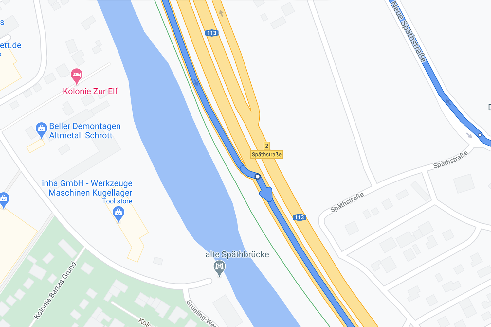
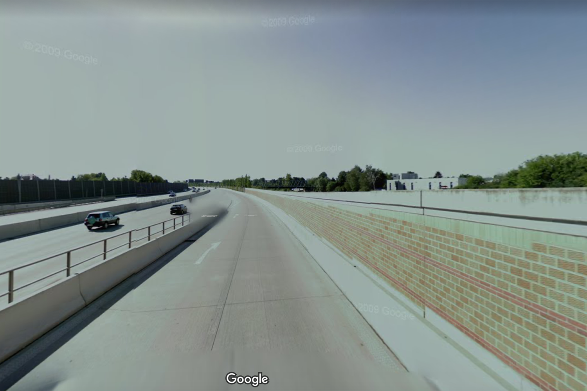
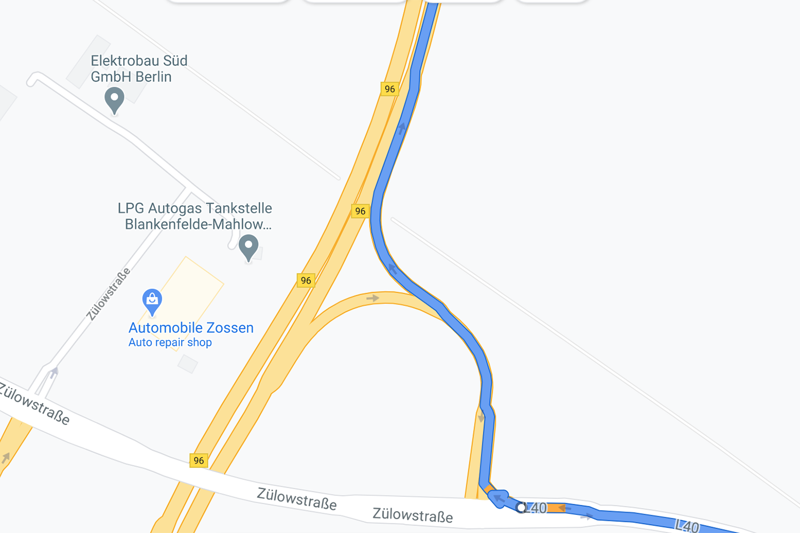

| **Interaction Designer** | [Alexey Opokin](https://tomtom.atlassian.net/wiki/people/70121:e8cb7861-9079-4b92-b96d-bfe8cd882680?ref=confluence) |
|---|---|
| PM | [Joost Pennings](https://tomtom.atlassian.net/wiki/people/712020:a6d50cb1-97be-4a9a-a279-3fbb3e2e1799?ref=confluence) |

  

Table of Contents
=================

*   [Table of Contents](#Table-of-Contents)
*   [Introduction](#Introduction)
*   [Conditions for instruction](#Conditions-for-instruction)
*   [Merge Instruction Triggering](#Merge-Instruction-Triggering)
*   [Merge Instruction](#Merge-Instruction)
    *   [EXAMPLE 1 - Motorway Merge](#EXAMPLE-1---Motorway-Merge)
        *   [Road Situation](#Road-Situation)
        *   [Visual Instruction](#Visual-Instruction)
    *   [EXAMPLE 2 - Non-Motorway Merge](#EXAMPLE-2---Non-Motorway-Merge)
        *   [Road Situation](#Road-Situation)
        *   [Visual Instruction](#Visual-Instruction)

  

  

**Introduction**
================

This Instruction is special in a way that it is not an instruction at all in normal terms. In fact there is no manoeuvre is to be preformed by the driver, as merging doesn't give any possibilities for the manoeuvre besides continuing straight. Still the instruction is given and it's purpose is **to prepare the driver to a potentially dangerous situation** that requires higher level of attention - merging to high speed traffic. This situation considered to be dangerous, especially for new drivers, and it is a good practice to announce it even though it doesn't bring any guiding information. Due to this quality the instruction doesn't have all normal audio announcements (Early, Main) but is only announced once - at confirmation triggering point.  
  

Conditions for instruction
==========================

The instruction is given when vehicle is approaching a point where current (lower class road) is going to merge to a higher Road class (usually Motorway) via specially designed **acceleration ramp**. An **acceleration ramp**, also known as an **on-ramp** or **entry ramp**, is a section of road designed to allow vehicles to accelerate to the speed of traffic on a motorway before merging. It provides a dedicated lane where drivers can increase their speed to match the flow of vehicles on the main roadway, facilitating a smoother and safer entry onto the motorway. The design of the ramp typically includes a gentle curve and sufficient length to allow for safe acceleration and merging. 

Merge Instruction Triggering
============================

Merge Instruction does not use standard triggering logic because it should not be repeated multiple times as all other instructions. Only Confirmation phase is announced by Audio, all other phases are suppressed.

  

Merge Instruction
=================

There are slight variation of the Merge instruction depending on the road class. Below are two examples of Merge to different road class.

EXAMPLE 1 - Motorway Merge
--------------------------

This instruction is given at the merging point to Motorways. [Location URL](https://www.google.com/maps/dir/52.4537076,13.4589479/52.4502693,13.4643892/@52.4517529,13.4617187,224m/data=!3m1!1e3!4m2!4m1!3e0)

### Road Situation

| **Road Geometry** | **Driver's View** |
|---|---|
|  |  |

  

### Visual Instruction

| **NIP** | **Notes** |
|---|---|
|  | When entering an ***Motorway*** (which is always marked on the entrance by Motorway signpost) ***Motorway icon*** is used only in areas that follow ***Vienna convention*** for Road signs. In other areas, where Vienna Convention is not applicable, corresponding alternative icon must be used (if available) which is representing Motorways in this region. If no symbol is provided for Motorways, "Merge" icon should be used instead. |

NOTE: Term _**"Motorway"**_ used here refers to a Controlled Access Highway type of roads and it has different names in different regions.  Correct term applicable to specific area of the map should be used here. 

REFERENCE: Common English terms are **freeway** (in Australia, South Africa, and the United States), **motorway** (in the United Kingdom, Pakistan, Ireland, New Zealand and parts of Australia) and **expressway** (parts of Canada, parts of the United States, parts of the United Kingdom, India and many other Asian countries). Read more about Controlled access road type [here](https://en.wikipedia.org/wiki/Controlled-access_highway).

  

**Audio Instruction**

| component | Value | Notes |
|---|---|---|
| Distance | \-\- | Distances are not announced at Confirmation phase |
| Pointer | \-\- | There is no Pointer. |
| Action | take the A113 | A113 is the motorway ID we are merging to |
| Purpose | \-\- | The action is also the final purpose of the manoeuvre, therefore, the purpose left blank. |
| Direction | \-\- | \-\- |

  

  

EXAMPLE 2 - Non-Motorway Merge
------------------------------

This instruction is given at the merging point to Non-Motorways roads that still have motorway-like geometry **with acceleration ramp**. [Location URL](https://www.google.com/maps/place/52%C2%B018%2759.4%22N+13%C2%B027%2706.4%22E/@52.316488,13.451769,17z/data=!3m1!4b1!4m4!3m3!8m2!3d52.316488!4d13.451769?entry=ttu)

  

### Road Situation

| **Road Geometry** | **Sattelite View** |
|---|---|
|  |  |

  

  

### Visual Instruction

| **NIP** | **Notes** |
|---|---|
|  | When entering a Higher class road via acceleration ramp ***Merge icon*** is used. |
|  | In case the entrance to Motorway comes from the left side, appropriate manoeuvre icon should be used. |

  

  

**Audio Instruction**

| component | Value | Notes |
|---|---|---|
| Distance | \-\- | Distances are not announced at Confirmation phase |
| Pointer | \-\- | There is no Pointer. |
| Action | take the B96 | B96 is the Road ID we are merging to |
| Purpose | \-\- | The action is also the final purpose of the manoeuvre, therefore, the purpose left blank. |
| Direction | \-\- | \-\- |