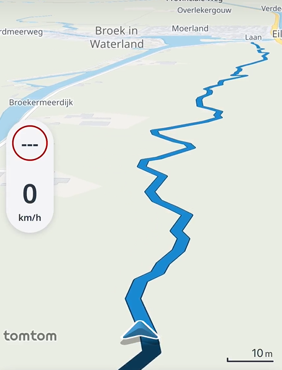
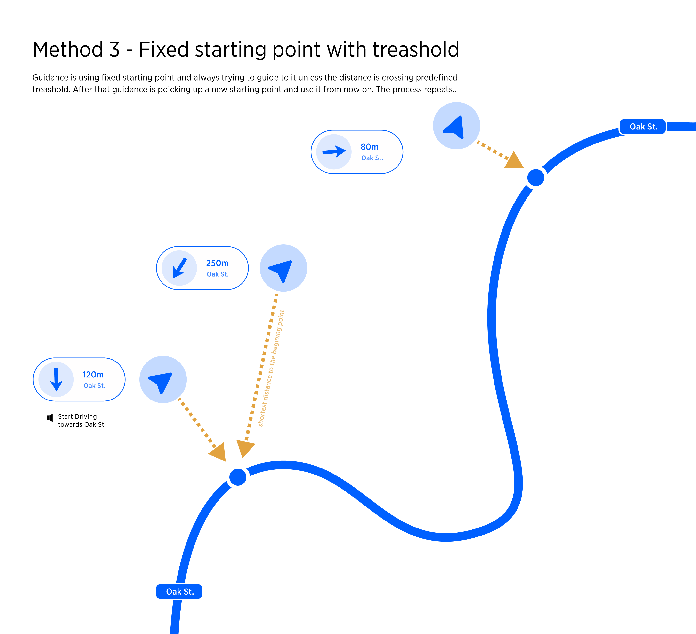

| **Interaction Designer** | [Alexey Opokin](https://tomtom.atlassian.net/wiki/people/70121:e8cb7861-9079-4b92-b96d-bfe8cd882680?ref=confluence) |
|---|---|
| **Visual Designer** | [Georgios Koultouridis](https://tomtom.atlassian.net/wiki/people/5be2fd44649a737c2342afbe?ref=confluence) |
| PM | [Joost Pennings](https://tomtom.atlassian.net/wiki/people/712020:a6d50cb1-97be-4a9a-a279-3fbb3e2e1799?ref=confluence) |
| Visual Design Specification |  |

  

Table of Contents
=================

*   [Table of Contents](#Table-of-Contents)
*   [Introduction](#Introduction)
*   [Follow an imported track](#Follow-an-imported-track)
*   [Diverting from road network](#Diverting-from-road-network)

Introduction
============

Placeholder page for the off road navigation use cases.  
Currently the following use cases can be identified:

Follow an imported track
========================

*   Driver imports a track from file / web portal
*   Driver follows a track

*   Driver diverts from track  
      
    [Epic: Off-road navigation from imported tracks: Batch I-0](https://tomtom.atlassian.net/wiki/spaces/GOSDK/pages/213489646/Epic+Off-road+navigation+from+imported+tracks+Batch+I-0)  
      
    
*   Driver diverts from track to on road
*   Driver diverts from on road back to the track
*   Driver reaches way point / destination of imported track  
      
    

Diverting from road network
===========================

*   Driver starts following a route when the current location is off road

[Off-road guidance proposals](https://tomtom.atlassian.net/wiki/spaces/~vsh/pages/115771082/Off-road+guidance+proposals) (option 3)

  

*   Driver diverts from route and drives off road
*   Driver returns on the route