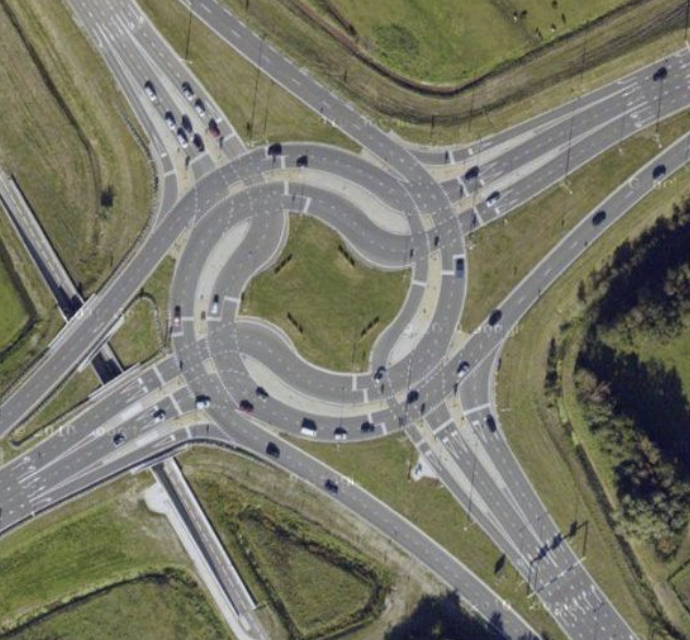
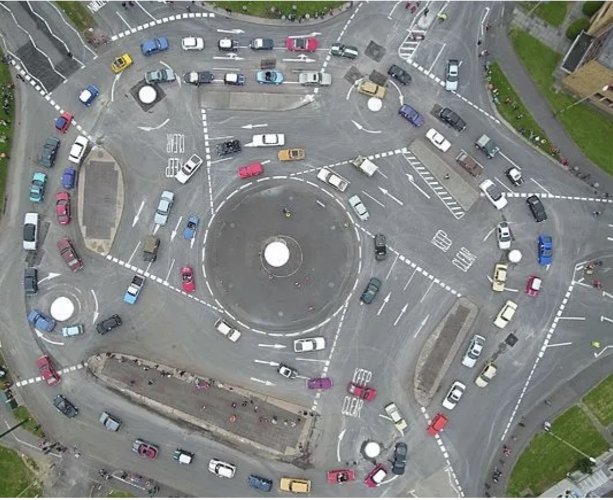
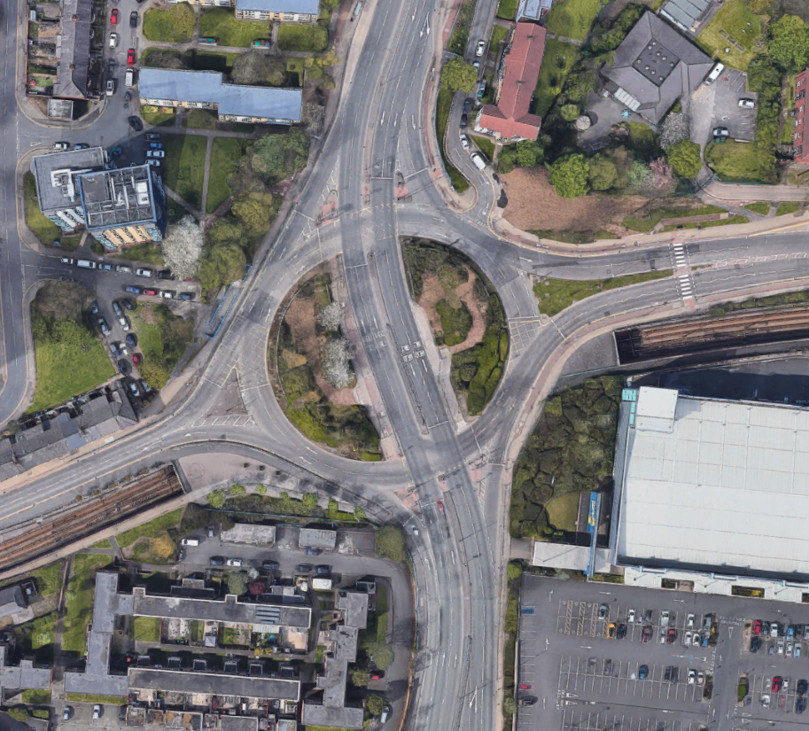

| **Interaction Designer** | [Alexey Opokin](https://tomtom.atlassian.net/wiki/people/70121:e8cb7861-9079-4b92-b96d-bfe8cd882680?ref=confluence) |
|---|---|
| **Visual Designer** | [Georgios Koultouridis](https://tomtom.atlassian.net/wiki/people/5be2fd44649a737c2342afbe?ref=confluence) |
| **PM** | [Joost Pennings](https://tomtom.atlassian.net/wiki/people/712020:a6d50cb1-97be-4a9a-a279-3fbb3e2e1799?ref=confluence) |
| **ENG Owner** | TBD |

Introduction to Roundabouts
===========================

A **roundabout** is a type of road intersection designed to improve traffic flow and safety by eliminating the need for traffic signals or stop signs. It is a circular junction where vehicles travel in a counterclockwise direction (in most regions) around a central island. Roundabouts are commonly used in many countries around the world and have proven to be effective in reducing traffic congestion, minimizing accidents, and improving overall traffic efficiency.

Key features and characteristics of a roundabout include:  

1.  **Circular Shape:** Roundabouts are circular in design, with a central island or traffic circle located in the center of the intersection.
    
2.  **Entry and Exit Lanes:** Approach lanes lead into the roundabout from multiple directions. Vehicles yield to the traffic already inside the roundabout before entering it.
    
3.  **Yield Control:** Unlike traditional intersections with stop signs or traffic signals, roundabouts use yield signs at the entry points. Vehicles entering the roundabout must give way to traffic already circulating within it.
    
4.  **Counterclockwise Movement:** Vehicles within the roundabout move in a counterclockwise direction around the central island (with an exception or left driving countries)
    
5.  **One-Way Traffic:** Roundabouts are designed to have one-way traffic flow, which helps reduce the risk of severe accidents like head-on collisions.
    
6.  **Pedestrian Crossings:** Most modern roundabouts are designed with crosswalks or pedestrian islands, allowing pedestrians to cross one direction of traffic at a time, enhancing safety for pedestrians as well.
    
7.  **Low-Speed Environment:** Roundabouts are typically designed with curvature and lane widths that encourage drivers to slow down as they navigate the intersection.
    
8.  **Landscaping and Aesthetics:** Many roundabouts feature landscaping and decorative elements on the central island, making them visually appealing and contributing to the overall beautification of the area.  
    

While all those attributes are typical for traditional roundabouts, there are exceptions - **Signalised roundabouts**. While traditional roundabouts operate without traffic signals, **"signalized roundabouts"** or **"roundabout intersections with traffic lights"** incorporate traffic lights to manage traffic flow. These signalized roundabouts have also circular design and counterclockwise traffic flow characteristic of traditional roundabouts, but they also feature **traffic lights at the entry and exit points**. The traffic lights help control the flow of vehicles and pedestrians, especially during peak traffic periods when the volume of vehicles may be too high for an unsignalized roundabout to handle efficiently.

Overall, roundabouts are considered a safer and more efficient alternative to traditional intersections, as they help to reduce the severity and frequency of collisions while maintaining a smooth traffic flow.

**Roundabout types**

Roundabouts can be classified into different types based on their design, size, and the number of lanes they have. This classification might lead to different treatment of certain roundabout types. The main types of roundabouts include:

| **ID** | **Name**                 | **Geometry**              | **Description**                                                                                                                                                                                                                                                                                                                                                                                                                                                                                                                                                                                                                                                                                                                                                                                |
|--------|--------------------------|---------------------------|------------------------------------------------------------------------------------------------------------------------------------------------------------------------------------------------------------------------------------------------------------------------------------------------------------------------------------------------------------------------------------------------------------------------------------------------------------------------------------------------------------------------------------------------------------------------------------------------------------------------------------------------------------------------------------------------------------------------------------------------------------------------------------------------|
| 1      | Mini Roundabouts         |  | Mini roundabouts are small in size and often used at low\-traffic intersections or to improve traffic flow in residential areas. They typically have a single lane and a small central island.    EXAMPLE: 31\.762777188430196, 35\.21322398829558  This type of Roundabout is covered under [generic roundabout instruction](./Generic%20Roundabout%20Instruction/Generic_Roundabout_Instruction.md)                                                                                                                                                                                                                                                                                                                                                                          |
| 2      | Single\-Lane Roundabouts |  | *Single\-lane roundabouts* are the most common type and consist of a single circular lane that all vehicles follow in a counterclockwise direction. They typically have one entry and one exit lane for each approach. *Mini* and *Single\-lane* roundabouts just differ in size.  EXAMPLE: 52\.503559474837125, 13\.410877099213769  This type of Roundabout is covered under [generic roundabout instruction](./Generic%20Roundabout%20Instruction/Generic_Roundabout_Instruction.md)                                                                                                                                                                                                                                                                                        |
| 3      | Multi\-Lane Roundabouts  |  | *Multi\-lane roundabouts* have two or more concentric circular lanes for traffic flow. These roundabouts can accommodate higher traffic volumes and often have more than one entry and exit lane for each approach. *Multi\-lane roundabouts* are often also *Signalised*.  EXAMPLE: 52\.512361534163716, 13\.321874133441352  This type of Roundabout is covered under [generic roundabout instruction](./Generic%20Roundabout%20Instruction/Generic_Roundabout_Instruction.md)                                                                                                                                                                                                                                                                                               |
| 4      | Turbo Roundabouts        |  | Also known as dumbbell roundabouts, are a variation of multi\-lane roundabouts. They have additional entry and exit lanes in the central island, which creates a "dumbbell" shape  EXAMPLE: 51°17'47\.7"N 3°51'47\.1"E  NOTE: Turbo Roundabouts are new and not very common.  Currently are not covered by NIE Design.  \[]A: Turbo roundabouts are quite common in the Netherlands.                                                                                                                                                                                                                                                                                                                                                                                           |
| 5      | Magic roundabouts        |  | Magic roundabouts (also called "circus" or "ring junctions") are complex roundabouts with multiple concentric rings of traffic flowing in different directions. They are typically found in the United Kingdom and are designed to manage heavy traffic loads efficiently.  EXAMPLE: [51\.562832503351785, \-1\.7714542711640355 (Swindon Magic Roundabout)](https://www.google.de/maps/@51.562825,-1.771465,168m/data=!3m1!1e3?entry=ttu)  NOTE: Magic roundabouts are not very common.  Currently are not covered by NIE Design.                                                                                                                                                                                                                                             |
| 6      | Signalized Roundabouts   |  | *Signalized roundabouts*, as mentioned earlier, are roundabouts with traffic lights at the entry and/or exit points. These are used to manage high traffic volumes more effectively. *Signalised Roundabouts* usually have names associated with them.   EXAMPLE: 52\.518471, 13\.428274  This type of Roundabout is covered under [generic roundabout instruction](./Generic%20Roundabout%20Instruction/Generic_Roundabout_Instruction.md)                                                                                                                                                                                                                                                                                                                                    |
| 7      | Hamburger Roundabouts    |  | Cut\-through roundabouts, also known as 'throughabouts' or 'hamburger roundabouts', combine a roundabout with a straight road. This design necessitates the use of traffic lights—it would be impossible to safely cross the area where the roundabout and main carriageway intersect otherwise.  Naturally, obeying the traffic lights is key to traversing such junctions safely. You'll typically come across several sets of lights as you work your way around the roundabout—necessary for safety reasons, but making this one of the more frustrating junctions to encounter if you need to take the third exit!  EXAMPLE: 53\.4830635559805, \-2\.3307660154463528  NOTE: Hamburger roundabouts are not very common.  Currently are not covered by NIE Design. |

Guiding through Roundabouts
===========================

Navigation systems follow specific patterns to guide drivers around roundabouts. The instructions provided guidance system aim to ensure safe and efficient navigation through the circular junction. Here are important phases of navigation through roundabout:  

1.  **Approaching the Roundabout:**
    
    *   As the driver approaches the roundabout, the navigation system will say: _**"In \[X\] meters/yards, at the Roundabout, take the \[Nth\] exit"**_  
        
2.  **Lane Guidance:**
    
    *   If the roundabout has multiple lanes, the navigation system may provide lane guidance to help the driver get into the correct lane for their intended exit. For example, it might say, _**"Stay in the right lane to take the first exit..."**_ 
        
3.  **Navigating the Roundabout:**
    
    *   While driving through the roundabout, the navigation system might not provide continuous instructions since the circular nature of the junction should be straightforward, however, if roundabout is big enough, it might provide _**Exit Instruction**_  
        
4.  **Exiting the Roundabout:**
    
    *   As the driver approaches their desired exit, the navigation system will announce the exit in advance. It might say, _**"Exit roundabout the \[street name\]"**_   
        
5.  **After Exiting the Roundabout:**
    
    *   Once the driver has successfully exited the roundabout, the navigation system may provide guidance for the next steps in the journey.  
        

Next Chapters
=============

For more detailed definition of generic roundabout instruction please follow to this page: [Generic Roundabout instructions](./Generic%20Roundabout%20Instruction/Generic_Roundabout_Instruction.md).

Some special types of Roundabouts would require special treatment in the Instruction handling.  
Those types will be covered here:  ["Special Roundabouts Intsructions"](./Special%20Cases%20%20/Special_Cases.md)

 / END OF DOCUMENT
==================