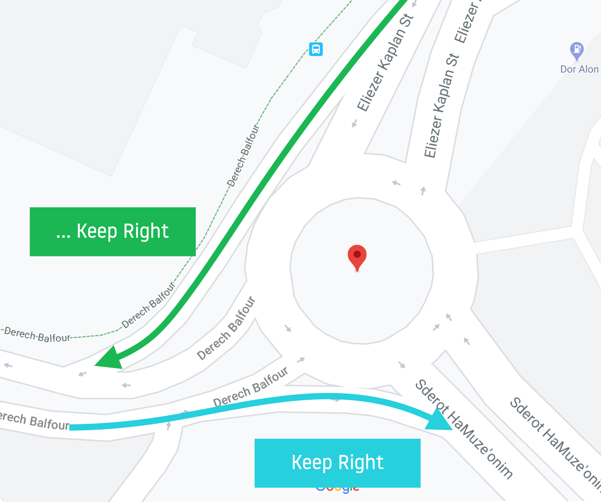
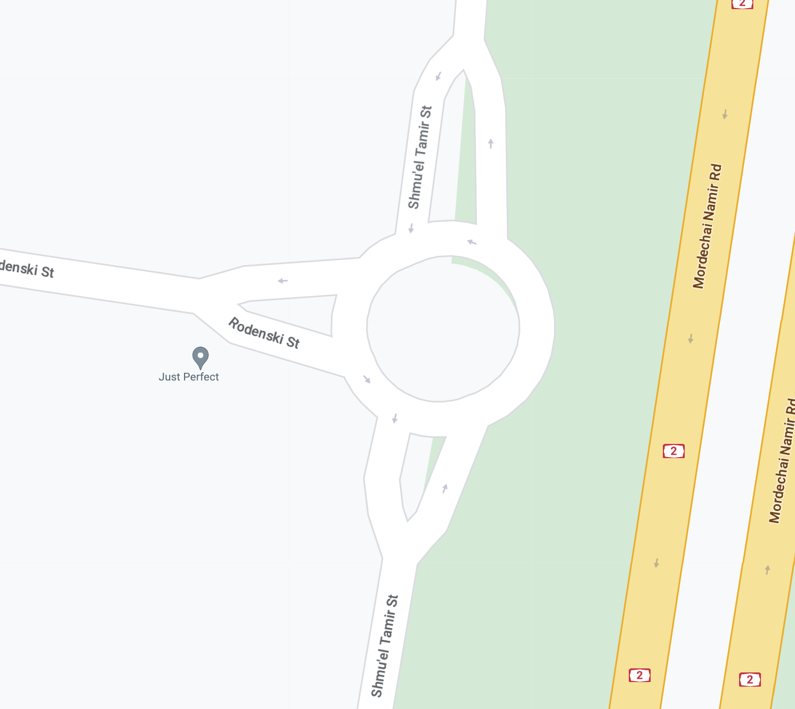
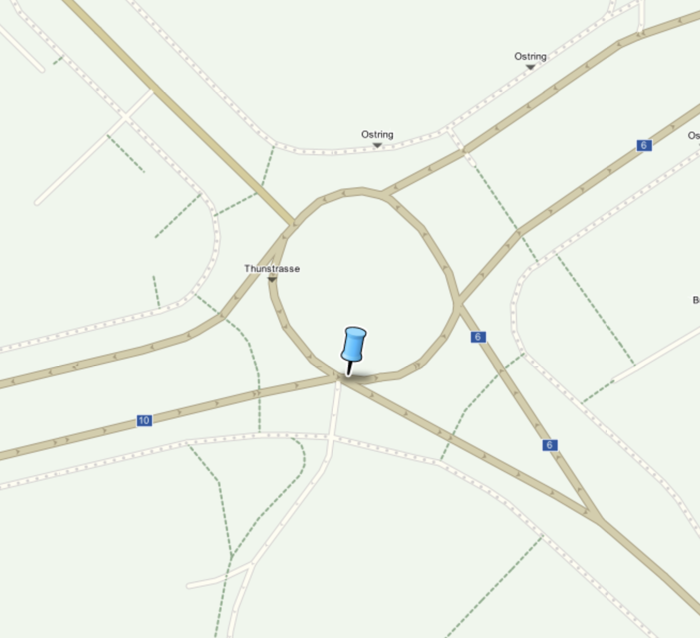

| **Interaction Designer** | [Alexey Opokin](https://tomtom.atlassian.net/wiki/people/70121:e8cb7861-9079-4b92-b96d-bfe8cd882680?ref=confluence) |
|---|---|
| **Visual Designer** | [Georgios Koultouridis](https://tomtom.atlassian.net/wiki/people/5be2fd44649a737c2342afbe?ref=confluence) |
| **PM** | [Joost Pennings](https://tomtom.atlassian.net/wiki/people/712020:a6d50cb1-97be-4a9a-a279-3fbb3e2e1799?ref=confluence) |

Introduction
============

This page defines corner cases and deviations from [Generic Roundabout Instruction](./../Generic%20Roundabout%20Instruction/Generic_Roundabout_Instruction.md) design.

Deviations inside the roundabout
================================

Driver passes the correct exit and continues to drive along the circle of the roundabout….

| **Scenario** | **Scenario description** | **Behaviour** |
|---|---|---|
| passing the exit | Driver passes the correct exit and continues to drive along the circle of the roundabout…. | After passing the correct exit, the instruction keeps showing "exit roundabout" manoeuvre arrow. Distance is absent. This state is kept as long as driver stays on the roundabout. After the exit, route recalculation process starts. |
| taking early exit | Driver doesnt reach the target exit and takes the exit before. | Route recalculation starts immediately after detection of deviation. |

Tangential entries
==================

Entries and exits are not aways perfectly radial to the circle of Roundabout. In many cases they come as tangent lines and also curve at the entrance/exit. Handling those situations adds some complexity.

| **Type**                                                                                                                                                                                                                                                               | **Roundabout Geometry** | **Notes**                                                                                                                                                                                                                                                                                                                                                                                                                       |
|------------------------------------------------------------------------------------------------------------------------------------------------------------------------------------------------------------------------------------------------------------------------|---|---------------------------------------------------------------------------------------------------------------------------------------------------------------------------------------------------------------------------------------------------------------------------------------------------------------------------------------------------------------------------------------------------------------------------------|
| Tangential entries \- not touching perimeter of the roundabout                                                                                                                                                                                                         |  | In case of tangential lines that are not even touching the roundabout without entering it, the instruction should not be *Roundabout instruction,* but rather *Turn, Bear, Keep* \- whatever is applicable for the given geometry.  NOTE: In the given example each entry split at the entrance\- one branch is tangential and another merges with the roundabout.  Each entry of such geometry is counted as a legit entry. |
| Tangential entries \- having common segment/point with the perimeter of the roundabout  [Location URL \- Google Map](https://www.google.com/maps/dir/51.449238,5.4985074/51.4465453,5.4977983/@51.447154,5.499552,213m/am=t/data=!3m1!1e3!4m2!4m1!3e0?entry=ttu) |  | If tangential lines have at least one point of contact with the roundabout \- this entry considered to to be legit roundabout entry (and exit) point.                                                                                                                                                                                                                                                                           |

V-shaped entries
================

V-shaped Roundabouts entries are very common. We need to make sure that for those type we calculate the angle of entry not where the "V-segment" meats the circle but rather from the main road before the V-split.

Here's the formatted version of your table:

| **ID** | **Road Network** | **Description** |
| --- | --- | --- |
| #1 |  | This is an example of a small straight roundabout with v-shaped entries. Even though v-segments meet the circle at various angles, the actual entry angles here are 90 degrees—measured from the main road. |
| #2 |  |  |
| #3 |  |  |

Joint Exits
===========

There are rare situation when two exits seem to come from the same point on the roundabout - usually this is the way how map renders geometry and not how this is done in reality. But since we can only rely on map, we need to define some treatment for such situations. The exits should be counted by their angle measured from the entry point. The first exit is the one that has sharper angle in relation to incoming branch.

Here’s a formatted version of your table:

| **ID** | **Road network** | **Description** |
|-----| --- | --- |
| #1  |  | There are two exits going out from the pin location. The first exit is the one that has a sharper angle (white line on the diagram). |
|     |  |  |