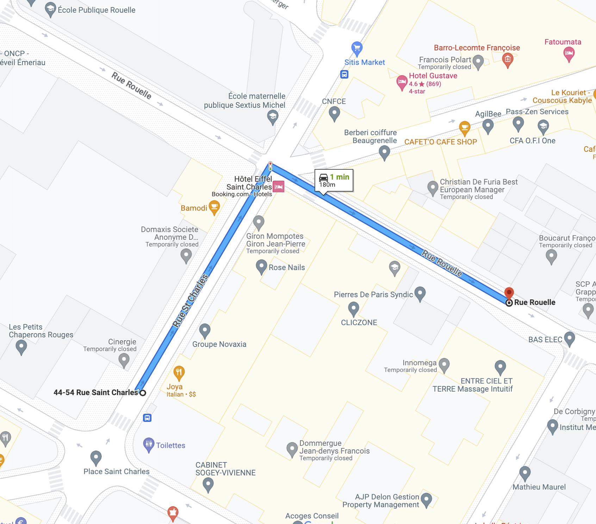
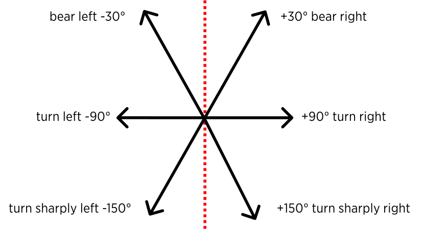
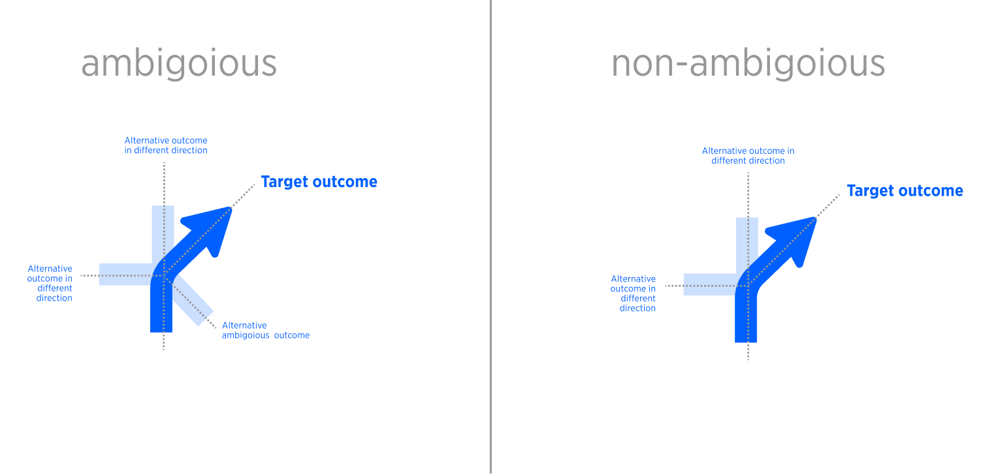
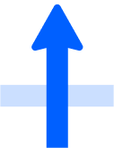
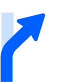
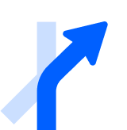

| **Interaction Designer** | [Alexey Opokin](https://tomtom.atlassian.net/wiki/people/70121:e8cb7861-9079-4b92-b96d-bfe8cd882680?ref=confluence) |
|---|---|
| **Visual Designer** | [Georgios Koultouridis](https://tomtom.atlassian.net/wiki/people/5be2fd44649a737c2342afbe?ref=confluence) |
| **PM NK2** | [Joost Pennings](https://tomtom.atlassian.net/wiki/people/712020:a6d50cb1-97be-4a9a-a279-3fbb3e2e1799?ref=confluence) |
| **ENG. OWNER** | [User e12b3](https://tomtom.atlassian.net/wiki/people/712020:c273d0e3-9a2a-456c-ad2f-6f56ca0e12b3?ref=confluence) → please assign |

> [!NOTE]
> **DICLAIMER**   The document below is covering user experience and general guidelines for technical implementation. It doesn't define exact methods for achieving this user experience, algorithms and heuristics - those has to be described at separate technical documentation on _**GitHub**_ and managed by _**engineering owner.**_

> [!NOTE]
> As of today 14 Aug 2024 the functionality described here is not implemented

> [!NOTE]
> This document doesn't cover angles represented by SLG arrows. Multi-lane intersections should be covered separately.

What is the angle of turn? 
==============================

Intersecting roads can create a complex intersections, especially if more than 2 roads intersect. The angle of turn is is complimentary to the turn instruction information that helps the driver to identify the correct manoeuvre in such situations. The angle information communicates which outcome of the intersection he should take. From the start, we have to distinguish between two groups of scenarios here:  
  
**Single outcome or non-ambiguous turn** - drivers have only one possibility to turn in one given direction (left or right) with all variations included (slight right (bear right), sharp right)

**Ambiguous turn** that gives more than one possible outcome in the same direction. Drivers have multiple possibilities and more clarification is required - both turn right and sharp right outcomes available.  
  
Here are some examples of ambiguous turns:

| **Map view** | **Driver's view** | **Notes** |
|---|---|---|
|  |  | There are two possibilities for a right turn. This is an ambiguous turn scenario where driver needs additional guidance in order to decide which road to take. |
|  |  | There are two possibilities for a right turn. This is an ambiguous turn scenario. |

Quantisation of angles
======================

Angle values originally come from the map in a form of raw angle (0°-360°), but this data cannot be used for communication directly due to various reasons (limited set of graphic assets that represent angles and quantisation errors that distort the real angle value). Angles need to be formatted into suitable for the guidance purpose format. This is done via _**quantisation of angles**_ and matching them to 8 possible directions (3 in each direction (left or right)), in such a way that every outcome has a unique quantised output.

NOTE: While there are 8 possible directions in quantisation circle, we don't use 2 of them for turn instructions. Directions _**straight**_ is identified by different means (natural continuation, or no instruction requited), and doesn't use angles for detection. The same is true for _**U-turn**_. Those instructions are covered specifically elsewhere.

NOTE: If two outcomes are matched to the same output, one has to be separated and matched to the nearest alternative. 

**Diagram of quantisation of angles**  
Each outcome has to be matched (to the closest value) to one of these 6 directions: 30° bear right  /  90° turn right  /  150° turn sharply right  /  -30° bear left.  /  -90° turn left  / -150° turn sharply left. 

| **Quantised angles for type of turn** | **Quantised angles for drawing manoeuvre arrow** |
|---|---|
|  |  |

NOTE: Exact matching algorithm of real angles to quantised values is beyond this design document and should be defined on engineering side. The outcome of this algorithm should match real angle to a closest quantised one.

NOTE: The division of segments is not symmetrical in order to provide bigger range for straight turn instructions.

NOTE: While the angle of quantised turn is an absolute value and is represented by the graphic arrow, the string _**bear right**_, _**turn right**_ does not always correspond to this angle. There are multiple strings can be used for the same outcome angle depending on the other outcomes. This aspect will be illustrated later down.

NOTE: While quantisation angles are not symmetrical, their visual representation arrows are. All visual arrows are matched to 45° and 90°. This is done for the purpose of clarity of instruction arrow.

  
**How quantised angles are used?**
=====================================

After gathering quantised angles for each possible outcome, we should communicate them to the driver. There are two touch points where angles are communicated at:

1.  Manoeuvre arrow graphical representation in the NIP
    
2.  Audio instruction.
    
3.  SLG arrows - scenarios involving multi-lane junctions are not covered by this document.
    

As illustrated by the examples below, turn angle is manifested in both: manoeuvre arrow and audio instruction. The usage of the angle differs between ambiguous and ambiguous turns scenarios.

| **non\-Ambiguous turn** | **Ambiguous shallow turn** | **Ambiguous sharp turn** |
|---|---|---|
|  |  |  |
| turn ***right*** | take the right turn, ***the gentler one*** | take ***the sharper*** turn left |
| Turn direction is communicated without comparative adjectives. | Turn direction is communicated using comparative adjective ***gentler*** that clarifies the direction of the target outcome in comparison with the alternative. | Turn direction is communicated using comparative adjective ***sharper*** that clarifies the direction of the target outcome in comparison with the alternative. |

  
  

Drawing manoeuvre arrows using quantised angles
===============================================

Quantised outcomes are drawn in the manoeuvre arrow. Target outcome (the one that is recommended by guidance) is highlighted, and alternatives outcomes are greyed out. The presence of alternative outcome in the _same direction_ indicates ambiguity that has to be addressed. By same direction we mean left or right, or angles in a range of 0°...-180 (for left) and 0°...+180(for right).

NOTE: Only legal outcomes should be drawn in manoeuvre arrow. Illegal ones (one way streets) should be ignored.

Further down we will explain how to treat ambiguous and non-ambiguous situation based on this information.

  
  
Non-ambiguous scenarios
-----------------------------

In non\-ambiguous scenarios, the angles are named directly in audio instruction, without comparative aspect: _**Turn right, Bear right, Turn sharply right.**_

**Examples of non-ambiguous turns**

| **Single outcome** | **Audio instructions** | **Notes**                                                                                                                                                                        |
|---|---|----------------------------------------------------------------------------------------------------------------------------------------------------------------------------------|
|  | continue straight | This direction is only used in "continue straight" instruction, which is not defined by the angle.  This scenario is covered separately and it is not part of turn handling. |
|  | bear right | Alternative outcome is straight.      This is non ambiguous manoeuvre because there is only one outcome in the given direction.                                                    |
|  | bear right | non\-straight junction                                                                                                                                                           |
|  | turn right | Alternative outcome is straight                                                                                                                                                  |
|  | turn right | simple junction.                                                                                                                                                                 |
|  | turn sharply right | Alternative outcome is straight.                                                                                                                                                 |
|  | turn sharply right | non\-straight junction                                                                                                                                                           |

  
  

Ambiguous scenarios
-------------------

In ambiguous scenarios there is a necessity to use comparative naming to outcomes in order to distinguish them from the alternative: _**sharper, gentler.**_

**Examples of Ambiguous turn manoeuvres**

| **Arrow** | **Audio Instruction** | **Notes** |
|---|---|---|
|  | take the right turn, the gentler one. | Because of the ambiguity, we should clarify for the driver which out of two possible outcomes he should take. This is done via usage of comparative adjective "gentler". |
|  | take the right turn, the gentler one. | Because of the ambiguity, we should clarify for the driver which out of two possible outcomes he should take. This is done via usage of comparative adjective "gentler". |
|  | take the right turn, the gentler one. | Because of the ambiguity, we should clarify for the driver which out of two possible outcomes he should take. This is done via usage of comparative adjective "gentler". |
|  | take the sharper turn right | Ambiguous turn. indication of which outcome is correct via using "sharper" attribute. |
|  | take the right turn, the gentler one | Ambiguous turn. indication of which outcome is correct via using "gentler" attribute. |
|  | take the right turn, the gentler one | Ambiguous turn. indication of which outcome is correct via using "gentler" attribute. |
|  | take the sharper turn right | Ambiguous turn. indication of which outcome is correct via using "gentler" attribute. |
|  | take the middle turn right | Ambiguous turn. indication of which outcome is correct via using "middle" attribute. |
|  | take the sharper turn right | Ambiguous turn. indication of which outcome is correct via using "sharper" attribute. |
|  | take the sharper turn right | Ambiguous turn. indication of which outcome is correct via using "sharper" attribute. |
|  | take the sharper turn right | Ambiguous turn. indication of which outcome is correct via using "sharper" attribute. |

Text strings
============

New audio test strings have to be defined an added to the table.