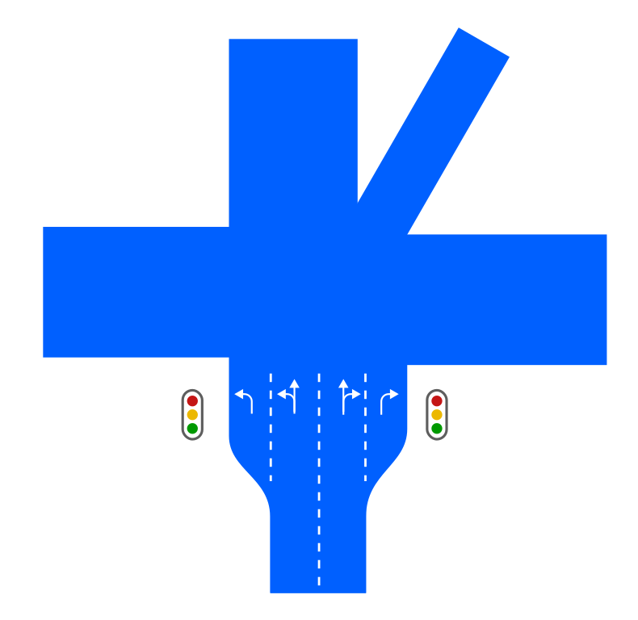
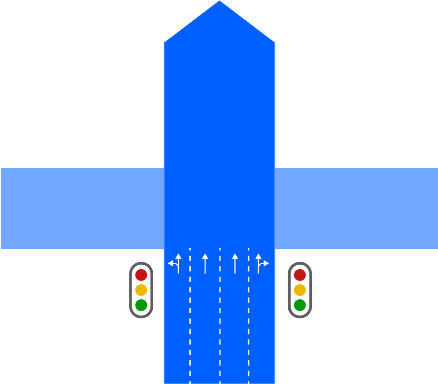
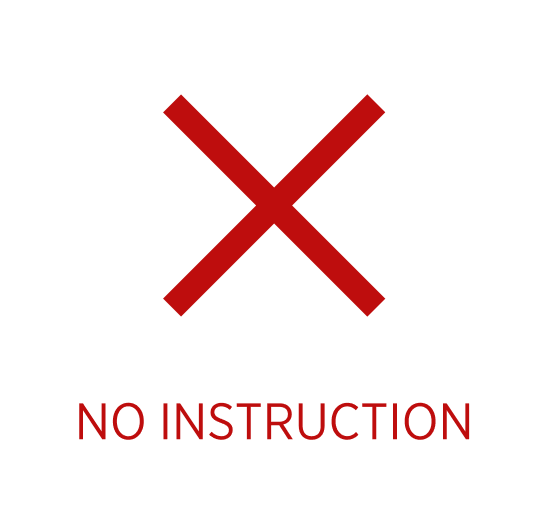

| **Interaction Designer** | [Alexey Opokin](https://tomtom.atlassian.net/wiki/people/70121:e8cb7861-9079-4b92-b96d-bfe8cd882680?ref=confluence) |
|---|---|
| **Visual Designer** | [Georgios Koultouridis](https://tomtom.atlassian.net/wiki/people/5be2fd44649a737c2342afbe?ref=confluence) |
| **PM** | [Joost Pennings](https://tomtom.atlassian.net/wiki/people/712020:a6d50cb1-97be-4a9a-a279-3fbb3e2e1799?ref=confluence) |
| **ENG. OWNER** | [Maksym Osadchuk](https://tomtom.atlassian.net/wiki/people/712020:fb261b5b-de23-442e-854b-8b08f3e29b6f?ref=confluence) |

**Introduction**
================

| Instruction ***Continue straight*** is used in situation when continuation of movement in original direction (straight, without a manoeuvre) is not clear due to a road network complexity, and additional guidance is required in order to go simply straight.       This instruction should **not be used** if:        **1\. Straight direction is obvious.**    **2\. Outside of junctions, i.e. when road splits into two or more directions via Fork or Exit.**    **3\. On straight segments of the road without junctions or forks.**        In this document we will define exact conditions for this instruction to happen as well as conditions for it not to happen or being replaced with other instruction. |  |
|----------------------------------------------------------------------------------------------------------------------------------------------------------------------------------------------------------------------------------------------------------------------------------------------------------------------------------------------------------------------------------------------------------------------------------------------------------------------------------------------------------------------------------------------------------------------------------------------------------------------------------------------------------------------------------------------------------------|---|

**Conditions for the "Continue Straight" Instruction**
======================================================

There are two groups of scenarios that should trigger _**Continue Straight**_ instruction. First one is "Crossing Multilane junction" and second "Crossing significant road". Both of them are described below.

Scenario 1 / Crossing Simple Multilane Junction
===============================================

_**Simple Junction**_ is a typical traffic figure - intersection of two roads crossing at roughly 90° angle. Those intersections are normally regulated by traffic lights, but could also be unsignalised (without traffic lights) and managed by traffic rules and road signs. 

| **CONDITIONS FOR CONTINUE STRAIGHT INSTRUCTION** |
|---|
| 1. Simple junction.    2. Junction should allow right or/and left turns.    3. Current road at the point of intersection should have at least 3 lanes.    4. Not all lanes allow for continuation straight. Some of them are dedicated for turns. |

If given conditions are not met, there is no need for any instruction at this junction.

| **JUNCTION TOPOLOGY** | **CONDITIONS**                                                                                                                                                                                                                                                    | **INSTRUCTION** | **NOTES** |
|---|-------------------------------------------------------------------------------------------------------------------------------------------------------------------------------------------------------------------------------------------------------------------|---|---|
|  |  At simple junction junction   At least 3 lanes or more at the entrance point
   Not all lanes allow for continuation straight | Use two middle lanes to continue straight | Not all lanes allow for continuation straight. |
|  |  At Ambiguous junction    At least 3 lanes or more at the entrance point
   Not all lanes allow for continuation straight           | Use two middle lanes to continue straight | For ambiguous multilane junctions, EALG should always be used in all directions. |

  
Scenario 1 / Crossing Ambiguous Multilane Junction
=====================================================

_**Ambiguous Junction**_ is a that has either crossing angles different from 90° or more then 4 exits or both conditions. Detection of junction ambiguity is a separate topic that is not covered in this document. _**Ambiguous Junctions**_ should always use EALG to clarify directions of turns  

| **JUNCTION TOPOLOGY** | **CONDITIONS** |  | **INSTRUCTION** | **NOTES** |
|---|---|---|---|---|
|  |  |  | Use two middle lanes to continue straight |  |

All lanes go straight
---------------------

| **DIAGRAM** | **CONDITIONS** | **INSTRUCTION** | **NOTES** |
|---|---|---|---|
|  |  At simple junction   Turns are allowed at the junction   At least 3 lanes in at the entrance point   Not all lanes allow for continuation straight |  | At this junction all lanes allow straight movement. There is no need for an instruction here. |

  
  

Scenario - 2 / Crossing more significant road
=============================================

This scenario happens on unregulated junctions when crossing a more significant (Main road, if this can be detected) road. E.g vehicle yields to a traffic following on a main road. Following conditions should be met in order for instruction "Continue Straight" to be used.

| **EXAMPLE** | **CONDITIONS** |
|---|---|
|  | 1. Instruction should be given at “Simple junctions” \- intersections of two roads with approximate to 90 degree angles, (not including T\-junctions).    2. Unregulated Junction \- no Traffic lights.    **One of the the 3 conditions:**    3. Main road turns instead of continuing straight, which results in having a yield sign for vehicles that go straight.    4. Crossing a main road with dual directions, from side road.    5. Crossing dual carriageway road. |

  
  
Examples of Scenario 2
----------------------------

Here are some examples illustrating various possible use cases belonging to Scenario 2:

Main road turns
---------------

| **DIAGRAM** | **CONDITIONS**                                                                                                                                                                              | **INSTRUCTION** | **NOTES** |
|---|---------------------------------------------------------------------------------------------------------------------------------------------------------------------------------------------|---|---|
|  |  At a junction    Unregulated junction  Main road turns |  | Main road turns and vehicle must continue on another road, instruction is required here. |

Crossing the main road
----------------------

| **DIAGRAM** | **CONDITIONS** | **INSTRUCTION** | **NOTES** |
|---|---|---|---|
|  |  At a junction    Unregulated junction  Crossing Main road |  | Crossing more significant road requires "Continue straight" instruction. |

Crossing dual carriageway road
------------------------------

| **DIAGRAM** | **CONDITIONS** | **INSTRUCTION** | **NOTES** |
|---|---|---|---|
|  |  At a junction    Unregulated junction Crossing dual carriageway road |  | Crossing dual carriagway road requires "Continue straight" instruction. |

\---/ END OF SPEC