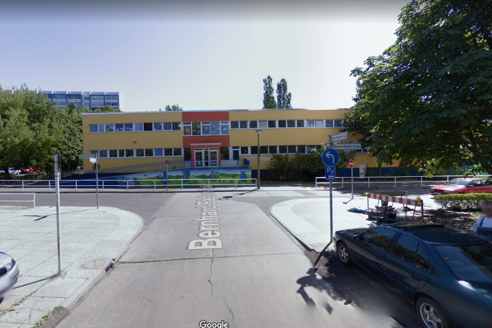
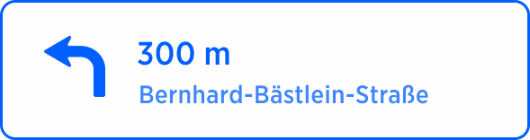

| **Interaction Designer** | [Alexey Opokin](https://tomtom.atlassian.net/wiki/people/70121:e8cb7861-9079-4b92-b96d-bfe8cd882680?ref=confluence) |
|---|---|
| **Visual Designer** | [Georgios Koultouridis](https://tomtom.atlassian.net/wiki/people/5be2fd44649a737c2342afbe?ref=confluence) |
| **PM** | [Joost Pennings](https://tomtom.atlassian.net/wiki/people/712020:a6d50cb1-97be-4a9a-a279-3fbb3e2e1799?ref=confluence) |
| **ENG. OWNER** | [User e12b3](https://tomtom.atlassian.net/wiki/people/712020:c273d0e3-9a2a-456c-ad2f-6f56ca0e12b3?ref=confluence) → please assign |

**What is Mandatory turn?**
---------------------------

Usu

al manoeuvres assume several possibilities for a turn, however there are situations when only one outcome is actually possible. This is due to the fact that alternative outcomes are blocked by traffic signs. Mandatory turn is instruction is used when there is only one possible outcome of the manoeuvre and driver needs to follow the manoeuvre anyway following driving rules or physical road. In such cases instruction is replaced by the **"follow the road to** _**<direction of="" turn="">**_. 

**Conditions for Mandatory turn**
---------------------------------

In order for mandatory turn instruction to be generated, following conditions should be met:  

1.  **At Intersection** - meaning mandatory turn is not required if road just curves. Intersections with pedestrian roads do not count.
    
2.  There is **only one legal outcome** of the manoeuvre.
    
3.  The outcome is **not a natural continuation**. In case of Natural Continuation no instruction is needed.
    
4.  The street name of the current road and the target road **are the same**. If they are not the same, normal turn instruction is executed.
    
5.  Any of (current and target) roads (which are the same road) are **NOT** _**boulevard**_ **types** of roads (with physical separation barrier between directions).
    
6.  There is no landmark at the manoeuvre point, such as traffic light, end of the road, Brigde. If landmark is present, normal turn is used.
    

  

  
  
  
Example 1 | Follow the Road to the Left/Right
------------------------------------------------------

| **Instruction** | Mandatory Turn |  |
|---|---|---|
| **Action** | Follow the road |  |
| **Purpose** | Not available |  |
| **NavKit ID** | ??? |  |
| **Description** | There is only one possible outcome of the manoeuvre.  Therefore the instruction **"Turn Left"** is replaced by **"Follow the road to the Left"** |  |
| **Location** | [52\.531247, 13\.481123](https://goo.gl/maps/yyzFMoftLWkLGWuYA) |  |
| **Road Geometry** |  |  |
| **Visual Instruction** |  |  |
| **Audio Instruction** | in 300m**Follow the Road to the** left. |  |
| **Audio Template** | **\[distance] \[action]** |  |

  

---</direction>