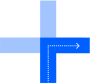
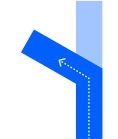
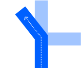
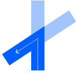
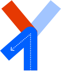
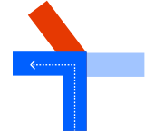
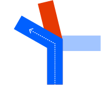
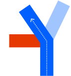
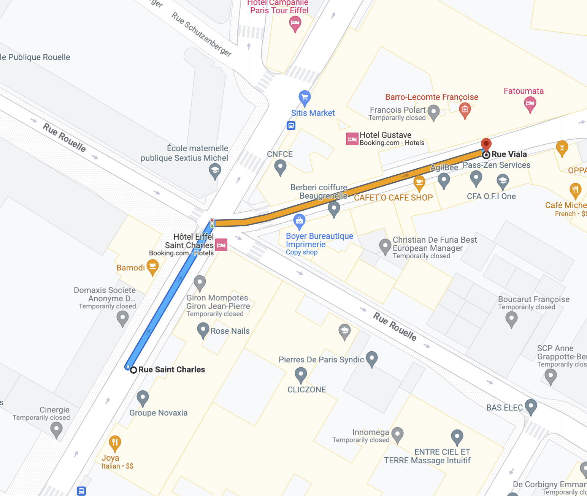

| **Interaction Designer** | [Alexey Opokin](https://tomtom.atlassian.net/wiki/people/70121:e8cb7861-9079-4b92-b96d-bfe8cd882680?ref=confluence) |
|---|---|
| **Visual Designer** | [Georgios Koultouridis](https://tomtom.atlassian.net/wiki/people/5be2fd44649a737c2342afbe?ref=confluence) |
| **PM** | [Joost Pennings](https://tomtom.atlassian.net/wiki/people/712020:a6d50cb1-97be-4a9a-a279-3fbb3e2e1799?ref=confluence) |
| **ENG. OWNER** | TBD |

> [!NOTE]
> **DICLAIMER**   The document below is covering user experience and general guidelines for technical implementation. It doesn't define exact methods for achieving this user experience, algorithms and heuristics - those has to be described at separate technical documentation on _**GitHub**_ and managed by _**engineering owner.**_

> [!NOTE]
> As of today 14 Aug 2024 the functionality described here is not implemented

**Motivation**
==============

At intersections where roads intersect at angles significantly different from straight angles, it makes sense to communicate turn angles to the driver. This is especially critical in ambiguous situations when there are alternative outcomes in the same direction present. There are two types of such deviations: _**Shallow turns**_ (also known as _**Bear**_) and **Sharp turns**. There are also two types of scenarios:  
  
1. **Single outcome turn**. There is only one possible outcome in given direction (left or right). This is a _**ambiguous**_ scenario.  
2. **Multi-outcome or ambiguous turn**, when there are multiple outcomes possible in the given direction (left or right).  
  
Those scenarios have to be defined separately.  
  

Single outcome in one direction - non ambiguous scenarios
=========================================================

This table provides examples of turns with single possible outcome. The usage of _**sharp**_ or _**bear**_ attribute is dictated entirely by the angle of the turn and quantisation rules defined here [Angles Quantisation](./../Angles%20Quantisation%20%20/Angles_Quantisation.md) It is important to note that the angle of the turn provided by the map is not reliable, due to quantisation errors of road segments, therefore we use quite aggressive angle threshold for sharp turn to eliminate false calls.

| **Road Geometry**               | **Manoeuvre arrow**             | **Instruction**       | **Notes**                                                                                                                                                        |
|---------------------------------|---------------------------------|-----------------------|------------------------------------------------------------------------------------------------------------------------------------------------------------------|
|  |  | Turn Right            | A normal turn is used if the angle of the turn quantised to 90° See [Angles Quantisation](./../Angles%20Quantisation%20%20/Angles_Quantisation.md)           |
|  |  | Turn Left             | Even though, the turn is different from 90°, it is still quantised to 90° See [Angles Quantisation](./../Angles%20Quantisation%20%20/Angles_Quantisation.md) |
|  |  | Turn **sharply** left | This turn angle is quantised to \-150° which is a sharp turn. See [Angles Quantisation](./../Angles%20Quantisation%20%20/Angles_Quantisation.md)             |
|  |  | Bear Left             | This turn angle is quantised to \-30° which is a sharp turn. See [Angles Quantisation](./../Angles%20Quantisation%20%20/Angles_Quantisation.md)              |

Multiple outcomes in one direction - Ambiguous scenarios
========================================================

In order to to disambiguate multiple possible turns in the same direction we use comparative argument _**sharper**_. In this table we describe use cases of such _sharper_ turn usage. **Important to note: here the** _**sharper**_ **attribute is not dictated by the angle alone but rather by the presence of alternative outcome.**

| **Road Geometry**                | **Manoeuvre Arrow**               | **Instruction**                           | **Notes**                                                                                                                                                                                                                                                                                                                                                                                                                                                                                                                                                                                        |
|----------------------------------|-----------------------------------|-------------------------------------------|--------------------------------------------------------------------------------------------------------------------------------------------------------------------------------------------------------------------------------------------------------------------------------------------------------------------------------------------------------------------------------------------------------------------------------------------------------------------------------------------------------------------------------------------------------------------------------------------------|
|  |  | Take the ***sharper*** turn left          | To disambiguate this manoeuvre we apply ***sharper*** attribute to a blue outcome. ***sharper*** attribute here is not indicating the absolute angle, but rather points to a relative value.                                                                                                                                                                                                                                                                                                                                                                                                     |
|  |  | Take the ***sharper*** turn left          | To disambiguate this manoeuvre we apply ***sharper*** attribute to a blue outcome, even though, it is technically, in the range of angles for the normal turn. ***sharper*** attribute here is not indicating the absolute angle, but rather points to a relative value. In other words it is saying:  this turn is **sharper than alternative** (red outcome).  Manoeuvre arrow representing turn is not identical to the road geometry because it is quantised using quantisation logic described here: [Angles Quantisation](./../Angles%20Quantisation%20%20/Angles_Quantisation.md) |
|  |  | Take the ***sharper*** turn left          | To disambiguate this manoeuvre we apply ***sharper*** attribute to a blue outcome, even though, it is technically, in the range of angles for the shallow turn. ***sharper*** attribute here is not indicating the absolute angle, but rather points to a relative value.                                                                                                                                                                                                                                                                                                                        |
|  |  | Take the left turn, ***the gentler one*** | To disambiguate this manoeuvre we apply ***gentler*** attribute to a blue outcome. ***Genlter*** attribute here is not indicating the absolute angle, but rather points to a relative value.                                                                                                                                                                                                                                                                                                                                                                                                     |

  

===

**Examples**
============

| **Intersection geometry** | **Driver view** | **NIP arrow** | **Audio** | **Location** |
|---|---|---|---|---|
|  |  |  | ...Take the sharper right to *street name* | 48\.849978, 2\.288525 |
|  |  |  | ... Take the right turn, the gentler one, to *street name* | 48\.849978, 2\.288525 |
|  |  |  | ...take the sharper right to *street name* | 48\.867842, 2\.281052 |