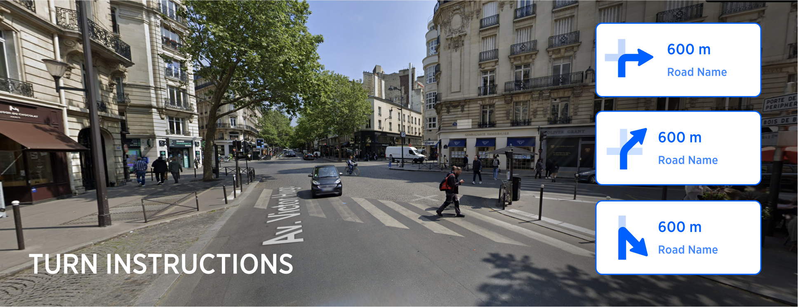

| **Interaction Designer** | [Alexey Opokin](https://tomtom.atlassian.net/wiki/people/70121:e8cb7861-9079-4b92-b96d-bfe8cd882680?ref=confluence) |
|---|---|
| **Visual Designer** | [Georgios Koultouridis](https://tomtom.atlassian.net/wiki/people/5be2fd44649a737c2342afbe?ref=confluence) |
| **PM** | [Joost Pennings](https://tomtom.atlassian.net/wiki/people/712020:a6d50cb1-97be-4a9a-a279-3fbb3e2e1799?ref=confluence) |
| **ENG. OWNER** | [Vadym Khandus](https://tomtom.atlassian.net/wiki/people/712020:2b00ecb1-a543-4410-818c-575056da8b84?ref=confluence) |
| **Reference** | [Lane guidance messages for supported instruction types](https://tomtom.atlassian.net/wiki/spaces/~khandus/pages/267835935/Lane+guidance+messages+for+supported+instruction+types) |

> [!NOTE]
> **DICLAIMER**   The document below is covering user experience and general guidelines for technical implementation. It doesn't define exact methods for achieving this user experience, algorithms and heuristics - those has to be described at separate technical documentation on _**GitHub**_ and managed by _**engineering owner.**_

> [!NOTE]
> As of today 14 Aug 2024 , most of the functionality described here is not yet implemented.

Introduction
============

Turn manoeuvres are most basic manoeuvre type that we can define as deviation from _**natural continuation**_ path of the road at intersection of two or more roads or at the point of splitting of the current road into two or more. _**Natural continuation**_ path is a road that can be clearly identified by driver as a _**continue straight**_ direction. When following natural continuation path, no instruction is required. Before moving on we need to define some terminology.  
  
Intersection types:

_**Single lane intersections**_ are intersections that don't provide individual lanes dedicated for turns, and all manoeuvres are performed from the same (single) lane.

_**Multi lane intersections**_ are intersections that separate directions by individual lanes. Lane count at multilane intersection points must be more then 2.

_**Ambiguous Intersections**_ are intersections that depart from standard geometry and as a result of this, manoeuvres cannot be mapped to standard set of instructions (turn left/right, continue straight)

_**Unambiguous intersection**_ is an standard intersection that is constructed from two crossing roads at the roughly 90 angle. This includes T-junctions as well.

Manoeuvre types:

_**Turn left/right**_ - Manoeuvre with straight angle of the turn.

_**Bear left/right**_ - Manoeuvre with the shallow angle of the turn.

_**Turn sharply left/right**_ - Manoeuvre with sharp angle of the turn.

_**U-turn**_ - going backwards on the same roar path.

This page below defines how turn instructions are constructed based on the road geometry, and also how they appear to the driver. We will look separately at ambiguous and non-ambiguous scenarios as well as single and multi-lane scenarios.  
  

Single lane, Unambiguous Intersections
======================================

Scenarios involving intersections with single outcome in one turn direction. Those types of intersections considered to be trivial and not posing any ambiguity to the driver, unlike other intersections which could have multiple outcomes in one turn direction.

| **No.** | **Location**                                                | **Geometry** | **Road view** | **Manoeuvre arrow** | **Instruction** | ***Notes*** |
|---|-------------------------------------------------------------|---|---|---|---|---|
| 02 | Simple turn left at a T\-junction  48\.866433, 2\.277646 | 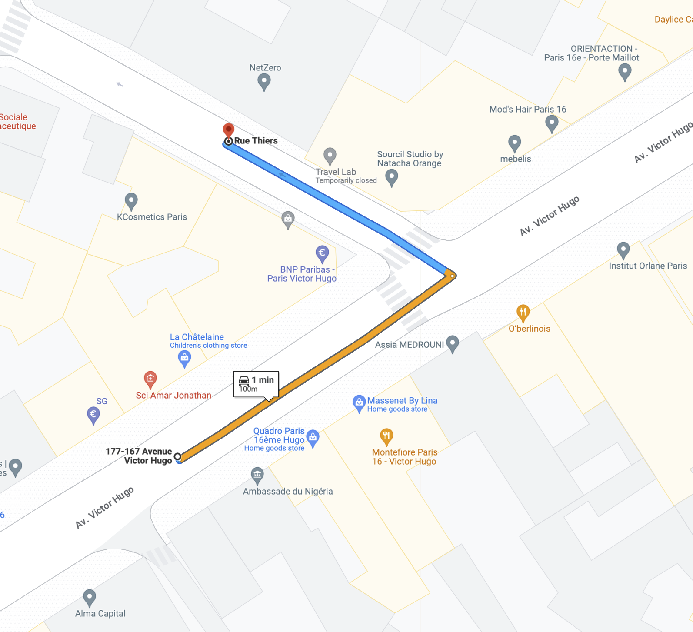 |  | 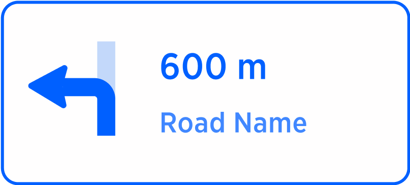 | turn left | Simple turn manoeuvre that happen at T junction with no ambiguity present. In such trivial use cases we omit street names announcements from audio instructions.  The real angle of the turn is not 90° but this direction still matched to 90° as closest match. |
| 07 | Non\-ambiguous sharp turn  48\.856411, 2\.274748              | 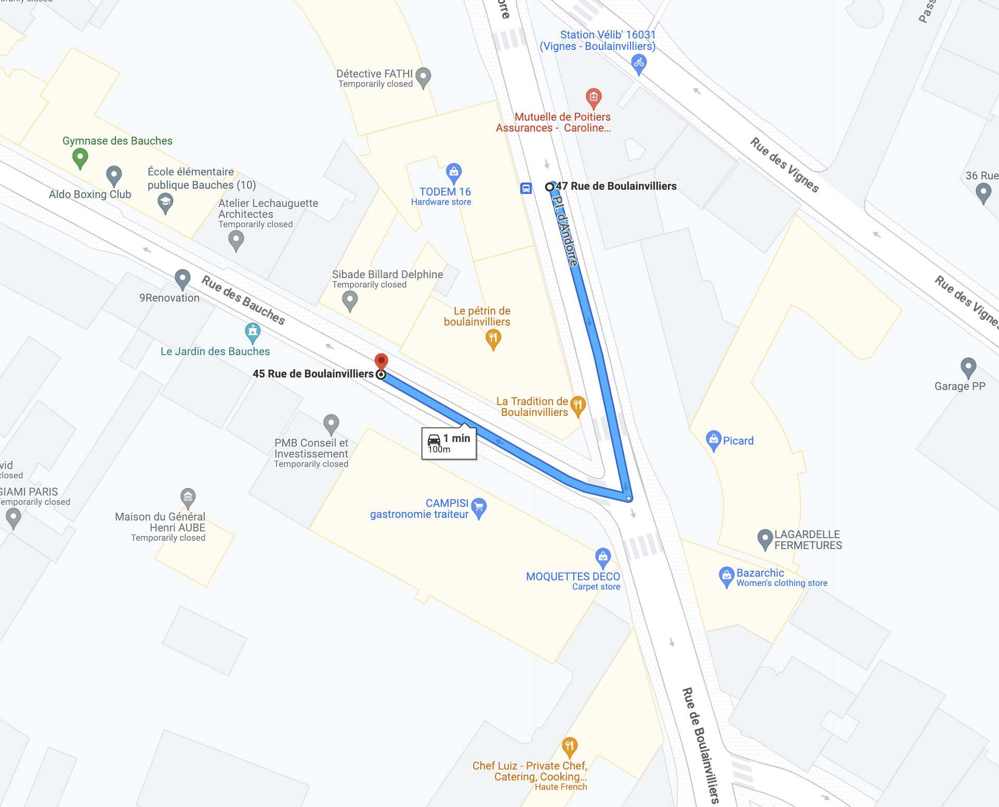 |  | 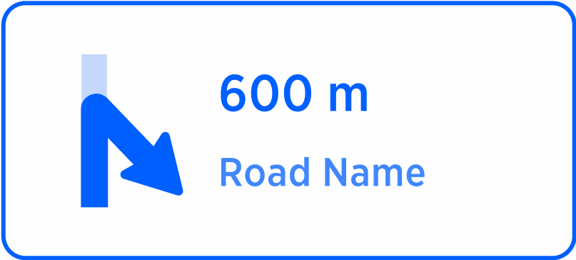 | turn sharp right to street name | This sharp turn is non ambiguous therefore |

Single lane, Ambiguous Intersections NOT IMPLEMENTED
====================================================

Scenarios involving conflicting, alternative exits in the same direction

| **No.** | **Location** | **Geometry** | **Road view** | **Manoeuvre arrow** | **Instruction** | ***Notes*** |
|---|---|---|---|---|---|---|
| 03 | Ambiguous turn right, the gentler one  48\.849978, 2\.288525 | 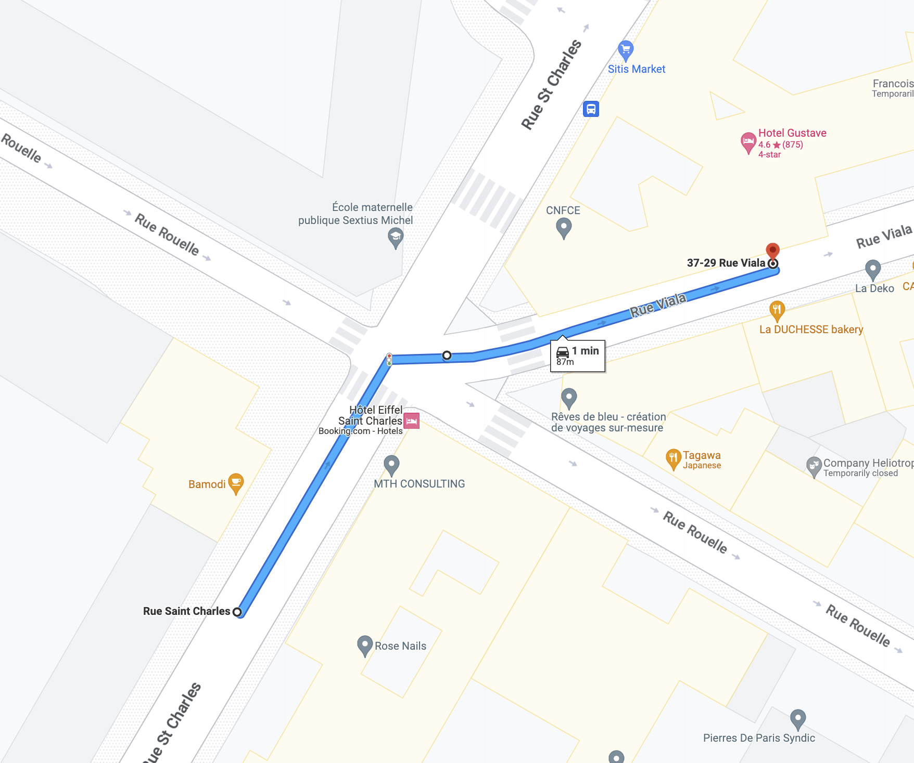 |  | 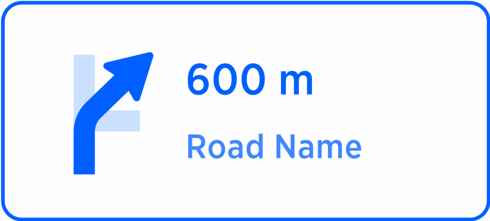 | take the right turn, the gentler one, to *street name* | The right turn direction provides two possible outcomes for turning right. This is an ambiguous use case. |
| 04 | Ambiguous turn right, the sharper one  48\.849978, 2\.288525 |  |  | 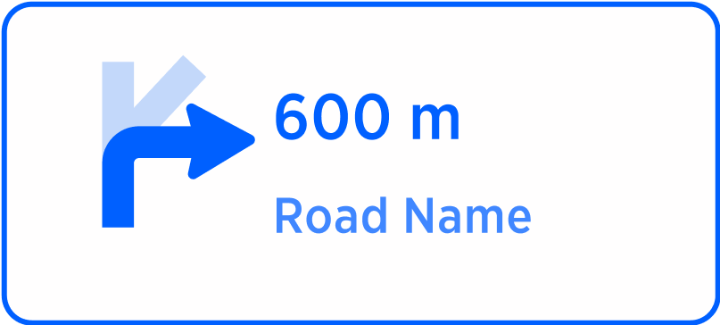 | take the sharper turn right, to *street name* | The right turn direction provides two possible outcomes for turning right. This is an ambiguous use case. |
| 05 | Ambiguous right turn with many alternative outcomes  48\.867842, 2\.281052 | 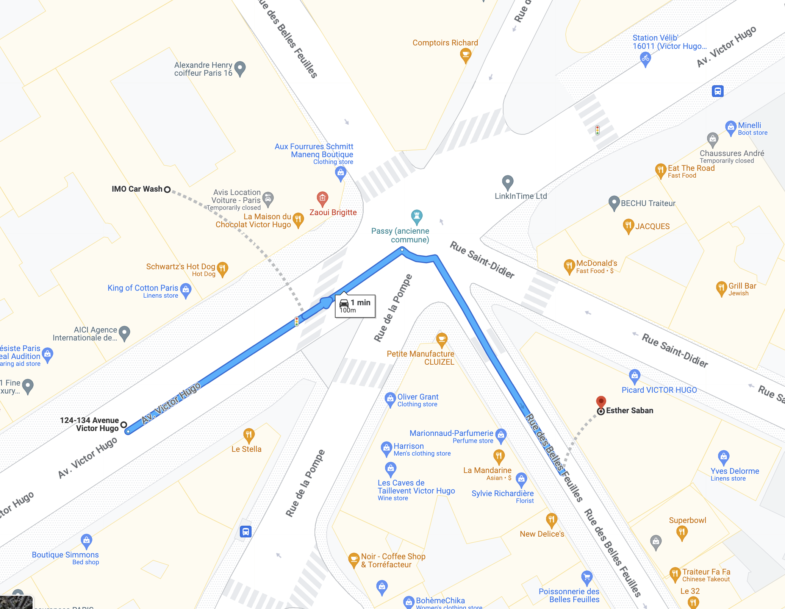 |  | 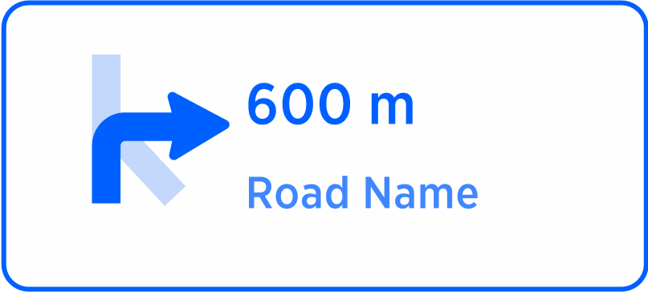 | take the right turn, the gentler one to *street name* | There are 3 outcomes to the right direction here, |
| 06 | Ambiguous sharp right turn with many alternative outcomes  48\.867842, 2\.281052 | 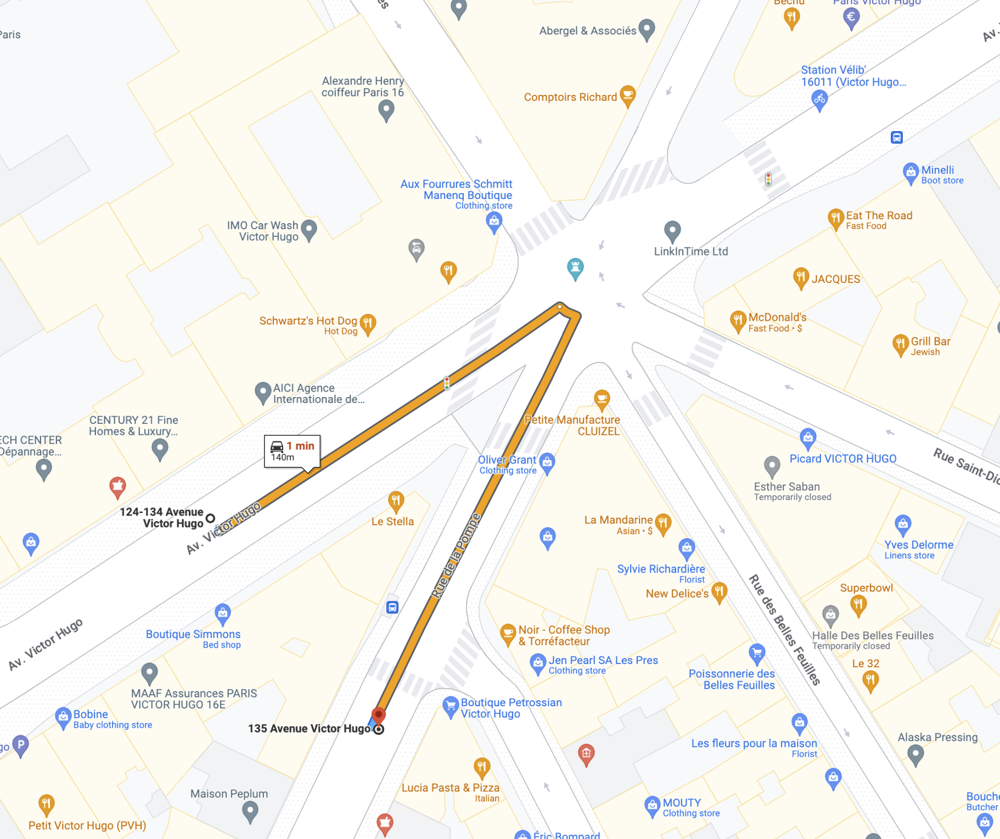 |  | 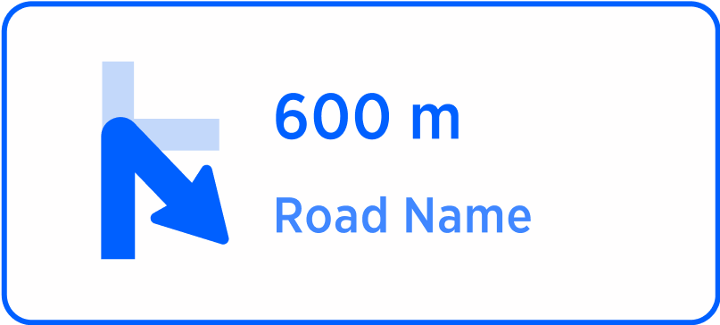 | take the sharper turn right, to *street name* |  |

REFERENCE: Turn instruction follow generic instruction model defined here: [NIE\_002 - Next Instruction Panel (NIP)](./../../Guidance%20Framework%20-%20Methods%20%26%20Components/Next%20Instruction%20panel%20-%20NIP/Next_Instruction_Panel.md)

Multi-lane Intersections - Audio Instruction Architecture
=========================================================

In NIE Instruction constructed in a modular way so they can communicate not only simple messages like _**Turn right**_ but more elaborative instructions like _**Bear right to stay on Haupstrasse**_ or _**Use the right two lanes to turn right**_.  In order to allow this we use **components** called **Action** and **Purpose.**  More info about instruction architecture provided here: [NIE\_003 - Audio Instructions](./../../Guidance%20Framework%20-%20Methods%20%26%20Components/Audio%20Instructions/Audio_Instructions.md)  
  

**\[action\]** - Describes the immediate action that driver needs to perform: _**turn right, keep left, use the right two lanes**_

**\[purpose\]** - Describes what would be the result of this action: _**to stay on, to take the exit, to switch to, to turn right**_

In case of trivial Instruction, like _**Turn right**_ there is only one component (action) is provided. Turn instruction (as well as any other instruction) is composed of those two components. We need to keep in mind that the same expression (turn right) can be used as an _action_ or _purpose_ depending on the context of the instruction.  
  
Examples:

| **Audio Instruction** | **Action** | **Purpose** |
|---|---|---|
| **Turn Right** | turn right | \-\- |
| **use the two right lanes to turn right** | use the two right lanes | to turn right |
| **Bear left** | bear left | \-\- |
| **use the two left lanes to bear left** | use the two left lanes | to bear left |
| **Turn sharp right** | turn sharp right | \-\- |
| **use the two right lanes to turn sharp right** | use the two right lanes | to turn sharp right |

Text constructions like _**use the two right lanes to...**_ called _**Explicit Audio Lane guidance**_ - EALG. EALG is used every time when precise lane guidance information is helpful for the manoeuvre taking. EALG is not always helpful though - In trivial turn scenarios it is simply not necessary. Lets look at some typical junctions scenarios:

| **Manoeuvre** | **Junction 1** | **Junction 2** | **Junction 3** |
|---|---|---|---|
| **Diagram of the intersection** |  | 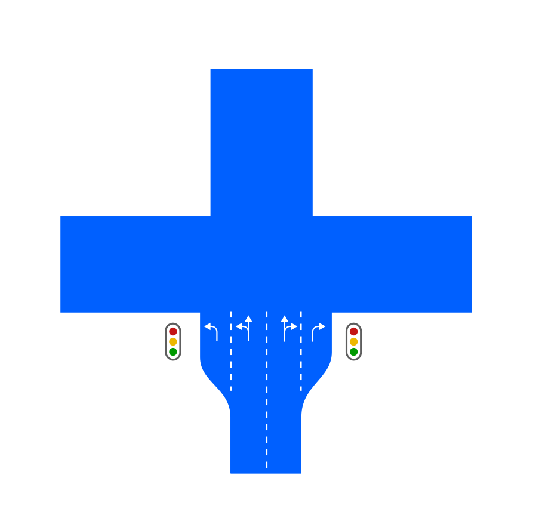 | 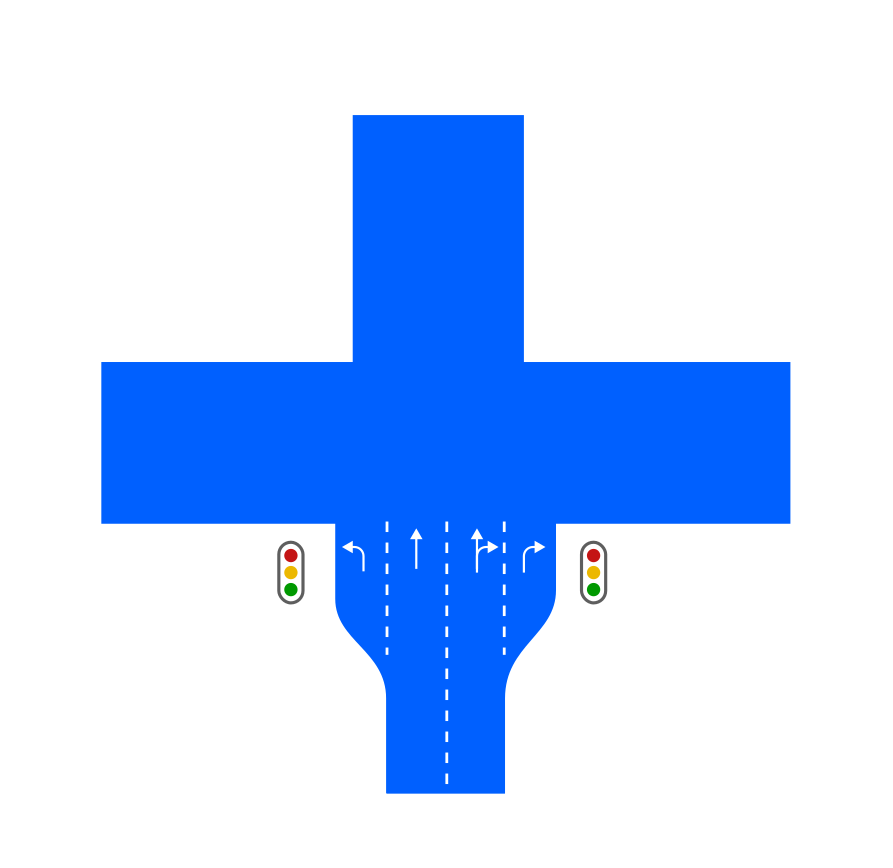 |
| **Turn left** | NO EALG \- single possibility for turn doesn't require EALG because it is trivial manoeuvre. | YES \- because there are two lanes available for turn. | NO EALG \- single possibility for turn doesn't require EALG because it is trivial manoeuvre. |
| **Turn right** | NO EALG \- single possibility for turn doesn't require EALG because it is trivial manoeuvre. | YES \- because there are two lanes available for turn. | YES \- because there are two lanes available for turn. |
| **Continue straight** | YES \- continuation straight always require EALG. | YES \- continuation straight always require EALG. | YES \- continuation straight always require EALG. |

Drivers can navigate lanes intuitively (rightmost lane turns right, leftmost - left) for small lane count simple junctions, however, on bigger, multilane junctions, lane configuration could pose challenges. The situation gets even more complicated when street traffic congestion covers lane markings on the surface of the road. The aim of SLG (and EALG specifically) in those situations is to guide drivers more precisely into specific lanes. There are following conditions should be met for EALG to be applied:

| **No.** | **Condition for turns (Left/Right)** | **Condition for straight** |
|---|---|---|
| 1 | amount of lanes is more then 2 | always |
| 2 | more then one lane available for turn | always |

| **Instruction without EALG** | **Instruction with EALG** |
|---|---|
| turn right | use the two right lanes to turn right... |
| turn left | use the three left lanes to turn left... |
| Continue straight | use the two middle lanes to continue straight... |

NOTE: The logic described above is not complete as it doesn't cover scenarios with _**route path optimisation**_. _**Route path optimisation**_ is an algorithm that optimises chain instructions for easiest passage. When chain instruction present, guidance could recommend specific lane for the first turn (out of many) in order to prepare the driver for the next manoeuvre. This could result in following instruction: _**...use the second lane from the right to turn right -**_ in order to prepare the driver for consecutive left turn. Route optimisation path will be defined separately and not covered here. 

Ambiguous Multilane Junction
============================

_**Ambiguous Junction**_ is a that has either crossing angles different from 90° or more then 4 exits or both conditions. Detection of junction ambiguity is a separate topic that is not covered in this document. _**Ambiguous Junctions**_ should always use EALG to clarify directions of turns

| **Ambiguous Junction 1** | **Ambiguous Junction 2** | **Ambiguous Junction 3** |
|---|---|---|
|  | 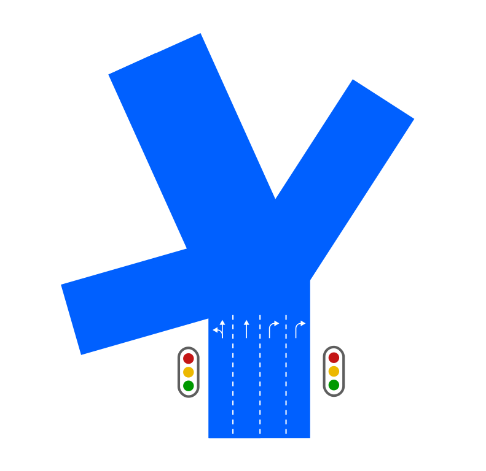 | 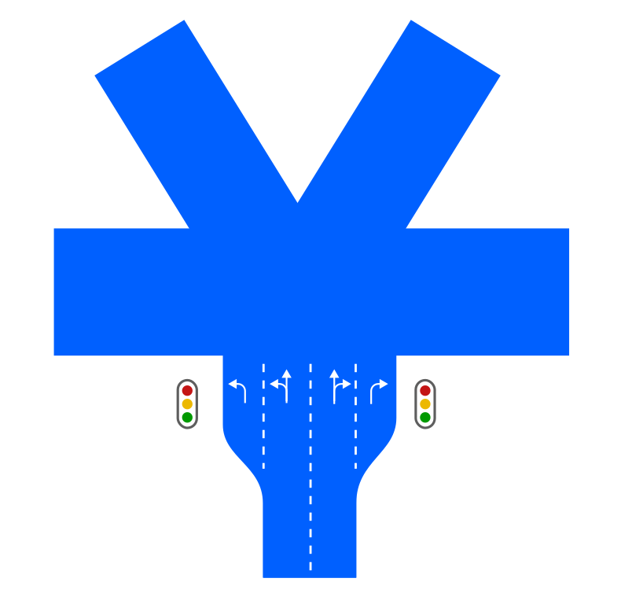 |

  
Examples
-----------

Lets illustrate those rules by examples:

| **View** | **EALG** |
|---|---|
| 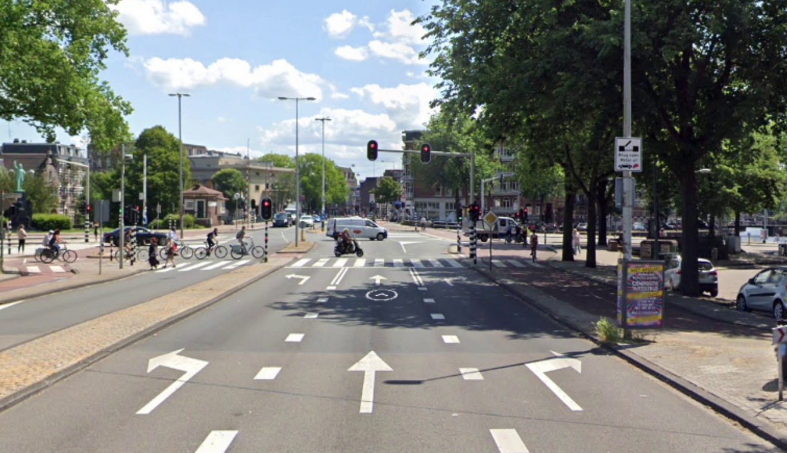 | LEFT\- NO  RIGHT \- NO  STRAIGHT \- YES |
| 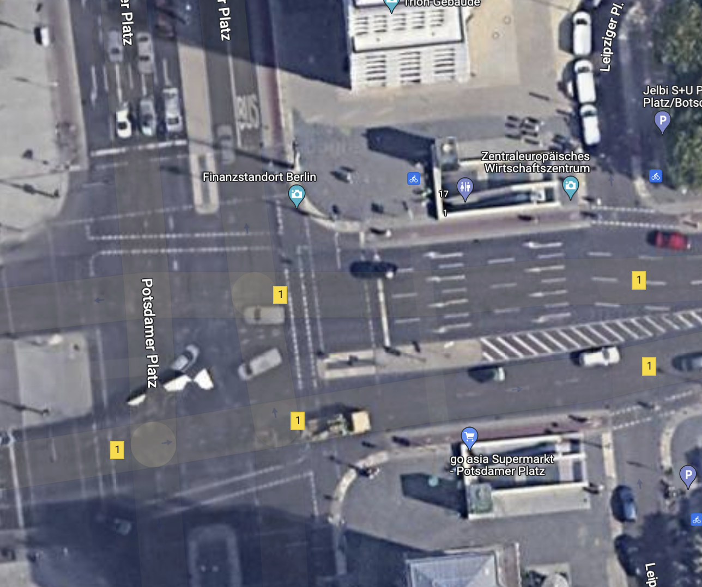 | LEFT\- NO  RIGHT \- NO  STRAIGHT \- YES |

  
  

Examples of lane guidance messages - complete set of messages
=============================================================

The page below consolidates all possible scenarios for audio messages for turns (and other instruction types).   
  

 [Lane guidance messages for supported instruction types](https://tomtom.atlassian.net/wiki/spaces/~khandus/pages/267835935/Lane+guidance+messages+for+supported+instruction+types)

Further Information
===================

Information posted on this page defines general framework of Turn instruction. To dig deeper into concrete scenarios, follow those pages:

[NIE\_011.7 - Turn Instructions](https://tomtom.atlassian.net/wiki/spaces/FlaminGO/pages/157680380)

[NIE\_011.1 - Bear left / right](https://tomtom.atlassian.net/wiki/spaces/FlaminGO/pages/157690607/Bear+left+right)

[NIE\_011.6 - Turn Angle representation](./Angles%20Quantisation%20%20/Angles_Quantisation.md)

[NIE\_011.5 - Sharp &amp; Sharper Turns](./Shallow%20and%20Sharp%20Turns%20%20/Shallow_and_Sharp_Turns.md)

[NIE\_011.4 - Isolated turn](./Isolated%20turn%20%20/Isolated_turn.md)

[NIE\_011.3 - Mandatory turn](./Mandatory%20turn%20%20/Mandatory_turn.md)

[NIE\_011.2 - Continue Straight](./Continue%20Straight%20%20/Continue_Straight.md)

