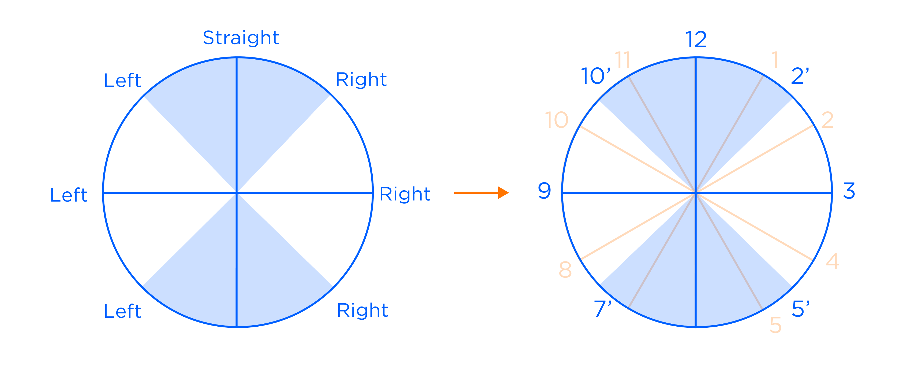
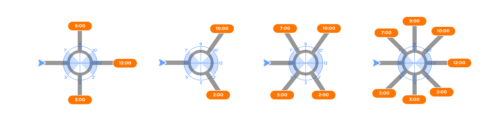

| **Interaction Designer** | [Rachael Lo](https://tomtom.atlassian.net/wiki/people/70121:018cce61-1d81-4f2e-beef-371a9f3958c1?ref=confluence)  [Alexey Opokin](https://tomtom.atlassian.net/wiki/people/70121:e8cb7861-9079-4b92-b96d-bfe8cd882680?ref=confluence)                                                                                                 |
|--------------------------|---------------------------------------------------------------------------------------------------------------------------------------------------------------------------------------------------------------------------------------------------------------------------------------------------------------------------------------|
| Dev. Teams               | Geo\-expansion                                                                                                                                                                                                                                                                                                                        |
| Jira tickets             | Audio Instructions [GOSDK\-6647](https://tomtom.atlassian.net/browse/GOSDK-6647?src=confmacro)  [GOSDK\-6648](https://tomtom.atlassian.net/browse/GOSDK-6648?src=confmacro)                                                                                                                                                   |
| Deviated from            | [Audio Instructions](../../Guidance%20Framework%20-%20Methods%20%26%20Components/Audio%20Instructions/Audio_Instructions.md) [Roundabouts](./../../Instructions/Roundabouts/Roundabouts.md)                                                                                                                                        |
| Local references         | [Drive tests](https://tomtom.atlassian.net/wiki/pages/viewpage.action?pageId=202052949), [Discussions](https://tomtominternational-my.sharepoint.com/:x:/g/personal/sundie_jong_tomtom_com/EaNi4nnhOjhMufT01SWgK8AB_geo1zkK_yWinQIQU5MxBA), [Benchmarks](https://tomtom.atlassian.net/wiki/display/AS/South+Korea+clockwise+guidance) |

*   
    *   [1\. Audio Instructions](#1Audio-Instructions)
    *   [1-1. Introduction](#1-1Introduction)
    *   [1-2. Approaches](#1-2-Approaches)
    *   [1-3. Audio Instructions Source](#1-3Audio-Instructions-Source)
*   [2\. Roundabouts](#2-Roundabouts)
    *   [2-1. Introduction](#2-1-Introduction)
    *   [2-2. Indicating directions of maneuver](#2-2-Indicating-directions-of-maneuver)
    *   [2-3. Roundabout Instruction structure](#2-3-Roundabout-Instruction-structure)

  

  

1. Audio Instructions 
======================

1-1. Introduction
-----------------

To make audio guidance more idiomatic for end users in South Korean region, clockwise guidance is implemented to replace "Bear left/right" and "Turn sharply" instructions, which lack suitable vocabulary in Korean.  

Using clockwise guidance not only make the Korean audio guidance more intuitive. It also provides drivers more informative instructions to navigate busy intersections or take ambiguous turns without relying on the display. 

1-2. Approaches
---------------

On Q23.2 the first step is to translate the local strings, which involve mapping clock annotations to the current guidance angles.

> [!NOTE]
> Since the phrase "turn left/right at x o'clock" conveys a distinct meaning compared to the original expressions "bear" and "sharp turn," it would be beneficial to introduce technical and visual design updates that provide more specific descriptions using clockwise directions. By incorporating detailed clockwise descriptions, the instructions can be more accurate and useful. 
 

  

| № | Action English|Action Korean | Purpose | Pointer | Road name/number | Detail English      |Detail Korean     | Towards | Number ordinal/cardinal |
|---|--------------------|---|-|---|-|---------------------|--------------------|---|---|
| A | Bear               | Turn | to take exit | At the traffic light | A100 (example) | left | left at 11 o'clock   | towards city centre | List of ordinal numbers |
| B | Bear     |Turn|to take exit | At the traffic light | A100 (example) | right | right at 1 o'clock |towards city centre |List of ordinal numbers 
| C | Turn sharply       | Turn | to merge | After the tunnel | E51 (example) | Cardinal numbers (list) | left at 7 o'clock    | towards Hamburg (example) |  
| D | Turn sharply |Turn|to merge | After the tunnel | E51 (example) | Cardinal numbers (list) | right at 5 o'clock | towards Hamburg (example) |

1-3. Audio Instructions Source
------------------------------

End result of the audio instructions compilation is stored in the Excel file.  
See the [Audio Instructions Source](https://tomtominternational.sharepoint.com/:x:/s/ttUXDDrive/EWU_AvkdHg5FmCxdz9uhLRsBhLTZSEuS_mEuSR4gYuVYtQ?e=EFgM9q) (English only), and Korean [translation discussions](https://tomtominternational-my.sharepoint.com/:x:/g/personal/sundie_jong_tomtom_com/EaNi4nnhOjhMufT01SWgK8AB_geo1zkK_yWinQIQU5MxBA)

  

2\. Roundabouts
===============

2-1. Introduction
-----------------

Roundabout instruction localization for Korean is needed for the following reasons:

1.  The current audio instructions using exit numbers to express action are unfamiliar among locals.
2.  Because of differences in language structures, using the phrase 'turn right/left in a roundabout' can cause confusion among users and lead to incorrect turns. So the current action details for roundabout instructions with be replaced by clockwise guidance. 

See examples below:

|  | Pointer | Distance                    | Action                       | Detail | Purpose |
|---|---|-----------------------------|------------------------------|---|---|
| English | At the roundabout | in 300m                     | take the 4th exit            | to go left | to xxx St. |
| Korean |At the roundabout|in 300m |   go at 10 o’clock direction | go at 10 o’clock direction| to xxx St.|

> [!NOTE]
> On Q23.2 as the first step we start from translating the local strings. 
  Follow-up actions include aligning the upcoming topics (e.g. distinguishing big or small roundabouts) and validate usability concerns (e.g. announcing clockwise guidance as confirmation instruction).

2-2. Indicating directions of maneuver
--------------------------------------

The clockwise format will be mapped on the current all possible 8(max.) directions.

Because some of the angles fall somewhere in between the clockwise 12 directions, they snap to one of the clock number based on the direction users need to turn.

See examples below:  

  

If the road direction falls somewhere in between those main 8 directions, it snaps to the closest clock which is the same logic as global. 

2-3. Roundabout Instruction structure
-------------------------------------

Visual Instruction represents Roundabout schematically and contains following items: Roundabout circle, All exits/entries, Highlighted correct exit.

| NIP Instruction | Main Audio Instruction                                                                                                                                        | Korean localization                                                                                                                                                         | Notes |
|---|---------------------------------------------------------------------------------------------------------------------------------------------------------------|-----------------------------------------------------------------------------------------------------------------------------------------------------------------------------|---|
|  | **FULL:** In 300m on the Roundabout, take the 1st exit to go right to Lorem Ipsum St.      **COMPACT:** In 300m on the Roundabout, take the 1st exit. | **FULL:** In 300m on the Roundabout, go at 3 o’clock direction to go to Lorem Ipsum St.  **COMPACT:** In 300m on the Roundabout, at 3 o’clock direction.            | Graphical representation of the RB has all exits depicted with highlighted correct exit. |
|  | **FULL:** In 300m Cross the Roundabout, 1st exit to Lorem Ipsum St.  **COMPACT:** In 300m Cross the Roundabout, 1st exit.                             | **FULL:** In 300m Cross the Roundabout, go at 12 o’clock direction to Lorem Ipsum St.  **COMPACT:** In 300m Cross the Roundabout, go at 12 o’clock direction.       |  |
|  | **FULL:** In 300m Cross the Roundabout, 1st exit to Lorem Ipsum St.    **COMPACT:** In 300m Cross the Roundabout, 1st exit.                           | **FULL:** In 300m Cross the Roundabout, go at 12 o’clock direction to Lorem Ipsum St.    **COMPACT:** In 300m Cross the Roundabout, go at the 12 o’clock direction. | On multi\-lane Roundabouts lane guidance information must be provided.  NOTE: LG at the entrance to RB might be different from LG before the exit. LG must be changed during travelling across the rB. |
|  | **FULL:** In 300m on the Roundabout, take the 5th exit to go Left to Lorem Ipsum St.    **COMPACT:** In 300m on the Roundabout, take the 5th exit.    | **FULL:** In 300m on the Roundabout, go at 10 o’clock direction to Lorem Ipsum St.    **COMPACT:** In 300m on the Roundabout, go at 10 o’clock direction.           | Indicate visually all possible exits (Max 8\). |
|  | **FULL:** In 300m on the Roundabout, take the 1st exit to go Right to Lorem Ipsum St.  **COMPACT:** In 300m on the Roundabout, take the 1st exit.     | **FULL:** In 300m on the Roundabout, go at 5 o’clock direction to Lorem Ipsum St.  **COMPACT:** In 300m on the Roundabout, go at 5 o’clock.                         | Not possible exits are also indicated via interrupted line, but only if they are orthogonal to the circle of the roundabout (not v\-shaped) For v\-shaped entries which a separated from exits, entries are not indicated. |
|  | **FULL:** In 300m Go around the Roundabout, 4th exit to Lorem Ipsum St.  **COMPACT:** In 300m Turn around on the Roundabout, 4th exit.                | **FULL:** In 300m Go around the Roundabout, go back to Lorem Ipsum St.  **COMPACT:** In 300m turn around on the Roundabout.                                         | Turn around Instruction is given only if the route needs to come back to the same road (identical name) that we came from. |