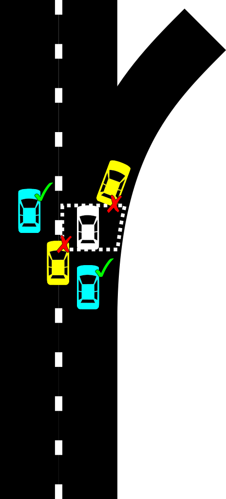
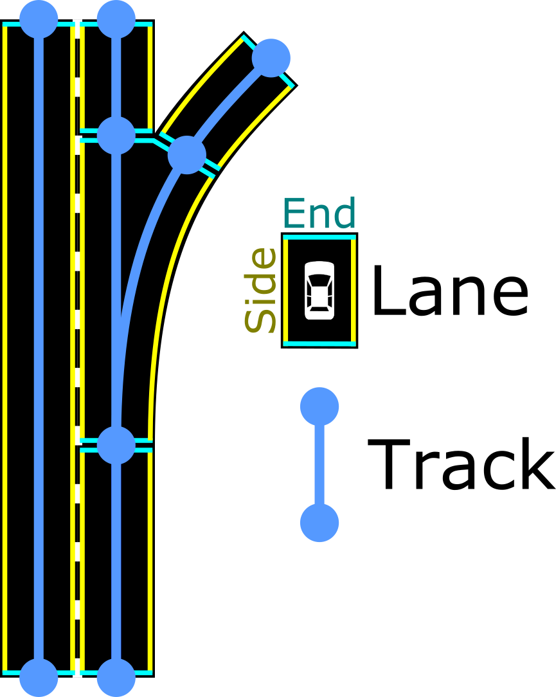

// Copyright (C) 2023 TomTom NV. All rights reserved.
//
// This software is the proprietary copyright of TomTom NV and its subsidiaries and may be
// used for internal evaluation purposes or commercial use strictly subject to separate
// license agreement between you and TomTom NV. If you are the licensee, you are only permitted
// to use this software in accordance with the terms of your license agreement. If you are
// not the licensee, you are not authorized to use this software in any manner and should
// immediately return or destroy it.

= Glossary

Note: the base of this glossary is located here: https://nk2-docs.azurewebsites.net/cpp/_c_glossary.html[NAVKIT2 C++
glossary].

== General Terms

[[def_kpi]]
KPI:: Key Performance Indicator: a measurable value that demonstrates how
performant a product is or how much resource it uses.

== Navigation Terms
////
Glossary format reminder: List terms in alphabetical order.  Unless
terms are always capitalized (names, acronyms), terms should be in
lowercase.  Meanings should be in sentence case with a period at the end.
Add links to standardized references if they are available.
////

[[def_active_route]]
Active route::
The <<def_route,route>> through which the driver currently navigates.  There
can be only one active route in the <<def_trip,trip>> - all other routes will
be considered <<def_alternative_route,alternatives>>.

[[def_connected_onboard_environment]]
Connected Onboard Environment
A navigation system that works in embedded environment but sources navigation data
(<<def_route,route>>, <<def_instruction,instructions>>, <<def_traffic_sdk,traffic>>)
from cloud deployment.

[[def_alternative_route]]
Alternative route::
A <<def_route,route>> which would still take the driver to their destination,
but during a different set of <<def_arc,arcs>>.  If the driver navigates to an
alternative route by steering, the route becomes the <<def_active_route,
active route>>.

[[def_guidance]]
Guidance::
The process of providing the driver with information about the <<def_route,
route>> and the <<def_maneuver,maneuvers>> they are supposed to perform.
Guidance is typically provided by the <<def_instruction_engine,instruction
engine>>.  Guidance typically consists of visual and audio information, and
reacts to the driver's actions in real time, as well as external events, such
as traffic, lane closures, or <<def_lane_level_position,lane-level position>>.

[[def_guidance_version]]
Guidance version::
A version of the <<def_guidance,guidance>> functionality.  The guidance version
is part of the request to compute <<def_static_guidance,static guidance>> via
the <<def_routing_api, Routing API>>.  The guidance version is used to select
the <<def_instruction_engine,instruction engine>> that will be used to generate
the <<def_instruction,instructions>> for the route.  Guidance version 1 invokes
the <<def_legacy_instruction_engine, legacy instruction engine>>.  Guidance
version `2` invokes the <<def_new_instruction_engine,new instruction engine>>,
and is the default version as of writing of this line.

[[def_hybrid]]
Hybrid::
A navigation mode that uses both <<def_onboard,onboard>> and <<def_online,
online>> modes.  The navigation system typically has a map of the road network
stored locally on the device, but also relies on <<def_routing_api,Routing
API>> for initial or partial computation, which is then refined on the device.

[[def_nds]]
NDS (Navigation Data Standard)::
The https://en.wikipedia.org/wiki/Navigation_Data_Standard[Navigation Data Standard]
is a standardized format for
automotive-grade navigation databases, jointly developed by automobile
manufacturers and suppliers.

[[def_nip]]
NIP (Next Instruction Panel)::
A visual representation of the next <<def_maneuver,maneuver>> the driver is
supposed to perform.  It is displayed on the screen of the navigation device.
The NIP is a visual representation of the <<def_instruction,instruction>> and
is generated by the <<def_instruction_engine,instruction engine>>. Additional
information in the NIP can include road shields of the upcoming road, next road
name, distance to the next maneuver, and the <<def_lane_configuration,lane
configuration>> at the next maneuver.  The NIP is usually displayed in the top
part of the screen.

[[def_onboard]]
Onboard::
A navigation mode that does not require a connection to the internet.  The
navigation mode is self-contained and does not require any external services
to function.  The navigation system typically has a map of the road network
stored locally on the device.

[[def_onboard_map]]
Onboard map::
A map of the road network stored locally on the device.  The map is used to
calculate routes and to provide guidance to the driver.  The map is typically
stored in the NDS format, and is used by the <<def_route_planning,route
planning>> and <<def_guidance,guidance>>.

[[def_online]]
Online::
A navigation mode that requires a connection to the internet.  The system in
this mode is not self-contained and requires external services to function.
The navigation system typically does not have a map of the road network stored
locally on the device.

[[def_route]]
Route::
A path that spans a sequence of <<def_arc,arcs>> in the road network, which
take the driver through the itinerary points provided by them.  Multiple routes
can exist in a given trip (for example: <<def_active_route,active route>>,
fastest route, fuel economical route, or just an <<def_alternative_route,
alternative>>).  Deviation leads to <<def_route_replanning,route replanning>>
and creation of a new route.

[[def_route_planning]]
Route planning::
The process of calculating a <<def_route,route>> from a set of itinerary points.
The route planning process is typically performed by the <<def_routing_engine,
routing engine>>.

[[def_route_replanning]]
Route replanning::
The process of recalculating a <<def_route,route>> from a set of
itinerary points, in attempt to find a more optimal route and ingest
real-time updates, such as <<def_traffic_sdk,traffic>>.
+
The route replanning process is typically performed by the
<<def_routing_engine,routing engine>>.  Route replanning happens during the
<<def_trip,lifetime of the trip>> lifetime and the <<def_route,route>>
navigation.

[[def_routing_engine]]
Routing Engine::
A software component that calculates a <<def_route,route>> from a set
of itinerary points.  The routing engine is typically part of the
<<def_route_planning,route planning>> process.  Routing Engine can
run as a service in the cloud, or onboard the navigation device.
When running on the cloud, the navigation system consumes the planned
route via the <<def_routing_api,Routing API>>.  When running onboard,
it performs the computation on the <<def_onboard_map,onboard map>>.

[[def_trip]]
Trip::
An entity which has itinerary points (departure, destination, optionally
waypoints) the driver wants to navigate between.  The lifetime of the trip
is from the moment the driver sent a request to plan a <<def_route,route>>,
to the moment the driver has arrived to the planned destination.  Note that
<<def_route_replanning,replanning>> or deviation do not alter the lifetime
of the trip.

[[def_vehicle]]
Vehicle::
A generalisation for any kind of steerable object.  Usually represents a
motorized vehicle, but can also refer to a bicycle or a pedestrian.

[[def_vehicle_profile]]
Vehicle profile::
A set of attributes relevant to the navigation of a vehicle.

[[def_voice_guidance]]
Voice guidance::
<<def_instruction,Instructions>> pronounced to the driver in real time using
audio, generated by text-to-speech engine.  In presence of good voice guidance,
the driver doesn't need to often look at the <<def_nip,NIP>>.  The voice
guidance language is selectable by the user.

[[def_wgs84]]
https://en.wikipedia.org/wiki/World_Geodetic_System#WGS84[WGS 84]::
The World Geodetic System (WGS) is a standard for use in cartography,
geodesy, and navigation including GPS. It comprises a standard coordinate
system for the Earth, a standard spheroidal reference surface (the datum or
reference ellipsoid) for raw altitude data, and a gravitational equipotential
surface (the geoid) that defines the nominal sea level.

== Products

[[def_gosdk]]
GO SDK::
Former name of <<def_navsdk,NavSDK>>.

[[def_navkit]]
NAVKIT:: (also: _NavKit 1_, _NK1_, _NK_).
The first generation of the modern TomTom navigation SDK sold to automotive
customers, driving TomTom mobile apps (e.g., <<def_amigo,AmiGO>>), and online
services (known as <<def_routing_api,Routing API>>).  _FCA R1_ is an example of
an automotive customer powered by NAVKIT.  NAVKIT is known by being
https://en.wikipedia.org/wiki/Monolithic_application[monolithic] and lacking
modularity, all code residing in a single
https://en.wikipedia.org/wiki/Monorepo[monorepo].  It was initially developed
as <<def_onboard,onboard-only>>, while later <<def_hybrid,Hybrid>> mode was
added.
The <<def_legacy_instruction_engine,Legacy Instruction Engine>> is the
<<def_guidance,Guidance>> engine of NAVKIT.
+
As of today NAVKIT is legacy, for which support for existing customers and some
extension is handled by a special team.  It was superseded by <<def_navkit2,
NAVKIT2>> and later by <<def_navsdk,NavSDK>>.

[[def_navkit2]]
NAVKIT2:: (also: _NK2_).
The second generation of the TomTom navigation SDK, replacing <<def_navkit,
NAVKIT>>.  The original intention for NAVKIT2 is to be <<def_online,
online>>-first,  and its architecture has been built up on this.  However,
closing the deal with Audi for the <<def_audi_hcp3, HCP3>> project in beginning
of 2020 forced to introduce an <<def_onboard, onboard>>-only mode for Guidance
and <<def_hybrid,Hybrid>> mode for <<def_route_planning,route planning>> due to
project and customer requirements.
For some time it was thought that NAVKIT2 will power <<def_amigo,AmiGO>>,
which is <<def_online, online>>-only (i.e., has no <<def_onboard_map,onboard
map>>).  However in 2021 the <<def_navsdk,NavSDK>> was identified as the next
generation of TomTom navigation SDK, and it became clear that NAVKIT2 will only
serve the <<def_audi_hcp3, HCP3>> project. This in turn has led to  abandoning
the vision of NAVKIT2 being <<def_online,online>>-first, since <<def_amigo,
AmiGO>> will eventually be driven by <<def_navsdk,NavSDK>>.
+
Unlike NAVKIT, NAVKIT2 code was https://www.devtip.co/monorepo/[multi-repo],
with https://microservices.io/[micro service] architecture in mind: all the
functionalities, besides the infrastructure, were split into service and
client library components, and the SDK was assembled from a list of client
library components, each connecting to its respective service.  While such
architecture can potentially allow modularity and different components residing
on either <<def_online, online>> or <<def_onboard,onboard>>, NAVKIT2 ended up
being  https://en.wikipedia.org/wiki/Monolithic_application[monolithic] just
like <<def_navkit,NAVKIT>>, with the navigation SDK released all at once and
having a specific version, despite each underlying component being versioned
differently.
+
Initially NAVKIT2 was planned to run for both iOS and Android, however the iOS
version of the SDK quickly started lagging behind the Android version, due to
lack of urgency: the <<def_audi_hcp3, HCP3>> system that was the business
driver of NAVKIT2 was Android-only.  <<def_amigo,AmiGO>>, which is required to
run on both iOS and Android, was by that time already planned to move to
<<def_navsdk,NavSDK>>, and until this was done, was consuming a very old
version of NAVKIT2 which still supported both Android and iOS.
+
The vast majority of the code in NAVKIT2 was implemented within C++
components, categorized as either framework libraries, services, or client
libraries.  The driving idea was that the SDK consists of client libraries that
start the counterpart services, control them, and receive data in real time
from them by subscribing listeners for those services.  The resulting SDK is
essentially exposed as a collection of C++ client libraries.  On top of that
each client library was wrapped by a thin Android client library, where most of
the C++ interfaces could be automatically translated to Java using
https://www.swig.org[SWIG].  Initially there were also iOS client libraries,
but as explained above, these were dropped due to lack of clients.

[[def_routing_api]]
Routing API::
A cloud service that provides <<def_route_planning,route planning>>
and <<def_static_guidance,static guidance>> functionality to the
the navigation system.  The navigation system consumes that data
via the Routing API.  Routing API can be accessed using
https://www.ibm.com/topics/rest-apis[REST API].
+
Routing API is used in the <<def_online,online>> and <<def_hybrid,hybrid>>
navigation modes.  It is considered a product of its own, and is
marketed as such.

[[def_navsdk]]
NavSDK:: (also: _GO SDK_).
The third generation of the TomTom navigation SDK, replacing
<<def_navkit2,NAVKIT2>>.  The driving architectural principle behind NavSDK
was true modularity consisting of smaller SDKs, allowing customers to build
a completely custom system consisting only of the functionality they need,
while allowing them to connect their own sub-systems, also for input, given
they adhere to a interface defined by other consuming SDKs inside NavSDK.
For example, given they wish to do so, a customer is enabled to inject their
own <<def_static_guidance,static guidance>> engine by implementing their own
Routing SDK, instead of using NavSDK native Routing SDK which is tied to
<<def_new_instruction_engine,New Instruction Engine>> usage.
https://developer.tomtom.com/android/navigation/documentation/overview/introduction[Link to portal]
for more information.
+
Unlike <<def_navkit2,NAVKIT2>>, only a limited number of components remained
in C++ and have not been rewritten in platform-native programming languages
Kotlin (for Android) and Swift (for iOS).  Even <<def_guidance,Guidance>>
implementation in NavSDK has been split into
<<def_static_guidance,Static Guidance>> implemented in the
<<def_navigation_instruction_engine_component,Navigation Instruction Engine component>>
which was implemented in C++, and <<def_dynamic_guidance,Dynamic Guidance>>
(formerly the <<def_triggering_engine_component,Triggering Engine component>>
of <<def_navkit2,NAVKIT2>>), for which the functionality has been rewritten
in Kotlin and Swift.  Therefore, in NavSDK there are no SWIG-generated wrappers
for C++ client libraries, but rather most of the functionality is implemented
on SDK level using native programming languages.  Instead, the remaining C++
components are exposed to the SDK as Kotlin and Swift client libraries using
<<def_functional_enabler,Functional Enablers>>.

== NavSDK-specific Terms

[[def_dynamic_guidance_engine]]
Dynamic Guidance Engine::
The component of the <<def_navsdk,NavSDK>> that is responsible for the
generation of <<def_dynamic_guidance,dynamic guidance>>.  It is part of the
<<def_navigation_sdk,Navigation SDK>>.

[[def_functional_enabler]]
Functional Enabler::
An entity in the architecture of <<def_navsdk,NavSDK>> that is responsible
for providing a specific functionality to the SDK.  They were introduced as
a concept to allow consuming core functionality such as <<def_static_guidance,
Static Guidance>> and <<def_route_planning,Route Planning>> without having to
rewrite those functionalities in platform-native programming languages,
but rather reuse the existing C++ code, developed as part of <<def_navkit2,
NK2>>.  Functional Enablers are implemented as C++ components, and are
exposed to the SDK as C++ client libraries.  Functional Enablers expose
platform-native interface in Kotlin and Swift.  The
<<def_new_instruction_engine,NIE>> is wrapped in a Functional Enabler.

[[def_navigation_sdk]]
Navigation SDK::
One of the SDKs that make up the <<def_navsdk,NavSDK>>.  As the name suggests,
this SDK exposes real-time navigation functionality to the client application.
Navigation SDK takes output of other NavSDK SDKs, such as <<def_routing_sdk,
Routing SDK>> and <<def_traffic_sdk,Traffic SDK>> while combining static data
such as the planned <<def_route,route>> and dynamic data such as current car
position, and produces events for the client which exposes the data required
for the client to build a real-time navigation experience.

[[def_routing_sdk]]
Routing SDK::
One of the SDKs that make up the <<def_navsdk,NavSDK>>.  As the name suggests,
this SDK exposes <<def_route_planning,route planning>> functionality to the
client application, as well as other SDKs in NavSDK.  Routing SDK takes
input from the client application, such as the itinerary points, and produces
a <<def_route,route>> as output.  In NavSDK, important to note, the route
actually includes <<def_static_guidance,static guidance>>.
+
Routing SDK can operate in <<def_online,online>>, <<def_onboard,onboard>>, and
<<def_hybrid,hybrid>> modes.
+
Routing SDK uses a <<def_functional_enabler,Functional Enabler>> to provide
the functionality of <<def_static_guidance,Static Guidance>> and
<<def_route_planning,Route Planning>> in <<def_onboard,onboard>> and
<<def_hybrid,hybrid>> modes.

[[def_traffic_sdk]]
Traffic SDK::
One of the SDKs that make up the <<def_navsdk,NavSDK>>.  As the name suggests,
this SDK exposes real time traffic functionality to the client application,
as well as other SDKs in NavSDK.

== Customers and Projects

This is not supposed to be an exhaustive list of TomTom automotive customers,
but rather definition of several customers that have driven or dictated the
development of the <<def_new_instruction_engine,New Instruction Engine>>.
It provides some history and background which might be useful to understand
the context of the products and projects described in this document and
how the <<def_guidance,Guidance>> engine on all its incarnations fits in them.

[[def_amigo]]AmiGO::
TomTom mobile consumer application.  Has historically and currently been
using Routing API and <<def_online, online>> <<def_route_planning,Routing>>
and <<def_guidance,Guidance>>.  Currently using <<def_navsdk, NavSDK>> and
serves Guidance computed online by <<def_new_instruction_engine,
New Instruction Engine>> in production deployment.
+
AmiGO has Alpha, Beta, and Production versions, with greatly different user
base.  This allows rolling out features incrementally to users and gathering
feedback.

[[def_audi_hcp3]]Audi HCP3::
The first <<def_new_instruction_engine,New Instruction Engine>> client.
<<def_navkit2,NAVKIT2>> was relatively in an early stage of development, when
the deal was closed with Audi.  Back then the <<def_new_instruction_engine,
New Instruction Engine>> was a theoretical idea waiting for a business
opportunity to materialize, but which had never got the priority, and the HCP3
project was a trigger to start its development.  The reason for this was Audi's
request of features, and the decision was that it would be easier to implement
from scratch a new <<def_instruction_engine,instruction engine>>, rather than
extending the existing <<def_legacy_instruction_engine,Legacy Instruction
Engine>> and integrating all those features into <<def_navkit,NAVKIT>>.  The
Guidance team has long wished for a green light and budget to start development
of a brand new cutting-edge instruction engine, so the decision was to
implement and deliver the Guidance features for HCP3 as part of the New
Instruction Engine.
+
The year 2023 sees delivery of the first production milestone (SOP1) of
<<def_new_instruction_engine,New Instruction Engine>> to Audi as the quality of
Guidance has been accepted by them.
+
The system as a whole runs on Android and is integrated in the car.

[[def_bmw_motorrad]]BMW Motorrad::
The first automotive consumer project of <<def_navsdk,NavSDK>>.
The system, which consists of a custom UI application developed outside
of TomTom, and NavSDK, is designated for motorbike riders, and contains
special functions relevant for them.  The resulting application is
installable on iOS and Android devices.

[[def_stla_r2]]
STLA R2 (formerly FCA R2)::
The second generation of the TomTom navigation system for FCA.  It is
based on <<def_navsdk,NavSDK>> and includes new <<def_guidance,Guidance>>
features such as <<def_lane_level_navigation,Lane-Level Navigation>> and
<<def_audible_lane_guidance,Audible Lane Guidance>>.
+
* See https://confluence.tomtomgroup.com/display/NAV/Lane+Level+Guidance+in+R2[this page]
for more information on lane-level guidance in STLA R2.
+
* See https://confluence.tomtomgroup.com/display/PSA/STLA+Product+Overview+-+In-car+Navigation#expand-SoftwareSpecs[STLA Product Overview - In-car Navigation] for the complete product scope.

== HCP3-specific Terms

[[def_esolutions]]
eSolutions:: The company that implemented a library which exposes components
to <<def_naviapp,NaviApp>>, and consumes with <<def_navkit2,NAVKIT2>> SDK.

[[def_exitview]]
Exit View:: Graphical schematic 3D visualisation of the road and the
<<def_lane,lanes>> (including splits) at the motorway exit junction, with the
lane recommendations marked on it so it would be clear for the driver which
lane(s) they are supposed to change into.
+
Unlike <<def_simple_lane_guidance,simple lane guidance>>, the Exit View shows
lane information not just at the next upcoming maneuver, but the
<<def_lane_configuration,lane configuration>> before and after as well.
+
Relevant only for motorways and is not displayed for any other roads.

[[def_naviapp]]
NaviApp:: TomTom did not provide a frontend application for the
<<def_audi_hcp3,HCP3>> project.  Instead, the frontend application was
implemented by a third party supplier (Cariad). It interacts with a library
provided by <<def_esolutions,eSolutions>>, rather than with <<def_navkit2,
NAVKIT2>> SDK.

== Guidance Terms

[[def_arc]]
Arc:: An arc is as defined by the NDS model, a road or similar segment that
connects <<def_node,nodes>>.  An arc should be contrasted with a <<def_line,
line>>, which is the primary model of a road for instruction generation
purposes (however in practice each line is generated from one arc).

[[def_audio_instruction]]
Audio Instruction:: An announcement in natural language to the driver
describing a <<def_maneuver,maneuver>>, played to the driver audibly.  One
audio instruction corresponds to one or more (if they are combined)
<<def_instruction,instructions>>, whereas each instruction may be communicated
to the driver as multiple different audio instructions.

[[def_chained_instruction]]
Chained Instruction:: A synonym for <<def_combined_instruction,combined
instruction>>.

[[def_combined_instruction]]
Combined Instruction:: Two <<def_instruction,instructions>> are combined if
they are announced together as a single <<def_audio_instruction,audio
instruction>>.  This is typically done when there is not enough time between
two <<def_maneuver,maneuvers>> to fully describe the second.
+
Also: _chained instruction_.

[[def_dynamic_guidance]]
Dynamic guidance:: Guidance that reacts quickly to circumstances, therefore is
time-aware.  Examples of circumstances are the driver position on the road,
the driver's speed, the driver's lane, and traffic.

[[def_dynamic_guidance_data]]
Dynamic guidance data:: Data that is synthesised out of
<<def_static_guidance_data,static guidance data>> and other sensor data to
produce <<def_dynamic_guidance,dynamic guidance>>.
+
Dynamic guidance should not require map access.  Any necessary map data should
be encapsulated in the <<def_static_guidance_data,static guidance data>>.

[[def_earliest_trigger_point]]
Earliest trigger point:: One potential <<def_trigger_point,trigger point>> that
is the earliest point at which an <<def_audio_instruction,audio instruction>>
will be announced.  The audio instruction will be announced only if the
<<def_triggering_phase,triggering phase>> is interrupted between the earliest
trigger point and the <<def_recommended_trigger_point,recommended trigger
point>>.

[[def_fishbone_model]]
Fishbone Model:: A view of a route that consists of an ordered sequence of
<<def_junction,junctions>>.  So-called because a route appears to be a sequence
of lines forming the backbone of the fish, with not-taken side roads forming
the ribs.

[[def_bifurcation_intersection]]
Bifurcation (intersection)::
A fork with two outgoing roads.

[[def_bifurcation_road_situation]]
Bifurcation (road situation)::
A road situation that happens on <<def_bifurcation_intersection, bifurcations
(intersection type)>> only and always requires a fork (left, right)
<<def_instruction,instruction>> to take one of the two possible options.

[[def_exit]]
Exit::
A <<def_situation which happens at forks and requires special exit
<<def_instruction,instruction>> to leave the current <<def_motorway,motorway>>.

[[def_fork]]
Fork::
An <<def_intersection,intersection>> type where the road splits without
interrupting the traffic flow.

[[def_highway_switch]]
Highway Switch::
A road situation that happens on motorways and requires a special switch
highway <<def_instruction,instruction>> to leave the current <<def_motorway,
motorway>> (via exit or fork) in order to take another one.

[[def_instruction]]
Instruction:: A description of an <<def_maneuver,maneuver>> required which is
communicated to the driver.  The instructions generated by the
<<def_instruction_engine,instruction engine>> are a decomposed set of fields
describing all aspects of the required maneuver.

[[def_instruction_engine]]
Instruction Engine:: A software component that generates <<def_instruction,
instructions>> for a route.  Current development is focused on the
<<def_new_instruction_engine,New Instruction Engine>>, while the
<<def_legacy_instruction_engine,legacy instruction engine>> is closed for new
features.

[[def_instruction_island]]
Instruction island: An <<def_instruction,instruction>> island is a set of subsequent
<<def_instruction,instrctions>> that are potentially <<def_combined_instruction,combinable>>.

[[def_interrupted_phase]]
Interrupted phase:: A <<def_triggering_phase,triggering phase>> that cannot
begin at the regular position, because the previous instruction has not yet
ended.
+
Refer to https://confluence.tomtomgroup.com/display/FlaminGO/NIE_004+-+Instruction+Triggering+Logic[FlaminGO spec]
for complete information and diagrams.

[[def_intersection]]
Intersection::
A point at which two or more roads cross or meet.  From the developer's point of
view, it's an NDS junction that has at least three outgoing <<def_arc, arcs>>.
+
Intersections can be T-intersections, Y-intersections, forks, N-way
intersections, and so on.

[[def_junction]]
Junction:: A junction is either a point where three or more incident
<<def_line,lines>> join, or a point on a <<def_line,line>> where the line
properties change, which effectively makes it a trivial junction, where two
<<def_line,lines>> join).
+
A junction represents a place where the simplest possible turn-by-turn
<<def_instruction,instructions>> make sense (turn left, bear right, u-turn, go
straight).  If this is a trivial junction, no instruction is expected.  Its
geometry is defined by a set of coordinates and connectivity to two or more
<<def_line,lines>>.
+
A junction generally corresponds to a <<def_node,node>> on the map, although we
reserve the possibility to introduce non-node junctions in a future design
decision (for example, entering a restricted area).  As for now, every node
along the route will is a junction, even those that will not lead to generation
of any instruction.

[[def_junction_model]]
Junction Model:: A view of a route that consists of an ordered sequence of
<<def_junction,junctions>> connected by <<def_line,lines>>.  From a software
architecture point of view, this is an abstraction layer that hides the
complexity of the underlying map, allowing to provide a mock implementation for
testing decoupled from a real map.

[[def_legacy_instruction_engine]]
Legacy Instruction Engine:: The <<def_instruction_engine,instruction engine>>
used in <<def_navkit,NAVKIT>>.  It is still being maintained as of writing of
this line by an external team to support <<def_navkit,NAVKIT>> which is still
being sold to customers.  However, no new features or extensions have been
developed for it for quite some time.

[[def_line]]
Line:: A line is a connection between two <<def_junction,junctions>> for
<<def_instruction,instruction>> calculation purposes.  Depending on future
design decisions it may correspond to multiple <<def_arc,arcs>> on the map, or
to only a part of an arc.  Currently, each line is generated from one arc.
+
The geometry of a line is defined by that of its junctions, its length, and its
start and end angles.  Detailed shape points can be additionally queried from a
line.
+
Bidirectional arcs must be represented as two unidirectional lines.

[[def_maneuver]]
Maneuver:: An action involving control of the vehicle by the driver.  This is
loosely defined and dependent on the perception of the driver.  Many times
interchangeable with the term <<def_instruction,instructions>>, however
instruction is intended to signal about a necessity or suggestion to perform
the maneuver.

[[def_maneuver_point]]
Maneuver Point:: A maneuver point is a point on a <<def_route,route>> where
the <<def_maneuver,maneuver>> is at its extreme (for example, when the driver
steers the most while performing a turn).  A maneuver point is represented by
a lat/lon coordinate and is located on an <<def_arc,arc>>.  A maneuver point is
not necessarily located on a <<def_node,node>>.

[[def_maneuver_type]]
Maneuver Type:: A maneuver type is a classification of a maneuver. The
classification is based on the type of  maneuver, the type of road, and the
type of junction.  The classification is used to determine the
<<def_trigger_point,trigger point>> for the maneuver.

[[def_motorway]]
Motorway:
A road whose corresponding arc has either the _IsMotorway_ flag set to true or
the _IsControlledAccess_ flag set to true and a specified minimum speed limit
of 80 km/h.

[[def_natural_continuation]]
Natural continuation::
A group of one or more <<def_road_situation,road situations>> when the driver
does not need any <<def_instruction,instruction>> to pass through the
<<def_intersection,intersection>> and stay on the route.

[[def_new_instruction_engine]]
New Instruction Engine (NIE):: Also _Next Instruction Engine_, or
_Navigation Instruction Engine_.  The new instruction engine is a software
component that generates <<def_instruction,instructions>> for a route.  The new
instruction engine is the successor of the <<def_legacy_instruction_engine,
legacy instruction engine>>.  It has been under development since 2020.  It
consists of the instruction and <<def_lane_guidance,Lane Guidance>> generation
component (which in turn is called _Instruction Engine_, which can be
confusing), <<def_triggering_engine,Triggering Engine>>, and
<<def_text_generation,Text Generation>> components. The previous instruction
engine is called the <<def_legacy_instruction_engine,legacy instruction engine>>, and is the legacy implementation of the functionalities of all the
three components. It was used in <<def_navkit,NAVKIT>> for onboard guidance and
the <<def_guidance_version,guidance version>> `1` of <<def_routing_api,
Routing API>>.

[[def_node]]
Node:: A node as defined by the NDS model, a connection point between
<<def_arc,arcs>>.  This should be contrasted with a <<def_junction,junction>>,
which is the abstraction layer used for <<def_instruction,instruction>>
generation.

[[def_recommended_trigger_point]]
Recommended Trigger Point:: One potential <<def_trigger_point,trigger point>>
that is the typical point at which an <<def_audio_instruction,audio
instruction>> will be announced.  In the case of an <<def_interrupted_phase,
interrupted phase>>, however, it may be earlier.
+
Refer to https://confluence.tomtomgroup.com/display/FlaminGO/NIE_004+-+Instruction+Triggering+Logic[FlaminGO spec]
for complete information and diagrams.

[[def_road_situation]]
Road Situation::
A route stretch at the junction where the <<def_instruction_engine,
Instruction Engine>> intentionally produces or suppresses an <<def_instruction,
instruction>>.
+
A road situation is a pattern that consists of a set of rules.  If rules are
satisfied, then the road situation is detected.
+
Road situations may have the same names as <<def_intersection,intersections>>
where they appear (e.g. <<def_bifurcation_intersection,bifurcation>>).
+
It is possible to have different road situations at the same intersections
depending on the route stretch.  For example https://www.google.com/maps/place/51%C2%B014'02.5%22N+6%C2%B042'29.6%22E/@51.2341682,6.7074442,167m/data=!3m1!1e3!4m4!3m3!8m2!3d51.2340359!4d6.7082125[this intersection]
on the motorway:
 +
This intersection type is a bifurcation since the road splits without
interrupting the traffic flow.  If the route goes through the right branch
then it's an <<def_exit,exit road situation>> since it leads from a <<def_motorway,motorway>> to a
https://www.google.com/maps/dir/51.2334091,6.7115605/51.2361533,6.7032187/@51.2346495,6.7048156,725m/data=!3m1!1e3!4m2!4m1!3e0[non-motorway road].
However if the route continues straight, it's a <<def_natural_continuation,
natural continuation>> situation since the driver does not need any instruction
to https://www.google.com/maps/dir/51.2334091,6.7115605/51.2345804,6.7052171/@51.2338614,6.7071022,363m/data=!3m1!1e3!4m2!4m1!3e0[pass through this intersection]
+
This way, it is possible to have a natural continuation road situation at the
<<def_bifurcation_intersection,bifurcation>> intersection type.

[[def_situation]]
Situation:: A situation is a stretch of the road to which a particular piece of
business logic applies.  Defining different situations is the principle way the
<<def_new_instruction_engine,new instruction engine>> keeps different business
requirements from becoming entangled, preserving maintainability of the code.
Situations typically are short sequences of <<def_maneuver,maneuvers>> (often
just one) which can be described coherently to the driver.  However, one
situation may result in several distinct <<def_instruction,instructions>>.
+
In some design documents the word "situation" represents a sequence of
<<def_instruction,instructions>> that can be processed within the attention
span of a driver.  Instructions generated during a situation can be held in the
driver's short term memory.  However, this usage is probably now just confusing
and should be avoided.

[[def_situation_detector]]
Situation Detector:: A code component of <<def_new_instruction_engine,NIE>>
that is responsible for identifying situations on the route at a given offset.
For example, _Merge Detector_ is responsible for identifying a merge.  It is
typically invoked by <<def_situation_handler, situation handlers>> to
encapsulate all or most of the business logic of algorithms and heuristics used
to identify different <<def_situation,situations>> and extract their details.
Situation detectors are mockable for easier unit testing of
<<def_situation_handler,situation handlers>>.

[[def_situation_handler]]
Situation Handler:: A code component of the <<def_new_instruction_engine, NIE>>
that is responsible for handling a particular <<def_situation, situation>>.  It
is typically invoked by the instruction engine main loop.  It is responsible
for generating one or more <<def_instruction,instructions>> for the situation.
A situation handler may consume one or more <<def_line,lines>> from the
<<def_junction_model,junction model>>, or not.  Typically, not consuming a line
means that the situation handler is not interested in the situation, and the
next situation handler will be invoked.  A situation handler may consume a line,
but not generate any instructions, which means it detected a situation, but it
is not actionable (for example, the driver would stay on the route without
deviating from it).
+
Situations handlers are mockable for easier unit testing of the new
instruction engine.

[[def_situation_model]]
Situation Model:: A view of a route that consists of an ordered sequence of
<<def_situation,situations>>.  A situation model is be built from an underlying
<<def_junction_model,junction model>>.

[[def_static_guidance]]
Static guidance data:: Guidance that can be precomputed based on
<<def_static_guidance_data,static guidance data>>, and be shown to the driver
as a turn-by-turn list, for example.  As opposed to <<def_dynamic_guidance,
dynamic guidance>>, which is time-aware, static guidance does not incorporate
any time-triggered events.

[[def_static_guidance_data]]
Static guidance data:: A complete enough subset of map data and precomputed
data so that no further map access is necessary for giving turn-by-turn
guidance to the user.  As opposed to <<def_dynamic_guidance_data,dynamic guidance data>>.

[[def_text_generation]]
Text Generation:: A component of the <<def_new_instruction_engine,new
instruction engine>> that generates <<def_text_instruction,text instructions>>
from <<def_instruction,instructions>>.  The text generation component supports
multiple languages, and is responsible for generating the text for the voice
guidance.  It is also responsible for generating the text for the warning
messages.

[[def_ttfg]]
Time to first guidance:: The time taken by the system from the moment
the client requests the <<def_route_planning,route planning>> to the
moment where the first <<def_instruction,instruction>> is displayed in
the <<def_nip,NIP>> with proper <<def_lane_guidance,lane guidance>>.

[[def_trifurcation_intersection]]
Trifurcation (intersection)::
A <<def_fork,fork>> with three outgoing roads.  This is different from a
<<def_trifurcation_road_situation,trifurcation road situation>>.

[[def_trifurcation_road_situation]]
Trifurcation (road situation)::
A road situation that happens on <<def_trifurcation_intersection,trifurcations
(intersection type)>> only and always requires a <<def_fork,fork>> (left,
middle, right) <<def_instruction,instruction>> to take one of the three
possible options.

[[def_trigger_point]]
Trigger point:: A point along the route in which the current <<def_instruction,
instruction>> will be announced as an <<def_audio_instruction,audio
instruction>> according to the current <<def_triggering_phase,phase>>.
+
Refer to https://confluence.tomtomgroup.com/display/FlaminGO/NIE_004+-+Instruction+Triggering+Logic[FlaminGO spec]
for complete information and diagrams.

[[def_triggering_engine]]
Triggering Engine:: To provide <<def_dynamic_guidance, dynamic guidance>>,
this component is responsible for triggering <<def_audio_instruction,audio
instructions>> at the right time.   The triggering engine is responsible for
triggering <<def_audio_instruction,audio instructions>> at the right time.
It is responsible for determining the <<def_trigger_point,trigger point>>
for each <<def_instruction,instruction>>.  It is also responsible for
determining the <<def_triggering_phase,triggering phase>> for each
<<def_instruction,instruction>>, based on configuration and the current
car position.
The triggering engine typically runs on the navigation device.  It does
not use any map data.  The <<def_static_guidance_data,static guidance data>>
and the dynamic inputs are sufficient to generate the triggering points.

[[def_triggering_engine_component]]
Triggering Engine component:: The component that runs side-by-side with
the <<def_instruction_engine,instruction engine>> and is responsible for
triggering <<def_audio_instruction,audio instructions>> at the right time.
In <<def_navkit2,NAVKIT2>> it was called the _Triggering Engine component_.
In <<def_navsdk,NavSDK>> it is part of the _Dynamic Guidance Engine_,
which is part of the Navigation SDK.

[[def_triggering_phase]]
Triggering phase:: A stretch of the <<def_route,route>> leading to an
<<def_instruction,instruction>>, during which the instruction will be
announced with a particular style of <<def_audio_instruction,audio
instruction>>.  In general, triggering phases further away from the
instruction will be more descriptive, while triggering phases closer to the
instruction will be more concise.  The <<def_audio_instruction,audio
instruction>> of a phase will be triggered one, at the phase's
<<def_trigger_point,trigger point>>.
+
Refer to https://confluence.tomtomgroup.com/display/FlaminGO/NIE_004+-+Instruction+Triggering+Logic[FlaminGO spec]
for complete information and diagrams.

== Lane Guidance Terms

Note: some of these terms may conflict with terms used in the
https://nds.tomtomgroup.com/documentation/view/275/[Lane FTX Block of the NDS
standard].  The closest FTX equivalents are noted below.

[[def_audible_lane_guidance]]
Audible Lane Guidance:: A lane guidance functionality where the driver
is informed about the recommended lane and the <<def_lane_configuration,
lane configuration>>, at the point of the <<def_maneuver,maneuver>>, using
an <<def_audio_instruction,audio instruction>>, or informed about
<<def_lane_recommendation,lane recommendations>> change.
+
As of writing of this line, the audible lane guidance UX spec is still
inexistent, and the definition above is based on the general understanding of
the concept.

[[def_end]]
End:: The ends of a <<def_lane,lane>> define places where a vehicle crosses
from one lane into another along a <<def_track,track>>.
+
A vehicle arriving at a lane must arrive from one of the incoming ends of the
lane.
+
A vehicle driving along a lane must choose one of the outgoing ends of the
lane.
+
There may be a natural end of the lane, in which case a driver choosing this
end is not making a conscious <<def_maneuver,maneuver>>.  A driver choosing any
other end is making a conscious maneuver.
+
_FTX equivalent_: Lane Connector.

[[def_lane]]
Lane:: An area of lateral exclusivity on the road.  That is, when a vehicle is
driving along a lane, there may be other vehicles ahead or behind within the
lane, but not to either <<def_side,side>>.  A lane is marked by road markings
and is intended for a particular type of traffic.  The driver might be required
to change lanes to perform a maneuver.
+
Not to be confused with a <<def_line,line>>.

+
Lanes have exactly two <<def_side,sides>> and two or more
<<def_end,ends>>.
+
A lane is a two-dimensional shape.
+
Lanes may overlap, in which case it is the responsibility of all drivers to
respect the lateral exclusivity of other drivers using overlapping lanes.
+
Vehicles within a lane should follow one of a defined set of <<def_track,
tracks>> contained within the lane.
+
_FTX equivalent_: Lanes have no well-defined meaning within the FTX block.

[[def_lane_arrow]]
Lane Arrow:: A lane arrow is a visual representation of the direction(s) a
vehicle may travel in a lane.  It is typically painted on the road surface, but
may also be a sign or other visual representation.  A single <<def_lane,lane>>
may have multiple lane arrows, each representing a different <<def_track,
track>> that a vehicle may follow within the lane.  Note that the
<<def_instruction_engine,instruction engine>> computes the lane arrows based on
different sources of information, such as road geometry and
<<def_lane_connectivity,lane connectivity>>.  Therefore there is no inherent
expectation that the computed lane arrows will match the actual lane arrows
painted on the road surface.

[[def_lane_configuration]]
Lane Configuration:: The set of <<def_lane,lanes>> that are available to the
driver at a particular point along the route.  The lane configuration consists
of <<def_lane_arrow,lane arrows>> per lane, some of which are highlighted as
<<def_lane_recommendation,lane recommendations>>.

[[def_lane_connectivity]]
Lane Connectivity:: The connectivity between <<def_lane,lanes>> at a
particular point along the route.  Each element of the lane connectivity is
a pair of source and destination <<def_lane_connector,lane connectors>>
between two <<def_lane_group,lane groups>>.

[[def_lane_connector]]
Lane Connector:: An entity allowing connecting one <<def_lane_group,
lane groups>> to another on <<def_lane,lane>> level.

[[def_lane_group]]
Lane Group:: A lane group is a set of one or more <<def_lane,lanes>>. All
lanes within one lane group have the same travel direction.  A lane group
typically occupies the whole <<def_arc,arc>> or a part of it.  Sometimes there
are zero-length lane groups, which are used to store <<def_lane_connectivity,
lane connectivity>> for the <<def_intersection,intersection>> in front of it.

[[def_lane_guidance]]
Lane Guidance:: Lane guidance keeps the driver informed about:
* Which <<def_lane,lanes>> are reachable from this lane
* What legal restrictions exist on changing lanes
* Which <<def_track,tracks>> may be followed within each lane
* Which lanes will take the driver to their destination
* Which tracks within each lane will take the driver to their
destination
* Which lane and track are <<def_lane_recommendation,recommended>>.

[[def_lane_level_guidance]]
Lane-Level Guidance:: Same as <<def_lane_level_navigation,lane-level
navigation>>.

[[def_lane_level_navigation]]
Lane-Level Navigation:: Lane-level navigation is a subset of
<<def_lane_guidance,lane guidance>> functionality, where the driver is guided
along a <<def_track,track>> between <<def_lane,lanes>> using the
<<def_lane_recommendation,lane recommendations>>.  The driver is expected to
follow the lane recommendations and change lanes when necessary to follow the
<<def_track,track>>.  This scope of this concept extends beyond
<<def_simple_lane_guidance, Simple Lane Guidance>>, where the driver is only
informed about the recommended lane and the lane configuration, at the point
of the maneuver.
+
Also referred to as <<def_lane_level_guidance,lane-level guidance>>.
+
Refer to
https://confluence.tomtomgroup.com/display/FlaminGO/NIE_027+-+Lane+Level+guidance[FlaminGO spec]
for more details and diagrams.

[[def_lane_level_position]]
Lane-Level Position:: The lateral position of a vehicle on a road, indicated
by the <<def_lane,lane>> it is currently following.

[[def_lane_level_route]]
Lane-Level Route:: A route that is defined by a sequence of <<def_lane,lanes>>
and changes between them at specific <<def_lane_change_point,lane change
points>>.  Refer to https://confluence.tomtomgroup.com/display/FlaminGO/NIE_027+-+Lane+Level+guidance[FlaminGO spec] for
more details and diagrams.

[[def_lane_recommendation]]
Lane Recommendation:: A recommendation to the driver to take specific
<<def_lane,lanes>> for optimal navigation.  The driver is expected to follow
the recommendation, but is not required to do so.  The driver
ay choose to ignore the recommendation, in which case the
<<def_lane_level_route,lane-level route>> taken in practice may be considered
less optimal.

[[def_lane_change_point]]
Lane Change Point (LCP):: A point along a <<def_route,route>> where the driver
is recommended to change lanes.  Refer to https://confluence.tomtomgroup.com/display/FlaminGO/NIE_027+-+Lane+Level+guidance[FlaminGO spec] for
more details and diagrams.

[[def_side]]
Side::
+
The side of a <<def_lane,lane>> defines its lateral extent, that is the left
and right boundaries within which a vehicle has exclusive access to the lane.
+
Each side is either adjacent to another lane or to space off the road network.
+
Vehicles may be permitted to cross the side of a lane into an adjacent lane,
depending on dividers and if it is safe to do so.  Crossing into another lane
is a conscious <<def_maneuver,maneuver>> by the driver.
+
_FTX equivalent_: Divider.

[[def_simple_lane_guidance]]
Simple Lane Guidance (SLG):: A lane guidance mode where the driver is informed
about the recommended lane and the lane configuration, at the point of the
maneuver.  The driver is expected to follow the <<def_lane_recommendation,
lane recommendation>> and change lanes when necessary to stay on the
<<def_route,route>>.  This scope of this concept is limited to the maneuver
itself, and does not include the concept of <<def_lane_level_navigation,
lane-level navigation>>.

[[def_track]]
Track:: A path that it is safe for a vehicle to follow.
+
A Track has exactly two <<def_end,ends>>.
+
A track is a one-dimensional shape.
+
Each track is contained entirely in exactly one <<def_lane,lane>>.
+
A track represents a single <<def_maneuver,maneuver>>.  The driver actively
performs that maneuver along the entire length of the track.
+
_FTX equivalent_: Lane Connectivity Element.

=== Lane Guidance Illustration

This diagram illustrates the "lateral exclusivity" of a <<def_lane,lane>>. The
white car is driving along the right-hand lane.  The white dotted region is the
region where the car has exclusive access.  The zone is bounded by the left and
right <<def_side,sides>> of the lane, and by the front and back of the car.
The cyan cars are safely outside the exclusive zone of the white car.  The
yellow cars are overlapping with the exclusive zone, showing a situation that
should not occur.

This diagram shows the <<def_lane,lanes>> and <<def_track,tracks>> of this
road.  The lanes are bounded by yellow and cyan lines.  The yellow lines are
the <<def_side,sides>> of the lane, the cyan lines are the <<def_end,ends>>
of the lane.  The blue lines are the tracks.  The blue circles are the ends of the tracks.

