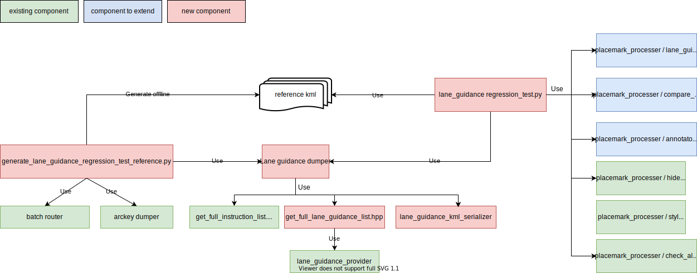

// Copyright (C) 2021 TomTom NV. All rights reserved.
//
// This software is the proprietary copyright of TomTom NV and its subsidiaries and may be
// used for internal evaluation purposes or commercial use strictly subject to separate
// license agreement between you and TomTom NV. If you are the licensee, you are only permitted
// to use this software in accordance with the terms of your license agreement. If you are
// not the licensee, you are not authorized to use this software in any manner and should
// immediately return or destroy it.

= Lane guidance regression test

== Status

Accepted

== Context

Setup lane guidance regression test framework.
The existing components in instruction regression test should be reused if possible.

== Proposal
Add components as in following diagram to facilitate lane guidance regression test.

lane_guidance_dumper:: Takes arc keys and route attributes as input, and dumps all
https://bitbucket.tomtomgroup.com/projects/NAVKIT2/repos/nk2-navigation-instruction-engine-interface/browse/navigation-instruction-engine-interface/include/tomtom/navkit2/instruction_engine/lane_guidance_scenario.hpp[lane guidance scenario]
on the route into kml.
lane_guidance_kml_serializer: Convert lane guidance scenarios into kml placemarks.
generate_lane_guidance_regression_test_reference.py:: Used to generate new reference kml or to update reference kml after engine changes.
lane_guidance_regression_test.sh:: The entry point of lane guidance regression test.
Uses lane guidance dumper to get lane guidance scenarios, then use placemark_processor to compare with references.
match.py:: Extend to match placemarks by the first coordinate of a LineString.footnote:extend_or_new_module[If it is turned out the code become too
large or un-readable, we could create a separate module, I will leave it as implementation detail.]
compare_placemarks.py:: Extened to compare data in two matching lane guidance placemark.footnote:extend_or_new_module[]
annotator.py:: Extend to extract data from ExtendedData as annotation viewable in Google Earth.footnote:extend_or_new_module[]

Lane guidance regression test and the existing instruction regression test will be in
different folder and with independent entry point, so they can be executed independently.
The folder structure is depicted in following figure, where the existing regression/* is moved to
regression/instruction/
----
nk2-navigation-instruction-engine
├── navigation-instruction-engine
│   ├── src
│   │   ├── get_full_instruction_list.hpp                           # <1>
│   │   └── get_full_lane_guidance_list.hpp                         # <2>
│   │
│   └── test
│       ├── instruction_dumper/                                     # <1>
│       ├── lane_guidance_dumper/                                   # <2>
│       └── regression
│           ├── instruction_regression                              # <3>
│           │   ├── od/
│           │   ├── reference/
│           │   └── instruction_regression_test.py (entry point)
│           │
│           └── lane_guidance_regression                            # <2>
│               ├── od/
│               ├── reference/
│               └── lane_guidance_regression_test.py (entry point)
└── scripts/regression_tests/
    ├── run_instruction_regression_test.py                          # <3>
    ├── generate_instruction_regression_test_references.sh          # <3>
    ├── run_lane_guidance_regression_test.py                        # <2>
    └── generate_lane_guidance_regression_test_reference.sh         # <2>

nk2-placemark-processor
└── placemark_processor/                                            # <4>
    ├── match.py
    ├── compare_placemarks.py
    └── annotator.py
----
<1> Unchanged
<2> New component
<3> Moved or renamed, content remains the same
<4> Need extend

In reference kml, there will be a lane_guidance_reference folder, containing child folders representing lane guidance scenarios.
Each lane guidance scenario folder then holds placemarks representing lane segment.
Each lane segment placemarks contains brief textual description for directions, and line string for polyline.

Below is the brief structure:
----
├── [folder] lane_guidance_reference
    ├── [folder] lane guidance scenario for Exit Right A26
        ├── [placemark] segment id 0, arrows: |↑|↑→|
        │   ├── data, and lane info of the segment
        │   └── line string
        ├── [placemark] segment id 1, arrows: |↑|↑|→|
        ├── [placemark] segment id 2, arrows: |↑|
----

And the table for direction and corresponding textual character:
|===
|Direction |Symbol

|None |⨯
|Strait |↑
|SlightRight |↗
|Right |→
|SharpRight |↘
|RightUTurn |↷
|SlightLeft |↖
|Left |←
|SharpLeft |↙
|LeftUTurn |↶
|===

And a more concrete example:
----
<Folder id="lane_guidance_reference">
    <name>lane_guidance_reference</name>

    <Folder id="lane_guidance_scenario_for_instruction_0">
        <name>scenario Exit Right A5</name>
        <Placemark>
            <name>segment {id: 0, arrows: |↑|↑→|}</name>
            <visibility>1</visibility>
            <ExtendedData>
                <nie:lane_guidance xmlns:nie="http://tomtom.com/guidance/instruction-engine/1.0">
                    <nie:segment_id>0</nie:segment_id>
                    <nie:is_maneuver>false</nie:is_maneuver>
                    <nie:is_on_route>true</nie:is_maneuver>
                    <nie:start_offset_on_route_in_cm>10000</nie:start_offset_on_route_in_cm>
                    <nie:end_offset_on_route_in_cm>15000</nie:end_offset_on_route_in_cm>
                    <nie:driving_side>Right<nie:driving_side>
                    <nie:lanes>
                        <nie:lane_info>
                            <nie:lane_arrows>
                                <nie:lane_arrow>
                                    <nie:direction>Right</nie:direction>
                                    <nie:is_recommended>true</nie:is_recommended>
                                </nie:lane_arrow>
                                <nie:lane_arrow>
                                    <nie:direction>Strait</nie:direction>
                                    <nie:is_recommended>false</nie:is_recommended>
                                </nie:lane_arrow>
                            </nie:lane_arrows>
                            <nie:incoming_connections>
                                <nie:connection>
                                    <nie:segment_id>0</nie:segment_id>
                                    <nie:lane_id>0</nie:lane_id>
                                    <nie:connection_type>Normal</nie:connection_type>
                                </nie:connection>
                            </nie:incoming_connections>
                            <nie:outgoing_connections>
                                <nie:connection>
                                    <nie:segment_id>1</nie:segment_id>
                                    <nie:lane_id>0</nie:lane_id>
                                    <nie:connection_type>Normal</nie:connection_type>
                                </nie:connection>
                            </nie:outgoing_connections>
                            <nie:toll_payment_types>
                                <nie:toll_payment_type>CashCoinsAndBills</nie:toll_payment_type>
                                <nie:toll_payment_type>ETC</nie:toll_payment_type>
                            </nie:toll_payment_types>
                        </nie:lane_info>
                        <nie:lane_info>
                            <nie:lane_arrows>
                                <nie:lane_arrow>
                                    <nie:direction>Strait</nie:direction>
                                    <nie:is_recommended>false</nie:is_recommended>
                                </nie:lane_arrow>
                            </nie:lane_arrows>
                            <nie:incoming_connections>
                                <nie:connection>
                                    <nie:segment_id>0</nie:segment_id>
                                    <nie:lane_id>0</nie:lane_id>
                                    <nie:connection_type>Normal</nie:connection_type>
                                </nie:connection>
                            </nie:incoming_connections>
                            <nie:outgoing_connections>
                                <nie:connection>
                                    <nie:segment_id>1</nie:segment_id>
                                    <nie:lane_id>0</nie:lane_id>
                                    <nie:connection_type>Normal</nie:connection_type>
                                </nie:connection>
                            </nie:outgoing_connections>
                            <nie:toll_payment_types/>
                        </nie:lane_info>
                    </nie:lanes>
                </nie:lane_guidance>
            </ExtendedData>
            <LineString>
                <coordinates>13.3227950,52.5128192,0 13.3227360,52.5128782,0 </coordinates>
            </LineString>
        </Placemark>
        <Placemark>
            <name>segment {id: 1, arrows: |↑|↑|→|}</name>
            ....
        </Placemark>
    </Folder>
</Folder>
----

After running annotator, the ExtendedData is extracted into viewable data in Google Earth.
Elements in lane info vector are extracted due to the viewable annotation in kml does not map well to nested data structure.
Below is the example corresponding to the above lane guidance placemark.
----
<ExtendedData>
    <Data name="segment_id">
        <value>0<value>
    </Data>
    <Data name="is_maneuver">
        <value>false</value>
    </Data>
    ....
    <Data name="lane_info_0">
        <value>{{{Right, true}, {Straight,false}}, {{0, 0, Normal}}, {{1, 0, Normal}}, {CashCoinsAndBills, ETC}}</value>
    </Data>
    <Data name="lane_info_1">
        <value>{{{Straight, false}}, {{0, 0, Normal}}, {{1, 0, Normal}}, {}}</value>
    </Data>
</ExtendedData>
----
