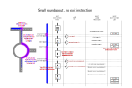
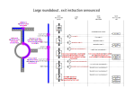
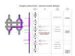

// Copyright (C) 2018 TomTom NV. All rights reserved.
//
// This software is the proprietary copyright of TomTom NV and its subsidiaries and may be
// used for internal evaluation purposes or commercial use strictly subject to separate
// license agreement between you and TomTom NV. If you are the licensee, you are only permitted
// to use this software in accordance with the terms of your license agreement. If you are
// not the licensee, you are not authorized to use this software in any manner and should
// immediately return or destroy it.

= Roundabout Maneuver Paths

== Status

Proposed

== Context

This is a proposal for the behaviour of the `NextInstructionListener`
and `AudioInstructionListener` on big and small roundabouts.  The
motivation is the current poor behaviour of audio announcements
described in https://jira.tomtomgroup.com/browse/NAV-40064[NAV-40064].

== Problem Description

At the moment as far as audio announcements are concerned, all
maneuvers are treated as infinitesimal points.  The `Instruction`
class does support start and end offsets and a maneuver path, but the
triggering engine treats the instruction as existing at one offset
along the route.

Roundabouts are handled with either one instruction in the case of
small roundabouts, or two instructions for larger roundabouts.  In
practice, we are finding that for small roundabouts the following
instruction (e.g. "turn left") is being announced while the driver is
in the middle of the roundabout.  This is misleading.

It makes sense to now treat instructions as covering a non-trivial
interval of the route, and delay announcing following instructions
until the entire maneuver is completed.  However, this raises
complications with handling of the "exit roundabout" instruction for
larger roundabouts.

We have committed to Audi that the maneuver path of a roundabout
instruction will cover the whole roundabout.

The NK2UI spec says that a single roundabout glyph should be displayed
throughout the maneuver.

Additionally, we have a requirement that on large roundabouts the
distance countdown in the Next Instruction Panel should countdown
separately to both the main roundabout instruction and the exit
roundabout instruction.  That is, when approaching the entrance of the
roundabout, the distance should reflect the distance to the entrance.
When driving on the roundabout, the distance should reflect the
distance to the exit.

== Rejected Alternatives

=== Immediately switch the exit roundabout instruction

One option would be to have the maneuver path of the main roundabout
instruction become a point, while the exit roundabout instruction
maneuver path covers the actual roundabout.

One problem with this approach is the inconsistency with small
roundabouts, which would still need the main roundabout instruction to
have a maneuver path covering the entire roundabout.

Another problem is it forces the NIP to be able to display both the
main roundabout instruction and the exit roundabout instruction.  This
is unnecessarily complicated for the NIP.

We have also communicated to Audi that the main roundabout instruction
would have the maneuver path that covers the roundabout.

=== Split in half

It was suggested that we could split the maneuver path of large
roundabouts into two halves, so that the exit roundabout instruction
begins halfway through the maneuver.

Exit roundabout instructions contain the same data as the main
roundabout instruction, so the NIP can display the same information.

The biggest flaw in this approach is deciding on a meaningful place to
put the break.  It must be early enough to give space for the correct
announcements to be made.  That in turn depends on the triggering
engine configuration and the vehicle speed.

The conclusion is that this would degrade our architecture, as well as
producing counterintuitive results for consumers of the API.

=== Exit Announced Early

In this proposal, announcements for the next instruction must not be
made until after the end offset of the current instruction.  However,
we make an exception for exit roundabout instructions, which may be
announced any time after the start offset of the current instruction.

In this design the exit roundabout instruction is never the next
instruction in the next instruction list.

== Proposed Solution

The agreed solution is that the main roundabout instruction should
cover the entire roundabout, while the exit roundabout instruction
only occupies an infinitesimal point at the exit of the roundabout.

Announcements may not be triggered until a previous maneuver is
complete, when the car has passed the end of the maneuver path.
Equivalently, this is when the car has passed the end offset on route
of the instruction.  HOWEVER, exit roundabout instructions are an
exception to this rule, and may be triggered while still inside the
maneuver path of the main roundabout instruction.

Instructions are removed from the upcoming instructions list only when
the car passes the end offset of the instruction.  However, an
exception is made where the following instruction is an exit the
roundabout instruction.  Then the instruction is removed when the car
passes the start offset of the instruction.

Here is the solution as a set of points:

* Roundabout instructions will contain a maneuver path that covers the
  path around the roundabout.
  - This ensures that the NIP or any other maneuver display
    consistently shows the entire current maneuver
* Large roundabout maneuvers also include an exit roundabout
  instruction.  This will have a maneuver path consisting of just the
  exit point of the roundabout.  This overlaps (infinitesimally) with
  the main roundabout instruction.
  - Given that announcement points are speed dependent, there is no
    meaningful place to transition to the exit roundabout instruction.
    Better to keep the main instruction the whole way.
* Complex intersection instructions will contain a maneuver path that
  covers the path from entering to exiting the complex intersection.
* Maneuver paths cannot overlap, except for the infinitesimal overlap
  of roundabout exit instructions.
* An announcement for an instruction cannot be made until the car has
  passed entirely through the maneuver path of the previous
  instruction.
* EXCEPT announcements for exit roundabout instructions, which should
  ignore the above rule.
  - An alternative rule without exceptions is "announcements cannot be
    made for instructions that are not next in the list"
* The next instruction should change only when the car passes the end
  offset of the previous instruction.
* EXCEPT when the following instruction is exit the roundabout, in
  which case it should change when the car passes the start offset.
* The next announcement text message is constructed from the next
  upcoming instruction.
* When the car is outside a maneuver path, the distance shown in the
  NIP is the distance to the start of the next upcoming maneuver.
* When the car is inside a maneuver path, the NIP should not show a
  distance, and the API will report the distance as 0.
* EXCEPT when the following instruction is exit the roundabout, in
  which case the distance shown in the NIP is the distance to the
  start of the exit the roundabout instruction

=== Combined Instructions

With this proposal, it will not be possible to combine a large
roundabout instruction with a following turn instruction.  This means
that the smaller part of the NIP will be hidden.  Note that combining
roundabout instructions is already disabled in the default
configuration.

Combining small roundabout instructions with following turn
instructions will work fine, if the configuration allows.  The same is
true of complex intersections.

If in future UX requires that large roundabout instructions must be
combined with a following maneuver, we can consider omitting the exit
roundabout instruction from the instructions returned by
`OnNextInstructionChanged`.  This may require a larger rethink of how
we handle exit roundabout announcements.

== Worked Examples

The following diagrams describe several semi-realistic examples.  They
are intended to be read from bottom to top as a timeline.  For each
timeline it shows:

* The route, represented as a blue line, with pink regions
  representing maneuver paths
* The current contents of the Next Instruction Panel: a glyph and
  optionally a distance countdown
* The current contents of the next instruction list, as reported to
  the `NextInstructionListener`
* The current upcoming audio message, as reported to the
  `AudioInstructionListener` via `OnAudioPrepare`
* The played audio announcements as heard by the driver

=== Small roundabout - no exit instruction

This is a small roundabout followed by a left turn.

=== Large roundabout - exit instruction announced

This is a large roundabout followed by a left turn.

=== Complex intersections - announcements delayed

This is two complex intersections close together.  At the first
intersection the driver should turn right, at the second they should
turn left.

== Appendix: Sequence Diagrams

=== Small roundabout - no exit instruction

[plantuml, roundabout-path-small-sequence, svg, alt="Sequence diagram of guidance callbacks over small roundabout"]

....

@startuml

participant Positioning
participant OnboardTripGuidanceManager
participant NextInstructionListener
participant AudioInstructionListener

Positioning -> OnboardTripGuidanceManager : OnProgressChanged
OnboardTripGuidanceManager -> NextInstructionListener : OnNextInstructionChange
note right
0: cross roundabout
1: turn left
2: arrival
end note
OnboardTripGuidanceManager -> NextInstructionListener : OnDistanceToNextInstructionChanged
note right: 60m
OnboardTripGuidanceManager -> AudioInstructionListener : OnAudioPrepare
note right: "in 60m cross roundabout"
...
Positioning -> OnboardTripGuidanceManager : OnProgressChanged
OnboardTripGuidanceManager -> NextInstructionListener : OnDistanceToNextInstructionChanged
note right: 40m
OnboardTripGuidanceManager -> AudioInstructionListener : OnAudioPrepare
note right: "in 40m cross roundabout"
...
Positioning -> OnboardTripGuidanceManager : OnProgressChanged
OnboardTripGuidanceManager -> NextInstructionListener : OnDistanceToNextInstructionChanged
note right: 20m
OnboardTripGuidanceManager -> AudioInstructionListener : OnAudioPrepare
note right: "in 20m cross roundabout"
OnboardTripGuidanceManager -> AudioInstructionListener : OnAudioPlay
...
Positioning -> OnboardTripGuidanceManager : OnProgressChanged
OnboardTripGuidanceManager -> NextInstructionListener : OnDistanceToNextInstructionChanged
note right: 10m
OnboardTripGuidanceManager -> AudioInstructionListener : OnAudioPrepare
note right: "cross the roundabout"
OnboardTripGuidanceManager -> AudioInstructionListener : OnAudioPlay
...
Positioning -> OnboardTripGuidanceManager : OnProgressChanged
OnboardTripGuidanceManager -> NextInstructionListener : OnDistanceToNextInstructionChanged
note right: 0m
...
Positioning -> OnboardTripGuidanceManager : OnProgressChanged
OnboardTripGuidanceManager -> NextInstructionListener : OnDistanceToNextInstructionChanged
note right: 0m
...
Positioning -> OnboardTripGuidanceManager : OnProgressChanged
OnboardTripGuidanceManager -> NextInstructionListener : OnNextInstructionChange
note right
0: turn left
1: arrival
end note
OnboardTripGuidanceManager -> NextInstructionListener : OnDistanceToNextInstructionChanged
note right: 40m
OnboardTripGuidanceManager -> AudioInstructionListener : OnAudioPrepare
note right: "in 40m turn left"
OnboardTripGuidanceManager -> AudioInstructionListener : OnAudioPlay

@enduml

....

=== Large roundabout - exit instruction announced

[plantuml, roundabout-path-large-sequence, svg, alt="Sequence diagram of guidance callbacks over large roundabout"]

....

@startuml

participant Positioning
participant OnboardTripGuidanceManager
participant NextInstructionListener
participant AudioInstructionListener

Positioning -> OnboardTripGuidanceManager : OnProgressChanged
OnboardTripGuidanceManager -> NextInstructionListener : OnNextInstructionChange
note right
0: cross roundabout
1: exit roundabout
2: turn left
3: arrival
end note
OnboardTripGuidanceManager -> NextInstructionListener : OnDistanceToNextInstructionChanged
note right: 60m
OnboardTripGuidanceManager -> AudioInstructionListener : OnAudioPrepare
note right: "in 60m cross roundabout"
...
Positioning -> OnboardTripGuidanceManager : OnProgressChanged
OnboardTripGuidanceManager -> NextInstructionListener : OnDistanceToNextInstructionChanged
note right: 40m
OnboardTripGuidanceManager -> AudioInstructionListener : OnAudioPrepare
note right: "in 40m cross roundabout"
...
Positioning -> OnboardTripGuidanceManager : OnProgressChanged
OnboardTripGuidanceManager -> NextInstructionListener : OnDistanceToNextInstructionChanged
note right: 20m
OnboardTripGuidanceManager -> AudioInstructionListener : OnAudioPrepare
note right: "in 20m cross roundabout"
OnboardTripGuidanceManager -> AudioInstructionListener : OnAudioPlay
...
Positioning -> OnboardTripGuidanceManager : OnProgressChanged
OnboardTripGuidanceManager -> NextInstructionListener : OnDistanceToNextInstructionChanged
note right: 10m
OnboardTripGuidanceManager -> AudioInstructionListener : OnAudioPrepare
note right: "cross the roundabout"
OnboardTripGuidanceManager -> AudioInstructionListener : OnAudioPlay
...
Positioning -> OnboardTripGuidanceManager : OnProgressChanged
OnboardTripGuidanceManager -> NextInstructionListener : OnNextInstructionChange
note right
0: exit roundabout
1: turn left
2: arrival
end note
OnboardTripGuidanceManager -> NextInstructionListener : OnDistanceToNextInstructionChanged
note right: 40m
OnboardTripGuidanceManager -> AudioInstructionListener : OnAudioPrepare
note right: "in 40m exit the roundabout"
OnboardTripGuidanceManager -> AudioInstructionListener : OnAudioPlay
...
Positioning -> OnboardTripGuidanceManager : OnProgressChanged
OnboardTripGuidanceManager -> NextInstructionListener : OnDistanceToNextInstructionChanged
note right: 20m
OnboardTripGuidanceManager -> AudioInstructionListener : OnAudioPrepare
note right: "in 20m exit the roundabout"
...
Positioning -> OnboardTripGuidanceManager : OnProgressChanged
OnboardTripGuidanceManager -> NextInstructionListener : OnDistanceToNextInstructionChanged
note right: 10m
OnboardTripGuidanceManager -> AudioInstructionListener : OnAudioPrepare
note right: "exit the roundabout"
OnboardTripGuidanceManager -> AudioInstructionListener : OnAudioPlay
...
Positioning -> OnboardTripGuidanceManager : OnProgressChanged
OnboardTripGuidanceManager -> NextInstructionListener : OnNextInstructionChange
note right
0: turn left
1: arrival
end note
OnboardTripGuidanceManager -> NextInstructionListener : OnDistanceToNextInstructionChanged
note right: 40m
OnboardTripGuidanceManager -> AudioInstructionListener : OnAudioPrepare
note right: "in 40m turn left"
OnboardTripGuidanceManager -> AudioInstructionListener : OnAudioPlay

@enduml

....

=== Complex intersections - announcements delayed

[plantuml, roundabout-path-complex-sequence, svg, alt="Sequence diagram of guidance callbacks over complex intersection"]

....

@startuml

participant Positioning
participant OnboardTripGuidanceManager
participant NextInstructionListener
participant AudioInstructionListener

Positioning -> OnboardTripGuidanceManager : OnProgressChanged
OnboardTripGuidanceManager -> NextInstructionListener : OnNextInstructionChange
note right
0: turn right
1: turn left
2: arrival
end note
OnboardTripGuidanceManager -> NextInstructionListener : OnDistanceToNextInstructionChanged
note right: 60m
OnboardTripGuidanceManager -> AudioInstructionListener : OnAudioPrepare
note right: "in 60m turn right"
...
Positioning -> OnboardTripGuidanceManager : OnProgressChanged
OnboardTripGuidanceManager -> NextInstructionListener : OnDistanceToNextInstructionChanged
note right: 40m
OnboardTripGuidanceManager -> AudioInstructionListener : OnAudioPrepare
note right: "in 40m turn right"
...
Positioning -> OnboardTripGuidanceManager : OnProgressChanged
OnboardTripGuidanceManager -> NextInstructionListener : OnDistanceToNextInstructionChanged
note right: 20m
OnboardTripGuidanceManager -> AudioInstructionListener : OnAudioPrepare
note right: "in 20m turn right"
OnboardTripGuidanceManager -> AudioInstructionListener : OnAudioPlay
...
Positioning -> OnboardTripGuidanceManager : OnProgressChanged
OnboardTripGuidanceManager -> NextInstructionListener : OnDistanceToNextInstructionChanged
note right: 10m
OnboardTripGuidanceManager -> AudioInstructionListener : OnAudioPrepare
note right: "turn right"
OnboardTripGuidanceManager -> AudioInstructionListener : OnAudioPlay
...
Positioning -> OnboardTripGuidanceManager : OnProgressChanged
OnboardTripGuidanceManager -> NextInstructionListener : OnDistanceToNextInstructionChanged
note right: 0m
...
Positioning -> OnboardTripGuidanceManager : OnProgressChanged
OnboardTripGuidanceManager -> NextInstructionListener : OnDistanceToNextInstructionChanged
note right: 0m
...
Positioning -> OnboardTripGuidanceManager : OnProgressChanged
OnboardTripGuidanceManager -> NextInstructionListener : OnNextInstructionChange
note right
0: turn left
1: arrival
end note
OnboardTripGuidanceManager -> NextInstructionListener : OnDistanceToNextInstructionChanged
note right: 40m
OnboardTripGuidanceManager -> AudioInstructionListener : OnAudioPrepare
note right: "in 40m turn left"
OnboardTripGuidanceManager -> AudioInstructionListener : OnAudioPlay

@enduml

....
