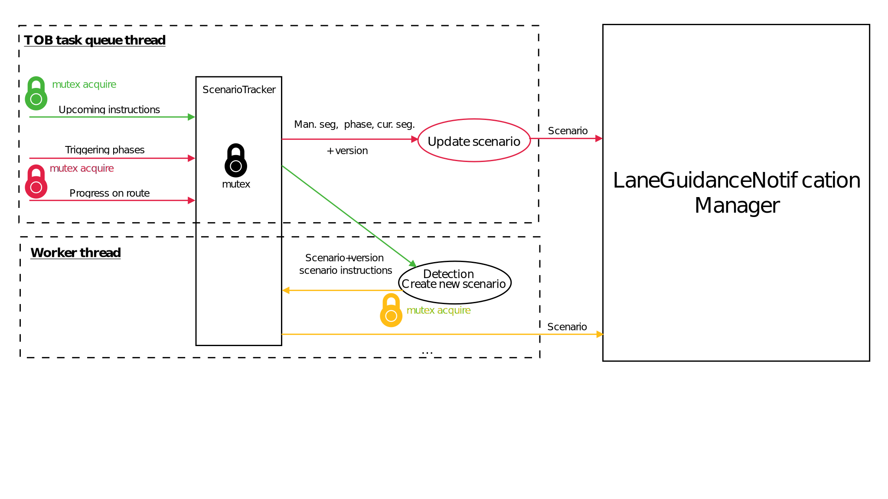
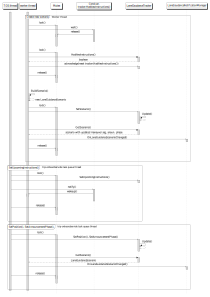

// Copyright (C) 2021 TomTom NV. All rights reserved.
//
// This software is the proprietary copyright of TomTom NV and its subsidiaries and may be
// used for internal evaluation purposes or commercial use strictly subject to separate
// license agreement between you and TomTom NV. If you are the licensee, you are only permitted
// to use this software in accordance with the terms of your license agreement. If you are
// not the licensee, you are not authorized to use this software in any manner and should
// immediately return or destroy it.

= Lane Guidance Provider Threading Model

== Status

Accepted

== Context

Lane Guidance is currently running on NavKit2 main thread. This causes
significant issues with latency, where the NavKit2 main thread gets blocked for
up to 2 seconds.

In the current system a new LaneGuidanceScenario is only generated when the instruction
list changes, and it is generated for the next upcoming instructions on the route.
Neither the SDK application nor other components in NavKit2 cannot request LaneGuidanceAdapter
to start generating instructions.

=== Future HCP3 requirements and compatibility

Audi has requested that the JunctionExitView and PrepareView display the situation for the instructions that are combined both in the visual and audio subsystems.
In addition to that Audi has requested that the LaneGuidanceScenario is provided a some time before it is displayed on the screen.

This is conflicting with our objective generate the instruction combination just in time so that we can do most precise calculations based on the current situation on the road (car speed, traffic, route etas, number of lanes the car needs to cross to execute the maneuver).

In the current system we start computing the LaneGuidanceScenario as soon as the next instructions are available. Whenever instructions change, e.g. due to incremental instruction computation we recompute the scenario and deliver a new one.

In addition to that, the LaneGuidanceProvider uses fixed distances for computing instruction combination flags. This is different from AudioInstructionListener and NextInstructionListener (driven by TriggeringEngine) that use additional data like current vehicle speed.
This is in conflict with the Audi requirements described above.

The following changes will have to be implemented in the future to meet the Audi requirements:

- InstructionEngine will have to report progress on route to the triggering engine.
- TriggeringEngine will postpone emitting any instructions until the progress of InstructionEngine is far enough that we are sure new instructions will not affect instruction combined flags.
- A new internal triggering phase will be implemented in the TriggeringEngine that will tell the system that from now on the combined flags are computed and will not change.
- LaneGuidanceProvider will get the next combined instruction from the TriggeringEngine once the combined flags are settled.
- LaneGuidanceProvider will deliver the LaneGuidanceScenario to the client before the EarlyWarning distance is reached, but not before the combined flags are settled.

There is still an ongoing debate how to handle two LaneGuidanceScenarios that are very close to each other. In such cases it may be difficult to deliver the LaneGuidanceScenario before the EarlyWarning trigger phase of the AudioInstructionListener.

There are 3 options how we can deal with such a situation:
- relax the adherence to audi requirements and allow in certain situations the LaneGuidanceScenario to be delivered after the EarlyWarning trigger from AudioInstructionListener;
- postpone the EarlyWarning trigger untill LaneGuidanceScenario is computed;
- compute more than one lane guidance scenario in advance;

Choosing one of these options requires a separate discussion/ADR/decision.

== Current state

LaneGuidanceProvider gets calls(upcoming instructions, progress on route and announcement phase) from
trip-onboard-service. LaneGuidanceProvider passes them to ScenarioTracker to update the next maneuver segment,
announcement phase and current segment(current segment update is not implemented yet).
If the condition of making a new scenario is met LaneGuidanceProvider runs in the caller's thread the scenario
detection and building process and sets a created scenario to the tracker. If the scenario(lane_segments list, next
maneuver segment, announcement phase, current segment) has changed due to a new scenario or an update of the
existing scenario, ScenarioTracker issues a callback OnLaneGuidanceScenarioChanged().

== Questions
How to avoid the main thread from being blocked?

How can the latency of providing the first scenario after getting an instruction might be reduced?

How the design might be changed to provide more than one scenario ahead?

== Alternatives

=== 1. LaneGuidanceProvider runs an async task in a separate thread for each LaneGuidanceScenario

Every time the instruction list changes the LaneGuidanceProvider starts a separate thread to
compute LaneGuidanceScenario.

==== Latency of providing the first scenario
Not considered due complexity.

==== Providing arbitrary amount of scenarios
It's possible to find all route stretches for all upcoming instructions and run a task to make each scenario in a
separate thread. A component storing all the scenarios and merging scenario produced by different tasks is needed.

Advantages:

- can be easily extended to handle on demand lane guidance computation for any stretch of the route.

Disadvantage:

- A global race condition. New scenarios are get ready in a random order, so an older scenario might overwrite more
  fresh one.
  Might be solved if we are sure that for any road stretch we build a scenario only one time and scenarios are not
  overlapping.
  Might be solved by introducing scenario versioning. Both solutions lead to significant complexity growth.

- Lack of control on how many threads are spawned.
  Multiple threads put a strain on available system resources (iOS requires 2M per thread).
  In extreme cases, this can lead to performance degradation on the operating system level.
  Might be solved by using a thread pool what leads to using a task queue.

=== 2. LaneGuidanceProvider uses internal thread queue and task queue

To avoid the explosion of worker threads in solution (1) a worker queue is used with associated task queue.
Whenever new instructions are available, a task to update LaneGuidanceScenario is enqueued.

==== Latency of providing the first scenario
For each instruction list update two tasks might be enqueued. First for with the first instruction. Second - with
the rest.

==== Providing arbitrary amount of scenarios
Any task might be enqueued for any road stretch. A component managing scenarios is needed. It might be ScenarioTracker.

Advantages:

- solves potential resource usage and latency issues of solution (1)

- can be easily extended to handle on demand lane guidance computation for any
  stretch of the route

Disadvantages:

- after a long scenario creating before publishing the latest scenario might produce a chain of outdated scenarios

- more expensive to implement than (1) and (3)

=== 3. Single LaneGuidanceProvider thread is used to generate lane guidance

LaneGuidanceProvider runs one worker thread. This thread is woken up whenever a new
LaneGuidanceScenario needs to be computed(there are new instructions). While there is an ongoing LaneGuidanceScenario
computation the system stores the necessary state(arguments of calls SetProgress, SetUpcomingInstructions,
SetAnnouncementPhase) and always completes the computation of the scenario(except cases when thread cancellation is
requested or ArcKeyBuffer is cancelled). Only after the computation is finished building of a new scenario might be
started again based on the most recent state.

Only the most recent state for the next LaneGuidanceScenario is kept, each call(SetProgress, SetUpcomingInstructions,
SetAnnouncementPhase) overwrites the previous state. After a scenario is ready scenario(maneuver points,
announcement phase etc) must be updated according to the most recent state and OnLaneGuidanceScenarioChanged callback
must be issued from the worker thread.

If an event doesn't lead to a new scenario computation(e.g. SetAnnouncementPhase), the current scenario is being updated
immediately in the same thread where a handler(e.g. SetAnnouncementPhase) is called. In order to avoid race conditions
OnLaneGuidanceScenarioChanged calls must be done with a locked mutex.
There is an alternative approach to issue all callback from the worker thread. The cost is significantly higher
complexity of the code detecting a situation by the current state.

With this approach there is always one scenario tracked(possibly empty) and may be one scenario in the building process.
A condition to wake up the worker thread is "there is a new instruction".
While a scenario is being build all events lead to updating state of the tracked scenario.
After the scenario is ready, the current scenario must be replaced with a new one.
Once the condition to wake up the worker thread is met, building process runs again base on the most recent state(
instructions list, progress, announcement phase).

==== Latency of providing the first scenario
A scenario might be computed incrementally instruction by instruction. A new instruction event extends the tracked
scenario. A progress event shortens the tail of the tracked scenario(a problem here is cleaning up off-route arcs).

==== Providing arbitrary amount of scenarios
As an extension of the incremental scenario computation in order to provide precalculated scenarios ahead we may have
a single scenario(with gaps) and incrementally calculate it as much as it's possible.

Another approach is to run the scenarios build process for a list of route stretches. A problem here is to provide the
first scenario before scenarios for the next route stretches are ready.

Advantages:
- fast to implement - no complicated corner cases to handle as in design (1) and (2)
- provides as few callbacks as possible to provide the most recent scenario

Disadvantages:
- this solution does not work well if on demand lane guidance needs to be implemented for arbitrary road stretches

== Decision
Use solution (3) a single thread inside the LaneGuidanceProvider. OnLaneGuidanceScenarioChanged callbacks caused by
getting a new scenario(new instructions) are emitted from the worker thread. Callback caused by events which don't
require a new scenario(progress on route, announcement phase) are emitted in the main thread.

== Consequences
- if request comes for on-demand computation of lane guidance for arbitrary stretch
  of the route the solution will need to change
